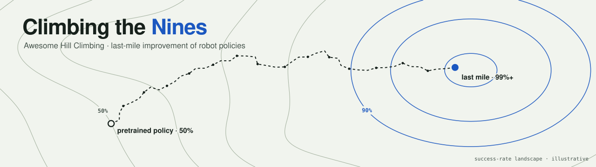
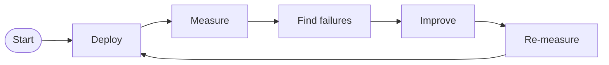
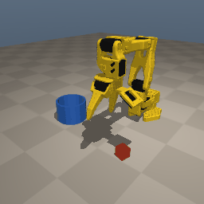
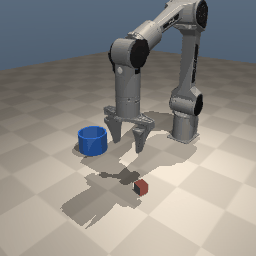
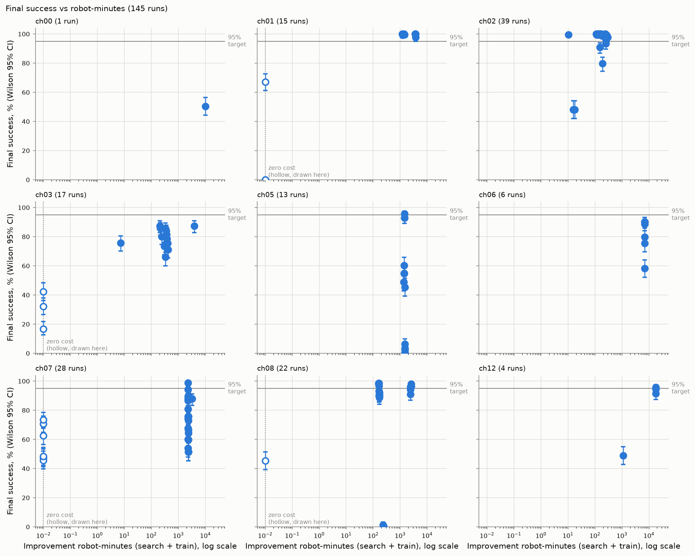
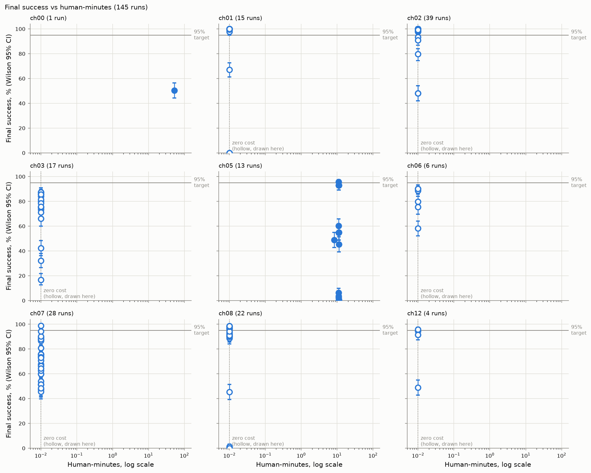

# Awesome Hill Climbing [](https://awesome.re)

<picture>
  <source media="(prefers-color-scheme: dark)" srcset="media/banner-dark.svg">
  
</picture>

> Papers, posts, code and courses on **hill-climbing robot policies**: taking a pretrained or imitation-learned policy from ~50% to 95–99%+ success on a real task. RL fine-tuning, residual and steering policies, advantage-weighted retraining, human corrections, test-time verifiers, reward and world models, sim-to-real, and the classic black-box search underneath it all.

**912 papers and posts** · **676 since September 2025** · **122 must-know (⭐)** · **212 tools, courses and benchmarks** · updated **2026-09-30**

**Interactive explainer: [Climbing the Nines](https://afinitus.github.io/awesome-hill-climbing/)**: the hill-climbing loop, the RL ideas underneath, a timeline of the last 12 months, the course results, and a searchable index of every paper.

A pretrained robot policy that works half the time needs more reliable behavior before deployment. Even 99% success needs a declared task scope, quality bar, speed and evaluation protocol. "Hill climbing" is what labs and companies call the loop in between: deploy, measure, find failures, improve, re-measure. This list maps the ways people run that loop, the textbook RL ideas each one comes from, and what changed in the last twelve months, down to this week.

## Contents

- [What's new](#whats-new)
- [Start here](#start-here)
- [The hill-climbing loop](#the-hill-climbing-loop)
- [Foundations](#foundations)
- [Papers and posts by family](#papers-and-posts-by-family)
  - [Black-box search](#black-box-search)
  - [On-policy policy gradients](#on-policy-policy-gradients)
  - [Off-policy critics & offline-to-online RL](#off-policy-critics--offline-to-online-rl)
  - [Residual, edit & steering policies](#residual-edit--steering-policies)
  - [Advantage-weighted & filtered BC](#advantage-weighted--filtered-bc)
  - [Human corrections & DAgger](#human-corrections--dagger)
  - [Test-time search & verifiers](#test-time-search--verifiers)
  - [Reward, value & progress models](#reward-value--progress-models)
  - [World models & evaluation](#world-models--evaluation)
  - [Sim-to-real & real-to-sim](#sim-to-real--real-to-sim)
  - [Industry recipes & deployment reports](#industry-recipes--deployment-reports)
  - [Broader RL advances that transfer](#broader-rl-advances-that-transfer)
- [Code, tools and learning resources](#code-tools-and-learning-resources)
  - [Code: robot learning and last-mile RL](#code-robot-learning-and-last-mile-rl)
  - [Code: general RL and black-box optimization](#code-general-rl-and-black-box-optimization)
  - [Simulators and robot models](#simulators-and-robot-models)
  - [Benchmarks and datasets](#benchmarks-and-datasets)
  - [Courses, books and tutorials](#courses-books-and-tutorials)
  - [Surveys](#surveys)
  - [Talks and podcasts](#talks-and-podcasts)
  - [Related awesome lists](#related-awesome-lists)
- [Hands-on: lastmile](#hands-on-lastmile)
- [How this list is made](#how-this-list-is-made)
- [Contributing](#contributing)

## What's new

**198 papers and posts from the last 14 days** (2026-09-16 to 2026-09-30), newest first. Descriptions are on each family page.

- `2026-09-29` **[FP2](https://arxiv.org/abs/2609.37433)**: Equipping Robotic Foundation Models with Force Control (FORTE Lab; Noematrix; Flexiv; SJTU et al.) · [Residual, edit & steering policies](papers/residual.md)
- `2026-09-29` **[Track-and-Complete](https://arxiv.org/abs/2609.36924)**: Learning Humanoid Skills from a Single Failed Human Video (Yonsei University) · [Sim-to-real & real-to-sim](papers/simreal.md)
- `2026-09-29` **[Counterfactual Video Generation Enables Scalable Humanoid Loco-Manipulation](https://arxiv.org/abs/2609.38172)** (UC Berkeley; Stanford; Amazon FAR) · [Sim-to-real & real-to-sim](papers/simreal.md)
- `2026-09-29` **[Encore](https://arxiv.org/abs/2609.37359)**: Few-Shot Agentic Discovery of Manipulation Strategies (Kang et al.) · [Black-box search](papers/blackbox.md)
- `2026-09-29` **[T²Mem](https://arxiv.org/abs/2609.36720)**: Learning Test-Time Memory for Robotics (Stanford) · [Test-time search & verifiers](papers/testtime.md)
- `2026-09-29` **[Lucid Dreaming for World Models](https://arxiv.org/abs/2609.37156)**: Learning to Doubt Imagination and Decide by Trust (Wen et al.) · [World models & evaluation](papers/worldmodel.md)
- `2026-09-29` **[RoXDrive](https://arxiv.org/abs/2609.36851)**: Closed-Loop Reinforcement Learning for End-to-End Autonomous Driving via Action-Faithful Rollouts (CUHK-Shenzhen et al.) · [Broader RL advances that transfer](papers/generalrl.md)
- `2026-09-29` **[Fine-Tuning on Self-Generated and Reward-Weighted Data](https://arxiv.org/abs/2609.36945)**: Learning Dynamics, Convergence Rates, and Benefits of Off-Policyness (Wang et al.) · [Broader RL advances that transfer](papers/generalrl.md)
- `2026-09-29` **[Explore, Execute, Evolve](https://arxiv.org/abs/2609.37810)**: A Skill Acquisition and Reuse Loop for Embodied Agents (Xie et al.) · [Black-box search](papers/blackbox.md)
- `2026-09-29` **[Real2Gym](https://arxiv.org/abs/2609.37089)**: Building Gyms from Videos, Bringing Skills to Robots (Ren et al.) · [Sim-to-real & real-to-sim](papers/simreal.md)
- `2026-09-29` **[ProgressCompass](https://arxiv.org/abs/2609.36684)**: Embodied Progress Reward Models Are Lost Without the Right Context (Zhang et al.) · [Reward, value & progress models](papers/reward.md)
- `2026-09-29` **[Credit-Guided Policy Improvement for Test-time Adaptive Vision-Language Navigation](https://arxiv.org/abs/2609.37591)** (Li et al.) · [Test-time search & verifiers](papers/testtime.md)
- `2026-09-29` **[EasyPPO](https://arxiv.org/abs/2609.36802)**: Stabilizing the Critic Is Key (Zhou et al.) · [Broader RL advances that transfer](papers/generalrl.md)
- `2026-09-29` **[RoboHarn-Evo](https://arxiv.org/abs/2609.37583)**: Evolving Hierarchical Physical Knowledge for Self-Improving Robotic Manipulation (Bao et al.) · [Test-time search & verifiers](papers/testtime.md)
- `2026-09-29` **[TaRL](https://arxiv.org/abs/2609.36785)**: Learning General and Physical Rewards from Tactile Demonstrations (Wu et al.) · [Reward, value & progress models](papers/reward.md)
- `2026-09-29` **[Video2STL](https://arxiv.org/abs/2609.37519)**: Grounding VLM-Generated Temporal Specifications for Robot Learning (Atasever et al.) · [Reward, value & progress models](papers/reward.md)
- `2026-09-29` **[Spotter](https://arxiv.org/abs/2609.36808)**: Let the Embodied Model Lead, and the VLM Reflect for It (Li et al.) · [Test-time search & verifiers](papers/testtime.md)
- `2026-09-29` **[Rho](https://arxiv.org/abs/2609.38164)**: A Foundation for Efficiently Adaptable VLA Models (Rho Team) · [Human corrections & DAgger](papers/hitl.md)
- `2026-09-29` **[WorldLine](https://arxiv.org/abs/2609.38059)**: Action-Driven Visual Simulation for Robotic Manipulation (Zheng et al.) · [World models & evaluation](papers/worldmodel.md)
- `2026-09-29` **[Taming VLAs under Robot Execution Errors](https://arxiv.org/abs/2609.37334)**: Self-Compensation and Stress Testing (Lee et al.) · [Test-time search & verifiers](papers/testtime.md)
- `2026-09-29` **[EVO-WAM](https://arxiv.org/abs/2609.38057)**: Evolving World Action Models through Video-Action Verification (Zhou et al.) · [World models & evaluation](papers/worldmodel.md)
- `2026-09-29` **[Direct Experience World-Model Optimization](https://arxiv.org/abs/2609.37398)**: Learning the World Beyond Action Imitation (Zhan et al.) · [World models & evaluation](papers/worldmodel.md)
- `2026-09-29` **[Cooperative Multi-Agent Vision-Language-Action Models via Reinforced Fine Tuning](https://arxiv.org/abs/2609.36588)** (Xu et al.) · [Residual, edit & steering policies](papers/residual.md)
- `2026-09-29` ⭐ **[BlenDAgger](https://arxiv.org/abs/2609.37599)**: Blended Shared Control for Interactive Imitation Learning (Carnegie Mellon University) · [Human corrections & DAgger](papers/hitl.md)
- `2026-09-29` ⭐ **[Skill-Space Shooting](https://arxiv.org/abs/2609.38178)** for Autonomous Robot Policy Improvement (Tsinghua University; UC Berkeley; Shanghai Qi Zhi Institute) · [Human corrections & DAgger](papers/hitl.md)
- `2026-09-29` ⭐ **[PreferenceFlow](https://arxiv.org/abs/2609.36872)**: Test-Time Guidance of Flow-Matching Robot Policies from Human Interventions (Westlake University) · [Test-time search & verifiers](papers/testtime.md)
- `2026-09-29` **[ReF-HIL](https://arxiv.org/abs/2609.37131)**: Shaping the Critic around Human Action Neighborhoods for Efficient Human-in-the-Loop Reinforcement Learning (Tsinghua University) · [Off-policy critics & offline-to-online RL](papers/offpolicy.md)
- `2026-09-28` **[DexAgent](https://arxiv.org/abs/2609.35318)**: An Agentic Human2Sim2Robot Framework for Dexterous Manipulation with Self-Evolving Tool Library (Stanford University; Columbia) · [Sim-to-real & real-to-sim](papers/simreal.md)
- `2026-09-28` **[NavHarness](https://arxiv.org/abs/2609.34276)**: Towards Lifelong Embodied Navigation (Adelaide University (AIML); CSIRO Data61) · [Test-time search & verifiers](papers/testtime.md)
- `2026-09-28` **[Zeroth-Order Reward Shaping](https://arxiv.org/abs/2609.34695)**: Sufficiency of Zeroth-Order Reward Shaping for Policy Gradient in Stabilization Control (UC San Diego, Tsinghua University) · [Reward, value & progress models](papers/reward.md)
- `2026-09-28` **[EMPIRIC](https://arxiv.org/abs/2609.35047)**: Experiment-Driven Learning of Residual World Models for Robot Planning (Cambridge / MIT / Basis / Cornell / Princeton et al.) · [World models & evaluation](papers/worldmodel.md)
- `2026-09-28` **[QAMM](https://arxiv.org/abs/2609.34497)**: Adjoint MeanFlow Matching for Few-Step Offline Reinforcement Learning (Gong et al.) · [Broader RL advances that transfer](papers/generalrl.md)
- `2026-09-28` **[Don't Throw Away the Tail](https://arxiv.org/abs/2609.34911)**: Action Upcycling for Policy Acceleration (Kwon et al.) · [Test-time search & verifiers](papers/testtime.md)
- `2026-09-28` **[NUDGE](https://arxiv.org/abs/2609.35231)**: Zero-Shot Reactive Obstacle Avoidance for Generative Robot Policies (Guo et al.) · [Test-time search & verifiers](papers/testtime.md)
- `2026-09-28` **[Learning from Teacher Continuations at Student States](https://arxiv.org/abs/2609.36246)** (Wang et al.) · [Broader RL advances that transfer](papers/generalrl.md)
- `2026-09-28` **[Behavioral Foundation Models for Quality Diversity](https://arxiv.org/abs/2609.35615)** (Bendib et al.) · [Black-box search](papers/blackbox.md)
- `2026-09-28` **[Test-Time Adaptation of Manipulation Policies Under Actuator Degradation](https://arxiv.org/abs/2609.36182)** (Sagar et al.) · [Test-time search & verifiers](papers/testtime.md)
- `2026-09-28` **[Scouting the Dynamics Gap](https://arxiv.org/abs/2609.36107)**: Test-Time Policy Adaptation via Action-Outcome Feedback (Li et al.) · [Test-time search & verifiers](papers/testtime.md)
- `2026-09-28` **[Action Chunking Proximal Policy Optimization with Feedback Correction](https://arxiv.org/abs/2609.36250)** (Hahn et al.) · [On-policy policy gradients](papers/onpolicy.md)
- `2026-09-28` **[RefineDrive](https://arxiv.org/abs/2609.35078)**: Reliable Failure-Guided Learning for Vision-Language-Action Driving (Sun et al.) · [Broader RL advances that transfer](papers/generalrl.md)
- `2026-09-28` **[WorldGuide](https://arxiv.org/abs/2609.34206)**: Learning Success-Failure Boundaries in Latent World Models for Vision-Language-Action Policies (Liu et al.) · [World models & evaluation](papers/worldmodel.md)
- `2026-09-28` **[WAM-OPD](https://arxiv.org/abs/2609.34250)**: Sharpening World Action Models via On-Policy Distillation (Liu et al.) · [On-policy policy gradients](papers/onpolicy.md)
- `2026-09-28` **[Uni-TMPO](https://arxiv.org/abs/2609.34688)**: Unified Trajectory Matching Policy Optimization: Diverse T2I Generation and VLA Generalization (Ma et al.) · [Broader RL advances that transfer](papers/generalrl.md)
- `2026-09-28` **[StructRL](https://arxiv.org/abs/2609.36352)**: Online Structured Reinforcement Learning for Long-Horizon Vision-Language-Action Tasks (Penn State, Amazon AWS AI) · [Reward, value & progress models](papers/reward.md)
- `2026-09-28` **[AGF](https://arxiv.org/abs/2609.34944)**: Adjoint Guidance Flow: Amortized Critic Guidance for VLA Policies (KAIST; SKKU; GIST) · [Test-time search & verifiers](papers/testtime.md)
- `2026-09-28` **[FailPatch](https://arxiv.org/abs/2609.34175)**: Failure Residual Patching for Vision-Language-Action Models (Xi'an Jiaotong; Dexmal; Nanjing U) · [Residual, edit & steering policies](papers/residual.md)
- `2026-09-28` **[ARS](https://arxiv.org/abs/2609.34484)**: Agentic Reward System for Robot Learning (AIRC, Midea Group) · [Reward, value & progress models](papers/reward.md)
- `2026-09-28` ⭐ **[F4R](https://arxiv.org/abs/2609.35575)**: Failure-Driven Recognition, Reconstruction, Refinement, and Redeployment for Continual Robot Self-Improvement (Nanyang Technological University; Xi'an Jiaotong University; Dexmal) · [Sim-to-real & real-to-sim](papers/simreal.md)
- `2026-09-27` **[Train Together or Merge Later? Unifying VLA Experts via a Shared Action Interface](https://arxiv.org/abs/2609.33125)** (Zhang et al.) · [On-policy policy gradients](papers/onpolicy.md)
- `2026-09-27` **[DPP](https://arxiv.org/abs/2609.33172)**: Dynamic Manipulation with World-Action Models via Counterfactual Planning (Park et al.) · [Test-time search & verifiers](papers/testtime.md)
- `2026-09-27` **[Beyond Conservatism](https://arxiv.org/abs/2609.33336)**: Recoverability-Conditioned Exploration for Model-Based Imitation Learning (Chen et al.) · [World models & evaluation](papers/worldmodel.md)
- `2026-09-27` **[DexTaG](https://arxiv.org/abs/2609.33882)**: Tactile-as-Guidance in Reinforcement Learning for Dexterous Manipulation (Yang et al.) · [Sim-to-real & real-to-sim](papers/simreal.md)
- `2026-09-27` **[FoLD](https://arxiv.org/abs/2609.33551)**: Force-Informed Learning for Dexterous Articulated Object Manipulation (USTC; CAS Institute of AI for Industries; Shenzhen University) · [Residual, edit & steering policies](papers/residual.md)
- `2026-09-27` **[SwingRL](https://arxiv.org/abs/2609.33053)**: Adaptive Observation Reinforcement Learning with World-Model Prediction for Cable-Suspended Hoisting Control (Wang et al.) · [Residual, edit & steering policies](papers/residual.md)
- `2026-09-27` **[Safe Score Matching](https://arxiv.org/abs/2609.33337)**: Diffusion Policies with Hamilton-Jacobi Reachability for Online Safe Reinforcement Learning (Li et al.) · [Broader RL advances that transfer](papers/generalrl.md)
- `2026-09-27` **[Steer2Grasp](https://arxiv.org/abs/2609.33546)**: Inference-Time Embodiment-Aware Steering for Diverse Physically Feasible Grasp Diffusion (Vembar et al.) · [Test-time search & verifiers](papers/testtime.md)
- `2026-09-27` **[PARS](https://arxiv.org/abs/2609.33049)**: Is Online Interaction Necessary for Recovery? A Minimalist Approach to Robust Planning via Perturbation (Park et al.) · [Human corrections & DAgger](papers/hitl.md)
- `2026-09-27` **[Evolving Dexterous Robots from Scratch](https://arxiv.org/abs/2609.33101)** (Guo et al.) · [Black-box search](papers/blackbox.md)
- `2026-09-27` **[Test-Time Spatial Reasoning for Robot Manipulation Using Generative Real-to-Sim](https://arxiv.org/abs/2609.33982)** (Kapelyukh et al.) · [Test-time search & verifiers](papers/testtime.md)
- `2026-09-27` **[ZeroBot](https://arxiv.org/abs/2609.34010)**: Learning from Scratch in Minutes with Generative Real2Sim (Kapelyukh et al.) · [Sim-to-real & real-to-sim](papers/simreal.md)
- `2026-09-27` **[Robot-GST](https://arxiv.org/abs/2609.33872)**: geometry-aware spatial-temporal robot policy representation and evaluation (Liu et al.) · [Test-time search & verifiers](papers/testtime.md)
- `2026-09-27` **[Recursive Harness Distillation across Agents for Robot Manipulation](https://arxiv.org/abs/2609.33378)** (Kim et al.) · [Test-time search & verifiers](papers/testtime.md)
- `2026-09-27` **[Schrödinger–Föllmer Actor–Critic](https://arxiv.org/abs/2609.33239)**: Diffusion Policy Improvement with Finite-Sample Analysis (Jiao et al.) · [Off-policy critics & offline-to-online RL](papers/offpolicy.md)
- `2026-09-27` **[ActionGround](https://arxiv.org/abs/2609.33256)**: Training-Free Runtime Refinement of Frozen VLA Policies (Chandra et al.) · [Test-time search & verifiers](papers/testtime.md)
- `2026-09-27` **[Achieve What You Imagined](https://arxiv.org/abs/2609.33832)**: Learning to Align Actions with Visual Plans (Qiao et al.) · [World models & evaluation](papers/worldmodel.md)
- `2026-09-27` ⭐ **[TimelyDAgger](https://arxiv.org/abs/2609.33157)**: Timing-Aware Expert Querying for VLA Policy Improvement (Tsinghua University; SEEN·E Robotic) · [Human corrections & DAgger](papers/hitl.md)
- `2026-09-27` ⭐ **[PSS](https://arxiv.org/abs/2609.33765)**: Principal Steering Subspaces for Online Adaptation of Frozen Generative Robot Policies (XPENG Robotics; University of Michigan) · [Residual, edit & steering policies](papers/residual.md)
- `2026-09-26` **[SAMBAR](https://arxiv.org/abs/2609.32108)**: Selective Anchoring via Method of Multipliers for Balanced Knowledge Acquisition and Retention in Vision-Language-Action Models (UC Berkeley) · [Broader RL advances that transfer](papers/generalrl.md)
- `2026-09-26` **[RecastVLA](https://arxiv.org/abs/2609.32155)**: From Past Interaction to Future Control with Adaptive Policy States (Li et al.) · [Test-time search & verifiers](papers/testtime.md)
- `2026-09-26` **[Timestep Weighting](https://arxiv.org/abs/2609.32665)**: A Hidden Key to Effective ELBO-Based Flow-Matching RL (Tsinghua; Princeton; EPFL) · [On-policy policy gradients](papers/onpolicy.md)
- `2026-09-26` **[ALTER](https://arxiv.org/abs/2609.32129)**: Residual Denoising Enables Sample-Efficient Multi-Agent Coordination on Demand (UC Berkeley) · [Residual, edit & steering policies](papers/residual.md)
- `2026-09-26` **[From Static Policies to Adaptive Priors in Offline Reinforcement Learning](https://arxiv.org/abs/2609.35880)** (Ni et al.) · [Broader RL advances that transfer](papers/generalrl.md)
- `2026-09-26` **[Rank Collapse Is Recoverable, Growing \|Q\| Is Not: Out-of-Sample Early Warning for Value Divergence in High-UTD Soft Actor-Critic](https://arxiv.org/abs/2609.32819)** (Bu et al.) · [Broader RL advances that transfer](papers/generalrl.md)
- `2026-09-26` **[Constrained Flow Policy Updates](https://arxiv.org/abs/2609.32952)**: A Generalized Schrödinger Bridge View (Li et al.) · [Broader RL advances that transfer](papers/generalrl.md)
- `2026-09-26` **[MA-FPPO](https://arxiv.org/abs/2609.32594)**: Multi-Agent Flow-Pretrained Policy Optimization (Zou et al.) · [Broader RL advances that transfer](papers/generalrl.md)
- `2026-09-26` **[Beyond Scripted Search](https://arxiv.org/abs/2609.32394)**: Sample-Efficient Reward Discovery via Agentic Black-box Optimization (Li et al.) · [Reward, value & progress models](papers/reward.md)
- `2026-09-26` **[RE-0](https://arxiv.org/abs/2609.32416)**: Verified Recursive Improvement of Embodied Code-as-Policy Agents through Local On-Policy Distillation (Zhang et al.) · [Advantage-weighted & filtered BC](papers/advbc.md)
- `2026-09-26` **[RoboFoundry](https://arxiv.org/abs/2609.32862)**: System-as-Policy Evolution for Self-Learning Embodied Agents (Liang et al.) · [Test-time search & verifiers](papers/testtime.md)
- `2026-09-26` **[SEES](https://arxiv.org/abs/2609.32698)**: A Self-Evolving Embodied System via Failure-Guided VLA Policy Adaptation (Li et al.) · [On-policy policy gradients](papers/onpolicy.md)
- `2026-09-25` **[Causeway](https://arxiv.org/abs/2609.30913)**: Restoring Task Accessibility for Instruction Switching in VLA Policies (University of Maryland) · [Test-time search & verifiers](papers/testtime.md)
- `2026-09-25` **[MA-WAM](https://arxiv.org/abs/2609.31281)**: Multi-Agent World-Action Model for Test-Time Planning (Zou et al.) · [Test-time search & verifiers](papers/testtime.md)
- `2026-09-25` **[G2MAF](https://arxiv.org/abs/2609.31286)**: Test-Time Gradient Guidance for Multi-Agent Flow Policies (Zou et al.) · [Broader RL advances that transfer](papers/generalrl.md)
- `2026-09-25` **[Learning to Leverage Compliance](https://arxiv.org/abs/2609.31439)**: A Policy-Admittance Learning Framework for Robotic Insertion (Wang et al.) · [Reward, value & progress models](papers/reward.md)
- `2026-09-25` **[Multi-Objective Human-in-the-Loop Bayesian Optimization of a Lower-Limb Exoskeleton](https://arxiv.org/abs/2609.30695)** (Janwani et al.) · [Black-box search](papers/blackbox.md)
- `2026-09-25` **[Generate, Track, Improve](https://arxiv.org/abs/2609.31577)**: Perceptive Multi-Skill Humanoid Locomotion with RL-Fine-Tuned Motion Generators (Olkin et al.) · [Advantage-weighted & filtered BC](papers/advbc.md)
- `2026-09-25` **[Precision at Speed](https://arxiv.org/abs/2609.31025)**: Sample-Efficient Online Model-Based Reinforcement Learning for Hydraulic Excavator Control (Canales et al.) · [World models & evaluation](papers/worldmodel.md)
- `2026-09-25` **[HapticWorld](https://arxiv.org/abs/2609.31924)**: an Interactive World Simulator with Real-time Torque Feedback (Peng et al.) · [World models & evaluation](papers/worldmodel.md)
- `2026-09-25` **[STL-SVPG](https://arxiv.org/abs/2609.31606)**: Learning Robot Policies from Sparse Success Signals via STL-Guided Stein Variational Policy Gradient (Zheng et al.) · [Reward, value & progress models](papers/reward.md)
- `2026-09-25` **[Towards VLA-Dreamer](https://arxiv.org/abs/2609.31313)**: Refining VLA Behavior Using World Models (Kashani et al.) · [World models & evaluation](papers/worldmodel.md)
- `2026-09-25` **[RoboMonitor](https://arxiv.org/abs/2609.30715)**: Label-Efficient Runtime Monitoring of Robot Task Execution via Predictive Representation Learning (Ajith et al.) · [Test-time search & verifiers](papers/testtime.md)
- `2026-09-25` **[PHIRL](https://arxiv.org/abs/2609.31855)**: Aligning Learned Rewards with Task Progress for Inverse Reinforcement Learning (Yu et al.) · [Reward, value & progress models](papers/reward.md)
- `2026-09-25` **[Kintsugi-VLA](https://arxiv.org/abs/2609.31048)**: Turning Failed Robot Rollouts into Recovery Data through Interventional Recoverability (Snegirev et al.) · [Human corrections & DAgger](papers/hitl.md)
- `2026-09-25` **[VLaRL](https://arxiv.org/abs/2609.30868)**: Augmenting Vision-Language-Action Models with Simulation-Trained Latent-Conditioned Residual RL (MSRA Tokyo; KAIST; U Tokyo) · [Residual, edit & steering policies](papers/residual.md)
- `2026-09-25` **[FIND](https://arxiv.org/abs/2609.32069)** Something You Can't Do: Agentic Real-World Reinforcement Learning for Self-Improving VLA Models (TU Darmstadt; Hessian.AI; U Augsburg; Tongji University; Shanghai Research Institute for Intelligent Autonomous Systems) · [Residual, edit & steering policies](papers/residual.md)
- `2026-09-24` **[Training-free Behavior Cloning](https://arxiv.org/abs/2609.30134)** (Stanford) · [Test-time search & verifiers](papers/testtime.md)
- `2026-09-24` **[World Action Agent](https://arxiv.org/abs/2609.29964)**: Harnessing VLMs for Robot Manipulation via World Action Rehearsal (Zhang et al.) · [Test-time search & verifiers](papers/testtime.md)
- `2026-09-24` **[Aim Short to Reach Far](https://arxiv.org/abs/2609.30036)**: Your Frozen World Model Can Plan Better Than You Think (Tsinghua University) · [Test-time search & verifiers](papers/testtime.md)
- `2026-09-24` **[RACaP](https://arxiv.org/abs/2609.29394)**: Agentic Reasoning, Acting, and Coding as Policies for Evolvable Robot Learning (Li et al.) · [Black-box search](papers/blackbox.md)
- `2026-09-24` **[HarnessPAI](https://arxiv.org/abs/2609.29166)**: An Evolving Harness for Physical AI (Wang et al.) · [Black-box search](papers/blackbox.md)
- `2026-09-24` **[AdaHVLA](https://arxiv.org/abs/2609.29204)**: Adaptive Harnesses for Long-Horizon Vision-Language-Action Execution (Tang et al.) · [Black-box search](papers/blackbox.md)
- `2026-09-24` **[Online Sim-to-Real Adaptation via Closed-Loop System Modeling](https://arxiv.org/abs/2609.28878)** (Huang et al.) · [Sim-to-real & real-to-sim](papers/simreal.md)
- `2026-09-24` **[Privacy-Preserving Prompted Policy Search for Robotic Control](https://arxiv.org/abs/2609.30554)** (Irshayyid et al.) · [Black-box search](papers/blackbox.md)
- `2026-09-24` **[AD-WM](https://arxiv.org/abs/2609.30264)**: Action-Discriminative World Models for Counterfactual Model Predictive Control (Qiu et al.) · [World models & evaluation](papers/worldmodel.md)
- `2026-09-24` **[Policy-Calibrated DAgger](https://arxiv.org/abs/2609.30462)**: Offline Calibrated Noise Injection for Imitation Learning (Wang et al.) · [Human corrections & DAgger](papers/hitl.md)
- `2026-09-24` **[Self-Adaptive VLA](https://arxiv.org/abs/2609.30092)** for Robust Robot Deployment (UMass Amherst; Genesis AI) · [Test-time search & verifiers](papers/testtime.md)
- `2026-09-24` **[PACL](https://arxiv.org/abs/2609.29000)**: Learning from Mixed-Quality Deployment Experience for Robot Manipulation (NTU; Changan) · [Advantage-weighted & filtered BC](papers/advbc.md)
- `2026-09-24` ⭐ **[Dyna: reward model as failure detector](https://www.youtube.com/watch?v=Sjfz1TqxzEs)**: Robot Demos Are Easy. Reliability Is Hard (Dyna Robotics) · [Reward, value & progress models](papers/reward.md)
- `2026-09-24` **[Res-HIL](https://arxiv.org/abs/2609.30023)**: Human-Guided Residual Reinforcement Learning for Sample-Efficient Dexterous Manipulation (Siemens; TU Munich) · [Residual, edit & steering policies](papers/residual.md)
- `2026-09-23` **[Context-Continuous Preference Learning for Exoskeleton Personalization](https://arxiv.org/abs/2609.28427)** (Baek et al.) · [Black-box search](papers/blackbox.md)
- `2026-09-23` **[RegenHarness](https://arxiv.org/abs/2609.27612)**: A Robot Agent Harness with Evidence-Gated Recursive Self-Improvement (Wang et al.) · [Black-box search](papers/blackbox.md)
- `2026-09-23` **[BrickCraft-Duo](https://arxiv.org/abs/2609.28281)**: Efficient Dual-Arm Skill Learning and Refinement for Compositional Long-Horizon Assembly (Yu et al.) · [Human corrections & DAgger](papers/hitl.md)
- `2026-09-23` **[Banana Kick](https://arxiv.org/abs/2609.27269)**: Response-Informed Skill Evolution for Humanoid Soccer (Zhang et al.) · [On-policy policy gradients](papers/onpolicy.md)
- `2026-09-23` **[An Analysis of Streaming Deep Reinforcement Learning for Adaptive Continual Learning in Robotics](https://arxiv.org/abs/2609.28807)** (Vitchutripop et al.) · [On-policy policy gradients](papers/onpolicy.md)
- `2026-09-23` **[TANDEM](https://arxiv.org/abs/2609.28314)**: Task and Motion Planning with As-Needed Demonstrations for Efficient Vision-Language-Action Model Fine-tuning (Sahoo et al.) · [Human corrections & DAgger](papers/hitl.md)
- `2026-09-23` **[What Stops Recursive Self-Improvement in Robotics? Lessons from 123 Rounds of Agentic Skill Discovery](https://arxiv.org/abs/2609.31760)** (National University of Singapore) · [Black-box search](papers/blackbox.md)
- `2026-09-23` **[Morphometric Imitation](https://arxiv.org/abs/2609.28660)**: From Morphology and Contact Aware Hand Retargeting to Sim-to-Real Visuomotor Policy (Sadjadpour et al.) · [Sim-to-real & real-to-sim](papers/simreal.md)
- `2026-09-23` **[Generalizable Robotic Insertion with World Models](https://arxiv.org/abs/2609.28258)** (Hansen et al.) · [World models & evaluation](papers/worldmodel.md)
- `2026-09-23` **[CereVLA](https://arxiv.org/abs/2609.27468)**: Cerebellum-Inspired Consequence-Aware Residual Governance for Efficient Vision-Language-Action Execution (Zeng et al.) · [Residual, edit & steering policies](papers/residual.md)
- `2026-09-23` ⭐ **[Dissecting advantage-guided post-training](https://arxiv.org/abs/2609.28161)** for Vision-Language-Action Policies (Shanghai Jiao Tong University; Xiaomi Robotics) · [Advantage-weighted & filtered BC](papers/advbc.md)
- `2026-09-23` ⭐ **[Skild Physical Self-Play](https://www.skild.ai/blogs/physical-self-play)** (Skild AI) · [Industry recipes & deployment reports](papers/industry.md)
- `2026-09-23` **[BEE](https://arxiv.org/abs/2609.27450)**: Intervention-Adaptive Real-World Reinforcement Learning with Vision-Language-Action Models (AgiBot; SCUT) · [Residual, edit & steering policies](papers/residual.md)
- `2026-09-23` **[Uncertainty-gated exploration noise](https://arxiv.org/abs/2609.28838)** Suppresses Task Collapse in Online RL Fine-Tuning of a Flow-Matching Vision-Language-Action Policy (KIT, Cukurova University) · [On-policy policy gradients](papers/onpolicy.md)
- `2026-09-22` **[Hill Sampling for Test-Time Scaling](https://arxiv.org/abs/2609.25510)**: A Simple and Better Alternative to Repeated Sampling, Evolution, and Training (Oracle) · [Broader RL advances that transfer](papers/generalrl.md)
- `2026-09-22` **[Sample, Simulate, Select](https://arxiv.org/abs/2609.26420)**: Physics-in-the-Loop Text-to-Motion for Humanoids Without Training (University of Bonn) · [Test-time search & verifiers](papers/testtime.md)
- `2026-09-22` **[DreamStream](https://arxiv.org/abs/2609.26792)**: Towards Policy-Oriented Generative Simulation for End-to-End Driving (UCLA; Toyota Research Institute) · [Broader RL advances that transfer](papers/generalrl.md)
- `2026-09-22` **[Know Your Body](https://arxiv.org/abs/2609.28530)**: A Harness for Direct and Self-Improving Robot Control with VLMs (Lou et al.) · [Black-box search](papers/blackbox.md)
- `2026-09-22` **[HABILIS Brain 0](https://arxiv.org/abs/2609.25558)**: Geometry-Change Supervision for Vision-Language-Action and Residual Flow Recovery (Pahk et al.) · [Residual, edit & steering policies](papers/residual.md)
- `2026-09-22` **[Imperfection for Precision](https://arxiv.org/abs/2609.26672)**: Upcycling Imperfect Data for High-Precision Robotic Manipulation (Wei et al.) · [Advantage-weighted & filtered BC](papers/advbc.md)
- `2026-09-22` **[DynaForge](https://arxiv.org/abs/2609.25631)**: Planning-Guided Residual Learning for Dynamic Manipulation Demonstration Generation (Jin et al.) · [Residual, edit & steering policies](papers/residual.md)
- `2026-09-22` **[SafeLoop](https://arxiv.org/abs/2609.26313)**: Risk-Aware Rollback for Vision-Language-Action Manipulation (Lou et al.) · [Test-time search & verifiers](papers/testtime.md)
- `2026-09-22` ⭐ **[PAKT](https://arxiv.org/abs/2609.25630)**: Physically-Aligned Kinesthetic Teaching for Reinforcement Learning (NVIDIA) · [Human corrections & DAgger](papers/hitl.md)
- `2026-09-22` **[HiRE](https://arxiv.org/abs/2609.27068)**: Hindsight Reward Editing for Policy Finetuning (UC Berkeley, CUHK) · [Reward, value & progress models](papers/reward.md)
- `2026-09-22` **[RouteRLT](https://arxiv.org/abs/2609.26467)**: Learning When and Which RL Specialist Should Control a Vision-Language-Action Policy (University of Toronto) · [Residual, edit & steering policies](papers/residual.md)
- `2026-09-21` **[Learning Beyond What Humans Can Demonstrate](https://arxiv.org/abs/2609.24996)** (UC Irvine) · [Human corrections & DAgger](papers/hitl.md)
- `2026-09-21` **[Uranus](https://arxiv.org/abs/2609.24815)**: Building the Next-Generation Simulation Infrastructure for Embodied AI (D-Robotics AI Lab) · [World models & evaluation](papers/worldmodel.md)
- `2026-09-21` **[Visuomotor Robotic Pruning in Planar Orchards Using Hybrid Reinforcement Learning](https://arxiv.org/abs/2609.24906)** (Oregon State University) · [Sim-to-real & real-to-sim](papers/simreal.md)
- `2026-09-21` **[GraspTune](https://arxiv.org/abs/2609.24180)**: Tactile-Driven Execution Refinement for Robust Grasping (Li et al.) · [Residual, edit & steering policies](papers/residual.md)
- `2026-09-21` **[Dexterous Robot Manipulation from Human Demonstrations via Contact-Anchored Retargeting and Residual Policy Learning](https://arxiv.org/abs/2609.24093)** (Yang et al.) · [Residual, edit & steering policies](papers/residual.md)
- `2026-09-21` **[InsertAnything](https://arxiv.org/abs/2609.24511)**: Generalizable Contact-Rich Precision Insertion from Simulation to Reality (Ma et al.) · [Sim-to-real & real-to-sim](papers/simreal.md)
- `2026-09-21` **[Performance-Preserving Online Adaptation in Social Navigation via Diffusion Steering](https://arxiv.org/abs/2609.24317)** (Nagahisa et al.) · [Residual, edit & steering policies](papers/residual.md)
- `2026-09-21` **[D-JEPA](https://arxiv.org/abs/2609.24749)**: A Decision-Aligned Latent World Model (Liu et al.) · [Test-time search & verifiers](papers/testtime.md)
- `2026-09-21` **[Beyond Visual Quality](https://arxiv.org/abs/2609.24745)**: A Study of Test-Time Planning with World Action Models (Yuan et al.) · [Test-time search & verifiers](papers/testtime.md)
- `2026-09-21` **[Imagine-RL](https://arxiv.org/abs/2609.24033)**: Residual-Confidence-Guided Cross-Attention for World-Model-Augmented VLA Reinforcement Learning (KAIST; USTB; SJTU; ICT CAS) · [Residual, edit & steering policies](papers/residual.md)
- `2026-09-20` **[ReVeal](https://arxiv.org/abs/2609.23910)**: A Reconstruction-Aware Real-to-Sim Framework for VLA Policy Evaluation (Purdue; Samsung SDS Research America) · [World models & evaluation](papers/worldmodel.md)
- `2026-09-19` **[Anatomy of a Closed-Loop Collapse](https://arxiv.org/abs/2609.23048)**: A Causal Case Study of a Compressed VLA Policy (The Ohio State University) · [Human corrections & DAgger](papers/hitl.md)
- `2026-09-19` **[Verti-WM](https://arxiv.org/abs/2609.23118)**: A Physics-Aided Exteroceptive World Model for Off-Road Reinforcement Learning (George Mason University) · [World models & evaluation](papers/worldmodel.md)
- `2026-09-19` **[Expert-Play Contouring Control](https://arxiv.org/abs/2609.22798)**: Faster-than-Demonstration Planning from Slow Expert and Fast Play (Cho et al.) · [World models & evaluation](papers/worldmodel.md)
- `2026-09-19` **[U-GROW](https://arxiv.org/abs/2609.22879)**: Prioritized Rollouts for Efficient World Model-based Vision-Language-Action Policy Optimization (Nanjing University; Cirquar) · [World models & evaluation](papers/worldmodel.md)
- `2026-09-19` **[ForceRFT](https://arxiv.org/abs/2609.22840)**: Refining VLA Actions through Force-Guided Residual Reinforcement Learning (EIT Ningbo; Jiangnan U; SJTU; HKUST-GZ; NUS) · [Residual, edit & steering policies](papers/residual.md)
- `2026-09-19` ⭐ **[RAPolicy](https://arxiv.org/abs/2609.22888)**: Stable and Efficient Real-World Online VLA Post-Training via Asynchronous Replay-Anchored Policy Improvement (Fudan University; Shanghai Key Laboratory of Multimodal Embodied AI; Singapore Management University) · [Off-policy critics & offline-to-online RL](papers/offpolicy.md)
- `2026-09-18` **[FAN](https://arxiv.org/abs/2609.21358)**: Foresight Action Normalization for Continual Adaptation of Vision-Language-Action Models (Hong et al.) · [Broader RL advances that transfer](papers/generalrl.md)
- `2026-09-18` **[Simultaneous Forward and Inverse Human-in-the-Loop Optimization](https://arxiv.org/abs/2609.22630)** (Stanford) · [Human corrections & DAgger](papers/hitl.md)
- `2026-09-18` **[ProTracer](https://arxiv.org/abs/2609.21369)**: Proprioception-Guided Failure Diagnosis in Robot Manipulation (Adelaide University) · [Reward, value & progress models](papers/reward.md)
- `2026-09-18` **[Stability-aware Residual Reinforcement Learning Framework for Robotic Manipulator Disturbance Compensation](https://arxiv.org/abs/2609.21307)** (Hanyang Univ.; Kyonggi Univ.; Kookmin Univ.) · [Residual, edit & steering policies](papers/residual.md)
- `2026-09-18` **[Fewer Steps, Better Actions](https://arxiv.org/abs/2609.21216)**: Rethinking Flow-Matching Inference for VLA Policies (Tang et al.) · [Residual, edit & steering policies](papers/residual.md)
- `2026-09-18` **[Sandwich-Residuals](https://arxiv.org/abs/2609.21740)**: Parameter-Efficient Test-time Adaptation of World Models (Soni et al.) · [World models & evaluation](papers/worldmodel.md)
- `2026-09-18` **[FRAMES](https://arxiv.org/abs/2609.22538)**: Failure Recovery And Monitoring of Embodied Skills for Humanoid Loco-Manipulation (Periasami et al.) · [Test-time search & verifiers](papers/testtime.md)
- `2026-09-18` **[CommitFlow](https://arxiv.org/abs/2609.21908)**: Semantic Commitment Verification and Local Correction for Long-Horizon Robot Manipulation VLA Execution (Zhao et al.) · [Test-time search & verifiers](papers/testtime.md)
- `2026-09-18` **[CARF](https://arxiv.org/abs/2609.21982)**: Contrastive Attraction-Repulsion of Failure-Guided Flow Matching (UC Berkeley) · [Advantage-weighted & filtered BC](papers/advbc.md)
- `2026-09-18` **[CounterPlay](https://arxiv.org/abs/2609.21617)**: Counterfactual Post-Training for Self-Play Driving Policies (Wei et al.) · [Broader RL advances that transfer](papers/generalrl.md)
- `2026-09-18` **[A Sim-to-Real Integration Pipeline for Training and Deployment of Chunk-Based VLA Manipulation Policies](https://arxiv.org/abs/2609.21817)** (Kappel et al.) · [Sim-to-real & real-to-sim](papers/simreal.md)
- `2026-09-18` **[Latent Policy Steering](https://arxiv.org/abs/2609.22521)**: An Efficient and Flexible Framework for Cross-Embodiment Transfer (Wang et al.) · [Test-time search & verifiers](papers/testtime.md)
- `2026-09-18` **[RAPID](https://arxiv.org/abs/2609.21767)**: Scaling Vision-Language Reward Learning for Robot Manipulation in Parallel Simulation (Joualy et al.) · [Reward, value & progress models](papers/reward.md)
- `2026-09-18` **[VLA-Scope](https://arxiv.org/abs/2609.21246)**: Shift-Aware Failure Prediction for Vision-Language-Action Models (Zhu et al.) · [Test-time search & verifiers](papers/testtime.md)
- `2026-09-18` **[VT-Bridge](https://arxiv.org/abs/2609.22606)**: Bridging Pretrained Foundation VLAs to VTLAs via Lightweight Residual Adaptation (Wu et al.) · [Residual, edit & steering policies](papers/residual.md)
- `2026-09-18` **[SynthDemo-RL](https://arxiv.org/abs/2609.21650)**: Breaking the Zero-Reward Barrier in VLA Adaptation with LLM-Guided Synthetic Demonstrations (Kingetsu et al.) · [On-policy policy gradients](papers/onpolicy.md)
- `2026-09-18` ⭐ **[SeeQ](https://arxiv.org/abs/2609.22085)**: Training Generalist Value Functions for Long-Horizon Robotic Manipulation (Carnegie Mellon University) · [Test-time search & verifiers](papers/testtime.md)
- `2026-09-18` **[PARTS](https://arxiv.org/abs/2609.21788)**: From Pretraining to Proficiency: Real-World Subtask RL for Long-Horizon Manipulation with Minimal Human Intervention (UT Austin; Autel; UC Berkeley) · [Residual, edit & steering policies](papers/residual.md)
- `2026-09-17` **[Learning and Transferring Closed-Loop Robot Software](https://arxiv.org/abs/2609.19906)** (Sakana AI) · [Black-box search](papers/blackbox.md)
- `2026-09-17` **[Accelerating Visual Policy Learning with Sampling-Based Model Predictive Control](https://arxiv.org/abs/2609.20575)** (Yale University; University of Sydney) · [Sim-to-real & real-to-sim](papers/simreal.md)
- `2026-09-17` **[StageGuard](https://arxiv.org/abs/2609.20791)**: Learning Stage Transitions for Long-Horizon Robot Tasks via Agentic Distillation (Huang et al.) · [Reward, value & progress models](papers/reward.md)
- `2026-09-17` **[WM-VS](https://arxiv.org/abs/2609.20892)**: Progress-Aligned World Models for Closed-Loop Visual Servoing (Shanghai Jiao Tong University et al.) · [World models & evaluation](papers/worldmodel.md)
- `2026-09-17` **[REFINEPPO](https://arxiv.org/abs/2609.21108)**: Learning Continuous Control Policies by Iterative Action Refinement (Northeastern University) · [Broader RL advances that transfer](papers/generalrl.md)
- `2026-09-17` **[RebarSim](https://arxiv.org/abs/2609.20477)**: Visual Sim-to-Real Learning for Robotic Insertion under Geometric Variations: Application to Rebar Installation (Sun et al.) · [Sim-to-real & real-to-sim](papers/simreal.md)
- `2026-09-17` **[Hybrid Residual Reinforcement Learning for Contact-Rich Robotic Book Insertion](https://arxiv.org/abs/2609.19962)** (Liu et al.) · [Residual, edit & steering policies](papers/residual.md)
- `2026-09-17` **[Catch Me If You Can](https://arxiv.org/abs/2609.21022)**: Real-Time Feedback Denoising for Responsive VLAs (Ji et al.) · [Test-time search & verifiers](papers/testtime.md)
- `2026-09-17` **[DUO](https://arxiv.org/abs/2609.21138)**: Diverse and Adaptable Arm Coordination for Octopus-Crawling via Diffusion-Based Uncertainty-Aware Optimization (Kim et al.) · [Black-box search](papers/blackbox.md)
- `2026-09-17` **[WorldContact](https://arxiv.org/abs/2609.19600)**: A Contact-Centric World Model for Scalable Robot Learning (Wang et al.) · [World models & evaluation](papers/worldmodel.md)
- `2026-09-17` **[DexTouch-WM](https://arxiv.org/abs/2609.20649)**: Learning Action-Conditioned Tactile World Models from Human Touch for Dexterous Robot Manipulation (Qin et al.) · [World models & evaluation](papers/worldmodel.md)
- `2026-09-17` **[MAGMA-GEN](https://arxiv.org/abs/2609.20056)**: Validated Recovery Supervision from Ambiguous Failures via Counterfactual Re-Execution (LAAS-CNRS) · [Human corrections & DAgger](papers/hitl.md)
- `2026-09-17` **[EmbodiedMind](https://arxiv.org/abs/2609.19659)**: Adaptive Data Curation and Prefix-Tree Reinforcement Learning for Efficient Embodied Intelligence (Wang et al.) · [Broader RL advances that transfer](papers/generalrl.md)
- `2026-09-17` **[OPTED](https://arxiv.org/abs/2609.20756)**: On-Policy Fine-Tuning for End-to-End Driving using a Render-Free Teacher (Da Col et al.) · [Broader RL advances that transfer](papers/generalrl.md)
- `2026-09-17` **[GR2PO](https://arxiv.org/abs/2609.19850)**: Group Relative Return Policy Optimization for Continuous Robot Control (Wang et al.) · [Broader RL advances that transfer](papers/generalrl.md)
- `2026-09-17` **[AnyviewMeter](https://arxiv.org/abs/2609.20106)**: Adapting Robotic Reward Models with Camera Geometry and Multi-View Attention (Tu et al.) · [Reward, value & progress models](papers/reward.md)
- `2026-09-17` **[TraceFlow](https://arxiv.org/abs/2609.20646)**: Guiding Frozen Flow-Matching Robot Policies with Success and Failure Traces (HKU; SUSTech) · [Test-time search & verifiers](papers/testtime.md)
- `2026-09-17` **[DEXTERA](https://arxiv.org/abs/2609.21045)**: From a Single Image to Deployable Dexterous Manipulation via Real-to-Sim-to-Real (UT Austin, University of Florida, BrainCo) · [Sim-to-real & real-to-sim](papers/simreal.md)
- `2026-09-17` **[High-DoF VLA post-training](https://arxiv.org/abs/2609.19666)**: Towards High-DoF Dexterous Manipulation through VLA Post-Training (Wuji Technology; ShanghaiTech) · [Residual, edit & steering policies](papers/residual.md)
- `2026-09-17` **[HIL-UMI](https://arxiv.org/abs/2609.20659)**: Bringing Human-in-the-Loop Post-Training of Vision-Language-Action Models to Universal Manipulation Interface (Xi'an Jiaotong University; Peking University) · [Human corrections & DAgger](papers/hitl.md)
- `2026-09-16` **[Rethinking Critic Learning in PPO](https://arxiv.org/abs/2609.18708)**: Understanding and Mitigating Value Flattening (Li et al.) · [Broader RL advances that transfer](papers/generalrl.md)
- `2026-09-16` **[ForceDelta-VLA](https://arxiv.org/abs/2609.18242)**: Distilling Force-Conditioned Action Corrections for Contact-Rich Manipulation (TUM / Univ. Hamburg) · [Residual, edit & steering policies](papers/residual.md)
- `2026-09-16` **[Not All Layers Need Tuning](https://arxiv.org/abs/2609.18084)**: Diagnosing and Directing Adaptation in Vision-Language-Action Models (Carnegie Mellon University) · [Broader RL advances that transfer](papers/generalrl.md)
- `2026-09-16` **[Function-Preserving Data Generation for Zero-Shot Real-to-Sim-to-Real Manipulation](https://arxiv.org/abs/2609.18293)** (Xiang et al.) · [Sim-to-real & real-to-sim](papers/simreal.md)
- `2026-09-16` **[Characterizing Replay Retention Under Dynamics Shift in Model-Based Reinforcement Learning](https://arxiv.org/abs/2609.18167)** (Yang et al.) · [World models & evaluation](papers/worldmodel.md)
- `2026-09-16` **[RAFAIL](https://arxiv.org/abs/2609.18324)**: Relationship-Aware Failure Detection for Robotic Manipulation (Schneider et al.) · [Test-time search & verifiers](papers/testtime.md)
- `2026-09-16` **[FaRe](https://arxiv.org/abs/2609.18016)**: Causal-History Test-Time Scaling for Failure Recovery in Autoregressive World-Action Models (Li et al.) · [Test-time search & verifiers](papers/testtime.md)
- `2026-09-16` **[FIERCE](https://arxiv.org/abs/2609.18651)**: From Generalist Robot Policies to Fast Specialists via Progress-Failure Feedback (NTU, Guangzhou Cloudbutterfly) · [Reward, value & progress models](papers/reward.md)
- `2026-09-16` **[DistAL](https://arxiv.org/abs/2609.18392)**: Distance-based Advantage Learning for VLA Fine-Tuning (University of Oxford) · [Advantage-weighted & filtered BC](papers/advbc.md)
- `2026-09-16` ⭐ **[Real-Time EXPO-FT](https://arxiv.org/abs/2609.18207)**: Reinforcement Learning for Real-Time Vision-Language-Action Policies (Stanford University) · [Residual, edit & steering policies](papers/residual.md)

## Start here

Seven reads from the last year to start with:

1. **[Sunday ACT-2 Preview](https://www.sunday.ai/blog/act-2-preview)** (Sunday Robotics, 2026-07) — Sunday's framing of hill climbing: scale pretraining until in-house gains carry over to unseen homes, then climb reliability in-house. Proposes the "Solve" reporting standard.
1. **[pi*0.6 / RECAP](https://arxiv.org/abs/2511.14759)** (Physical Intelligence, 2025-11) — Advantage-conditioned retraining of a VLA: a value model tags chunks positive or negative, the model is retrained with its supervised loss on that tag, and at test time it is conditioned on positive (optionally with classifier-free guidance).
1. **[EXPO-FT](https://arxiv.org/abs/2605.25477)** (Stanford University, 2026-05) — Off-policy RL around a VLA with no RL gradient through it: propose chunks, apply a small bounded edit, execute the best under a Q-ensemble. The VLA itself keeps training on its own supervised loss.
1. **[Golden Ticket](https://arxiv.org/abs/2603.15757)** (Robotics and AI Institute; Arizona State University; Northeastern University, 2026-03) — Black-box search (random search, CEM, zeroth-order) for one fixed input-noise vector for a frozen diffusion or flow policy, training no new networks. Simple enough to run before RL: it beat Gaussian noise sampling on 46 of 51 sim and real tasks.
1. **[SCORE](https://arxiv.org/abs/2606.27475)** (University of Washington; Amazon FAR, 2026-06) — Noise-space steering constrained to what the base policy can already do, trained only in a scanned digital twin, transferred with zero real RL.
1. **[UF-OPS](https://arxiv.org/abs/2603.10282)** (University of Toronto; Google DeepMind; University of Alberta; Harvard University; UT Austin, 2026-03) — Train a verifier on your own evaluation rollouts and rerank N samples at deploy time. No policy weight updates.
1. **[Dissecting advantage-guided post-training](https://arxiv.org/abs/2609.28161)** (Shanghai Jiao Tong University; Xiaomi Robotics, 2026-09) — A controlled study of advantage-guided (RECAP-style) post-training that separates how the advantage is built, calibrated and used, screens each choice with offline diagnostics, then tests the recipe on four real bimanual tasks.

## The hill-climbing loop

Every method here runs some version of one loop. The families differ in which step they spend effort on and which part of the system they change.



| Step | What happens | Families that live here |
| :--- | :--- | :--- |
| **Start** | A pretrained policy that already succeeds sometimes: BC, ACT, a diffusion or flow policy, a VLA. | |
| **Deploy** | Collect episodes on the robot, a fleet, a simulator, a digital twin or a learned world model. | [World models](papers/worldmodel.md), [sim-to-real](papers/simreal.md) |
| **Measure** | Turn each episode into a number: a success check, a progress model, a VLM judge. | [Reward & progress models](papers/reward.md), [evaluation](papers/worldmodel.md) |
| **Find failures** | Locate where and why it fails: progress dips, runtime monitors, human takeovers. | [Reward models](papers/reward.md), [human corrections](papers/hitl.md) |
| **Improve** | Apply an update. Each family is a different update operator. | [Black-box search](papers/blackbox.md), [on-policy PG](papers/onpolicy.md), [off-policy critics](papers/offpolicy.md), [residual & steering](papers/residual.md), [weighted BC](papers/advbc.md), [DAgger](papers/hitl.md), [test-time search](papers/testtime.md) |
| **Re-measure** | Held-out start states, trial counts and confidence intervals. Then repeat. | [Evaluation](papers/worldmodel.md), [industry loops](papers/industry.md) |

**Measuring the nines.** Near the top, the hard part is knowing whether you climbed. 30/30 successes only shows the true rate is at least **88.6%** (95% Wilson interval). You need **73** straight successes for a lower bound of 95%, and **381** for 99%. Report the interval, keep search episodes separate from evaluation episodes, and compare methods on the same start states.

Three patterns run through the list: these methods mostly **amplify behavior the base policy already has** (at 0% success there is usually little to climb); many recipes that work **keep the big model frozen or anchored and train something small** next to it, while others retrain the whole model, sometimes with no anchor when the base already succeeds often (SimpleVLA-RL); and the bottleneck has moved from the optimizer to **the success signal and the evaluation**.

## Foundations

Most 2025–26 methods recombine about a dozen textbook ideas. The standard text is [Sutton & Barto, *Reinforcement Learning: An Introduction*](http://incompleteideas.net/book/the-book-2nd.html) (free online).

| Idea | Core equation | Classic references | Used most by |
| :--- | :--- | :--- | :--- |
| **Perturb and score** | `θ' = θ + σε; keep the best (hill climbing) or step along Σᵢ R(θ+σεᵢ)·εᵢ (ES, ARS)` | [Kohl & Stone 2004](https://www.cs.utexas.edu/~pstone/Papers/bib2html-links/icra04.pdf) · [CMA-ES tutorial](https://arxiv.org/abs/1604.00772) · [OpenAI ES](https://arxiv.org/abs/1703.03864) · [ARS](https://arxiv.org/abs/1803.07055) | Black-box search, test-time search |
| **Reward-weighted averaging** | `π_new(a) ∝ π_old(a) · exp(R(a)/λ); AWR puts the advantage A in place of R, PI² the negative path cost −S` | [PoWER](https://papers.nips.cc/paper/3545-policy-search-for-motor-primitives-in-robotics) · [PI²](https://www.jmlr.org/papers/v11/theodorou10a.html) · [AWR](https://arxiv.org/abs/1910.00177) | Advantage-weighted BC, black-box search |
| **Likelihood-ratio policy gradient** | `∇J = E[∇log π(a\|s) · A]` | [REINFORCE](https://link.springer.com/article/10.1007/BF00992696) · [TRPO](https://arxiv.org/abs/1502.05477) · [GAE](https://arxiv.org/abs/1506.02438) · [PPO](https://arxiv.org/abs/1707.06347) · [GRPO](https://arxiv.org/abs/2402.03300) | On-policy PG, world-model RL, sim-to-real |
| **Bellman backups on replay** | `Q(s,a) ← r + γ Q(s', a'), a' ~ π(·\|s') (DQN: max over a')` | [DQN](https://www.nature.com/articles/nature14236) · [DDPG](https://arxiv.org/abs/1509.02971) · [TD3](https://arxiv.org/abs/1802.09477) · [SAC](https://arxiv.org/abs/1801.01290) · [RLPD](https://arxiv.org/abs/2302.02948) | Off-policy critics, residual RL, HITL RL |
| **Conservative / in-sample critics** | `don't trust Q on actions the data never shows` | [CQL](https://arxiv.org/abs/2006.04779) · [IQL](https://arxiv.org/abs/2110.06169) · [Cal-QL](https://arxiv.org/abs/2303.05479) | Offline-to-online RL, verifiers |
| **Residual learning on a frozen base** | `a = a_base + f_θ(s); bounded variant: a_base + α · tanh(u)` | [Residual RL (Johannink)](https://arxiv.org/abs/1812.03201) · [Residual Policy Learning (Silver)](https://arxiv.org/abs/1812.06298) | Residual & steering, sim-to-real |
| **On-policy labels** | `label the states the learner actually visits` | [DAgger](https://arxiv.org/abs/1011.0686) · [HG-DAgger](https://arxiv.org/abs/1810.02890) | Human corrections, industry loops |
| **Greedy selection & guidance** | `a* = argmax over samples of Q(s,a); guidance: (1+w)∇log p(a\|s,c) − w∇log p(a\|s)` | [Classifier-free guidance](https://arxiv.org/abs/2207.12598) · [IDQL](https://arxiv.org/abs/2304.10573) · [V-GPS](https://arxiv.org/abs/2410.13816) | Test-time search, EXPO-style selection, RECAP |
| **Reward shaping & learned judges** | `r' = r + γΦ(s') − Φ(s)` | [Potential-based shaping](https://people.eecs.berkeley.edu/~pabbeel/cs287-fa09/readings/NgHaradaRussell-shaping-ICML1999.pdf) · [Human preferences](https://arxiv.org/abs/1706.03741) · [VICE-RAQ](https://arxiv.org/abs/1904.07854) | Reward & progress models |
| **Model-based RL / Dyna** | `learn p(s'\|s,a); practice or plan in imagination` | [Dyna](https://dl.acm.org/doi/10.1145/122344.122377) · [MBPO](https://arxiv.org/abs/1906.08253) · [Dreamer](https://arxiv.org/abs/1912.01603) | World models & evaluation |
| **Domain randomization & twins** | `make reality one more sample of the simulator` | [Domain randomization](https://arxiv.org/abs/1703.06907) · [ADR (Rubik's cube)](https://arxiv.org/abs/1910.07113) | Sim-to-real |

## Papers and posts by family

Each family answers one question. Below are the **must-know** works (⭐) per family; the link under each heading opens the full list, newest first.

### Black-box search

*How do I improve a policy when all I can do is run it and get a score, for example a success flag, and I cannot or do not want to backprop through it?*

Treat the policy, or a few knobs around it, as a vector. Try perturbed copies, score each with one number per episode, and move toward the copies that scored well. No backprop through the policy, no critic, no action log-probs.

**Loop step:** Improve · **Built on:** Perturb, evaluate, step (random search / finite differences / ES); Reward-weighted averaging (PoWER, PI2, CEM, MPPI); Adapt the search distribution (CMA-ES); Bayesian optimization (BO)

**[All 37 entries →](papers/blackbox.md)** (23 from September 2025 onward)

- ⭐ **[Decade of BO for control](https://arxiv.org/abs/2609.09403)** (RWTH Aachen, University of Technology Nuremberg, TU Munich, 2026-09-08) — Survey framing controller tuning as episodic policy search where a GP surrogate picks each trial; reviews 110 hardware papers and releases TuneControl. 57 of 110 use vanilla BO; sim 4-parameter cart-pole: LogEI 4310±48 vs Sobol 4647±190 (median±IQR cost, lower better). · [code](https://github.com/Data-Science-in-Mechanical-Engineering/tunecontrol)
- ⭐ **[ENPIRE](https://arxiv.org/abs/2606.19980)** (NVIDIA, Carnegie Mellon University, UC Berkeley, 2026-06-18) — Coding agents edit training recipes, train, run real rollouts scored automatically, and keep what raises success. Pin insertion: 8 agent/robot pairs reached near-perfect success in about 40 min vs over 1.5 h with one (success counts up to 8 retries). · [code](https://github.com/NVlabs/ENPIRE)
- ⭐ **[Golden Ticket](https://arxiv.org/abs/2603.15757)** (Robotics and AI Institute; Arizona State University; Northeastern University, 2026-03-16) — Replaces per-chunk Gaussian noise in a frozen diffusion or flow policy with one fixed noise vector found by black-box search. Real Franka block/cube pick: 80 → 98% success on 50 held-out episodes after 150 search episodes (~30 min). · [code](https://github.com/rai-opensource/lottery_tickets)
- ⭐ **[EGGROLL](https://arxiv.org/abs/2511.16652)** (University of Oxford (FLAIR, WhiRL); Mila; NVIDIA AI Technology Center; NormaCore.dev, 2025-11-20) — Shares matrix multiplication across low-rank evolution-strategies perturbations. With pre-generated noise, one GH200 benchmark (8192-dimensional bf16 layer, batch 1024) reaches 91% of maximum batch-inference throughput, versus PPO 34% and OpenES 0.41% (chart reading). · [code](https://github.com/ESHyperscale/HyperscaleES)
- ⭐ **[TD-ES](https://arxiv.org/abs/2511.09923)** (The University of Sydney; NVIDIA, 2025-11-13) — Continues from a PPO checkpoint with antithetic evolution strategies whose bounded triangular per-coordinate noise keeps candidates in a small box around the weights. Sim IQM success, 3 Isaac Lab Franka tasks: PPO 67.2%, Gaussian ES 73.7%, TD-ES 85.0%.
- ⭐ **[ES at Scale (LLM)](https://arxiv.org/abs/2509.24372)** (Cognizant AI Lab, MIT, UCLA, UT Austin, 2025-09-29) — Perturbs all weights of 30 model copies with tiny Gaussian noise, scores each with an outcome-only reward, and steps toward high-scoring noise, with no backprop or log-probs. Countdown, Qwen-2.5-3B (language-only): ES 60.5 vs Dr.GRPO-v 43.8 (base 10.0). · [code](https://github.com/VsonicV/es-at-scale)
- ⭐ **[EvolSAC](https://arxiv.org/abs/2507.10030)** (University of Padova, 2025-07-14) — Pretrains SAC on a dense surrogate reward, then fine-tunes the policy with SNES using the true task score as fitness. Sim cartpole swing-up time (10-agent mean): 2.085 s → 1.135 s, vs 1.565 s after 1000 more SAC episodes.
- ⭐ **[Zero-order optimization primer](https://arxiv.org/abs/2506.22087)** (Machines in Motion Laboratory, New York University, 2025-06-27) — Tutorial framing derivative-free robotics methods as one loop: sample Gaussian perturbations, score them, move toward better samples; the sample weighting recovers MPPI, CMA-ES or CEM-like updates. Plots only: on 4 Hydrax sim tasks, MPPI-CMA consistently outperforms MPPI. · [code](https://github.com/ajordana/zoo-rob)

### On-policy policy gradients

*How do I take a BC or SFT policy (diffusion, flow, ACT or a 7B VLA) that succeeds 50-90% of the time and push it toward 95-100% using only a success signal, a resettable simulator, and fresh on-policy rollouts?*

Roll out the pretrained policy as a stochastic policy, raise the log-probability of rollouts that beat a baseline, and clip each step so the pretrained skill survives.

**Loop step:** Improve · **Built on:** Likelihood-ratio policy gradient; Trust region by clipping (PPO); Where the baseline comes from: critic vs group; Getting a log-prob out of an expressive policy

**[All 67 entries →](papers/onpolicy.md)** (55 from September 2025 onward)

- ⭐ **[ADEPT](https://arxiv.org/abs/2608.19182)** (NVIDIA; University of Michigan, 2026-08-19) — Post-trains a reposing-pretrained PPO arm-hand policy: BC-distill the actor into new observations, warm up a fresh critic with the actor frozen, then PPO at actor LR 1e-5. Sim peg insertion: 5/5 seeds reach ADR 50 vs 0/5 at LR 1e-3.
- ⭐ **[StructRL](https://arxiv.org/abs/2608.15139)** (Fudan University; Singapore Management University; Shanghai Artificial Intelligence Laboratory, 2026-08-15) — Keeps the flow decoder deterministic and adds exploration noise only to the output action, AR(1)-correlated within a chunk with learned, group-bounded scales for position, rotation and gripper. ManiSkill pi0.5 OOD average: SFT 25.9, piRL 49.3, action-space Gaussian 65.9, StructRL 70.3.
- ⭐ **[Temporal GRPO](https://arxiv.org/abs/2608.13026)** (Institute of Software, CAS; UCAS, 2026-08-13) — A frozen VLM proposes checkable stages compiled into predicates; group advantages are computed per stage over rollouts that reached it, so good early actions escape blame for later failures. Sim RoboTwin 2.0, OpenVLA-OFT, macro-average: 75.8 vs SimpleVLA-RL 68.8 (SFT 38.3).
- ⭐ **[PAC-ACT](https://arxiv.org/abs/2607.09590)** (SUSTech, 2026-07-10) — Chunk-level PPO on a pretrained ACT (CVAE removed, learnable Gaussian noise), with a KL term between consecutive updates and a reward penalty for leaving the frozen BC policy. Sim Contour and Square Assembly: ACT 60.0%/51.2% → 100.0%/98.2%.
- ⭐ **[PDE (Prompt-Driven Exploration)](https://arxiv.org/abs/2607.08837)** (MIT Improbable AI Lab; MIT-IBM Computing Research Lab, 2026-07-09) — A VLM rewrites task prompts to discover successful rollouts; PPO trains with a mixture including the deployment prompt. Sim LIBERO-PRO, pi0.5 zero-start Regime 3 task, step 120: 81.8% vs action-noise PPO 0%.
- ⭐ **[Simple Recipe Works (continual VLA RL)](https://arxiv.org/abs/2603.11653)** (UT Austin, UCLA, NTU, Sony AI, 2026-03-12) — Fine-tunes a VLA on each new task in sequence with GRPO on sparse 0/1 success and a rank-32 LoRA adapter, with no replay or regularizer. Sim LIBERO-Spatial: AVG 81.2, forgetting 0.3, vs 7.3 and 40.9 with full fine-tuning. · [code](https://github.com/UT-Austin-RobIn/continual-vla-rl)
- ⭐ **[FPO++](https://arxiv.org/abs/2602.02481)** (Amazon FAR, UC Berkeley, Stanford, HKU, CMU, 2026-02-02) — Flow policy gradient using exp(old CFM loss - new CFM loss) as the PPO ratio, clipped per (tau, eps) sample, with zero-noise test-time sampling. Zero-sampling alone lifts the sim Robomimic Can base policy from 10.00% to 71.35% before RL. · [code](https://github.com/amazon-far/fpo-control)
- ⭐ **[piRL](https://arxiv.org/abs/2510.25889)** (Tsinghua University; Peking University; CASIA; Carnegie Mellon University; Infinigence AI; Zhongguancun Academy, 2025-10-29) — Makes pi0/pi0.5 flow chunks PPO-trainable by adding a learned per-step noise net (Flow-Noise) or an equal-marginal SDE (Flow-SDE) for exact log-probs, dropped at deployment. Few-shot LIBERO (sim): pi0 57.6% → 97.6%, pi0.5 77.1% → 98.3%. · [code](https://github.com/RLinf/RLinf)
- ⭐ **[RL-100](https://arxiv.org/abs/2510.14830)** (Shanghai Qi Zhi Institute; Shanghai Jiao Tong University; HKU; IIIS, Tsinghua University; UNC Chapel Hill; Carnegie Mellon University; CASIA, 2025-10-16) — BC-trains a diffusion policy on 29-400 teleop demos per task, then applies PPO-clip at every denoising step, offline with IQL advantages and an OPE gate, then online with GAE. Real, 8 tasks: 100 mean vs DP3 67.8; 1000/1000 trials. · [code](https://github.com/Lei-Kun/RL-100)
- ⭐ **[RLinf-VLA](https://arxiv.org/abs/2510.06710)** (Tsinghua University; Zhongguancun Academy; Infinigence AI; Peking University; UC Berkeley; Harbin Institute of Technology; CASIA, 2025-10-08) — Infrastructure plus recipe for VLA RL: simulators, rollout and trainer share GPUs, split them or run pipelined, with chunk-aware PPO and GRPO tricks. ManiSkill 25 tasks, ID/OOD: OpenVLA 53.91/39.10 → GRPO 84.38/75.15 → PPO 96.09/81.93. · [code](https://github.com/RLinf/RLinf)
- ⭐ **[SimpleVLA-RL](https://arxiv.org/abs/2509.09674)** (Tsinghua University, Shanghai AI Lab, SJTU, PKU, HKU, 2025-09-11) — GRPO on a tokenized-action OpenVLA-OFT: 8 rollouts per scene, binary success reward on every action token, group-normalized advantages, no critic, and all-agree groups dropped. LIBERO average 91.0 → 99.1; with one demo per task, 48.9 → 96.9. · [code](https://github.com/PRIME-RL/SimpleVLA-RL)

### Off-policy critics & offline-to-online RL

*How do I take a pretrained robot policy that works 40-80% of the time to 95-100% with minutes-to-hours of real robot data, reusing every demo and rollout I already have?*

Learn a Q-function from every transition you have (demos, human corrections, old rollouts, new rollouts), then use it to pick, edit or push the policy's actions toward higher value.

**Loop step:** Improve · **Built on:** Bellman backups and off-policy replay; Max-entropy actor-critic (SAC) and its offline-data variant RLPD (the engine of SERL and HIL-SERL); Conservative and in-sample critics; The offline-to-online hand-off

**[All 122 entries →](papers/offpolicy.md)** (69 from September 2025 onward)

- ⭐ **[RAPolicy](https://arxiv.org/abs/2609.22888)** (Fudan University; Shanghai Key Laboratory of Multimodal Embodied AI; Singapore Management University, 2026-09-19) — A rollout copy of pi0.5, re-synced after each small update group, collects data while the learner trains an IQL-style chunk critic and one-step flow actor only on stored actions. Real, 4 tasks, 20 trials each: 86.3% average vs EXPO-FT 50%. · [code](https://github.com/flyfaerss/RAPolicy)
- ⭐ **[VLA-Precision](https://arxiv.org/abs/2609.04355)** (University of Science and Technology of China; Beihang University; Zhongguancun Academy; Hefei SpinX Technology, 2026-09-03) — Post-trains pi0.5's action-expert LoRA with flow-matching BC on demos, successes and human corrections, plus ensemble-critic advantages relative to a frozen reference instead of absolute-Q maximization. 9 real chemistry-lab tasks: 98.3% vs demo-only pi0.5 67.8%, ConRFT (Octo) 7.8%. · [code](https://github.com/scy-v/VLA-Precision)
- ⭐ **[IPE](https://arxiv.org/abs/2607.27203)** (Stanford University, 2026-07-29) — Shows demo-pretrained critics barely beat random ones, then rolls out an ensemble of diverse policies trained on the same data so the critic sees contrasting actions. Six Robomimic/OGBench sim tasks: reported 1.26x average fine-tuning improvement over naive Q pretraining.
- ⭐ **[AutoSERL](https://arxiv.org/abs/2607.01651)** (Institute of Automation, CAS; PKU-PsiBot Joint Lab; Peking University, 2026-07-02) — Replaces HIL-SERL's human interventions with one-demo rules: a planner corrects drift beyond 2 cm; stalls trigger partial demo replay. Real, no start randomization: 50/50 on all 6 tasks in 8-45 min; SERL (20 demos, same time): 0-20/50. · [code](https://github.com/autoserl/AutoSERL)
- ⭐ **[FlowDPG](https://arxiv.org/abs/2606.22303)** (Carnegie Mellon University, University of Pennsylvania, Skild AI, 2026-06-21) — Predicts the clean action from a noisy flow point, nudges it along the critic's gradient, and regresses velocity toward it alongside BC, without ODE backprop. Real dual-arm AirPods assembly: 88% offline vs 80% for RLT/QAM (BC 64%).
- ⭐ **[EXPO-FT](https://arxiv.org/abs/2605.25477)** (Stanford University, 2026-05-25) — Samples 8 pi0.5 chunks, adds a tanh-bounded learned edit to each, runs the argmax-Q of 16; the VLA keeps training on its supervised loss, with human interventions. Real, 8 tasks: SFT 20.5/30 → 30/30 each, 19.1 min average (HG-DAgger 22.1/30). · [code](https://github.com/pd-perry/expo-ft/)
- ⭐ **[LWD (Learning While Deploying)](https://arxiv.org/abs/2605.00416)** (AGIBOT Finch; Shanghai Innovation Institute; Columbia University, 2026-05-01) — A 16-robot fleet logs rollouts and takeovers with sparse rewards; off-policy RL bootstraps the critic from an uncertainty-adaptive quantile of a distributional value model, with QAM policy extraction. 8 real tasks, mixed success/stage score: 0.95 vs SFT 0.76, RECAP 0.85.
- ⭐ **[RL Token (RLT)](https://arxiv.org/abs/2604.23073)** (Physical Intelligence, 2026-04-24) — Compresses frozen pi0.6 embeddings into one 'RL token'; a tiny TD3-style actor-critic then edits the VLA's own sampled action chunk under an L2 penalty, only in each task's critical phase. Screw critical-phase success: 20% → 65%.
- ⭐ **[ALOE](https://arxiv.org/abs/2602.12691)** (AgiBot, HKUST, Fudan University, Nanjing University, 2026-02-13) — Learns a chunk-level Q of the current pi0.5 policy by TD bootstrapping with a pessimistic ensemble, instead of Monte Carlo state values, to weight policy updates. Phone Assembly, 60 trials, 10.0% BC start: ALOE 95.0, AWR 80.0.
- ⭐ **[QAM](https://arxiv.org/abs/2601.14234)** (UC Berkeley, 2026-01-20) — Trains a second flow toward pi_beta(a\|s)·exp(tau·Q(s,a)) via adjoint matching, using the critic's action gradient without backpropagating through the sampler. Offline RL over 50 OGBench tasks (sim): QAM 44 vs ReBRAC 40, FQL 36, FBRAC 11. · [code](https://github.com/ColinQiyangLi/qam)
- ⭐ **[Three Regimes of Offline-to-Online RL](https://arxiv.org/abs/2510.01460)** (Mila - Quebec AI Institute; Universite de Montreal, 2025-10-01) — Compares the pretrained policy's return with the dataset's average: if the policy is better, protect it with warm-up rollouts; if the data is better, replay offline data. Regime predictions matched outcomes in 45/63 D4RL settings (71%).
- ⭐ **[Q-chunking (QC, QC-FQL)](https://arxiv.org/abs/2507.07969)** (UC Berkeley, 2025-07-10) — Critic and policy act on h-step action chunks with an unbiased h-step TD target, while the policy stays near a flow-matching BC model of the data. OGBench, 25 tasks, offline → online: QC 52→86 vs FQL 37→58. · [code](https://github.com/ColinQiyangLi/qc)

### Residual, edit & steering policies

*How do I push a big imitation, diffusion or VLA policy from 50% to 95%+ when I can't cheaply fine-tune or backprop through it, without breaking what it already does well?*

Freeze the big pretrained policy and train a small add-on with RL: one that corrects its actions (residual/edit) or one that picks the noise it is fed (steering).

**Loop step:** Improve · **Built on:** Residual policy: the base is part of the environment; Start at base performance: zero-init, bound and scale the correction; Off-policy actor-critic with prior data is what makes this fit on a real robot; Latent-noise steering: RL picks the noise, not the action

**[All 77 entries →](papers/residual.md)** (68 from September 2025 onward)

- ⭐ **[PSS (Principal Steering Subspaces)](https://arxiv.org/abs/2609.33765)** (XPENG Robotics; University of Michigan, 2026-09-27) — Finds noise directions that most move a frozen generative policy's actions using finite differences at 64 states; SAC steers those directions. Sim RoboMimic Diffusion-Square, final-five-evaluation mean, one seed: 0.878 vs 0.716 for full-latent steering.
- ⭐ **[Real-Time EXPO-FT](https://arxiv.org/abs/2609.18207)** (Stanford University, 2026-09-16) — Slow pi0.5 proposes 32 chunks from a stale observation; a fast policy adds bounded edits from the fresh one; a Q-ensemble picks one. Real, 4 dynamic tasks, 10 min online data: 12.5/30 → 29/30 (EXPO-FT w/ RTC 25/30). · [code](https://github.com/pd-perry/expo-ft)
- ⭐ **[MiDAS](https://arxiv.org/abs/2608.11363)** (Carnegie Mellon University, 2026-08-11) — LoRA-tunes pi0.5 on one demo, then freezes it and trains a sparse-reward off-policy edit actor-critic that outputs the full executed chunk, so it can leave the base's action support. LIBERO-Long, 1 demo: 91.2 vs DICE-RL 89.3, DSRL 33.5.
- ⭐ **[Foresight Residual RL](https://arxiv.org/abs/2607.16506)** (Rutgers University, 2026-07-17) — Trains a PPO residual on a frozen per-phase pi0 for each subtask, multiplying each phase's reward by a learned predictor of next-phase success. Sim wrench-on-nut full task: 85.6±3.9% vs 54.5±3.6% with plain per-phase residuals.
- ⭐ **[SCORE](https://arxiv.org/abs/2606.27475)** (University of Washington; Amazon FAR, 2026-06-25) — Freezes a real-demo flow policy; in a scanned sim twin, PPO learns to steer its input noise plus a small residual, staying near the base's action support. Real Franka/LEAP, 8 tasks, no real-world RL: 37.8% → 89.9% vs Residual-RL 59.5%.
- ⭐ **[BMD (Behavioral Mode Discovery)](https://arxiv.org/abs/2605.11387)** (Naver Labs Europe; Stanford, 2026-05-12) — A noise-steering policy on a frozen diffusion policy, conditioned on a per-episode code, learns distinct modes via a DIAYN-style classifier reward, kept as an RL fine-tuning bonus. ManiSkill sim Avoid, success ~1.00: DSRL keeps 2/24 modes, DPPO 6.33/24, DSRL[BMD] 10/24.
- ⭐ **[UniSteer](https://arxiv.org/abs/2605.10821)** (Microsoft Research; Tsinghua University; University of Technology Sydney, 2026-05-11) — Trains a SAC-style noise actor for frozen pi0, inverting the flow decoder by fixed-point iteration so human teleop corrections become noise-space targets. Real AgileX Piper, 4 tasks: average success 20% → 90% (~66 min training) vs DSRL 55%, DAgger 60%.
- ⭐ **[DICE-RL](https://arxiv.org/abs/2603.10263)** (Stanford University, 2026-03-10) — Freezes a diffusion/flow BC prior, trains a residual on the same noise with TD3+BC, then executes the best-Q sample. Real UR5 BeltAssembly, 30 trials/checkpoint: 56.67% → 93.33% after ~420 training episodes (chart reading). · [code](https://github.com/real-stanford/dice-rl)
- ⭐ **[DAWN](https://arxiv.org/abs/2602.10539)** (Nanyang Technological University; Mila / Universite de Montreal; National University of Singapore, 2026-02-11) — Speeds up residual SAC with 20K base-policy replay transitions and LayerNorm in the critic. ManiSkill sim PegInsertionSide reaches 90% success around 0.3M environment steps versus roughly 2.3M for Policy Decorator (chart reading). · [code](https://github.com/Guozheng-Ma/DAWN)
- ⭐ **[RFS](https://arxiv.org/abs/2602.01789)** (University of Washington; Amazon FAR, 2026-02-02) — One PPO policy outputs both the starting noise for a frozen flow-matching base and an additive residual, so it can switch modes and leave the demo manifold. Sim, 6 IsaacLab dexterous tasks: 0.861 vs base 0.250, DSRL-only 0.483.
- ⭐ **[PLD (Probe, Learn, Distill)](https://arxiv.org/abs/2511.00091)** (NVIDIA GEAR; CMU; UC Berkeley; UT Austin, 2025-10-30) — Trains a bounded Gaussian residual with SAC on a frozen VLA, lets the VLA drift before the residual recovers, and distills successes into it. LIBERO Spatial/Object/Goal avg: OpenVLA-OFT 91.8 → 99.2; real Franka cube pick-up: 30/30 vs 10/30 (human data).
- ⭐ **[ResFiT](https://arxiv.org/abs/2509.19301)** (Amazon FAR; Stanford; CMU; UC Berkeley, 2025-09-23) — Keeps an ACT chunked BC policy frozen and trains a small per-step residual with a tuned TD3-style off-policy recipe (demos in each batch, LayerNorm critic, n-step returns). Real 29-DoF humanoid: WoollyBallPnP 14% → 64% after 134 rollouts. · [code](https://github.com/amazon-far/residual-offpolicy-rl)

### Advantage-weighted & filtered BC

*How do I push a big imitation policy (a diffusion policy or a flow VLA) up on one task using its own rollouts, human corrections and success labels, without running policy-gradient RL through it?*

Keep the supervised imitation loss, but decide which actions (or which demos) the policy copies and how much, using a success label, a value function or a data-influence score.

**Loop step:** Improve · **Built on:** Reward- and advantage-weighted regression (RWR/AWR); Filtered BC and rejection sampling; Advantage- or return-conditioned policies; Classifier-free guidance as a policy-improvement knob

**[All 61 entries →](papers/advbc.md)** (44 from September 2025 onward)

- ⭐ **[Dissecting advantage-guided post-training](https://arxiv.org/abs/2609.28161)** (Shanghai Jiao Tong University; Xiaomi Robotics, 2026-09-23) — Ablates separately how critic-derived advantages are built, calibrated and used; n-step TD, per-value-bin normalization and soft exponential weights on the pi0.5 loss worked best. Real bimanual, 4-task mean success: SFT 0.11, source-weighted DAgger 0.45, continuous weighting 0.74.
- ⭐ **[RoboDrop](https://arxiv.org/abs/2609.10021)** (Tsinghua University; Striding AI, 2026-09-09) — In one warm-up epoch, compares each sample's compressed gradient with one from the most similar clean validation frames, and drops conflicting episodes before re-post-training pi0.5. Real, 4 tasks, 20 rollouts each: 35.0% → 67.5% with automatic filtering.
- ⭐ **[CLIFT](https://arxiv.org/abs/2607.29172)** (UC Berkeley, Google DeepMind, NVIDIA Research, 2026-07-31) — Tunes closed-weight Gemini Robotics On-Device via an SFT API only, tagging the top 30% of chunks by dense-reward advantage over similar-start chunks as 'advantage positive'. Real Unitree G1, 2 cycles of 100 rollouts: Plate Handover 53% → 96%.
- ⭐ **[RedFlow](https://arxiv.org/abs/2607.27782)** (HKUST, 2026-07-30) — Clusters action chunks by estimated progress and joint state; within a cluster, positive-scored chunks (progress gain plus episode outcome) form correction targets for negative chunks, which are also suppressed. Real pi0 clothes folding: 36 → 67/100 (AWR 48). · [code](https://github.com/HEISENYAN/RedFlow)
- ⭐ **[DEED](https://arxiv.org/abs/2607.20345)** (HIVE Robots; Technical University of Denmark, 2026-07-22) — Data-efficient GR00T N1.6 post-training plus a RECAP-adapted refinement (text advantage prefix, VLM value function) for chip restocking on a Unitree G1, ~108 min of data. 50 real episodes each: SFT 32%, iteration 1 42% (CIs overlap), iteration 2 22%.
- ⭐ **[STEAM](https://arxiv.org/abs/2606.29834)** (Institute of Automation, CAS; Tsinghua University; UCAS, 2026-06-29) — An ensemble of small VLMs predicts time offsets between expert frame pairs (forward and reversed); the ensemble minimum gives per-frame advantages for CFGRL training of pi0. Real towel folding: 92.3% vs one-iteration RECAP-style baseline 55.6%, BC 33.3% (trials unstated).
- ⭐ **[ROVE](https://arxiv.org/abs/2606.17011)** (XPENG Robotics; Fudan; CUHK; SJTU, 2026-06-15) — Splits each human intervention into autonomous rollout, human adaptation and human recovery, placing the failure penalty after adaptation; an optimistic expectile critic drives RECAP-style conditioning. Iteration 1, same robot data, Erase/Bread: 60.0%/73.3% vs RECAP 50.0%/66.7%.
- ⭐ **[IG-RFT](https://arxiv.org/abs/2602.20715)** (Zhejiang University; Torch Kernel, 2026-02-24) — Trains pi0.5 with 60 demos per task, offline advantage-weighted flow matching from a learned critic, then human-in-the-loop correction rounds with the same weighting. Four real long-horizon tasks, 20 trials each: 18.8% → 40.0% → 85.0%.
- ⭐ **[pi*0.6 / RECAP](https://arxiv.org/abs/2511.14759)** (Physical Intelligence, 2025-11-18) — Fits a distributional value, binarizes n-step advantages into text conditioning, and supervises the whole flow VLA; CFG is optional. Same-data real laundry: about 2x AWR throughput; success ~96% versus AWR ~91%, PPO ~75% (chart reading).
- ⭐ **[Hi-ORS](https://arxiv.org/abs/2510.26406)** (Tsinghua SIGS; Tencent Robotics X, 2025-10-30) — Keeps episodes above a rising return threshold, including human-corrected successes, and trains pi0 with reward-weighted flow matching. Three real tasks, two robots: 23.3 percentage points over offline BC (chart reading); about 1.5 hours of real training. · [code](https://github.com/hiors-project/hiors)
- ⭐ **[CUPID](https://arxiv.org/abs/2506.19121)** (Stanford; Toyota Research Institute; Cambridge; NVIDIA, 2025-06-23) — Scores each demo's effect on closed-loop success by chaining influence functions with a REINFORCE estimate from labeled eval rollouts, then drops negative-influence demos and retrains. Real TuckBox mass shift, 66% filtered: base 0%, CUPID 84%, oracle 88% (bar readings). · [code](https://github.com/agiachris/cupid)
- ⭐ **[CFGRL](https://arxiv.org/abs/2505.23458)** (UC Berkeley, 2025-05-29) — Trains one flow policy by BC with an optimality token; classifier-free guidance samples reference policy times a non-decreasing advantage function. Sim ExORL walker-stand, same IQL critic: 782±8 vs AWR 603±8. OGBench: mixed vs AWR, beats goal-conditioned BC on most tasks. · [code](https://github.com/kvfrans/cfgrl)

### Human corrections & DAgger

*My imitation policy works most of the time but fails in states the demos never covered. How do I spend a small amount of human time so the next version fixes exactly those failures?*

Run the policy, let a person (or now a machine) step in where it goes wrong, and train on those on-policy fixes so the policy learns to handle the states it actually reaches.

**Loop step:** Find failures → Improve · **Built on:** Compounding error (covariate shift); DAgger: label the learner's own states; Human-gated vs robot-gated takeovers; Reweighting correction data

**[All 78 entries →](papers/hitl.md)** (45 from September 2025 onward)

- ⭐ **[BlenDAgger](https://arxiv.org/abs/2609.37599)** (Carnegie Mellon University, 2026-09-29) — Keeps the policy running during corrections, blending human and policy actions per DoF group and giving the human more control when they push hard, disagree, or the policy is uncertain. Final round, real Almond Scooping: 50% vs HG-DAgger 15%.
- ⭐ **[Skill-Space Shooting](https://arxiv.org/abs/2609.38178)** (Tsinghua University; UC Berkeley; Shanghai Qi Zhi Institute, 2026-09-29) — A learned value model halts a pi0.5-class policy when its score drops below zero; Gemini 2.5 Pro picks and checks a repair skill; successful repairs become training data. Real Coffee mean progress: 71.25% vs 46.25% with extra human demos.
- ⭐ **[TimelyDAgger](https://arxiv.org/abs/2609.33157)** (Tsinghua University; SEEN·E Robotic, 2026-09-27) — Robot-gated DAgger: asks for takeover when a PCA residual on VLA features exceeds a threshold that the expert's first post-takeover actions raise or lower. pi0.5 StackCube-Green (ManiSkill sim, oracle expert): 81 vs HG-DAgger 29, offline BC 49.
- ⭐ **[PAKT](https://arxiv.org/abs/2609.25630)** (NVIDIA, 2026-09-22) — Operators correct HIL-SERL-style real-world RL by hand-guiding the arm via admittance control sharing the policy's action space, limits and impedance tracker. Vs HIL-SERL, four real insertion tasks: 62%-86% fewer interventions; 23%-48% lower cycle time, mostly from the new controller stack.
- ⭐ **[GAINS](https://arxiv.org/abs/2608.15707)** (Beijing Institute of Technology; Beijing Innovation Center of Humanoid Robotics; City University of Hong Kong; Nankai University, 2026-08-16) — Learns the return distribution with a truncated-quantile critic and acts on its lower tail, because takeover timing is inconsistent (over half of repeated marks differ by 10+ frames). Four sim and two real tasks: 22% higher success than RLIF. · [code](https://github.com/nuomizai/HIL-RL)
- ⭐ **[FlowDAgger](https://arxiv.org/abs/2607.08877)** (Microsoft Research; Microsoft; ETH Zurich; University of Washington, 2026-07-09) — Inverts the flow sampler to find the noise that would have produced the operator's correction and trains a small noise policy on it, VLA frozen. MetaWorld, pi0.5: 0.78 vs SFT 0.71; held-out skills 0.88 (base 0.96) vs SFT 0.02. · [code](https://github.com/microsoft/FlowDAgger)
- ⭐ **[HELP](https://arxiv.org/abs/2607.09776)** (Shanghai AI Laboratory, 2026-07-08) — A progress critic (VLAC-CUT) cuts autonomous pi0.5 rollouts into progress, recovery, idle and failure-inducing segments; only progress and recovery segments join HITL recovery data for retraining. Real round 2, Microplate: 42 tasks/hr at 90% vs HITL-only 25 at 60%. · [code](https://github.com/InternRobotics/VLAC-cut)
- ⭐ **[UniIntervene](https://arxiv.org/abs/2606.12372)** (Nanyang Technological University; Beijing University of Posts and Telecommunications, 2026-06-10) — Adds an intervention agent to HIL-SERL: a VLM-based proxy value model and a temporal value-risk critic detect stagnation, then steer back to a remembered high-value state. 5 real UR7e tasks: HIL-SERL 81% success at 34.3% intervention → 88% at 14.6%. · [code](https://github.com/Denghaoyuan123/UniIntervene)
- ⭐ **[FlowPRO](https://arxiv.org/abs/2606.05468)** (Tencent Robotics X; Futian Laboratory; Tsinghua University, 2026-06-03) — Operators roll back and teleoperate fixes, giving paired failed/corrected segments for a critic-free DPO-style flow-matching loss with proximal and SFT terms. Real Pack, pi0 base, 3 rounds: 99% vs 94% for a RECAP-style advantage-conditioning baseline, DAgger 88%.
- ⭐ **[Hi-WM](https://arxiv.org/abs/2604.21741)** (Current Robotics; Tsinghua University; Peking University; University of Toronto, 2026-04-23) — A human corrects failure-prone policy rollouts inside a learned action-conditioned world model, with rollback and branching from cached states; the corrections post-train the policy. 3 real tasks, DP and pi0: +37.9 points over base, +19.0 over world-model self-training without humans.
- ⭐ **[SOP](https://arxiv.org/abs/2601.03044)** (AgiBot Research; Shanghai Innovation Institute, 2026-01-06) — Ten real AgiBot G1 robots run pi0.5 with human takeovers; a cloud learner mixes on-policy data with old demos, publishing weights every 25 steps. 3 h on-policy interaction: 0.571 → 0.800; 80 more demo hours: 0.576 → 0.612.
- ⭐ **[RaC](https://arxiv.org/abs/2509.07953)** (Carnegie Mellon University, 2025-09-09) — Changes HG-DAgger takeovers: the human first recovers to a familiar state, then finishes the sub-task, and the episode ends with the takeover. Shirt-hanging: 78.3% with 5 hours of data vs ALOHA Unleashed's 75.0% with ~89 hours (RaC's estimate; cross-paper).

### Test-time search & verifiers

*My policy sometimes does the right thing but not reliably. Can I raise its success rate without retraining it, just by choosing better among its own samples at run time?*

Leave the policy's weights alone and spend extra compute at deployment: sample several candidate actions, score them with a critic, verifier, world model or monitor, and run the best one (or nudge the sampler toward it).

**Loop step:** Improve at deploy time (no policy weight updates) · **Built on:** Best-of-N with a verifier (sample, score, pick); KL-regularized optimum = guidance; Offline critics that are safe to argmax over; Lookahead with a model (shooting, MPPI, MCTS)

**[All 133 entries →](papers/testtime.md)** (112 from September 2025 onward)

- ⭐ **[PreferenceFlow](https://arxiv.org/abs/2609.36872)** (Westlake University, 2026-09-29) — Pairs each human takeover window with a frozen pi0.5 chunk from the same state, trains a small Bradley-Terry scorer on the pairs, and uses it to guide sampling. Four real Franka insertion tasks: 90.5% vs frozen 69.0%, intervention BC 84.5%.
- ⭐ **[SeeQ](https://arxiv.org/abs/2609.22085)** (Carnegie Mellon University, 2026-09-18) — Trains a critic that only values finishing the active subtask (reward at subtask end, no bootstrapping across boundaries) and reranks 8 samples from a frozen pi0.5 with it. Real bimanual, 24 trials per task: 35.4% → 66.7% average. · [code](https://github.com/saksham002/generalist-value-functions)
- ⭐ **[Q-Planning](https://arxiv.org/abs/2608.21204)** (Georgia Institute of Technology, 2026-08-21) — Keeps the policy frozen as a proposal, scores 32-64 candidate chunks with a separate ~1B Q-function, runs their softmax-Q-weighted average, and retrains only the critic. Real robot, 5 iterations: stack-cups 40% → 90% vs 55% for SFT on successful rollouts. · [code](https://github.com/varungiridhar/qplanning-code)
- ⭐ **[CoRe](https://arxiv.org/abs/2608.14822)** (Case Western Reserve University, 2026-08-14) — Flags out-of-distribution states via a Mahalanobis test on the action-expert latent, rewinds to a recovery anchor, imagines the frozen policy's moves, and plans minimal object restorations; training-free. Sim LangSwitch (ManiSkill) switch average: pi0 18.3 → 87.5, pi0.5 35.5 → 92.7. · numbers corrected after an independent re-check against the source
- ⭐ **[QGF (Q-Guided Flow)](https://arxiv.org/abs/2606.11087)** (UC Berkeley; Physical Intelligence, 2026-06-09) — Freezes a BC flow policy and IQL critic; each flow step adds grad Q, evaluated at a one-step estimate of the finished action, to the velocity. OGBench sim, charted 20-task mean: beats tested test-time methods, slightly edges EDP. · [code](https://github.com/zhouzypaul/qgf)
- ⭐ **[VLA-ATTC](https://arxiv.org/abs/2605.01194)** (University of Sydney; Central South University; USTC; SenseTime Research; HKUST, 2026-05-02) — Samples two chunks; when their DTW distance exceeds a threshold, samples 16 and picks one by knockout tournament under a relative action critic trained on auto-generated preference pairs. LIBERO-LONG, 50 trials/task: pi0 82.8% → 90.6% gated (92.2% ungated); RoboMonkey 56.5%.
- ⭐ **[FASTER](https://arxiv.org/abs/2604.19730)** (Stanford University, 2026-04-21) — A critic predicts action Q-values from raw noise, so only the best seed gets denoised. pi0.5 on five libero_90 tasks versus EXPO: inference FLOPs 37.55 TF → 4.70 TF, comparable success (chart reading). · [code](https://github.com/alexanderswerdlow/faster)
- ⭐ **[UF-OPS](https://arxiv.org/abs/2603.10282)** (University of Toronto; Google DeepMind; University of Alberta; Harvard University; UT Austin, 2026-03-10) — Trains a small verifier on labeled evaluation rollouts of the deployed policy, then reranks 10 samples from the frozen diffusion or flow policy. Real ALOHA, 5 tasks, 20 trials each: mean success 38% → 87% (chart reading).
- ⭐ **[CoVer](https://arxiv.org/abs/2602.12281)** (Stanford University; NVIDIA Research, 2026-02-12) — Keeps pi0 frozen, samples K instruction rephrasings times M action chunks, and picks one with a CLIP-style contrastive verifier trained on BridgeV2. SIMPLER red-teaming, ID/OOD: pi0 41.5/29.7, pi0 fine-tuned on augmented data 44.0/48.7, pi0 (rephrase) + CoVer 65.5/62.0. · [code](https://github.com/cover-vla/cover-vla)
- ⭐ **[VLS](https://arxiv.org/abs/2602.03973)** (University of Washington; AI2; University of Oxford; NUS, 2026-02-03) — Training-free: a VLM names task objects, SAM/DINOv2 features plus depth give 3D keypoints, and VLM-generated reward gradients steer frozen diffusion/flow denoising. CALVIN (sim) movable objects: 0.94 versus DynaGuide 0.26 and base 0.13 (chart reading). · [code](https://github.com/Vision-Language-Steering/code)
- ⭐ **[TACO](https://arxiv.org/abs/2512.02834)** (TeleAI (China Telecom); USTC; Tsinghua University; HKUST, 2025-12-02) — Samples M chunks from a flow VLA and runs the one with the highest pseudo-count in the fine-tuning data, from a small Coin Flipping Network on internal features. RoboTwin 2.0 (pi0.5, 41 tasks, M=50): 59.3 → 64.0. · [code](https://github.com/breez3young/TACO)
- ⭐ **[JITI](https://arxiv.org/abs/2511.22555)** (Jilin University; Microsoft Research Asia, 2025-11-27) — Trains an offline Cal-QL critic on frozen VLA features; reranks chunks only when Q deviates from its moving average. LIBERO-Elegant, SmolVLA: ESR 49.8 → 67.2, versus 53.8 with guidance every step (chart reading).

### Reward, value & progress models

*My robot only gets a success bit at the end of an episode, or a human has to watch every rollout. How do I get a dense, trustworthy score so RL, filtered BC or advantage conditioning can push the policy from about 60-80% toward 95%+?*

These methods leave the policy alone and build the score it climbs against: a learned or zero-shot judge that says how far along a rollout is, whether it succeeded, and where it went wrong.

**Loop step:** Measure → Find failures · **Built on:** Success classifier as reward; Progress from time (time-as-label); Preference and ranking rewards (Bradley-Terry); Potential-based shaping

**[All 87 entries →](papers/reward.md)** (60 from September 2025 onward)

- ⭐ **[Dyna: reward model as failure detector](https://www.youtube.com/watch?v=Sjfz1TqxzEs)** (Dyna Robotics, 2026-09-24) — A learned video progress model monitors deployment: progress dips flag errors and steer targeted recovery-data collection and retraining. Dyna-1 napkin folding: 99.4% success over a 24-hour run; Dyna says conventional pipelines stall near 80% (talk, no paper).
- ⭐ **[RynnValue](https://arxiv.org/abs/2608.09853)** (DAMO Academy, Hupan Lab, 2026-08-10) — Predicts seconds until task completion from an instruction and a few frames, trained on over 7,000 hours of video with no preference labels. As reward for real online DSRL on frozen pi0.5: 72.5% vs Robometer 52.5%, sparse 48.8%. · [code](https://github.com/alibaba-damo-academy/RynnValue)
- ⭐ **[SVM (Success Visitation Matching)](https://arxiv.org/abs/2606.23640)** (UC Berkeley, 2026-06-22) — Trains a classifier on the policy's own successful vs failed rollouts and adds its clipped log-odds to the sparse success reward. Real WidowX with DSRL, Pick and Place: about 0.93 vs about 0.2 for outcome-only RL (plot reading).
- ⭐ **[RARM](https://arxiv.org/abs/2606.22027)** (National University of Singapore, Booking.com, University of Cambridge, Nanjing University, 2026-06-20) — A comparator trained on non-robot videos (DAVIS, MOSE) matches rollout clips to one successful demo, rewarding only confident forward progress. Real pi0 with DSRL, cloth folding after 90 rollouts: 25/30 vs binary reward 7/30, Robometer 9/30.
- ⭐ **[SARM2 + SPIRAL](https://arxiv.org/abs/2606.10305)** (Stanford, UC Berkeley, SJTU, xdof.ai, 2026-06-09) — Classifies the active action primitive to gate a mixture-of-experts value head regressing normalized remaining steps, used as reward for a residual TD3+BC policy on frozen pi0.5. Real, Round 3 Whiteboard: 18/20 vs fine-tuned Robometer 13/20, sparse 11/20. · [code](https://github.com/Qianzhong-Chen/openspiral)
- ⭐ **[ViVa](https://arxiv.org/abs/2604.08168)** (GigaAI, Sichuan University, Tsinghua University, 2026-04-09) — Builds the RECAP value model from the Wan2.2 video generator, jointly predicting future proprioception and a return separating successes [0,1) from failures [1,2). Real, three tasks, two rounds: 80.0% average success vs 63.3% with a VLM value. · [code](https://github.com/GigaAI-research/ViVa)
- ⭐ **[SOLE-R1](https://arxiv.org/abs/2603.28730)** (MIT, RAI Institute, 2026-03-30) — An 8B video-language model writes chain-of-thought at each timestep, then outputs progress in [-100, 100] as the only reward for off-policy RL from a random policy. 40 sim and real tasks: >=50% success on 24 vs 7 for GPT-5. · [code](https://github.com/Philip-MIT/sole-r1-model)
- ⭐ **[Robometer](https://arxiv.org/abs/2603.02115)** (USC, UT Dallas, MIT, University of Washington, Ai2, NVIDIA, 2026-03-02) — Qwen3-VL-4B reward model with progress, success and preference heads, trained on RBM-1M including failures. Real DSRL on frozen pi0: 20% → 85% in ≤45 min (10k steps) vs 55% with RoboReward; 0 false-positive successes vs 45. · [code](https://github.com/robometer/robometer)
- ⭐ **[TOPReward](https://arxiv.org/abs/2602.19313)** (University of Washington, Allen Institute for AI, Amazon, UNC Chapel Hill, 2026-02-22) — Reads a frozen Qwen3-VL-8B's log-probability of 'True' that a video prefix completes the task as a training-free progress curve. Real ManiRewardBench progress subset (113 tasks, 497 episodes): VOC 0.942 vs GVL 0.316 on the same model, trained Robometer-4B 0.858. · [code](https://github.com/TOPReward/TOPReward)
- ⭐ **[RoboReward](https://arxiv.org/abs/2601.00675)** (Stanford University, UC Berkeley, 2026-01-02) — Fine-tunes Qwen3-VL to score rollouts 1-5 on a rubric, adding counterfactual-relabeled and clipped negatives; in sim, reward accuracy tracks RL success (r=0.83). Real WidowX DSRL, open drawer, 20 trials: base 10%, RoboReward 8B 80%, human-reward oracle 90%.
- ⭐ **[Robo-Dopamine](https://arxiv.org/abs/2512.23703)** (Peking University, BAAI, University of Sydney, CASIA, 2025-12-29) — A VLM reward model predicts signed progress 'hops' from multi-view images, fused into a potential used as policy-invariant shaping, not raw reward. 8 real tasks: 95.2% final success vs 68.0% with sparse reward (ConRFT) and 9.8% for BC. · [code](https://github.com/FlagOpen/Robo-Dopamine)
- ⭐ **[VLAC](https://arxiv.org/abs/2509.15937)** (Shanghai AI Laboratory, 2025-09-19) — Fine-tunes InternVL into a pairwise critic outputting signed progress between two frames plus a done signal, labeled from video temporal order, and uses it for real-arm PPO. Four real tasks: about 30% → about 90% within 200 episodes. · [code](https://github.com/InternRobotics/VLAC)

### World models & evaluation

*How do I tell whether checkpoint k+1 really beats checkpoint k, and how do I improve a policy, when every real robot trial is slow, noisy and needs a reset?*

Build a stand-in for the real robot, either a learned video or latent world model or a scanned real-to-sim twin, then use it to score checkpoints cheaply and to run the try-score-improve loop without spending robot time.

**Loop step:** Deploy → Measure · **Built on:** Dyna: learn a model, then practice inside it; Latent imagination (PlaNet/Dreamer); Monte Carlo policy evaluation in a stand-in world; Model exploitation and compounding error

**[All 102 entries →](papers/worldmodel.md)** (91 from September 2025 onward)

- ⭐ **[WorldSample](https://arxiv.org/abs/2607.02431)** (Nanyang Technological University; Tsinghua University; Central South University; Beijing University of Posts and Telecommunications, 2026-07-02) — Adds a Dyna-like stream to real-robot SAC/RLPD: jittered actions are rendered by a post-trained Cosmos-Predict2.5 model, reward-labeled, and gated into the critic loss. Real robot, 5 tasks: 82% in 64 min vs HIL-SERL 56% in 83 min.
- ⭐ **[RoboWorld](https://arxiv.org/abs/2607.01060)** (KAIST; Config, 2026-07-01) — Converts Wan2.1-T2V-1.3B into a causal, KV-cached, 4-step autoregressive video model on DROID, trained with Step Forcing to limit drift, and scores rollouts with GPT-4o. Across 8 VLAs (4,186 rollouts): Pearson r = 0.989 with the real RoboArena leaderboard.
- ⭐ **[VLA-MBPO](https://arxiv.org/abs/2603.20607)** (Nanjing University; Mila / Universite de Montreal, 2026-03-21) — Fine-tunes Bagel on ~50 collected rollouts per task to predict multi-view frames 10 steps ahead plus task success, then runs PPO on short imagined branches from dataset states. Sim LIBERO average 76.8 → 85.9, vs 82.6 for equal-budget online RL.
- ⭐ **[PlayWorld](https://arxiv.org/abs/2603.09030)** (Princeton University, 2026-03-09) — Trains a video world model on 30 hours of autonomous robot play, then improves a diffusion policy inside it with DSRL. Real towel-folding success peaks at 75% from 10% (2000 steps); human-demo-model peak: 40% (chart reading). · [code](https://github.com/irom-princeton/open-world)
- ⭐ **[WoVR](https://arxiv.org/abs/2602.13977)** (CASIA; Zhongguancun Academy; Tsinghua University, 2026-02-15) — Runs GRPO entirely inside an action-conditioned Wan2.2-5B world model, starting imagined episodes near failure keyframes and refreshing the model with policy-aligned data to curb hallucination. Real Franka: 51.1 → 80.0 average (WMPO 64.5), no online robot RL. · [code](https://github.com/RLinf/RLinf)
- ⭐ **[VLAW](https://arxiv.org/abs/2602.12063)** (Stanford University; Tsinghua University, 2026-02-12) — Grounds a world model on 50 real pi0.5 rollouts per task each iteration, labels synthetic rollouts with a strict Qwen3-VL-4B, and fine-tunes on real plus synthetic successes. 5 real DROID tasks: 0.460 → 0.868 vs filtered BC 0.752. · [code](https://github.com/Robert-gyj/Ctrl-World)
- ⭐ **[RISE](https://arxiv.org/abs/2602.11075)** (CUHK; Kinetix AI; HKU; Shanghai Innovation Institute; Horizon Robotics; Tsinghua University, 2026-02-11) — Replaces online physical rollouts with a learned action-conditioned video model and a pi0.5-based value model that scores imagined chunk outcomes, driving advantage-conditioned training of pi0.5. Real dual-arm, 20 trials per task: box closing 35% → 95% vs RECAP 60%. · [code](https://github.com/OpenDriveLab/RISE)
- ⭐ **[PolaRiS](https://arxiv.org/abs/2512.16881)** (University of Washington; Princeton University; UC Berkeley; Stanford University; Toyota Research Institute; USC; Cornell University; Physical Intelligence, 2025-12-18) — Turns a 2-5 minute monocular video into a splat-rendered IsaacSim twin for policy evaluation, with brief co-training to align visuals. Average Pearson r = 0.9 across 6 unseen scenes; in their tests the Ctrl-World video model mis-ranked policies (MMRV 0.22). · [code](https://github.com/arhanjain/PolaRiS)
- ⭐ **[Veo world-sim eval](https://arxiv.org/abs/2512.10675)** (Google DeepMind, 2025-12-11) — Runs Gemini Robotics On-Device inside an action-conditioned, multi-view Veo 2 world model; humans score the videos. Eight nominal checkpoints: Pearson 0.88, MMRV 0.03 against real success, with under-predicted absolute rates (chart reading).
- ⭐ **[Prophet / ProphRL](https://arxiv.org/abs/2511.20633)** (Fudan University; Shanghai Innovation Institute; Logos Robotics, 2025-11-25) — Trains flow VLAs with FA-GRPO and FlowScale inside a 2B Cosmos-initialized action-to-video world model, rewarded by a VLM majority vote. Real UR30e, 100 in-model RL updates, 3 runs x 20 trials: pi0.5-3B 52.1 → 82.1 (+30.0). · [code](https://github.com/LogosRoboticsGroup/ProphRL)
- ⭐ **[WMPO](https://arxiv.org/abs/2511.09515)** (HKUST; ByteDance Seed, 2025-11-12) — Runs critic-free GRPO for OpenVLA-OFT inside a pixel-space video world model fine-tuned on the policy's own rollouts, failures included, with a VideoMAE success classifier. MimicGen (sim), 4 tasks, 128-rollout budget: 33.6 → 47.1 vs online GRPO 33.2, offline DPO 37.3. · [code](https://github.com/WM-PO/WMPO)
- ⭐ **[Ctrl-World](https://arxiv.org/abs/2510.10125)** (Stanford University; Tsinghua University, 2025-10-11) — Fine-tunes a 1.5B multi-view video diffusion model on DROID so a VLA runs closed-loop inside it, then fine-tunes the policy on human-labeled successful imagined rollouts. pi0.5-DROID: 38.7% → 83.4% on novel instructions and objects, imagined rollouts only. · [code](https://github.com/Robert-gyj/Ctrl-World)

### Sim-to-real & real-to-sim

*How do I get the trial-and-error gains of RL for a robot policy without paying for thousands of risky, hand-reset real-world episodes?*

Uses a simulator, often a scanned or generated copy of the real scene, as a safe practice gym where the policy can hill-climb with RL before or alongside a short real-robot stage. Real demos or real replay data keep it tied to reality.

**Loop step:** Deploy → Improve · **Built on:** Domain randomization; Real-to-sim: digital twins and cousins; BC-anchored sim RL (sim-real co-training); Sim-to-online RL on the real robot

**[All 46 entries →](papers/simreal.md)** (35 from September 2025 onward)

- ⭐ **[F4R](https://arxiv.org/abs/2609.35575)** (Nanyang Technological University; Xi'an Jiaotong University; Dexmal, 2026-09-28) — A VLM diagnoses real pi0.5 failures, the scene is rebuilt in Isaac Sim, and the policy is co-trained on failure-conditioned sim data, then PPO-refined and redeployed. Real OOD success: 26.25% → 90.0%, vs 71.25% for budget-matched Targeted BC.
- ⭐ **[DLS (Where Success Breaks)](https://arxiv.org/abs/2609.06114)** (Show Lab, National University of Singapore, 2026-09-05) — Finds pi0/pi0.5 failures in parallel digital twins, turns hand-defined task phases into a dense potential, and applies a critic-free contrastive velocity loss plus a real-demo SFT anchor. pi0.5, 3 real tasks, ID/Unseen: 84.4/72.2 vs PPO 81.1/67.8, 100-demo SFT 78.9/54.4.
- ⭐ **[SILO](https://arxiv.org/abs/2607.04616)** (NVIDIA; UC San Diego, 2026-07-06) — Trains PPO from scratch in sim on a capsule-chain cable for single-clip routing, then deploys through a 10 Hz twin whose sim joint angles become real targets. Real 3-clip routing, zero demos: 18/24 vs 12/24 copied from the hierarchical-IL paper.
- ⭐ **[TacCoRL](https://arxiv.org/abs/2606.11743)** (UCLA, UC San Diego, Peking University, University of Utah, UESTC, 2026-06-10) — Adds contact-gated tactile tokens to a pi0.5-style VLA, co-trains on real plus sim demos, then runs sim PPO with a real-data BC anchor. Real, 4 bimanual tasks after sim RL: 72.5% visuo-tactile vs 50.0% vision-only.
- ⭐ **[Video2Sim2Real](https://arxiv.org/abs/2606.08828)** (Georgia Institute of Technology, University of Pennsylvania, Toyota Research Institute, Carnegie Mellon University, 2026-06-07) — Builds a sim twin from one RGB-D human video, re-optimizes robot poses at object-motion keyframes, distills them into a point-cloud policy, adds a PPO finger residual. Real, 7 tasks, no robot demos: 67/70 (95.7%) vs 11/70 with FoundationPose poses. · [code](https://github.com/video2sim2real/video2sim2real)
- ⭐ **[Sim-to-Real VLA Generalization Study](https://arxiv.org/abs/2603.22876)** (The Chinese University of Hong Kong, Shenzhen; Shenzhen Loop Area Institute, 2026-03-24) — Controlled study of zero-shot sim-to-real for a VLA trained only in RoboTwin 2.0, isolating which randomization factors matter and adding binary-success GRPO in sim. Real average success: SFT 5.6% → SFT+RL 33.4% → SFT+RL+DR 42.8%.
- ⭐ **[Sim-to-Real VLA RL with Generative 3D Worlds](https://arxiv.org/abs/2603.18532)** (Horizon Robotics, 2026-03-19) — Generates 100 physical ManiSkill 3 scenes with a GPT-4o designer and EmbodiedGen, runs PPOFlow on a BridgeV2-pretrained pi0 across them, then transfers zero-shot. Real WidowX, 12 scenes, 240 trials: 21.7% → 75% success, compared only with the imitation starting policy.
- ⭐ **[HandelBot](https://arxiv.org/abs/2603.12243)** (Stanford University; Amazon FAR, 2026-03-12) — Freezes a sim piano rollout, corrects lateral finger joints from MIDI errors, then trains bounded residual RL with MIDI rewards. Five real songs: mean best-validation key-press F1 77.6 versus open-loop simulation trajectory 41.8 (chart reading). · [code](https://github.com/amberxie88/handelbot)
- ⭐ **[What Matters for Sim-to-Online RL](https://arxiv.org/abs/2602.20220)** (ETH Zurich; Google DeepMind, 2026-02-23) — Empirical study of continuing sim-pretrained SAC on real robots: keep or warm-start replay, update the actor once per 20 critic steps at LR 1e-5, restore optimizer state. Franka vision grasping reaches near-perfect success in about ten real minutes. · [code](https://github.com/yardenas/panda-rl-kit)
- ⭐ **[RL-Co (RLinf-Co / Beyond Imitation)](https://arxiv.org/abs/2602.12628)** (Tsinghua University, Harbin Institute of Technology, Peking University, Carnegie Mellon University, Shanghai AI Laboratory, Zhongguancun Academy, 2026-02-13) — Co-trains the VLA on real plus MimicGen sim demos, then runs PPO in a rough ManiSkill3 task copy with a weighted real-demo BC loss; no real-robot RL. Real average success, pi0.5: SFT co-training 45.9 → 66.2. · [code](https://github.com/RLinf/RLinf)
- ⭐ **[TwinRL](https://arxiv.org/abs/2602.09023)** (Peking University; HKUST; Simplexity Robotics; Tsinghua University, 2026-02-09) — SFTs Octo-Small on 30 real demos plus twin trajectories, runs RL in a phone-scanned twin to seed the real buffer, then real HIL-SERL-style RL. 4 real Franka tasks: near-100% success, at least 30% less real interaction than HIL-SERL. · [code](https://github.com/zhourui9813/TwinRL)
- ⭐ **[VT-Refine](https://arxiv.org/abs/2510.14930)** (Columbia University, NVIDIA, UC San Diego, 2025-10-16) — BC-trains a visuo-tactile diffusion policy on 30 real demos per task, fine-tunes it with DPPO and sparse success reward in an Isaac Gym twin simulating the same tactile pad, and redeploys. Real tabletop, 5 parts, visuo-tactile mean: 0.50 → 0.85. · [code](https://github.com/NVlabs/vt-refine)

### Industry recipes & deployment reports

*How do robot companies say they climb from ~60-80% to 99% on a paying task, and what do they actually disclose?*

Companies take a big pretrained robot model and push one real task from "works in a demo" to "works all shift" with deploy, grade, curate and retrain loops, sometimes with RL folded in.

**Loop step:** The whole loop · **Built on:** On-policy data aggregation (DAgger and its human-gated variant); Automatic success and progress detection; Policy improvement through supervised learning (advantage-weighted or advantage-conditioned BC); Broad pretraining as the reason local hill-climbing transfers (a company claim, e.g. ACT-2)

**[All 28 entries →](papers/industry.md)** (20 from September 2025 onward)

- ⭐ **[Skild Physical Self-Play](https://www.skild.ai/blogs/physical-self-play)** (Skild AI, 2026-09-23) — Previews RL post-training via self-play: in simulated robot soccer the policy's one stated objective is to score, playing recent versions of itself, then is transferred to a real humanoid. No metrics; 140 simulated years of play, real match on video.
- ⭐ **[Dyna: deployment is the eval](https://www.dyna.co/research/scaling-customer-deployments)** (Dyna Robotics, 2026-08) — Fleet workflow: an auto-labeler splits each deployed episode into SOP steps with outcome and failure mode, humans review uncertain cases, and engineers query the fleet to retrain. Napkin folding: 35/hour, 75% passing (Dyna-1) → 95/hour, 93% (Dyna-2).
- ⭐ **[Sunday ACT-2 Preview](https://www.sunday.ai/blog/act-2-preview)** (Sunday Robotics, 2026-07-17) — Pretrains ACT-2 on sensorized human data from Sunday's own capture hardware, then post-trains on repeated in-house Memo runs and recoveries (update rule undisclosed). Laundry: 99.1% over 785 autonomous attempts in unseen homes, one fixed checkpoint, zero per-home adaptation.
- ⭐ **[Siemens factory VLA case study](https://arxiv.org/abs/2605.27461)** (Siemens, 2026-05-25) — Runs a pure-SFT loop on pi0.5 in a real Siemens factory: teleop demos, manual review, re-fine-tuning, and targeted recovery demos, relaxing constraints each round. 2,535 factory episodes; no final success rate given; authors say it fell short of expectations.
- ⭐ **[Generalist GEN-1](https://generalistai.com/blog/gen-1)** (Generalist AI, 2026-04-02) — Pretrained on 500K+ hours of human wearable-device data, adapted per task with about 1 hour of robot data; RL is one of five listed ingredients, not detailed. Three charted tasks: 99% average vs 64% for fine-tuned GEN-0 (whole-system comparison).
- ⭐ **[DYNA-1i open-world dexterity](https://www.dyna.co/research/open-world-dexterity)** (Dyna Robotics, 2025-12) — Post-trains a VLA on 'only tens of hours' of office data to stay reliable in unseen venues; no objective or update rule is given. 30-minute shirt-folding trials (~40/hour): 22 consecutive failure-free folds in the office, 20 in unseen venues.
- ⭐ **[Figure Helix logistics](https://www.figure.ai/news/scaling-helix-logistics)** (Figure AI, 2025-06-07) — Improves one deployed parcel-sorting job with more in-domain demos, richer System-1 inputs (stereo, vision memory, state history, force) and a 50% larger decoder head; the post describes no RL. Over three months, barcode-orientation success rose ~70% → ~95%.

### Broader RL advances that transfer

*Which general RL results from the last year change how you should hill-climb a robot policy?*

Not robot-manipulation papers: scaling laws for value functions and RL compute, critic and actor-critic design studies, flow/diffusion policy theory, RL for language models (group baselines, off-policy and stale-data training, process rewards, test-time compute), and last-mile RL for driving policies. Robot work keeps borrowing from all of them.

**Loop step:** Background for every step · **Built on:** Everything in Foundations

**[All 74 entries →](papers/generalrl.md)** (54 from September 2025 onward)

*No ⭐ picks in this family yet; the full list is linked above.*

## Code, tools and learning resources

### Code: robot learning and last-mile RL

- **[ACT: Action Chunking with Transformers](https://github.com/tonyzhaozh/act)** (Stanford) — Original Action Chunking with Transformers implementation; companion code to the ALOHA paper arXiv 2304.13705.
- **[AgileX PiPER SDK](https://github.com/agilexrobotics/piper_sdk)** (AgileX Robotics) — Official AgileX code for controlling the PiPER robotic arm.
- **[ALOHA: A Low-cost Open-source Hardware System for Bimanual Teleoperation](https://github.com/tonyzhaozh/aloha)** (Stanford) — ROS 1 teleoperation and data-collection code plus hardware assembly guide for the ALOHA bimanual system (four arms, four cameras); pairs with the ACT repo for imitation learning.
- **[COST-HIL: Cost-Aware Human-in-the-Loop Reinforcement Learning for Real-World Dexterous Manipulation](https://github.com/alexantaluo0/COST-HIL)** — Cost-aware HIL-SERL variant with weighted replay and gripper-switch penalties. Repository manuscript reports real Zhiyuan Elf G2 grasp success 99.9% versus 80.7% for HIL-SERL; human-intervened training steps fall from 30% to 6%.
- **[Dexbotic: Open-Source Vision-Language-Action Toolbox](https://github.com/dexmal/dexbotic)** (Dexmal) — PyTorch VLA toolbox that runs multiple mainstream VLA policies under one environment setup via experiment scripts, plus Dexbotic pretrained models that the authors report improve those policies.
- **[EXPO: Expressive Policy Optimization](https://github.com/pd-perry/EXPO)** (Stanford) — Official JAX code for "EXPO: Stable Reinforcement Learning with Expressive Policies" (arXiv 2507.07986), built on jaxrl and RLPD; offline-to-online scripts for D4RL Antmaze, Adroit, Robomimic and MimicGen.
- **[FluxVLA Engine: A One-Stop VLA Engineering Platform for Embodied Intelligence](https://github.com/FluxVLA/FluxVLA)** (LimX Dynamics et al.) — Unified VLA engineering platform standardizing datasets, VLM/world models, action heads, reward/advantage-weighted learning, sim evaluation, human-in-the-loop correction, and Real-Time Chunking robot deployment.
- **[GELLO: A General, Low-Cost, and Intuitive Teleoperation Framework for Robot Manipulators](https://github.com/wuphilipp/gello_software)** (UC Berkeley) — MIT-licensed software for GELLO kinematic-replica teleoperation leaders built from 3D-printed parts and cheap motors; supports Franka, UR, xArm and YAM, with bimanual and demonstration data collection.
- **[Interbotix ALOHA](https://github.com/Interbotix/aloha)** (Trossen Robotics) — Trossen Robotics' fork of the Mobile ALOHA repo: ROS 2 teleoperation, dataset collection and evaluation tools for Stationary and Mobile ALOHA kits; pairs with Interbotix ACT/ACT++ forks.
- **[Isaac GR00T](https://github.com/NVIDIA/Isaac-GR00T)** (NVIDIA) — Code (Apache-2.0) and weights (NVIDIA Open Model License) for GR00T N1.7, an open cross-embodiment humanoid VLA (Cosmos-Reason2 VLM + diffusion transformer head), with fine-tuning, inference and evaluation scripts; N1.5/N1.6 on branches.
- **[Koch v1.1 low-cost robot arm](https://github.com/jess-moss/koch-v1-1)** (Jess Moss) — Version 1.1 of Alexander Koch's low-cost robot arm with small design changes; open hardware repo.
- **[LeRobot](https://github.com/huggingface/lerobot)** (Hugging Face LeRobot) — Hugging Face robot learning library: datasets, ACT/diffusion/pi0/SmolVLA policies, SO-101 and other low-cost hardware, a modular RL stack with HIL-SERL, reward models (TOPReward, Robometer, SARM) and DAgger-style data collection.
- **[Low-cost robot arm](https://github.com/AlexanderKoch-Koch/low_cost_robot)** (Alexander Koch) — Open-source hardware design for Alexander Koch's low-cost leader/follower robot arm, the original that the Koch v1.1 arm builds on.
- **[Model-Based RSL RL (rsl_rl_rwm): Robotic World Model and Uncertainty-Aware Robotic World Model code](https://github.com/leggedrobotics/rsl_rl_rwm)** (ETH Zurich) — Fork of RSL RL adding model-based RL algorithms for Robotic World Model (arXiv 2501.10100) and Uncertainty-Aware RWM for offline MBRL on real robots (arXiv 2504.16680).
- **[Nautilus: From One Prompt to Plug-and-Play Robot Learning](https://arxiv.org/abs/2605.11665)** — Agent harness (a Claude Code plugin) that turns a natural-language prompt into reproduction, evaluation, fine-tuning and deployment workflows via typed contracts, generated adapters and containers. Main code not yet public (project page: "Coming Soon").
- **[Octo: An Open-Source Generalist Robot Policy](https://github.com/octo-models/octo)** (UC Berkeley and collaborators) — Open-source transformer diffusion generalist policy (27M/93M params) pretrained on 800k robot trajectories, with head-only or full fine-tuning to new robots on small datasets.
- **[openpi](https://github.com/Physical-Intelligence/openpi)** (Physical Intelligence) — Official Apache-2.0 repo with pi0, pi0-FAST and pi0.5 base checkpoints (10k+ hours robot data) plus JAX/PyTorch fine-tuning and inference code; ALOHA and DROID examples.
- **[pyAgxArm](https://github.com/agilexrobotics/pyAgxArm)** (AgileX Robotics) — Official AgileX Python SDK for Piper and Nero arms plus AgxGripper and Revo2 end effectors: CAN communication, status reading, motion and end-effector control. LGPL-3.0.
- **[real-time-chunking-kinetix: Simulated experiments for "Real-Time Execution of Action Chunking Flow Policies"](https://github.com/Physical-Intelligence/real-time-chunking-kinetix)** (Physical Intelligence) — Official Kinetix sim code for Real-Time Chunking and training-time RTC: trains experts, generates data, trains flow policies, and evaluates across inference delays and execution horizons on 12 levels.
- **[resfit-pytorch (unofficial ResFiT implementation, WIP)](https://github.com/lucidrains/resfit-pytorch)** (lucidrains) — Unofficial work-in-progress PyTorch implementation of ResFiT (arXiv 2509.19301), residual off-policy RL for behavior-cloned policies. An official implementation is also available from the authors.
- **[SO-ARM100 (Standard Open Arm 100 / SO-101)](https://github.com/TheRobotStudio/SO-ARM100)** (TheRobotStudio; Hugging Face) — Open-source 3D-printable low-cost leader/follower robot arm hardware ("Standard Open Arm 100"), Apache-2.0, widely used with LeRobot.
- **[StarVLA: A Lego-like Codebase for Vision-Language-Action Model Developing](https://github.com/starVLA/starVLA)** (StarVLA Community) — Modular VLA codebase with swappable VLM/world-model backbones and action heads, co-training recipes, and unified eval on LIBERO, SimplerEnv, RoboTwin 2.0, RoboCasa-GR1, BEHAVIOR-1K (arXiv 2604.05014).
- **[Universal Manipulation Interface](https://github.com/real-stanford/universal_manipulation_interface)** (Stanford; Columbia; Toyota Research Institute) — Official UMI code: robot-free handheld-gripper demo collection, SLAM video processing, dataset generation, and diffusion-policy training with UR5 deployment and a cup-arrangement checkpoint.
- **[vla-rlt: RL Tokens for open-source VLAs (SmolVLA on SO-101)](https://github.com/akashspacesky/vla-rlt)** (akashspacesky) — Unofficial RLT-inspired implementation: frozen SmolVLA, bottleneck RL-token encoder, SAC actor adding regularized delta actions; offline pretrain then online SAC on SO-101, runs on Apple Silicon. No own results.
- **[VLAb: Your Laboratory for Pretraining VLAs](https://github.com/huggingface/VLAb)** (Hugging Face) — LeRobot-derived library for pretraining VLAs; official SmolVLA reproduction kit with multi-dataset sampling and multi-GPU/SLURM training. Fine-tuning and inference are deferred to LeRobot.
- **[X-VLA: Soft-Prompted Transformer as a Scalable Cross-Embodiment Vision-Language-Action Model (official code)](https://github.com/2toinf/X-VLA)** (Tsinghua AIR) — Official X-VLA-0.9B code (ICLR 2026): embodiment-specific soft prompts on a unified Transformer for cross-embodiment VLA; natively in LeRobot; won AgiBot World Challenge at IROS 2025.
- **[XLeRobot: Practical Dual-Arm Mobile Home Robot for $660](https://github.com/Vector-Wangel/XLeRobot)** (Vector-Wangel) — Open-source (Apache-2.0) low-cost dual-arm mobile home robot hardware and software built on LeRobot and SO-101; README lists ~$660 parts cost for the basic config, excluding 3D printing, tools, shipping and taxes.

### Code: general RL and black-box optimization

- **[Ax: Adaptive Experimentation Platform](https://github.com/facebook/Ax)** (Meta) — Meta's open-source adaptive experimentation platform; general black-box optimization tooling.
- **[BoTorch: Bayesian Optimization in PyTorch](https://github.com/meta-pytorch/botorch)** (Meta) — Meta's PyTorch library for Bayesian optimization.
- **[Brax](https://github.com/google/brax)** (Google) — Differentiable JAX physics engine with PPO, SAC, ARS, ES and APG trainers on accelerators; since 0.13.0 only brax/training is maintained, with environments via MuJoCo Playground and physics via MJX or MuJoCo Warp.
- **[CleanRL](https://github.com/vwxyzjn/cleanrl)** (CleanRL community) — High-quality single-file implementations of deep RL algorithms with research-friendly features (PPO, DQN, C51, DDPG, TD3, SAC, PPG).
- **[cmaes](https://github.com/CyberAgentAILab/cmaes)** (CyberAgent AI Lab) — Python library for the CMA Evolution Strategy, a black-box optimizer.
- **[CORL: Clean Offline Reinforcement Learning](https://github.com/tinkoff-ai/CORL)** (Tinkoff AI) — Single-file implementations of offline and offline-to-online RL algorithms: AWAC, BC, CQL, DT, EDAC, IQL, SAC-N, TD3+BC, LB-SAC, SPOT, Cal-QL, ReBRAC (repo now archived).
- **[d3rlpy](https://github.com/takuseno/d3rlpy)** (Takuma Seno) — An offline deep reinforcement learning library.
- **[EBRL: Asynchronous Embodied RL by Multi-Grained Resource Management](https://arxiv.org/abs/2609.27547)** — Asynchronous RLinf-based scheduler overlaps rollout and training with CPU/GPU resource allocation. Simulation: 1.30-3.47x rollout throughput over prior systems; LIBERO-Object/GR00T PPO completes 60 epochs ~2.5x faster than a synchronous baseline.
- **[EnvPool](https://github.com/sail-sg/envpool)** (Sea AI Lab) — C++-based high-performance parallel (vectorized) environment execution engine for general RL environments.
- **[EvoJAX: Hardware-Accelerated Neuroevolution](https://github.com/google/evojax)** (Google) — JAX neuroevolution toolkit running evolution algorithms, policy networks and vectorized tasks in parallel on GPUs/TPUs; README examples run in minutes on a single accelerator versus hours or days on CPUs. Repo now archived.
- **[evosax: Evolution Strategies in JAX](https://github.com/RobertTLange/evosax)** (Robert Tjarko Lange) — JAX library of 30+ evolution strategies (CMA-ES, OpenAI-ES, Differential Evolution, PSO, Diffusion Evolution) with an ask-eval-tell API compatible with jit, vmap and lax.scan on GPU/TPU.
- **[EvoTorch](https://github.com/nnaisense/evotorch)** (NNAISENSE) — Advanced evolutionary computation library built directly on PyTorch, created at NNAISENSE.
- **[EvoX](https://github.com/EMI-Group/evox)** (EMI Group) — Distributed GPU-accelerated framework for evolutionary computation with a comprehensive library of evolutionary algorithms and benchmark problems.
- **[Gymnasium](https://github.com/Farama-Foundation/Gymnasium)** (Farama Foundation) — Standard API for single-agent reinforcement learning environments, with popular reference environments and utilities (formerly OpenAI Gym).
- **[jaxrl](https://github.com/ikostrikov/jaxrl)** (Ilya Kostrikov) — Clean JAX/Flax implementations of continuous-action deep RL: SAC, AWAC, DrQ, DDPG with clipped double-Q, REDQ, and behavioral cloning; superseded by jaxrl2.
- **[LeanRL](https://github.com/meta-pytorch/LeanRL)** (Meta) — CleanRL-derived single-file PyTorch RL scripts optimized for speed using torch.compile and CUDA graphs (repo now archived).
- **[Nevergrad](https://github.com/facebookresearch/nevergrad)** (Meta AI) — Python toolbox for performing gradient-free optimization.
- **[openpi-RLT: openpi-based real-robot RL system with RL-token-guided action refinement](https://github.com/Yyshadow/openpi-RLT)** — Community open-source reproduction of PI's RL Token on openpi pi0.5: RL-token modules, policy serving, online actor-critic, real-robot tools; AgileX arm Ethernet-insertion demo vs frozen VLA.
- **[Optuna](https://github.com/optuna/optuna)** (Optuna) — A hyperparameter optimization framework.
- **[PureJaxRL](https://github.com/luchris429/purejaxrl)** (Oxford FLAIR) — End-to-end JAX PPO with environment and training compiled together. README reports 10x over single-run CleanRL PyTorch PPO on CartPole/MinAtar-Breakout, and over 1000x over standard PyTorch RL when parallelizing many agents on GPUs.
- **[pycma](https://github.com/CMA-ES/pycma)** (CMA-ES) — Python implementation of CMA-ES (Covariance Matrix Adaptation Evolution Strategy) for black-box optimization.
- **[RL Baselines3 Zoo](https://github.com/DLR-RM/rl-baselines3-zoo)** (DLR-RM) — Training framework for Stable Baselines3 RL agents, with hyperparameter optimization and pre-trained agents included.
- **[rl_games](https://github.com/Denys88/rl_games)** (Denys Makoviichuk) — PyTorch RL library with PPO, asymmetric actor-critic and SAC implementations, supporting vectorized GPU environments including Isaac Lab and MJLab.
- **[RSL-RL](https://github.com/leggedrobotics/rsl_rl)** (ETH Zurich RSL) — Lightweight GPU-accelerated robot learning library with PPO and student-teacher distillation, multi-GPU training; used by Isaac Lab, Legged Gym, mjlab and MuJoCo Playground (paper arXiv:2509.10771).
- **[Sample Factory](https://github.com/alex-petrenko/sample-factory)** (Aleksei Petrenko) — High-throughput synchronous and asynchronous reinforcement learning library.
- **[skrl](https://github.com/Toni-SM/skrl)** (Toni-SM) — Modular RL library in PyTorch, JAX and NVIDIA Warp with support for Gymnasium/Gym, NVIDIA Isaac Lab, MuJoCo Playground and other environments.
- **[Stable-Baselines3](https://github.com/DLR-RM/stable-baselines3)** (DLR-RM) — PyTorch version of Stable Baselines: reliable implementations of reinforcement learning algorithms in one library.
- **[Tianshou](https://github.com/thu-ml/tianshou)** (Tsinghua University) — An elegant PyTorch deep reinforcement learning library from Tsinghua's thu-ml group.
- **[TorchRL](https://github.com/pytorch/rl)** (Meta) — A modular, primitive-first, python-first PyTorch library for reinforcement learning.

### Simulators and robot models

- **[Genesis](https://github.com/Genesis-Embodied-AI/genesis-world)** (Genesis Embodied AI) — Open-source (Apache-2.0) simulation platform for general-purpose robotics and embodied AI learning.
- **[gym-hil](https://github.com/huggingface/gym-hil)** (Hugging Face) — Hugging Face's human-in-the-loop reinforcement learning environment suite; the repo describes itself as a "Human in the loop Reinforcement Learning suite".
- **[Isaac Lab](https://github.com/isaac-sim/IsaacLab)** (NVIDIA) — Unified open-source (BSD-3) robot-learning framework with multi-physics and multi-renderer support; v3.0.0-EA released 2026-09-16.
- **[Isaac Sim](https://github.com/isaac-sim/IsaacSim)** (NVIDIA) — Open-source NVIDIA Omniverse application for developing, simulating, and testing AI-driven robots in realistic virtual environments.
- **[legged_gym: Isaac Gym Environments for Legged Robots](https://github.com/leggedrobotics/legged_gym)** (ETH Zurich Robotic Systems Lab) — Isaac Gym environments for training ANYmal and other legged robots on rough terrain with PPO (rsl_rl), including actuator network and domain randomization for sim-to-real; now migrated to Isaac Lab.
- **[mjlab: A Lightweight Framework for GPU-Accelerated Robot Learning](https://arxiv.org/abs/2601.22074)** (UC Berkeley; Sorbonne University) — Isaac Lab's manager-based API on GPU-accelerated MuJoCo Warp with minimal dependencies; reference velocity-tracking, motion-imitation and manipulation tasks, multi-GPU training; Apache-2.0.
- **[MuJoCo](https://github.com/google-deepmind/mujoco)** (Google DeepMind) — Multi-Joint dynamics with Contact: open-source (Apache-2.0) general-purpose physics simulator widely used for robot RL and sim-to-real.
- **[MuJoCo Menagerie](https://github.com/google-deepmind/mujoco_menagerie)** (Google DeepMind) — Collection of high-quality robot models for the MuJoCo physics engine, curated by Google DeepMind.
- **[MuJoCo Playground](https://github.com/google-deepmind/mujoco_playground)** (Google DeepMind) — Open-source suite of GPU-accelerated MuJoCo (MJX/Warp) environments for classic control, locomotion, and non-prehensile/dexterous manipulation, with vision via batch rendering, PPO training and sim-to-real focus.
- **[MuJoCo Warp (MJWarp)](https://github.com/google-deepmind/mujoco_warp)** (Google DeepMind; NVIDIA) — GPU-accelerated MuJoCo built on NVIDIA Warp, jointly maintained by Google DeepMind and NVIDIA as part of Newton; usable via MJX, Isaac Lab and mjlab.
- **[Newton](https://github.com/newton-physics/newton)** (newton-physics) — Open-source GPU-accelerated physics simulation engine built on NVIDIA Warp, targeting roboticists and simulation researchers; Apache-2.0.
- **[robosuite: A Modular Simulation Framework and Benchmark for Robot Learning](https://github.com/ARISE-Initiative/robosuite)** (ARISE Initiative) — Modular simulation framework and benchmark for robot learning; project site robosuite.ai.
- **[so101_sim: MuJoCo sim environment for SO-100/SO-101 arms](https://github.com/tuul-ai/so101_sim)** (tuul-ai) — MuJoCo simulation environment and task suite for SO-100/SO-101 arms, with an RL training notebook and a LeRobot-format wrapper for imitation learning.

### Benchmarks and datasets

- **[Active Real-World Factor-Based Evaluation for Generalist Robot Policies](https://arxiv.org/abs/2607.14439)** — Sequential experimental design uses a probabilistic surrogate over task factors for real-robot evaluation. Across 2,331 trials on three tasks, the authors report typically needing at least 20-40% fewer trials than random testing.
- **[AeroManip-VLA: Scalable Vision-Language-Action Learning for Aerial Manipulation with RL-Generated Demonstrations](https://arxiv.org/abs/2609.36915)** (NUS) — GPU-parallel aerial-manipulation benchmark that generates VLA demonstrations from RL policies plus expert rules, with automated event labeling and trajectory filtering, and evaluates IL/VLA baselines.
- **[AgiBot World Colosseo: A Large-scale Manipulation Platform for Scalable and Intelligent Embodied Systems](https://arxiv.org/abs/2503.06669)** (AgiBot / OpenDriveLab) — Open dataset of 1M+ real-robot trajectories over 217 tasks plus GO-1, a latent-action generalist policy; pretraining on it gives a 30% average gain over Open X-Embodiment, and GO-1 outperforms RDT by 32%.
- **[ArmnetBench v0.1: Parallel Real-World Evaluation of Manipulation Policies on a Low-Cost Arm Farm](https://arxiv.org/abs/2607.24481)** — Parallel real-world benchmark on a fleet of low-cost SO-101 arms: 7 policies, 12 tasks, 2,518 rollouts plus 600 demos (3,118 episodes) labeled success/suboptimal/failure.
- **[BEHAVIOR-1K: A Human-Centered, Embodied AI Benchmark with 1,000 Everyday Activities and Realistic Simulation](https://arxiv.org/abs/2403.09227)** (Stanford) — Simulation benchmark of 1,000 long-horizon everyday activities across 50 scenes (homes, gardens, restaurants, offices) and 9,000+ annotated objects, built on OmniGibson with rigid, deformable and liquid physics.
- **[Benchmarking Vision-Language-Action Models on SO-101: Failure and Recovery Analysis](https://arxiv.org/abs/2606.08881)** — Real-world SO-101 benchmark fine-tuning pi0.5, SmolVLA, Wall-X and ACT on four tasks with a failure taxonomy and recovery-aware metrics; execution instability is the dominant failure source.
- **[BiGym: A Demo-Driven Mobile Bi-Manual Manipulation Benchmark](https://github.com/NeuracoreAI/bigym)** (Dyson Robot Learning Lab) — MuJoCo benchmark of 40 mobile bi-manual home manipulation tasks with human-collected demonstrations, proprioceptive plus RGB/depth observations from 3 cameras, for demo-driven IL and RL.
- **[CALVIN: A Benchmark for Language-Conditioned Policy Learning for Long-Horizon Robot Manipulation Tasks](https://github.com/mees/calvin)** (University of Freiburg) — Open-source simulated benchmark for long-horizon, language-conditioned manipulation from onboard sensors, with D/ABC/ABCD training splits and MTLC / LH-MTLC evaluation; RA-L 2022 Best Paper.
- **[CALVIN: A Benchmark for Language-Conditioned Policy Learning for Long-Horizon Robot Manipulation Tasks](https://arxiv.org/abs/2112.03227)** (University of Freiburg) — Open-source simulated benchmark for long-horizon, language-specified manipulation from onboard sensors with flexible sensor suites; multi-context imitation learning baseline performs poorly.
- **[CaP-X: A Framework for Benchmarking and Improving Coding Agents for Robot Manipulation](https://arxiv.org/abs/2603.22435)** — Code-as-policy framework: CaP-Gym, CaP-Bench (12 frontier models), training-free CaP-Agent0 using multi-turn interaction and visual differencing to reach near human-level reliability on several tasks, plus CaP-RL with sim2real transfer.
- **[CodeActionBench: Evaluating Agentic Code-as-Policy for Embodied Manipulation](https://arxiv.org/abs/2609.33807)** — 25-task benchmark testing multimodal agents writing code-as-policy for manipulation without extra perception modules; success ranges 2.7-73.3% across nine configurations and 675 trials.
- **[Critical Interval MSE: Toward Reliable Offline Validation for Robot Manipulation Policies](https://arxiv.org/abs/2606.29898)** — Offline validation metric computing action MSE only on task-critical segments, with action alignment; across 27 simulated checkpoints, Spearman -0.87 with rollout success vs -0.61 for raw MSE; real-robot tests on four tasks agree.
- **[DROID: A Large-Scale In-The-Wild Robot Manipulation Dataset](https://arxiv.org/abs/2403.12945)** — 76k demonstration trajectories (350 hours) across 564 scenes and 84 tasks, collected by 50 people over 12 months; training with it improves policy performance and generalization.
- **[Efficient Evaluation of Multi-Task Robot Policies With Active Experiment Selection](https://arxiv.org/abs/2502.09829)** — Frames multi-task policy evaluation as active testing: models performance across policies and tasks using language task similarity, selecting trials by cost-aware expected information gain to cut evaluation cost.
- **[EmbodiedSWE: Coding Agents for Long Horizon Dexterous Robotics](https://arxiv.org/abs/2609.27308)** (Princeton, Yale, ByteDance Seed, CMU, Stanford et al.) — Benchmark where frontier coding agents solve long-horizon dexterous sim tasks (up to ~30 min interaction); agent solutions are expanded into diverse demos to train a VLA that completes a long-horizon task on a real robot.
- **[Eva-VLA: Evaluating Vision-Language-Action Models' Robustness Under Real-World Physical Variations](https://arxiv.org/abs/2509.18953)** — Simulation: black-box optimization finds worst-case object pose, lighting and adversarial scene variations for VLAs; OpenVLA fails over 90% on LIBERO-Long. Training on these generated worst-case scenes improves robustness.
- **[FailBench: How Reliable are VLMs at Judging Robot Task Success?](https://arxiv.org/abs/2609.03611)** — Benchmark of 2,197 manipulation attempts from 14 sources (12 real, 2 sim) for VLM success detection; best of 13 detectors reaches 0.77 mean balanced accuracy, and no model exceeds 0.60 on contact-rich assembly.
- **[Faster and Better? Benchmark Bugs and Design Limitations Distort the Evaluation of Vision-Language-Action Acceleration](https://arxiv.org/abs/2609.37771)** — Audits seven simulated VLA benchmarks (RoboTwin, LIBERO-Plus, VLABench...), finding 22 bugs and 4 design limitations; fixes can reverse acceleration-method rankings, moving the baseline from last to first on one LIBERO-PRO task.
- **[From Rollout to Reset: A Graph-Based Harness for Autonomous Long-Horizon Manipulation Evaluation (HALTER)](https://arxiv.org/abs/2609.19413)** — LLM over point-cloud scene graphs scores rollouts, plans resets from atomic reset skills and verifies them; on four long-horizon Franka tasks, 76% scene restoration vs 52% AutoEval, and 72% less operator time than manual reset.
- **[Galaxea Open-World Dataset and G0 Dual-System VLA Model](https://arxiv.org/abs/2509.00576)** (Galaxea) — Open-world robot dataset from real living/working environments plus G0, a dual-system VLM-planner + VLA-executor trained via cross-embodiment pretraining, single-embodiment pretraining, then task-specific post-training.
- **[Gymnasium-Robotics](https://github.com/Farama-Foundation/Gymnasium-Robotics)** (Farama Foundation) — A collection of robotics simulation environments for reinforcement learning, maintained by the Farama Foundation.
- **[H2RBench: A Real-to-Sim Benchmark for Evaluating Human-to-Robot Transfer](https://arxiv.org/abs/2609.24778)** — Real-to-sim benchmark with four manipulation tasks for evaluating human-video-to-robot transfer methods; simulated results predict real-robot performance with Pearson r = 0.89.
- **[How to Better Train VLAs: Lessons Learned From the REAL-I Challenge at ICRA 2026](https://arxiv.org/abs/2609.13679)** — Lessons from three REAL-I Challenge teams on a dual-arm humanoid under a fixed demo budget: data curation, staged adaptation preserving priors, action-space design. Imitation-only, no RL.
- **[IndustrialVLA-Bench: A Traceable Multi-Axis Evaluation of Open Robot Policy Models](https://arxiv.org/abs/2609.25562)** — Evaluates six VLA/world-action systems with distinct evidence tiers over three seeds on LIBERO, LIBERO-Plus and LIBERO-Para. Clean, robustness and paraphrase scores span 1.58/14.62/31.08 points; only three systems support strict protocol-faithful comparisons.
- **[Inspect Robots (Robocurve)](https://github.com/robocurve/inspect-robots)** (Robocurve) — Open-source (MIT, alpha) evaluation framework from Robocurve (YC S26): define a robotics benchmark once, then run any LLM-agent or VLA policy on a real arm/humanoid or simulator with auditable logs and Rerun visualization.
- **[Isaac Lab-Arena](https://github.com/isaac-sim/IsaacLab-Arena)** (NVIDIA) — Isaac Lab extension providing a composable, scalable system for building diverse simulation environments (embodiments, objects, scenes) and evaluating robot learning policies.
- **[LIBERO-MAX: Do Robot Policies Adapt When the World Changes?](https://arxiv.org/abs/2609.36518)** — Benchmark of 8,000 paired cases with mid-execution events across eight change types; fourteen current policies lose 11.0-25.7 points of success, isolating event-caused failures.
- **[LIBERO-Plus: In-depth Robustness Analysis of Vision-Language-Action Models](https://arxiv.org/abs/2510.13626)** (National University of Singapore; Fudan University; Tongji University; Shanghai Innovation Institute) — 10,030 perturbed LIBERO tasks across 7 factors; VLAs fall from 95% to below 30% under modest camera or initial-state shifts and largely ignore language instructions.
- **[LIBERO-PRO: Towards Robust and Fair Evaluation of Vision-Language-Action Models Beyond Memorization](https://arxiv.org/abs/2510.03827)** — Extends LIBERO with perturbations to objects, initial states, instructions and environments; VLAs scoring over 90% on standard LIBERO drop to 0.0%, exposing memorization.
- **[LIBERO-RECOVER: Beyond Task Success Towards Failure Recovery in Robotic Manipulation Models](https://arxiv.org/abs/2609.05178)** — LIBERO-based failure-recovery benchmark: 1,000+ scenarios built from execution failures collected from SOTA VLA/world-action models, across four recovery levels (action retry, action adaptation, object-state, environmental recovery), covering failed grasps, collisions and unintended object movements.
- **[LIBERO-VPro: Benchmarking Closed-Loop Visual Robustness of Robotic Foundation Models](https://arxiv.org/abs/2609.24350)** — Closed-loop visual-robustness benchmark for VLAs and world-action models: 12 perturbation categories, 96 settings, ~196,000 simulated episodes plus 200 real Franka tests; exposes grounding and observation-delay weaknesses.
- **[Memory, Benchmark & Robots: A Benchmark for Solving Complex Tasks with Reinforcement Learning (MIKASA-Robo)](https://arxiv.org/abs/2502.10550)** (AIRI; MIPT) — Memory-intensive ManiSkill manipulation benchmark: the ICLR 2026 paper introduces 32 tasks; the repository's later MIKASA-Robo-VLA release offers 90 language-conditioned tasks and 22,500 PPO/motion-planning oracle trajectories.
- **[Meta-World](https://github.com/Farama-Foundation/Metaworld)** (Farama Foundation) — Open-source benchmark of 50 continuous-control robotic manipulation tasks for multi-task (MT1/MT10/MT50) and meta-RL (ML1/ML10/ML45), Gymnasium API; repo cites Meta-World+ (arXiv 2505.11289).
- **[Minari](https://github.com/Farama-Foundation/Minari)** (Farama Foundation) — Standard format for offline reinforcement learning datasets, with popular reference datasets and related utilities (Farama Foundation).
- **[OGBench](https://github.com/seohongpark/ogbench)** (UC Berkeley) — A benchmark for offline goal-conditioned RL and offline RL.
- **[Open X-Embodiment: Robotic Learning Datasets and RT-X Models](https://arxiv.org/abs/2310.08864)** (Open X-Embodiment Collaboration) — Unified dataset from 22 robots across 21 institutions (527 skills, 160,266 tasks); RT-X models trained on it show positive cross-embodiment transfer. Common pretraining corpus for generalist policies.
- **[REBOOT: From Failure to Recovery - A Dataset and Benchmark for Precision Assembly](https://arxiv.org/abs/2609.22591)** — 2,160 demonstrations over 18 precision-assembly tasks pairing failures with expert recovery trajectories; five-phase completion metrics benchmark transformer, diffusion and pi0-FAST policies beyond binary success.
- **[REVERSAL-BENCH: A Reversibility Axis and Reset Oracle for Measuring the Reset-Free RL Cliff](https://arxiv.org/abs/2609.17745)** — Benchmark with a reversibility parameter rho in [0,1] and reset oracle over eight manipulation tasks in five physics engines; reset-free agents hit a cliff, episodic agents keep learning.
- **[RLBench](https://github.com/stepjam/RLBench)** (Imperial College London) — A large-scale robot learning benchmark and learning environment.
- **[RLE-Bench: A Qualifying Exam for Coding Agents as Robot Learning Engineers](https://arxiv.org/abs/2609.34210)** — Benchmark scoring coding agents on four robotics workflows (interactive control, policy learning, perception/estimation, mechanical design), aggregated into an RLE Index with per-workflow capability profiles.
- **[RoboArena](https://github.com/robo-arena/roboarena)** — Starter code for RoboArena's distributed real-world DROID evaluation: serve a policy through a remote websocket policy server, sanity-check it in simulation via the separate DROID sim-evals repo, and train DROID VLAs with openpi.
- **[RoboArena: Distributed Real-World Evaluation of Generalist Robot Policies](https://arxiv.org/abs/2506.18123)** (UC Berkeley; Stanford; UPenn; et al.) — Crowd-sourced double-blind pairwise real-world evaluation on DROID across seven institutions; preference aggregation ranks seven generalist policies from 600+ episodes, more accurately than centralized evaluation.
- **[RoboCasa365: A Large-Scale Simulation Framework for Training and Benchmarking Generalist Robots](https://arxiv.org/abs/2603.04356)** — Simulation benchmark of 365 everyday household mobile-manipulation tasks across 2,500 kitchen environments with 2,200+ hours of human and synthetic demonstrations for training and evaluating generalist policies (ICLR 2026).
- **[RoboCasa: Large-Scale Simulation Framework for Generalist Robots](https://github.com/robocasa/robocasa)** (UT Austin) — Kitchen simulation framework on robosuite; RoboCasa365 (v1.0, Feb 2026) offers 365 tasks, 2,500+ scenes, 600+ hours human demos, 1,600+ hours robot data, and a public leaderboard.
- **[RoboCasa: Large-Scale Simulation of Everyday Tasks for Generalist Robots](https://arxiv.org/abs/2406.02523)** (UT Austin; NVIDIA) — Kitchen simulation framework with 2,500+ 3D objects across 150+ categories (most from text-to-3D tools), AI-generated textures and 100 evaluation tasks, plus human demos and automated (MimicGen) trajectory generation for generalist robot policies.
- **[RoboChallenge: Large-scale Real-robot Evaluation of Embodied Policies](https://arxiv.org/abs/2510.17950)** — Online real-robot evaluation platform for embodied policies, especially VLAs, addressing scalability and reproducibility; introduces the Table30 benchmark and evaluates state-of-the-art VLA models.
- **[RoboChrono: A Real Robot Benchmark for Streaming Task Understanding](https://arxiv.org/abs/2609.36605)** — Benchmark from real-robot and bare-hand human recordings: 39 scenarios, 34,713 instances, seven streaming-understanding tasks and 18 VLMs. GPT-6-Astra scores 98.3% on frame matching versus 68.3% on frame ordering.
- **[RoboDojo: A Unified Sim-and-Real Benchmark for Comprehensive Evaluation of Generalist Robot Manipulation Policies](https://arxiv.org/abs/2607.04434)** — Sim-and-real benchmark: 42 Isaac Sim tasks plus 18 real tasks via cloud-based RealEval, testing generalization, memory, precision, long-horizon execution; 30 policies integrated with public leaderboard.
- **[robomimic: A Modular Framework for Robot Learning from Demonstration](https://github.com/ARISE-Initiative/robomimic)** (ARISE Initiative) — Framework for robot learning from demonstration: a broad set of manipulation demonstration datasets plus offline learning algorithms; widely used imitation-learning codebase and benchmark base for policy fine-tuning work.
- **[RoboMIND 2.0: A Multimodal, Bimanual Mobile Manipulation Dataset for Generalizable Embodied Intelligence](https://arxiv.org/abs/2512.24653)** — 310K+ dual-arm trajectories, 739 tasks, six embodiments, plus tactile, mobile and digital-twin sim data; includes MIND-2 dual-system VLM/VLA optimized with offline RL.
- **[RoboPhys-3D: A Comprehensive Embodied World Model Evaluation via 3D Reconstruction](https://arxiv.org/abs/2608.28718)** — 3D-reconstruction-grounded benchmark for embodied world models on RoboTwin 2.0: 50 tasks, 5,000 episodes, 25,000 multi-view videos, 50 metrics; its task-aligned RoboPhyscore agrees with human evaluation (Pearson r=0.9761).
- **[RoboRecover: Benchmarking Robot Policy Recovery under Execution Deviations](https://arxiv.org/abs/2609.28952)** — Benchmark of 2,000 off-nominal intermediate-state scenarios (1,000 each on RoboTwin and LIBERO, 800/200 train/test); shows initial-state success does not determine recovery performance.
- **[Robotics benchmarking: where we are, and what comes next](https://huggingface.co/blog/projectsim/robotics-benchmarking-where-we-are-and-what-comes)** (ProjectSim) — Robot-benchmark survey: fine-tuned GR00T N1.5 averages 43% on RoboCasa365 single-skill tasks versus 4.4% on unseen skill combinations. Argues real-to-sim reconstruction can expose policy weaknesses and guide data collection.
- **[RoboTwin 2.0: A Scalable Data Generator and Benchmark with Strong Domain Randomization for Robust Bimanual Robotic Manipulation](https://arxiv.org/abs/2506.18088)** (HKU; SJTU et al.) — 50-task bimanual simulator/data generator with five-axis domain randomization (731 objects, 147 categories). In real-world tests, synthetic data plus ten real demos yields a 367% relative VLA gain over the ten-demo baseline; ICML 2026.
- **[RoboVerse: Towards a Unified Platform, Dataset and Benchmark for Scalable and Generalizable Robot Learning](https://github.com/RoboVerseOrg/RoboVerse)** — MetaSim abstraction unifying Isaac, MuJoCo, SAPIEN, Genesis and more, porting LIBERO, ManiSkill, CALVIN, SimplerEnv tasks with RL (FastTD3, CleanRL) and IL (ACT, Diffusion Policy) baselines; RSS 2025.
- **[Same Trajectory, Contradictory Rewards (ROBORMBENCH): Paraphrase Fragility in Vision Language Reward Models](https://arxiv.org/abs/2609.05401)** — Benchmark of 2,390 real-robot trajectories with progress labels and 21,673 verified paraphrases; shows VLM reward models shift progress scores and flip success/failure under instruction rewording.
- **[Scalable Behavior Cloning with Open Data, Training, and Evaluation (ABC)](https://arxiv.org/abs/2606.27375)** (Amazon FAR; UC Berkeley) — Open-source BC stack: ABC-130K (3,500 h, 130K+ episodes, 195 tasks) plus 400 h sim-teleop for co-training, DiT/VLA checkpoints, simulation evaluation, and real-robot DAgger checkpoints.
- **[TriWorldBench: A Tri-View Consistency Perspective on Embodied World Models](https://arxiv.org/abs/2609.26314)** — Benchmark for embodied world models on synchronized head and wrist views: 500 episodes, 50 bimanual tasks, 19 metrics on cross-view consistency, physics, 3D coherence, combined into a TWB-Score.
- **[Uncovering and Mitigating Positional Blind Spots in Vision-Language-Action Models](https://arxiv.org/abs/2608.01573)** — Grid-based testing locates distractor placements that raise VLA failure: average F1 0.678 across five policies on simulated LIBERO/VLA-Arena. Targeted LoRA fine-tuning cuts failure rates 40-85%.
- **[vla-evaluation-harness](https://github.com/allenai/vla-evaluation-harness)** (Allen Institute for AI) — Unified harness (pip install vla-eval) decoupling VLA model servers from Dockerized sim benchmarks; batched parallel eval runs 2,000 LIBERO episodes in 18 min on one H100 (47x throughput).
- **[VLABench: A Large-Scale Benchmark for Language-Conditioned Robotics Manipulation with Long-Horizon Reasoning Tasks](https://github.com/OpenMOSS/VLABench)** (Fudan) — Simulation benchmark for VLAs, embodied agents and VLMs on language-conditioned long-horizon manipulation, with six evaluation tracks and a fine-tuning dataset of 10 primitive tasks; ICCV 2025.
- **[WorldArena 2.0: Extending Embodied World Model Benchmarking on Modality, Functionality and Platform](https://arxiv.org/abs/2605.17912)** — Extends the WorldArena embodied world-model benchmark to visuotactile modalities, RL policy optimization inside world models (beyond planning), and both simulated and real robot platforms.
- **[X2Real: an eXtensive simulation benchmark for real-world generalist policies](https://arxiv.org/abs/2609.27449)** — Calibrated simulation benchmark for generalist manipulation policies: 44 hierarchical tasks across 10 capability dimensions, ~300 hours of annotated trajectories, 0.84 linear correlation between sim and real-robot results.
- **[XPolicyLab: A Unified Standard and Open Ecosystem for Robot Policy Evaluation and Deployment](https://arxiv.org/abs/2608.09892)** — Unified observation/action/trajectory schemas and adapters integrate 42 policies, reducing policy-environment integrations from O(NM) to O(N+M). One controlled case reduced integration from over five hours to two; adapters serve RoboTwin, RoboDojo and real robots.

### Courses, books and tutorials

- **[16-831: Introduction to Robot Learning (CMU, Spring 2026)](https://sites.google.com/view/16-831-cmu/home)** (Carnegie Mellon University) — CMU Spring 2026 course by David Held covering deep learning for robotics, model-based/model-free, on-/off-policy and offline RL, behavior cloning, DAgger, inverse RL, and generative models.
- **[A (Long) Peek into Reinforcement Learning](https://lilianweng.github.io/posts/2018-02-19-rl-overview/)** (Lilian Weng) — Primer on RL fundamentals: MDPs, Bellman equations, dynamic programming, Monte-Carlo, TD learning (SARSA, Q-learning, DQN), policy gradients (REINFORCE, actor-critic, A3C), evolution strategies, and an AlphaGo Zero case study.
- **[A Course in Reinforcement Learning (2nd Edition)](https://web.mit.edu/dimitrib/www/RLbook.html)** (Arizona State University; MIT) — Bertsekas's free ASU course textbook: approximate-DP view of RL covering rollout, multistep search, MPC and policy gradients; 2nd edition adds transformer/LLM connections.
- **[Algorithms for Reinforcement Learning (Csaba Szepesvari)](https://sites.ualberta.ca/~szepesva/rlbook.html)** (University of Alberta) — Concise Morgan & Claypool monograph on TD, Monte Carlo, Q-learning, actor-critic, function approximation and exploration; the author's page lists 34 algorithm entries, 16 with pseudocode, and provides a free PDF.
- **[CS 185/285: Deep Reinforcement Learning (UC Berkeley, Sergey Levine)](https://rail.eecs.berkeley.edu/deeprlcourse/)** (UC Berkeley) — Levine's Spring 2026 deep RL course: imitation learning, policy gradients, actor-critic, Q-learning, model-based, offline and LLM RL; 25 lectures, five homeworks, Fall 2023 lecture recordings on YouTube.
- **[CS 224R: Deep Reinforcement Learning (Stanford, Chelsea Finn)](https://cs224r.stanford.edu/)** (Stanford) — Stanford's Spring 2026 deep RL course: imitation, policy gradients, Q-learning, offline RL, reward learning, model-based RL, sim-to-real, and RL for VLAs; Spring 2025 lectures on YouTube.
- **[CS234: Reinforcement Learning (Stanford, Winter 2026)](https://web.stanford.edu/class/cs234/)** (Stanford) — Emma Brunskill's introductory RL course: tabular MDP planning, policy evaluation, Q-learning with function approximation, policy search, exploration, deep RL and RL from human feedback; Python assignments.
- **[Deep Reinforcement Learning: From First Principles to Reasoning Models](https://arxiv.org/abs/2608.00133)** — Book-length text from dynamic programming and TD learning through DQN, policy gradients, PPO, SAC, MuZero, offline and multi-agent RL to reasoning models, with implementation and evaluation guidance.
- **[DeepMind x UCL RL Lecture Series (2021)](https://www.youtube.com/watch?v=TCCjZe0y4Qc)** (Google DeepMind; UCL) — 13-part DeepMind x UCL reinforcement learning video lecture series on the Google DeepMind YouTube channel; lecture 1 is "Introduction to Reinforcement Learning".
- **[Flow Matching Guide and Code](https://arxiv.org/abs/2412.06264)** — Self-contained guide to Flow Matching: mathematical foundations, design choices and extensions, with a PyTorch package and image/text generation examples. Background for flow-policy fine-tuning.
- **[From Generalists to Specialists: A Case for Real-World RL in Robot Manipulation](https://rasc.usc.edu/blog/from-generalists-to-specialists-a-case-for-real-world-rl-in-robot-manipulation/)** (USC Robotics and Autonomous Systems Center) — USC blog arguing generalist VLAs should specialize via real-world RL; covers ReWiND learned rewards (5x improvement of real-robot policies after 1 hour of online interaction), EXTRACT skill-based RL, and scalable multi-task evaluation.
- **[Hugging Face Deep Reinforcement Learning Course](https://huggingface.co/learn/deep-rl-course/en/unit0/introduction)** (Hugging Face) — Free hands-on deep RL course (theory plus practice) using Stable Baselines3, RL Baselines3 Zoo, Sample Factory and CleanRL; now low-maintenance, leaderboard and Unit 7 no longer functional.
- **[LeRobot v0.6.0: Imagine, Evaluate, Improve](https://huggingface.co/blog/lerobot-release-v060)** (Hugging Face) — LeRobot release adding world-model policies (VLA-JEPA, LingBot-VA, FastWAM), reward models (Robometer, TOPReward), a lerobot-rollout CLI with DAgger-style human takeover corrections, and six new sim benchmarks.
- **[Offline Reinforcement Learning: Tutorial, Review, and Perspectives on Open Problems](https://arxiv.org/abs/2005.01643)** — Tutorial and review of offline RL by Levine, Kumar, Tucker and Fu: learning from previously collected datasets without online data, its challenges, proposed solutions, applications and open problems.
- **[Policy Gradient Algorithms](https://lilianweng.github.io/posts/2018-04-08-policy-gradient/)** (Lilian Weng) — Long-form explainer deriving the policy gradient theorem and covering REINFORCE, actor-critic, A3C/A2C, DPG/DDPG, TRPO, PPO, ACER, ACKTR, SAC, TD3, SVPG and IMPALA.
- **[Reinforcement Learning: An Introduction (Second Edition)](http://incompleteideas.net/book/the-book-2nd.html)** (Richard S. Sutton; Andrew G. Barto; MIT Press) — Sutton and Barto's RL textbook (2nd ed., MIT Press 2018); the authors' page hosts the full PDF, errata, code and teaching slides, and trades official exercise solutions for your own. General RL background.
- **[Reinforcement Learning: An Overview](https://arxiv.org/abs/2412.05265)** — Kevin Murphy's book-length overview of deep RL: value-based, policy-based, model-based, multi-agent, offline and hierarchical RL, intrinsic rewards, RL+LLMs with code examples; v5 posted Dec 2025.
- **[SO-101 (LeRobot hardware documentation)](https://huggingface.co/docs/lerobot/so101)** (Hugging Face) — Official LeRobot guide to the SO-101 leader/follower arms: sourcing parts, Feetech motor ID setup, step-by-step assembly, and calibration before teleoperation and training.
- **[Spinning Up in Deep RL](https://spinningup.openai.com/)** (OpenAI) — OpenAI's educational deep RL resource: intro to RL concepts, curated key-paper list, exercises, and reference implementations of VPG, TRPO, PPO, DDPG, TD3, SAC; now in maintenance mode.
- **[Sporks of AGI: Why the Real Thing is better than the Next Best Thing](https://sergeylevine.substack.com/p/sporks-of-agi)** (Sergey Levine) — Levine essay arguing surrogate data (simulation, human video, hand-held grippers) cannot replace real robot data for broadly generalizing foundation models, and is best used to supplement rather than substitute real-world experience.
- **[Statistical and Algorithmic Foundations of Reinforcement Learning](https://arxiv.org/abs/2507.14444)** — INFORMS 2025 tutorial on non-asymptotic sample complexity and lower bounds for model-based, value-based and policy-optimization RL across simulator, online, offline, robust and human-feedback settings.
- **[UCL Course on RL (David Silver) - Advanced Topics 2015 (COMPM050/COMPGI13): Reinforcement Learning](https://davidsilver.uk/teaching/)** (UCL; DeepMind) — Classic 10-lecture RL course with slides and YouTube videos: MDPs, dynamic programming, model-free prediction/control, function approximation, policy gradients, learning plus planning, exploration, games; includes Easy21 assignment.
- **[Unfolding Robotics: The Open-Source Recipe for Teaching a Robot to Fold Your Clothes](https://huggingface.co/spaces/lerobot/robot-folding)** (Hugging Face) — OpenArm bimanual pi0/pi0.5 recipe using ~131 h teleoperation, SARM curation, reward-weighted BC, DAgger and real-time chunking. Fine-tuning on a curated dataset one-fifth the size raised shirt-folding success from 40% to 90% across 20 real rollouts.
- **[π*0.6 and RECAP: Teaching Robots to Learn From Their Mistakes](https://federicosarrocco.com/blog/pi-star-06-recap)** (Federico Sarrocco) — Third-party explainer of PI's RECAP: value-function advantages label actions positive/negative, VLA is conditioned on "positive" at deployment; reports 2.1-2.3x throughput, box assembly 65% to 90%.
- **[π0 and π0-FAST: Vision-Language-Action Models for General Robot Control](https://huggingface.co/blog/pi0)** (Hugging Face) — Hugging Face post on the LeRobot port of Physical Intelligence's π0 (flow matching, 50Hz actions) and π0-FAST (DCT+BPE action tokens; 5x faster training than diffusion-based VLAs, per the post), with fine-tuning commands.

### Surveys

- **[A Comprehensive Survey on World Models for Embodied AI](https://arxiv.org/abs/2510.16732)** — Survey of embodied world models with a three-axis taxonomy (functionality, temporal modeling, spatial representation), cataloging datasets and metrics across robotics, driving and video prediction.
- **[A Survey of Reinforcement Learning for Large Reasoning Models](https://arxiv.org/abs/2509.08827)** — Survey of RL for reasoning LLMs since DeepSeek-R1: foundational components, core problems, training resources and downstream applications; companion awesome list. LLM-focused, not robot policies.
- **[A Survey on Efficient Vision-Language-Action Models](https://arxiv.org/abs/2510.24795)** — TPAMI-accepted survey of efficient VLAs across three pillars: efficient model design (architectures, compression), efficient training, and efficient robot data collection.
- **[A Survey on Reinforcement Learning of Vision-Language-Action Models for Robotic Manipulation](https://doi.org/10.36227/techrxiv.176531955.54563920/v1)** (Haoyuan Deng et al.) — Survey of RL for VLA manipulation along four axes: RL-VLA architecture (action, reward, transition modeling), online/offline/test-time training paradigms, real-world deployment, and benchmarking; companion Awesome-RL-VLA paper list.
- **[Do World Models Make Better Robots? A Survey of Evaluation Benchmarks for Predictive Embodied Intelligence](https://arxiv.org/abs/2609.29669)** — Survey cataloging 160 embodied benchmarks (2017-2026); only 11 (7%) directly compare world models against VLA policies; proposes taxonomy, evaluation framework and four advantage-aware metrics.
- **[Embodied Robot Manipulation in the Era of Foundation Models: Planning and Learning Perspectives](https://arxiv.org/abs/2512.22983)** — Survey organizing foundation-model-era manipulation into high-level task planning and low-level action modeling; re-architected core of the full survey arXiv:2510.10903 (v2 Aug 2026).
- **[From Human Videos to Robot Manipulation: A Survey on Scalable Vision-Language-Action Learning with Human-Centric Data](https://arxiv.org/abs/2606.00054)** — IJCAI 2026 survey of VLA learning from human videos, grouping methods into latent actions, predictive world models, explicit 2D supervision, and 3D reconstruction; covers embodiment gap and evaluation.
- **[In-Context Learning for Robots: Methods and Applications](https://arxiv.org/abs/2609.36012)** (Haojian Huang et al.) — 100-page survey of robot in-context learning with frozen parameters: context-conditioned policies, geometric demo transfer, world-model control, and skill/agent execution. Also links these to recursive self-improvement from experience.
- **[Large VLM-based Vision-Language-Action Models for Robotic Manipulation: A Survey](https://arxiv.org/abs/2508.13073)** — Survey of large-VLM-based VLAs for manipulation, split into monolithic vs hierarchical designs; covers integration with reinforcement learning, training-free optimization, human-video learning, and world models.
- **[Pure Vision Language Action (VLA) Models: A Comprehensive Survey](https://arxiv.org/abs/2509.19012)** — Survey of 300+ VLA studies, categorized into autoregression-, diffusion-, reinforcement-based, hybrid and specialized paradigms, plus datasets, benchmarks and simulation platforms.
- **[Quo Vadis, World Modeling?](https://arxiv.org/abs/2608.02713)** — Position/survey recasting world models as agent-usable proxies: six types (dynamics, spatial, execution, memory, skill, reward/verification) across inference-time guidance, training-time optimization, and agent-proxy co-evolution.
- **[Reinforcement Learning for Diffusion Policies in Robotics: A Survey and State-Based Locomotion Reproduction](https://doi.org/10.3390/robotics15080147)** (City University of Macau; Minzu University of China) — Scoping review mapping 84 studies with a five-axis taxonomy; in state-based D4RL Hopper, five DPPO fine-tuning seeds gain mean +1261 return over BC initializations. A Gaussian-PPO control also improves, so the gain is not diffusion-specific.
- **[Robotic Foundation Models for Industrial Control: A Comprehensive Survey and Readiness Assessment Framework](https://arxiv.org/abs/2603.06749)** — Survey scoring 324 manipulation-capable robot foundation models against 149 industrial-readiness criteria (48,276 LLM-assisted, expert-validated criterion decisions); finds industrial maturity limited and uneven.
- **[Robotic Manipulation via Imitation Learning: Taxonomy, Evolution, Benchmark, and Challenges](https://arxiv.org/abs/2508.17449)** — Survey of imitation-learning manipulation policies: taxonomy, input formats, design choices, timeline of policy evolution, and benchmark comparisons, plus open challenges.
- **[Robots Need More than VLA and World Models](https://arxiv.org/abs/2606.06556)** (Motoniq.ai; Stanford; IIT; ETH Zurich; TU Darmstadt; UCL) — Position paper arguing that scaling VLAs is not enough. It proposes data, embodiment, world-model and reward interfaces, the last inferring task outcomes from video and language, to turn unstructured behaviour data into robot supervision.
- **[Self-evolving Embodied AI](https://arxiv.org/abs/2602.04411)** — Perspective paper proposing self-evolving embodied agents: memory self-updating, task self-switching, environment self-prediction, embodiment self-adaptation and model self-evolution for continual autonomous adaptation.
- **[Towards a Unified Understanding of Robot Manipulation: A Comprehensive Survey](https://arxiv.org/abs/2510.10903)** — Broad manipulation survey: benchmarks, datasets, unified taxonomy of high-level planning and learning-based control (input modeling, latent learning, policy learning), plus data and generalization bottlenecks.
- **[Vision Language Action Models in Robotic Manipulation: A Systematic Review](https://arxiv.org/abs/2507.10672)** — Systematic review of 102 VLA models, 26 datasets and 12 simulation platforms for manipulation, with a dataset taxonomy by semantic richness and multimodal alignment.
- **[Vision-Language-Action in Robotics: A Survey of Datasets, Benchmarks, and Data Engines](https://arxiv.org/abs/2604.23001)** — TMLR-accepted data-centric VLA survey covering datasets (embodiment, modality, action space), benchmarks, and data engines (simulation, video reconstruction, task generation); argues future progress depends more on data engines and evaluation protocols than on architecture.
- **[Vision-Language-Action Models for Robotics: A Review Towards Real-World Applications](https://arxiv.org/abs/2510.07077)** — Full-stack VLA survey (IEEE Access) covering architectures, modality processing, learning paradigms, robot platforms, data collection, datasets, augmentation and evaluation benchmarks for real-world deployment.
- **[World Models for Embodied Intelligence: From Plausible to Controllable to Actionable](https://arxiv.org/abs/2609.16697)** — Survey grading embodied world models in three tiers: plausible (task-relevant structure), controllable (predicts intervention effects), actionable (improves agent behavior), across manipulation, navigation, locomotion and driving.
- **[World Models: A Comprehensive Survey of Architectures, Methodologies, Reasoning Paradigms, and Applications](https://arxiv.org/abs/2606.00133)** — Broad world-model survey organized by architecture, methodology, reasoning strategy and application (robotics, RL, driving, video); traces PlaNet, Dreamer, MuZero, imagination-based planning and latent policy learning.

### Talks and podcasts

- **[Cheng Chi: Robotics Beyond Algorithms [ETHZ Robot Learning 2026]](https://www.youtube.com/watch?v=tvFvIEOBKfM)** (Sunday Robotics; ETH Zurich) — Guest lecture by Cheng Chi (Sunday Robotics) for ETH Zurich's Robot Learning course, posted on Oier Mees' channel; about robotics beyond algorithms, not policy improvement specifically.
- **[Continually Self-Improving Robots Workshop (CSIR 2026, CoRL 2026)](https://csircorl.github.io/website/)** (UT Austin; Google DeepMind; Tsinghua University; Agility Robotics) — CoRL 2026 workshop (Austin) on robots that self-improve via RL, continual learning, autonomous data collection, failure discovery, safe exploration; speakers from Physical Intelligence, Dyna, Generalist, UW, UBC.
- **[Data-Driven Control (ICML 2026 workshop invited talk)](https://icml.cc/virtual/2026/82813)** (UC Berkeley) — Sergey Levine's workshop invited talk on combining large-scale data-driven learning with RL's long-horizon optimization, spanning goal-directed image synthesis, dialogue, and robotic foundation models.
- **[Post-Training for Robotics Foundation Models: From Pretrained Policies to Real-World Mastery (RSS 2026 Workshop + Challenge)](https://posttraining-for-robotics.github.io/)** (Fudan / WorldEngine; USC; Tsinghua; TRI; MIT; UC Berkeley; et al.) — RSS 2026 workshop and two-phase bimanual post-training challenge (battery insertion, Tower of Hanoi, cap sealing) with expert, success/failure rollout and HIL data; $20k+ prizes; openpi baseline.
- **[Pretrain to Adapt: What Makes a Pretrained Policy Adaptable? (CoRL 2026 Workshop)](https://corl2026-robotcl.github.io/)** (CMU; Stanford; NYU; Amazon FAR; UT Austin) — CoRL 2026 workshop (Austin) on what makes pretrained robot policies good starting points for adaptation via fine-tuning, RL, in-context learning, test-time steering; speakers Pertsch, Yang, Zhang, Karamcheti.
- **[R2RL: Roadmap to Sample-Efficient Real-World Reinforcement Learning Workshop (CoRL 2026)](https://r2rl-workshop.github.io/)** (University of Washington; USC; Brown; Robotics & AI Institute; et al.) — Half-day CoRL 2026 workshop (Austin, Nov 12) on making real-robot RL sample-efficient: rewards, safe exploration, pretrained priors, post-deployment adaptation; speakers Zhanyi Sun, Kun Lei, Kay Ke, Paul Zhou.
- **[RoboPAD: Post-Training Adaptation of Robot Foundation Models (NeurIPS 2026 Workshop)](https://robotpad2026.github.io/)** (A*STAR; Inria Paris; NTU; University of Washington; et al.) — NeurIPS 2026 workshop (Paris, Dec 12-13) on post-training robot foundation models: human feedback/intervention, policy optimization, world models, reasoning and memory, cross-embodiment adaptation, evaluation and safety.
- **[RoboPapers (podcast)](https://robopapers.substack.com/)** (RoboPapers) — Podcast hosted by Chris Paxton and Michael Cho that discusses robotics papers with the papers' authors.
- **[RoboPapers Ep#103: Freeform Preference Learning for Robotic Manipulation](https://robopapers.substack.com/p/ep103-freeform-preference-learning)** (RoboPapers) — Podcast with Marcel Torné, Anubha Mahajan, Abhijnya Bhat on FPL: natural-language preference axes train a language-conditioned reward model and reward-conditioned policy; +38 points over sparse-reward/binary-preference baselines across four real and two simulated tasks.
- **[RoboPapers Ep#38: Q Learning is Not Yet Scalable](https://robopapers.substack.com/p/ep38-q-learning-is-not-yet-scalable)** (RoboPapers; guest Seohong Park) — Seohong Park on why many offline RL algorithms saturate on long-horizon simulated tasks (OGBench cube, puzzle, humanoid maze) even with 1000x larger datasets, identifying horizon as the barrier; presents horizon-reduction method SHARSA (arXiv 2506.04168).
- **[RoboPapers Ep#58: RL-100: Performant Robotic Manipulation with Real-World Reinforcement Learning](https://robopapers.substack.com/p/ep58-rl-100-performant-robotic-manipulation)** (RoboPapers) — Podcast with Kun Lei on RL-100: PPO-style objective inside diffusion denoising plus consistency distillation; 900/900 real-world successes across seven tasks (the current paper reports 1000/1000 over eight), seven-hour public juicing deployment.
- **[RoboPapers Ep#61: 1x World Model](https://robopapers.substack.com/p/ep61-1x-world-model)** (RoboPapers; 1X) — Podcast with Daniel Ho (1X) about using video-pretrained world models for NEO control: text-conditioned future video is converted into robot actions by an inverse-dynamics model, aiming to generalize beyond teleoperated tasks.
- **[RoboPapers Ep#86: RISE: Self-Improving Robot Policy with Compositional World Model](https://robopapers.substack.com/p/ep86-rise-self-improving-robot-policy)** (RoboPapers; guest Jiazhi Yang) — Jiazhi Yang on RISE: policy updates in a compositional world model rather than real-world RL. Reported real-task gains over prior art: more than 35 percentage points for brick sorting, 45 for backpack packing, 35 for box closing.
- **[Robot Learning at Deployment (Learn@Deploy) - CoRL 2026 Workshop](https://learn-at-deploy.github.io/)** (Brown University; Stanford University; Bosch Center for AI; UT Austin) — CoRL 2026 half-day workshop on methods, safety guardrails and evaluation for continuous adaptation and test-time optimization after deployment, under compute, memory, streaming-data and physical-safety constraints.
- **[Training General Robots for Any Task: Physical Intelligence's Karol Hausman and Tobi Springenberg (Training Data podcast)](https://sequoiacap.com/podcast/training-general-robots-for-any-task-physical-intelligences-karol-hausman-and-tobi-springenberg/)** (Sequoia Capital; Physical Intelligence) — Hour-long interview on pi*0.6: moving from demonstrations to RL from real-world experience, citing 13-hour coffee-making runs and roughly 2x policy throughput.
- **[Workshop on Agentic Robotics (CoRL 2026)](https://agentic-robotics-workshop.github.io/)** (McGill; Rice; UC Berkeley; CMU; UPenn; Georgia Tech; UMich) — CoRL 2026 workshop (Austin, Nov 12) on agents that reason, act and recover on real robots, including self-improvement pipelines and routing corrections to the right abstraction level; submission deadline was September 30, 2026 AoE.
- **[Workshop on Learning from Corrections and Interventions (LfC @ CoRL 2026)](https://sites.google.com/view/lfcworkshopcorl2026/home)** (Yale; USC; UCLA) — CoRL 2026 workshop (Austin, Nov 12) on defining correction signals, modelling human supervisory behaviour, learning from noisy interventions and real-world deployment; speakers Bobu, Karamcheti, Losey, Senft.

### Related awesome lists

- **[Awesome Deep RL](https://github.com/kengz/awesome-deep-rl)** (kengz) — Curated general deep-RL resource list: libraries, benchmark results, environments (incl. Meta-World, PyBullet), competitions, a 1947-2021 timeline, books, tutorials and blogs.
- **[Awesome Learning for Manipulation](https://github.com/Noietch/Awesome-Learning-for-Manipulation)** (Noietch) — Curated paper list on learning-based manipulation: VLAs (including an RL fine-tuning subsection), video-action models, visuomotor policies, world models, benchmarks, simulators and industry tech reports.
- **[Awesome Real World RL](https://github.com/ugurkanates/awesome-real-world-rl)** (ugurkanates) — Curated list of papers, books, talks, courses, datasets and libraries for making RL work in real-world settings: sim-to-real, offline RL, imitation learning, meta-RL.
- **[Awesome Test-Time Robot Learning](https://github.com/Oliverbansk/Awesome-Test-Time-Robot-Learning)** (Oliverbansk) — Curated list and taxonomy of deployment-stage robot policy improvement in six lines: RL post-training, policy steering, test-time adaptation/training, in-context learning, test-time scaling, policy self-improvement.
- **[Awesome-Embodied-AI (wadeKeith)](https://github.com/wadeKeith/Awesome-Embodied-AI)** (wadeKeith) — Community-maintained embodied-AI list of 430+ resources: surveys, VLA models, embodied RL, code-as-policy, in-context learning, humanoids, safety, simulators, datasets and toolkits.
- **[Awesome-Flow-RL-Papers](https://github.com/Tonghe-Zhang/Awesome-Flow-RL-Papers)** (Tonghe Zhang) — Curated table of 20+ papers/projects training flow-matching models and policies with RL, tagged by domain (robotics/CV/NLP), online/offline, on/off-policy, and pretrain vs fine-tune.
- **[awesome-model-based-RL (OpenDILab)](https://github.com/opendilab/awesome-model-based-RL)** (OpenDILab) — Curated, continually updated list of model-based RL papers by venue (classics through ICLR/ICML 2026), with key insights, environments, a taxonomy, tutorials and codebases.
- **[awesome-physical-ai](https://github.com/keon/awesome-physical-ai)** (keon) — Curated paper list on Physical AI: VLAs, world models, action representations, and learning paradigms including a section on RL for VLA policies (e.g. VLA-RL, FLaRe, SimpleVLA-RL).
- **[Awesome-Real2Sim2Real](https://github.com/sun254667/Awesome-Real2Sim2Real)** (sun254667) — Curated list of 2024-2026 papers on sim-to-real, real-to-sim and Real2Sim2Real closed-loop transfer (RL sim2real, domain randomization, Gaussian-splatting pipelines, benchmarks) for robotics and embodied AI.
- **[Awesome-RL-VLA: Awesome RL-VLA for Robotic Manipulation](https://github.com/Denghaoyuan123/Awesome-RL-VLA)** — Companion list to the TechRxiv survey on RL for VLA manipulation models; organizes papers into offline, online, offline+online and test-time RL-VLA, plus base models, benchmarks and tools.
- **[Awesome-Robotics-Diffusion](https://github.com/showlab/Awesome-Robotics-Diffusion)** (NUS Show Lab) — Curated list of robot-learning papers using diffusion models (diffusion as policy, as synthesizer, benchmarks, applications) for manipulation, navigation and planning; companion to an IJCV 2026 survey.
- **[awesome-vla-wam](https://github.com/DravenALG/awesome-vla-wam)** — Curated VLA and world-action-model research list with latent action models, human action pretraining, robotic agentics, surveys, datasets, benchmarks and hardware; RL papers appear within the VLA list.
- **[Awesome-WAM (World Action Models)](https://github.com/OpenMOSS/Awesome-WAM)** (OpenMOSS) — Curated World Action Model papers (cascaded/joint WAMs, world models for VLA imitation, RL and evaluation, data, benchmarks) with reading blogs and leaderboard; accompanies survey arXiv 2605.12090.
- **[Awesome-World-Model-for-Robotics-Policy](https://github.com/NTUMARS/Awesome-World-Model-for-Robotics-Policy)** (NTU MARS Lab) — Curated list accompanying the survey "World Model for Robot Learning" (arXiv 2605.00080): world models as policies, as simulators for RL and policy evaluation, video backbones, benchmarks, datasets.
- **[Embodied_AI_Paper_List (HCPLab-SYSU)](https://github.com/HCPLab-SYSU/Embodied_AI_Paper_List)** (Sun Yat-sen University HCP Lab; Pengcheng Laboratory) — Paper list for the embodied-AI survey "Aligning Cyber Space with Physical World" (arXiv 2407.06886): simulators, perception, interaction, agents/VLAs, sim-to-real, datasets.

## Hands-on: lastmile

This repo also hosts **`lastmile`**, an open-source course that implements these families on one task: a low-cost **SO-101** arm (the AgileX **PiPER** is supported in simulation too) picks up a cube and drops it in a cup. One base policy works about half the time; each chapter tries to push it toward 95%+ and reports what that cost in robot-minutes and human-minutes. Everything runs in MuJoCo on a laptop (no NVIDIA GPU needed). Each chapter also describes a real-arm step for the SO-101; none has been run on hardware yet, and each carries a safety note to read first (clear workspace, power switch or e-stop in reach, low speed limits, supervise every run). Each hardware step in the chapter notes opens with a safety checklist; read it before you power the arm.

**Benchmark limitation:** CupDrop-v1 scores a drop into the cup at its current position; it can count successes after the cup was moved or tipped and recovered. These scores do not establish a no-shoving benchmark. See the [prelaunch review](docs/maintenance/review/REPORT.md).

<p> </p>

**What is in the repo today:** the simulated task on both arms, the evaluation harness (fixed search and held-out start states, Wilson intervals, a cost ledger) and a scripted controller with ten tunable knobs. Tuned, it scores 255/256 on the held-out set; with the deliberately mis-tuned knobs that chapters 1 and 2 start from, it scores 123/256 = 48.0% [42.0%, 54.2%]. Chapters 0, 1, 2, 3, 5, 6, 7, 8 and 12 are available, with notes and results in [docs/chapters/](docs/chapters/).

```bash
make setup      # uv venv + dependencies
make test       # fast test suite
make validate   # sanity-check the task with the scripted controller, on both arms
```

| Ch | Method | Base idea | Mirrors | Status |
| ---: | :--- | :--- | :--- | :--- |
| 0 | The base policy | Behavior-clone a flow policy from mixed-quality demos | Rectified flow, ACT, Diffusion Policy | available |
| 1 | Hill climbing & ARS | Finite differences on a smoothed objective | Kohl & Stone 2004, ARS, TD-ES | available |
| 2 | CEM, CMA-ES, PI², BO | Reward-weighted averaging; BO: a surrogate model | Zero-order primer, BO review | available |
| 3 | The golden ticket | Black-box search in noise space | Golden Ticket | available |
| 4 | PPO/GRPO for a flow policy | Likelihood-ratio PG + anchors | SimpleVLA-RL, πRL, PAC-ACT | planned for v0.3 |
| 5 | SAC → RLPD → Q-chunking | Bellman backups on replay | Q-chunking, Three Regimes, IPE | available |
| 6 | Residual RL | Frozen base + bounded add-on | ResFiT, DAWN, Res-HIL | available |
| 7 | DSRL noise steering | RL in latent-noise space | DSRL, SCORE, PSS, RFS | available |
| 8 | Propose, edit, select | Edit policy + argmax-Q | EXPO-FT, Real-Time EXPO-FT | available |
| 9 | Filtered BC, AWR, RECAP-lite | Improvement as supervised learning | π*0.6/RECAP, CFGRL | planned for v0.3 |
| 10 | DAgger, HG-DAgger, RaC | On-policy labels | RaC, SOP, FlowDAgger | planned for v0.3 |
| 11 | Rewards & progress models | Shaping and learned judges | Robometer, TOPReward | planned for v0.3 |
| 12 | Test-time best-of-N | Greedy selection with a verifier | UF-OPS, Q-Planning, SeeQ | available |

Design contract: [docs/DESIGN.md](docs/DESIGN.md) · course plan: [docs/research/curriculum.md](docs/research/curriculum.md) · chapter notes: [docs/chapters/](docs/chapters/)

### Leaderboard

<!-- LEADERBOARD:START -->
| Chapter | Method | Robot | Setting | Base SR [CI] | Final SR [CI] | Δ | Improvement robot-min | Human-min | n eval |
| :--- | :--- | :--- | :--- | ---: | ---: | ---: | ---: | ---: | ---: |
| ch00 | bc_flow | so101 | sim | 99.6% [97.8, 99.9] | 50.4% [44.3, 56.5] | — (builds base_v1) | 9,906.7 | 52.0 | 256 |
| ch01 | ars_s2 | so101 | sim | 48.0% [42.0, 54.2] | 100.0% [98.5, 100.0] | +52.0 pp | 1,207.8 | 0 | 256 |
| ch01 | ars_s3 | so101 | sim | 48.0% [42.0, 54.2] | 100.0% [98.5, 100.0] | +52.0 pp | 1,194.4 | 0 | 256 |
| ch01 | fd_bigstep_s2 | so101 | sim | 48.0% [42.0, 54.2] | 100.0% [98.5, 100.0] | +52.0 pp | 3,731.8 | 0 | 256 |
| ch01 | fd_bigstep_s3 | so101 | sim | 48.0% [42.0, 54.2] | 100.0% [98.5, 100.0] | +52.0 pp | 3,658.0 | 0 | 256 |
| ch01 | fd_s2 | so101 | sim | 48.0% [42.0, 54.2] | 100.0% [98.5, 100.0] | +52.0 pp | 3,586.3 | 0 | 256 |
| ch01 | fd_s3 | so101 | sim | 48.0% [42.0, 54.2] | 100.0% [98.5, 100.0] | +52.0 pp | 3,591.2 | 0 | 256 |
| ch01 | fd_s4 | so101 | sim | 48.0% [42.0, 54.2] | 100.0% [98.5, 100.0] | +52.0 pp | 3,582.2 | 0 | 256 |
| ch01 | greedy_s2 | so101 | sim | 48.0% [42.0, 54.2] | 100.0% [98.5, 100.0] | +52.0 pp | 1,309.7 | 0 | 256 |
| ch01 | greedy_s4 | so101 | sim | 48.0% [42.0, 54.2] | 100.0% [98.5, 100.0] | +52.0 pp | 1,414.7 | 0 | 256 |
| ch01 | greedy_s3 | so101 | sim | 48.0% [42.0, 54.2] | 99.6% [97.8, 99.9] | +51.6 pp | 1,449.0 | 0 | 256 |
| ch01 | ars_s4 | so101 | sim | 48.0% [42.0, 54.2] | 99.2% [97.2, 99.8] | +51.2 pp | 1,237.4 | 0 | 256 |
| ch01 | fd_bigstep_s4 | so101 | sim | 48.0% [42.0, 54.2] | 97.7% [95.0, 98.9] | +49.6 pp | 3,702.7 | 0 | 256 |
| ch01 | random_s2 | so101 | sim | 48.0% [42.0, 54.2] | 67.2% [61.2, 72.6] | +19.1 pp | 0 | 0 | 256 |
| ch01 | random_s3 | so101 | sim | 48.0% [42.0, 54.2] | 0.0% [0.0, 1.5] | -48.0 pp | 0 | 0 | 256 |
| ch01 | random_s4 | so101 | sim | 48.0% [42.0, 54.2] | 0.0% [0.0, 1.5] | -48.0 pp | 0 | 0 | 256 |
| ch02 | bo_s2 | so101 | sim | 48.0% [42.0, 54.2] | 100.0% [98.5, 100.0] | +52.0 pp | 110.9 | 0 | 256 |
| ch02 | cem-4k_s0 | so101 | sim | 48.0% [42.0, 54.2] | 100.0% [98.5, 100.0] | +52.0 pp | 132.6 | 0 | 256 |
| ch02 | cem-4k_s1 | so101 | sim | 48.0% [42.0, 54.2] | 100.0% [98.5, 100.0] | +52.0 pp | 123.0 | 0 | 256 |
| ch02 | cem-4k_s2 | so101 | sim | 48.0% [42.0, 54.2] | 100.0% [98.5, 100.0] | +52.0 pp | 138.1 | 0 | 256 |
| ch02 | cem-greedy_s2 | so101 | sim | 48.0% [42.0, 54.2] | 100.0% [98.5, 100.0] | +52.0 pp | 125.7 | 0 | 256 |
| ch02 | cem_s2 | so101 | sim | 48.0% [42.0, 54.2] | 100.0% [98.5, 100.0] | +52.0 pp | 146.9 | 0 | 256 |
| ch02 | cmaes-4k_s2 | so101 | sim | 48.0% [42.0, 54.2] | 100.0% [98.5, 100.0] | +52.0 pp | 162.9 | 0 | 256 |
| ch02 | cmaes_s1 | so101 | sim | 48.0% [42.0, 54.2] | 100.0% [98.5, 100.0] | +52.0 pp | 170.8 | 0 | 256 |
| ch02 | cmaes_s2 | so101 | sim | 48.0% [42.0, 54.2] | 100.0% [98.5, 100.0] | +52.0 pp | 166.1 | 0 | 256 |
| ch02 | pi2-4k_s0 | so101 | sim | 48.0% [42.0, 54.2] | 100.0% [98.5, 100.0] | +52.0 pp | 132.7 | 0 | 256 |
| ch02 | pi2-4k_s1 | so101 | sim | 48.0% [42.0, 54.2] | 100.0% [98.5, 100.0] | +52.0 pp | 130.3 | 0 | 256 |
| ch02 | pi2-4k_s2 | so101 | sim | 48.0% [42.0, 54.2] | 100.0% [98.5, 100.0] | +52.0 pp | 149.0 | 0 | 256 |
| ch02 | pi2_s0 | so101 | sim | 48.0% [42.0, 54.2] | 100.0% [98.5, 100.0] | +52.0 pp | 156.7 | 0 | 256 |
| ch02 | pi2_s1 | so101 | sim | 48.0% [42.0, 54.2] | 100.0% [98.5, 100.0] | +52.0 pp | 148.3 | 0 | 256 |
| ch02 | random-4k_s1 | so101 | sim | 48.0% [42.0, 54.2] | 100.0% [98.5, 100.0] | +52.0 pp | 236.2 | 0 | 256 |
| ch02 | random-4k_s2 | so101 | sim | 48.0% [42.0, 54.2] | 100.0% [98.5, 100.0] | +52.0 pp | 243.1 | 0 | 256 |
| ch02 | sobol_s1 | so101 | sim | 48.0% [42.0, 54.2] | 100.0% [98.5, 100.0] | +52.0 pp | 160.7 | 0 | 256 |
| ch02 | bo-hw_s0 | so101 | sim | 48.0% [42.0, 54.2] | 99.6% [97.8, 99.9] | +51.6 pp | 10.5 | 0 | 256 |
| ch02 | bo_s0 | so101 | sim | 48.0% [42.0, 54.2] | 99.6% [97.8, 99.9] | +51.6 pp | 113.0 | 0 | 256 |
| ch02 | bo_s1 | so101 | sim | 48.0% [42.0, 54.2] | 99.6% [97.8, 99.9] | +51.6 pp | 121.0 | 0 | 256 |
| ch02 | cem-greedy_s0 | so101 | sim | 48.0% [42.0, 54.2] | 99.6% [97.8, 99.9] | +51.6 pp | 135.6 | 0 | 256 |
| ch02 | cem_s0 | so101 | sim | 48.0% [42.0, 54.2] | 99.6% [97.8, 99.9] | +51.6 pp | 200.0 | 0 | 256 |
| ch02 | cem_s1 | so101 | sim | 48.0% [42.0, 54.2] | 99.6% [97.8, 99.9] | +51.6 pp | 165.3 | 0 | 256 |
| ch02 | cmaes-4k_s1 | so101 | sim | 48.0% [42.0, 54.2] | 99.6% [97.8, 99.9] | +51.6 pp | 140.1 | 0 | 256 |
| ch02 | pi2_s2 | so101 | sim | 48.0% [42.0, 54.2] | 99.6% [97.8, 99.9] | +51.6 pp | 137.8 | 0 | 256 |
| ch02 | cmaes_s0 | so101 | sim | 48.0% [42.0, 54.2] | 99.2% [97.2, 99.8] | +51.2 pp | 181.9 | 0 | 256 |
| ch02 | random_s2 | so101 | sim | 48.0% [42.0, 54.2] | 99.2% [97.2, 99.8] | +51.2 pp | 267.9 | 0 | 256 |
| ch02 | sobol_s2 | so101 | sim | 48.0% [42.0, 54.2] | 99.2% [97.2, 99.8] | +51.2 pp | 155.3 | 0 | 256 |
| ch02 | cmaes-4k_s0 | so101 | sim | 48.0% [42.0, 54.2] | 98.8% [96.6, 99.6] | +50.8 pp | 192.0 | 0 | 256 |
| ch02 | random_s0 | so101 | sim | 48.0% [42.0, 54.2] | 98.8% [96.6, 99.6] | +50.8 pp | 264.2 | 0 | 256 |
| ch02 | random_s1 | so101 | sim | 48.0% [42.0, 54.2] | 98.8% [96.6, 99.6] | +50.8 pp | 276.9 | 0 | 256 |
| ch02 | random-4k_s0 | so101 | sim | 48.0% [42.0, 54.2] | 98.0% [95.5, 99.2] | +50.0 pp | 242.5 | 0 | 256 |
| ch02 | pi2-hot_s1 | so101 | sim | 48.0% [42.0, 54.2] | 97.7% [95.0, 98.9] | +49.6 pp | 292.1 | 0 | 256 |
| ch02 | pi2-hot_s2 | so101 | sim | 48.0% [42.0, 54.2] | 97.7% [95.0, 98.9] | +49.6 pp | 226.3 | 0 | 256 |
| ch02 | pi2-hot_s0 | so101 | sim | 48.0% [42.0, 54.2] | 93.4% [89.6, 95.8] | +45.3 pp | 252.7 | 0 | 256 |
| ch02 | sobol_s0 | so101 | sim | 48.0% [42.0, 54.2] | 91.0% [86.9, 93.9] | +43.0 pp | 150.3 | 0 | 256 |
| ch02 | cem-greedy_s1 | so101 | sim | 48.0% [42.0, 54.2] | 79.7% [74.3, 84.2] | +31.6 pp | 188.4 | 0 | 256 |
| ch02 | bo-hw_s1 | so101 | sim | 48.0% [42.0, 54.2] | 48.0% [42.0, 54.2] | +0.0 pp | 18.0 | 0 | 256 |
| ch02 | bo-hw_s2 | so101 | sim | 48.0% [42.0, 54.2] | 48.0% [42.0, 54.2] | +0.0 pp | 15.5 | 0 | 256 |
| ch03 | cem_near0_s1 | so101 | sim | 50.4% [44.3, 56.5] | 87.5% [82.9, 91.0] | +37.1 pp | 204.2 | 0 | 256 |
| ch03 | golden_ticket (exploratory: method added after held-out peek) | so101 | sim | 50.4% [44.3, 56.5] | 87.5% [82.9, 91.0] | +37.1 pp | 3,859.0 | 0 | 256 |
| ch03 | cem_near0_s2 | so101 | sim | 50.4% [44.3, 56.5] | 85.9% [81.1, 89.7] | +35.5 pp | 214.8 | 0 | 256 |
| ch03 | racing_s1 | so101 | sim | 50.4% [44.3, 56.5] | 85.5% [80.7, 89.3] | +35.2 pp | 333.7 | 0 | 256 |
| ch03 | cem_s0 | so101 | sim | 50.4% [44.3, 56.5] | 84.0% [79.0, 88.0] | +33.6 pp | 354.0 | 0 | 256 |
| ch03 | racing_s2 | so101 | sim | 50.4% [44.3, 56.5] | 81.6% [76.4, 85.9] | +31.2 pp | 360.4 | 0 | 256 |
| ch03 | cem_near0_s0 | so101 | sim | 50.4% [44.3, 56.5] | 80.1% [74.8, 84.5] | +29.7 pp | 240.6 | 0 | 256 |
| ch03 | random_s0 | so101 | sim | 50.4% [44.3, 56.5] | 78.5% [73.1, 83.1] | +28.1 pp | 380.0 | 0 | 256 |
| ch03 | zero_ticket | so101 | sim | 50.4% [44.3, 56.5] | 75.8% [70.2, 80.6] | +25.4 pp | 7.2 | 0 | 256 |
| ch03 | random_s1 | so101 | sim | 50.4% [44.3, 56.5] | 75.4% [69.8, 80.3] | +25.0 pp | 393.8 | 0 | 256 |
| ch03 | cem_s2 | so101 | sim | 50.4% [44.3, 56.5] | 75.0% [69.4, 79.9] | +24.6 pp | 329.3 | 0 | 256 |
| ch03 | racing_s0 | so101 | sim | 50.4% [44.3, 56.5] | 73.4% [67.7, 78.5] | +23.0 pp | 301.4 | 0 | 256 |
| ch03 | random_s2 | so101 | sim | 50.4% [44.3, 56.5] | 71.1% [65.3, 76.3] | +20.7 pp | 406.5 | 0 | 256 |
| ch03 | cem_s1 | so101 | sim | 50.4% [44.3, 56.5] | 66.0% [60.0, 71.5] | +15.6 pp | 330.0 | 0 | 256 |
| ch03 | random_ticket_s1 | so101 | sim | 50.4% [44.3, 56.5] | 42.2% [36.3, 48.3] | -8.2 pp | 0 | 0 | 256 |
| ch03 | random_ticket_s2 | so101 | sim | 50.4% [44.3, 56.5] | 32.0% [26.6, 38.0] | -18.4 pp | 0 | 0 | 256 |
| ch03 | random_ticket_s0 | so101 | sim | 50.4% [44.3, 56.5] | 16.8% [12.7, 21.9] | -33.6 pp | 0 | 0 | 256 |
| ch05 | qc_s1 | so101 | sim | 50.4% [44.3, 56.5] | 95.7% [92.5, 97.6] | +45.3 pp | 1,448.5 | 11.1 | 256 |
| ch05 | qc_s0 | so101 | sim | 50.4% [44.3, 56.5] | 93.0% [89.2, 95.5] | +42.6 pp | 1,443.3 | 11.0 | 256 |
| ch05 | qc_s2 | so101 | sim | 50.4% [44.3, 56.5] | 93.0% [89.2, 95.5] | +42.6 pp | 1,444.2 | 11.2 | 256 |
| ch05 | qc-cql_s0 | so101 | sim | 50.4% [44.3, 56.5] | 60.2% [54.1, 66.0] | +9.8 pp | 1,395.4 | 11.0 | 256 |
| ch05 | qc-cql_s2 | so101 | sim | 50.4% [44.3, 56.5] | 55.1% [49.0, 61.1] | +4.7 pp | 1,395.2 | 11.2 | 256 |
| ch05 | qc-cql_s1 | so101 | sim | 50.4% [44.3, 56.5] | 54.7% [48.6, 60.7] | +4.3 pp | 1,394.3 | 11.1 | 256 |
| ch05 | qc-random | so101 | sim | 50.4% [44.3, 56.5] | 48.8% [42.8, 54.9] | -1.6 pp | 1,347.4 | 8.3 | 256 |
| ch05 | rlpd_s2 | so101 | sim | 50.4% [44.3, 56.5] | 45.3% [39.3, 51.4] | -5.1 pp | 1,470.4 | 11.2 | 256 |
| ch05 | sac_s1 | so101 | sim | 50.4% [44.3, 56.5] | 6.2% [3.9, 9.9] | -44.1 pp | 1,474.8 | 11.1 | 256 |
| ch05 | rlpd_s1 | so101 | sim | 50.4% [44.3, 56.5] | 3.5% [1.9, 6.5] | -46.9 pp | 1,474.8 | 11.1 | 256 |
| ch05 | sac_s0 | so101 | sim | 50.4% [44.3, 56.5] | 2.3% [1.1, 5.0] | -48.0 pp | 1,473.7 | 11.0 | 256 |
| ch05 | sac_s2 | so101 | sim | 50.4% [44.3, 56.5] | 0.4% [0.1, 2.2] | -50.0 pp | 1,472.8 | 11.2 | 256 |
| ch05 | rlpd_s0 | so101 | sim | 50.4% [44.3, 56.5] | 0.0% [0.0, 1.5] | -50.4 pp | 1,471.2 | 11.0 | 256 |
| ch06 | residual-td3_v1_s1 | so101 | sim | 50.4% [44.3, 56.5] | 90.2% [86.0, 93.3] | +39.8 pp | 6,842.8 | 0 | 256 |
| ch06 | residual-td3_v1_s2 | so101 | sim | 50.4% [44.3, 56.5] | 90.2% [86.0, 93.3] | +39.8 pp | 6,840.8 | 0 | 256 |
| ch06 | residual-td3_v1_s0 | so101 | sim | 50.4% [44.3, 56.5] | 88.7% [84.2, 92.0] | +38.3 pp | 6,843.2 | 0 | 256 |
| ch06 | residual-td3_bias_s0 | so101 (bias) | sim | 18.8% [14.4, 24.0] | 79.7% [74.3, 84.2] | +60.9 pp | 6,853.2 | 0 | 256 |
| ch06 | residual-td3_bias_s2 | so101 (bias) | sim | 18.8% [14.4, 24.0] | 75.4% [69.8, 80.3] | +56.6 pp | 6,854.8 | 0 | 256 |
| ch06 | residual-td3_bias_s1 | so101 (bias) | sim | 18.8% [14.4, 24.0] | 58.2% [52.1, 64.1] | +39.5 pp | 6,872.0 | 0 | 256 |
| ch07 | residual_s2 | so101 | sim | 50.4% [44.3, 56.5] | 98.8% [96.6, 99.6] | +48.4 pp | 2,269.7 | 0 | 256 |
| ch07 | residual_s1 | so101 | sim | 50.4% [44.3, 56.5] | 94.1% [90.6, 96.4] | +43.8 pp | 2,271.7 | 0 | 256 |
| ch07 | residual_s0 | so101 | sim | 50.4% [44.3, 56.5] | 90.2% [86.0, 93.3] | +39.8 pp | 2,309.9 | 0 | 256 |
| ch07 | dsrl-pss8-res_s0 | so101 | sim | 50.4% [44.3, 56.5] | 89.5% [85.1, 92.6] | +39.1 pp | 2,304.1 | 0 | 256 |
| ch07 | dsrl-pss8_s1 | so101 | sim | 50.4% [44.3, 56.5] | 87.9% [83.3, 91.3] | +37.5 pp | 2,264.5 | 0 | 256 |
| ch07 | noise-steering-best | so101 | sim | 50.4% [44.3, 56.5] | 87.9% [83.3, 91.3] | +37.5 pp | 3,218.2 | 0 | 256 |
| ch07 | dsrl-pss8-res_s1 | so101 | sim | 50.4% [44.3, 56.5] | 86.7% [82.0, 90.3] | +36.3 pp | 2,286.2 | 0 | 256 |
| ch07 | dsrl-pss8_s0 | so101 | sim | 50.4% [44.3, 56.5] | 80.9% [75.6, 85.2] | +30.5 pp | 2,262.3 | 0 | 256 |
| ch07 | dsrl_s0 | so101 | sim | 50.4% [44.3, 56.5] | 75.8% [70.2, 80.6] | +25.4 pp | 2,308.6 | 0 | 256 |
| ch07 | dsrl_s1 | so101 | sim | 50.4% [44.3, 56.5] | 75.8% [70.2, 80.6] | +25.4 pp | 2,295.0 | 0 | 256 |
| ch07 | dsrl_s2 | so101 | sim | 50.4% [44.3, 56.5] | 75.8% [70.2, 80.6] | +25.4 pp | 2,314.6 | 0 | 256 |
| ch07 | dsrl-pss8_s2 | so101 | sim | 50.4% [44.3, 56.5] | 74.2% [68.5, 79.2] | +23.8 pp | 2,271.3 | 0 | 256 |
| ch07 | random_actor_s2 | so101 | sim | 50.4% [44.3, 56.5] | 73.4% [67.7, 78.5] | +23.0 pp | 0 | 0 | 256 |
| ch07 | random_actor_s0 | so101 | sim | 50.4% [44.3, 56.5] | 70.7% [64.9, 75.9] | +20.3 pp | 0 | 0 | 256 |
| ch07 | random_actor_s1 | so101 | sim | 50.4% [44.3, 56.5] | 62.5% [56.4, 68.2] | +12.1 pp | 0 | 0 | 256 |
| ch07 | dsrl-pss8-res_s2 | so101 | sim | 50.4% [44.3, 56.5] | 59.8% [53.7, 65.6] | +9.4 pp | 2,316.9 | 0 | 256 |
| ch07 | residual-hard_s1 | so101 (hard) | sim | 29.3% [24.1, 35.1] | 73.0% [67.3, 78.1] | +43.8 pp | 2,314.8 | 0 | 256 (stress) |
| ch07 | dsrl-pss8-hard_s1 | so101 (hard) | sim | 29.3% [24.1, 35.1] | 67.6% [61.6, 73.0] | +38.3 pp | 2,296.7 | 0 | 256 (stress) |
| ch07 | residual-hard_s0 | so101 (hard) | sim | 29.3% [24.1, 35.1] | 66.4% [60.4, 71.9] | +37.1 pp | 2,312.8 | 0 | 256 (stress) |
| ch07 | residual-hard_s2 | so101 (hard) | sim | 29.3% [24.1, 35.1] | 64.5% [58.4, 70.1] | +35.2 pp | 2,308.2 | 0 | 256 (stress) |
| ch07 | dsrl-pss8-hard_s2 | so101 (hard) | sim | 29.3% [24.1, 35.1] | 60.2% [54.1, 66.0] | +30.9 pp | 2,305.0 | 0 | 256 (stress) |
| ch07 | dsrl-pss8-hard_s0 | so101 (hard) | sim | 29.3% [24.1, 35.1] | 53.9% [47.8, 59.9] | +24.6 pp | 2,303.8 | 0 | 256 (stress) |
| ch07 | dsrl-pss8-res-hard_s0 | so101 (hard) | sim | 29.3% [24.1, 35.1] | 51.6% [45.5, 57.6] | +22.3 pp | 2,339.3 | 0 | 256 (stress) |
| ch07 | dsrl-pss8-res-hard_s1 | so101 (hard) | sim | 29.3% [24.1, 35.1] | 51.6% [45.5, 57.6] | +22.3 pp | 2,331.1 | 0 | 256 (stress) |
| ch07 | dsrl-pss8-res-hard_s2 | so101 (hard) | sim | 29.3% [24.1, 35.1] | 51.6% [45.5, 57.6] | +22.3 pp | 2,335.8 | 0 | 256 (stress) |
| ch07 | random_actor-hard_s2 | so101 (hard) | sim | 29.3% [24.1, 35.1] | 48.4% [42.4, 54.5] | +19.1 pp | 0 | 0 | 256 (stress) |
| ch07 | random_actor-hard_s0 | so101 (hard) | sim | 29.3% [24.1, 35.1] | 47.3% [41.2, 53.4] | +18.0 pp | 0 | 0 | 256 (stress) |
| ch07 | random_actor-hard_s1 | so101 (hard) | sim | 29.3% [24.1, 35.1] | 45.7% [39.7, 51.8] | +16.4 pp | 0 | 0 | 256 (stress) |
| ch08 | expo-b0.2_s1 (ablation) | so101 | sim | 50.4% [44.3, 56.5] | 98.4% [96.1, 99.4] | +48.0 pp | 160.3 | 0 | 256 |
| ch08 | expo-b0.2_s2 (ablation) | so101 | sim | 50.4% [44.3, 56.5] | 98.4% [96.1, 99.4] | +48.0 pp | 161.1 | 0 | 256 |
| ch08 | expo-b0.1-cotrain_s1 (cotrained-ablation) | so101 | sim | 50.4% [44.3, 56.5] | 98.0% [95.5, 99.2] | +47.7 pp | 2,529.4 | 0 | 256 |
| ch08 | expo-b0.2_s0 (ablation) | so101 | sim | 50.4% [44.3, 56.5] | 98.0% [95.5, 99.2] | +47.7 pp | 160.9 | 0 | 256 |
| ch08 | expo-b0.05_s0 (ablation) | so101 | sim | 50.4% [44.3, 56.5] | 96.9% [94.0, 98.4] | +46.5 pp | 163.2 | 0 | 256 |
| ch08 | expo-b0.1-cotrain_s0 (cotrained-ablation) | so101 | sim | 50.4% [44.3, 56.5] | 96.5% [93.5, 98.1] | +46.1 pp | 2,531.2 | 0 | 256 |
| ch08 | expo-b0.1-cotrain_s2 (cotrained-ablation) | so101 | sim | 50.4% [44.3, 56.5] | 96.5% [93.5, 98.1] | +46.1 pp | 2,529.3 | 0 | 256 |
| ch08 | expo-b0.1_s1 | so101 | sim | 50.4% [44.3, 56.5] | 96.1% [93.0, 97.9] | +45.7 pp | 2,384.7 | 0 | 256 |
| ch08 | expo-b0.1_s2 | so101 | sim | 50.4% [44.3, 56.5] | 94.1% [90.6, 96.4] | +43.8 pp | 2,384.7 | 0 | 256 |
| ch08 | bon-q_s0 (ablation) | so101 | sim | 50.4% [44.3, 56.5] | 93.4% [89.6, 95.8] | +43.0 pp | 163.7 | 0 | 256 |
| ch08 | expo-b0.05_s2 (ablation) | so101 | sim | 50.4% [44.3, 56.5] | 92.2% [88.2, 94.9] | +41.8 pp | 169.4 | 0 | 256 |
| ch08 | bon-q-n16_s2 (control) | so101 | sim | 50.4% [44.3, 56.5] | 91.8% [87.8, 94.6] | +41.4 pp | 167.6 | 0 | 256 |
| ch08 | expo-b0.1_s0 | so101 | sim | 50.4% [44.3, 56.5] | 91.0% [86.9, 93.9] | +40.6 pp | 2,384.7 | 0 | 256 |
| ch08 | bon-q-n16_s0 (control) | so101 | sim | 50.4% [44.3, 56.5] | 90.2% [86.0, 93.3] | +39.8 pp | 168.3 | 0 | 256 |
| ch08 | bon-q_s1 (ablation) | so101 | sim | 50.4% [44.3, 56.5] | 90.2% [86.0, 93.3] | +39.8 pp | 171.4 | 0 | 256 |
| ch08 | expo-b0.05_s1 (ablation) | so101 | sim | 50.4% [44.3, 56.5] | 90.2% [86.0, 93.3] | +39.8 pp | 166.5 | 0 | 256 |
| ch08 | bon-q_s2 (ablation) | so101 | sim | 50.4% [44.3, 56.5] | 89.8% [85.5, 93.0] | +39.5 pp | 165.8 | 0 | 256 |
| ch08 | bon-q-n16_s1 (control) | so101 | sim | 50.4% [44.3, 56.5] | 88.7% [84.2, 92.0] | +38.3 pp | 171.3 | 0 | 256 |
| ch08 | random-pick-8 (control) | so101 | sim | 50.4% [44.3, 56.5] | 45.3% [39.3, 51.4] | -5.1 pp | 0 | 0 | 256 |
| ch08 | expo-b2_s1 (ablation) | so101 | sim | 50.4% [44.3, 56.5] | 1.2% [0.4, 3.4] | -49.2 pp | 230.7 | 0 | 256 |
| ch08 | expo-b2_s0 (ablation) | so101 | sim | 50.4% [44.3, 56.5] | 0.0% [0.0, 1.5] | -50.4 pp | 237.6 | 0 | 256 |
| ch08 | expo-b2_s2 (ablation) | so101 | sim | 50.4% [44.3, 56.5] | 0.0% [0.0, 1.5] | -50.4 pp | 246.3 | 0 | 256 |
| ch12 | bon-q-n32_s2 | so101 | sim | 50.4% [44.3, 56.5] | 95.7% [92.5, 97.6] | +45.3 pp | 17,775.4 | 0 | 256 |
| ch12 | bon-q-n32_s0 | so101 | sim | 50.4% [44.3, 56.5] | 94.5% [91.0, 96.7] | +44.1 pp | 17,787.9 | 0 | 256 |
| ch12 | bon-q-n32_s1 | so101 | sim | 50.4% [44.3, 56.5] | 91.4% [87.3, 94.3] | +41.0 pp | 17,788.0 | 0 | 256 |
| ch12 | bon-random-n32 | so101 | sim | 50.4% [44.3, 56.5] | 48.8% [42.8, 54.9] | -1.6 pp | 1,128.8 | 0 | 256 |

*Generated by `tools/leaderboard.py` from `results/**/*.json`; do not edit by hand. SR = success rate on the recorded init set with its Wilson 95% interval. Plots include all listed runs, including exploratory and ablation rows; chapter docs identify the headlines. Improvement robot-min = search + train rollouts (the final evaluation is not counted). A robot shown as `so101 (hard)` ran a task variant other than v1. Hardware rows show k/n, never a bare 100%.*




<!-- LEADERBOARD:END -->

## How this list is made

The first version (September 2026) came from an agent-assisted literature sweep: many search angles plus rounds of gap-finding (arXiv month by month, citation mining, company blogs and talks). Of the 912 papers and posts, 325 are marked `checked` or `corrected` in the catalog, and 447 are marked `read-once`; these are recorded review statuses, not independent replication. The 212 resources are also listed from source pages. `tools/arxiv_meta.py` checks every arXiv link in the paper list and its first-version date against the arXiv API and flags titles that do not match, and `tools/check_links.py` checks the non-arXiv links. The workflow for weekly updates is documented in [docs/maintenance/weekly-sweep.md](docs/maintenance/weekly-sweep.md).

Numbers are as reported by the authors. Some are bar-chart readings or estimates from small trial counts, and industry numbers are self-reported. Check the paper before citing a number. Research and drafting were assisted by Claude (Anthropic), which also helped write the lastmile code and chapter notes. The pre-launch review and fixes also used Codex (OpenAI).

## Contributing

Add a row to [`data/papers.csv`](data/papers.csv) or [`data/resources.csv`](data/resources.csv), run `uv run python tools/build_awesome.py`, and open a pull request. A good entry has a concrete one-line description: the mechanism, then the headline number with its baseline. See [CONTRIBUTING.md](CONTRIBUTING.md).

## Citation

```bibtex
@misc{awesome-hill-climbing,
  title = {Awesome Hill Climbing: last-mile improvement of robot policies},
  year  = {2026},
  url   = {https://github.com/afinitus/awesome-hill-climbing}
}
```

## License

The list and the code are MIT-licensed ([LICENSE](LICENSE)). Robot models under `lastmile/envs/assets/` keep their MuJoCo Menagerie licenses (SO-101: Apache-2.0, PiPER: MIT).
