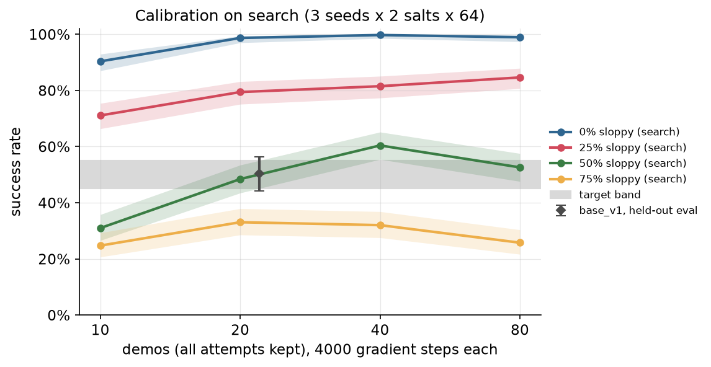
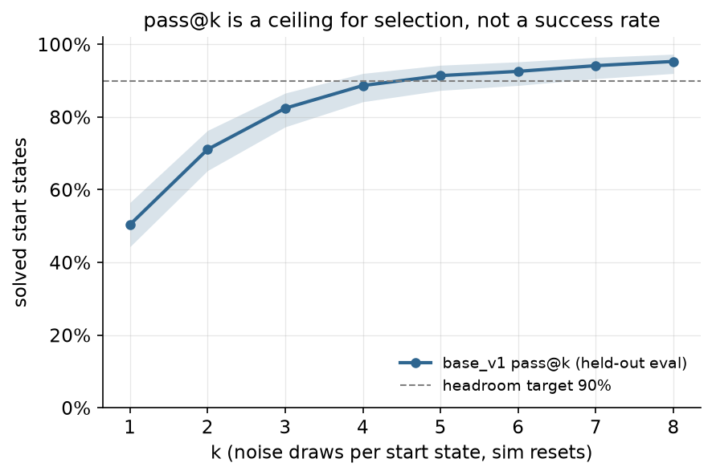
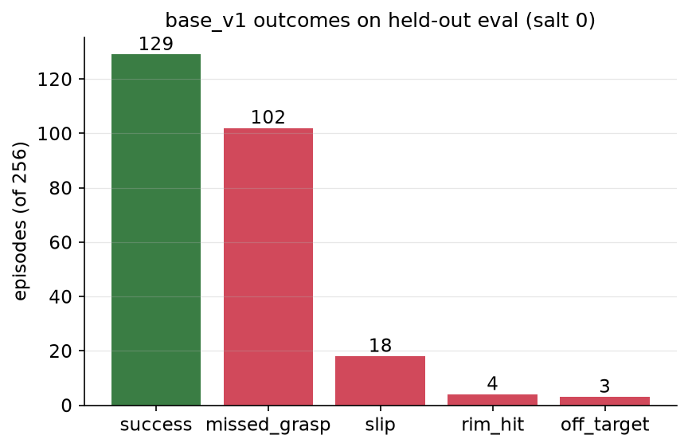
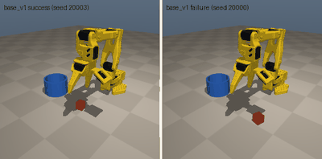
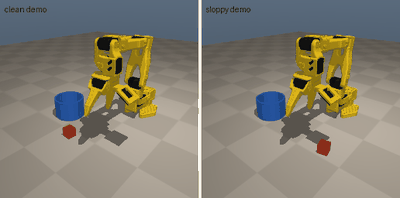
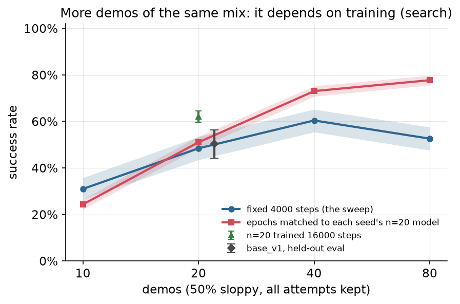
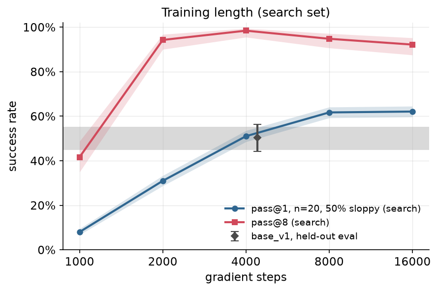

# Chapter 0: The base policy

Every later chapter starts from the same frozen policy, `base_v1`. This chapter builds it: a small flow-matching policy, behavior-cloned from scripted demonstrations of mixed quality, and deliberately calibrated so that it succeeds about half the time. It is not a hill-climbing method itself. It is the hill.

Code: [`algos/00_bc_flow.py`](../../algos/00_bc_flow.py). Checkpoint: [`checkpoints/base_v1_so101.pt`](../../checkpoints/base_v1_so101.pt) with its manifest [`base_v1_so101.json`](../../checkpoints/base_v1_so101.json).

```bash
uv run python algos/00_bc_flow.py            # full run: 16 min on an M5 Pro (6 rollout workers, busy machine)
uv run python algos/00_bc_flow.py --quick    # smoke test, about 40 s
```

The quick run writes its models, plots and checkpoint under `runs/ch00_quick/`, so it never touches the real ones, plus a results JSON in `results/ch00/` marked `"quick": true`, which the leaderboard skips.

Load the base in any chapter with `functools.partial(FlowChunkPolicy.load, "checkpoints/base_v1_so101.pt", noise="gaussian")` (or `noise="fixed", ticket=w`, or a callable). Read the manifest's `known_caveats` and `mandatory_baselines` first (see "What went wrong" #1 and #2).

## The idea in plain words

Behavior cloning is supervised learning on what a demonstrator did: for each observation in the demos, predict the actions that followed. It needs no reward and no robot time beyond the demos, which is why almost every real robot policy starts this way.

Two design choices matter for the rest of the course:

1. **The policy models a distribution, not an average.** A flow-matching policy turns a random noise vector into an action chunk. Different noise gives different, equally plausible chunks. That noise is the handle later chapters grab: Chapter 3 fixes it, Chapter 7 steers it, Chapter 12 samples many and picks one.
2. **A clone copies the data, including its mistakes.** Our demos come from two "operators": a careful one (the tuned scripted controller, 240/240 = 100% [98.4, 100.0] successes in the pool) and a sloppy one (the same controller with jittered knobs and noisy actions, 47/180 = 26.1% [20.2, 33.0] successes). We keep every attempt, as an operator who just hits "record" and never deletes a take would. The clone then reproduces the mixture: with half the demos sloppy and a fixed training budget, it succeeds about half the time.

The second point is how we set the base rate. With the training budget held fixed, the sloppy fraction moves success far more than the demo count does. That does not mean more demos are useless. When training grows with the data, four times as many demos of the same mix raise search success from 51% to 78% (What went wrong #1). Our reading, which we did not test further: more examples of both operators, spread over more cube positions, give the clone more to generalize from, even though it still copies both operators.

## The math

The policy predicts a chunk of H = 8 actions (4-D each, so 32 numbers) from the current observation, executes the first 4, and replans. Training is rectified flow (flow matching with straight paths):

```
x0 ~ N(0, I)                  noise, 32-dim
x1 = normalized action chunk from the demos
t  ~ U(0, 1),   x_t = (1 - t) x0 + t x1
loss(θ) = E || v_θ(obs, x_t, t) - (x1 - x0) ||²
```

The network learns the velocity that carries noise to data along a straight line. At test time we integrate `dx/dt = v_θ(obs, x, t)` from `x = noise` with 10 Euler steps. Given the noise the output is deterministic, so the policy is a deterministic function of `(obs, noise)`; all of its randomness lives in the noise.

Because the loss is a regression onto *every* demonstrated chunk, the learned distribution matches the demo distribution. If the demos at a given state are "grasp cleanly" half the time and "fumble" the other half, the clone samples each about half the time. Behavior cloning has no notion of which half was better. Chapters 9 and 10 add that notion back (filtering, weighting, corrections); chapters 3, 7 and 12 select among the behaviors the clone already has.

Architecture (DESIGN §6): MLP with 4 hidden layers of 256 units, SiLU, a 32-dim sinusoidal time embedding, observation and action normalization from dataset statistics. AdamW, lr 1e-3 with cosine decay, batch 256.

## Papers it mirrors

| Paper | What we take from it |
|---|---|
| Rectified flow: [Flow Straight and Fast](https://arxiv.org/abs/2209.03003) (Liu et al., 2022) | The straight-line interpolation and velocity target. |
| [Flow Matching for Generative Modeling](https://arxiv.org/abs/2210.02747) (Lipman et al., 2022) | The regression-onto-a-velocity-field view of generative modeling. |
| ACT: [Learning Fine-Grained Bimanual Manipulation with Low-Cost Hardware](https://arxiv.org/abs/2304.13705) (Zhao et al., 2023) | Predicting chunks of actions and executing part of each chunk. |
| [Diffusion Policy](https://arxiv.org/abs/2303.04137) (Chi et al., 2023) | A generative model over action sequences as a robot policy. |
| Golden Ticket ([C236]) | Why we care that the policy is deterministic given its noise: a fixed noise vector is a searchable knob. |
| RINSE ([C274]) | Demo quality can matter more than demo count: on Transport (mh), 55% using the 50 smoothest of 300 demos vs 39% with all of them. |
| JITI ([C189]), PACL ([C448]) | Mixed-quality demonstration data as the normal starting point for post-training. |

The first four are foundational and are not in `data/papers.csv`, which lists improvement methods; the links go to arXiv. The ACT code is listed under resources.

## How we calibrated it (all choices on the search set)

DESIGN §6 asks for a base that lands at 45-55% on `eval` with pass@8 ≥ 90%: bad enough to leave room, good enough that success is reachable from almost every start state. Everything below was chosen on the `search` set (64 start states, seeds 10 000-10 063). The held-out `eval` set (256 states) was scored once, at the end.

**Demos.** Clean demos: `KnobController(TUNED_KNOBS)`. Sloppy demos: the same controller with `noise={"knob_std": 0.15, "action_std": 0.3}` (each knob perturbed by 15% of its range per episode, plus N(0, 0.3) on every action). Demo env seeds come from a dedicated range, 50 000 + 2000·seed (clean) and +1000 (sloppy), far from every evaluation set. Each pipeline seed records one pool (80 clean, 60 sloppy demos); every dataset in the sweep is a prefix of that pool, so the 20-demo dataset is contained in the 40-demo one, as it would be if you kept recording.

**Sweep.** Demo count n ∈ {10, 20, 40, 80} × sloppy fraction ∈ {0, 0.25, 0.5, 0.75}, with training fixed at 4000 gradient steps for every cell. Each of the 16 settings was trained for 3 pipeline seeds (the seed sets both which demos were recorded and the network initialization) and scored with 2 noise salts × 64 search episodes per seed, so each cell below is 384 episodes.

**Rule.** Take the smallest setting (fewest demos, then least sloppy) whose pooled search success is in [45%, 55%], then check its search pass@8 is ≥ 90%. Among its three seeds, `base_v1` is the one whose search success (8 salts, 512 episodes) is closest to 50%.



Search success, pooled over 3 seeds (k/384, Wilson 95%), all at 4000 gradient steps:

| demos | 0% sloppy | 25% sloppy | 50% sloppy | 75% sloppy |
|---|---|---|---|---|
| 10 | 347 = 90.4% [87.0, 92.9] | 273 = 71.1% [66.4, 75.4]\* | 119 = 31.0% [26.6, 35.8] | 95 = 24.7% [20.7, 29.3]\* |
| 20 | 379 = 98.7% [97.0, 99.4] | 305 = 79.4% [75.1, 83.2] | **186 = 48.4% [43.5, 53.4]** | 127 = 33.1% [28.6, 37.9] |
| 40 | 383 = 99.7% [98.5, 100.0] | 313 = 81.5% [77.3, 85.1] | 232 = 60.4% [55.4, 65.2] | 123 = 32.0% [27.6, 36.9] |
| 80 | 380 = 99.0% [97.4, 99.6] | 325 = 84.6% [80.7, 87.9] | 202 = 52.6% [47.6, 57.5] | 99 = 25.8% [21.7, 30.4] |

\* The n = 10 cells cannot hit 25% and 75% exactly. The code uses Python's `round`, which rounds halves to even, so these two cells hold 2/10 (20%) and 8/10 (80%) sloppy demos. The results JSON records the real count (`n_sloppy`) for every cell.

**About these intervals.** Each cell pools 3 seeds × 2 salts over the *same* 64 start states, so a Wilson interval on k/384 treats repeated draws on one state as independent. Read these intervals as conditional on these 64 start states. The results JSON also has a cluster-bootstrap interval (`ci_cluster`) that resamples start states. It is up to about 4 points wider per side for the cells in the 70-90% range (10 demos, 25% sloppy: [62.5, 79.4] instead of [66.4, 75.4]) and within 1 point of Wilson near 50%.

What the table says:

- **At a fixed training budget, the sloppy fraction sets the success rate.** Going from 25% to 50% sloppy at 20 demos moves success from 79% to 48%. Going from 20 to 80 demos at 25% sloppy moves it from 79% to 85%. Across the demo count this comparison is confounded: every cell gets 4000 gradient steps, so the 80-demo datasets are seen about 4× fewer times than the 20-demo ones. That confound, not the data, is why 80 demos score *below* 40 demos at 50% sloppy. What went wrong #1 removes it.
- **Clean demos are enough on their own.** Ten clean demos already give 90%, twenty give 99%. The task is easy to imitate once the data is good, which is why the course's base has to be made worse on purpose.
- The chosen setting is **n = 20 demos, 50% sloppy** (10 clean, 10 sloppy). Its search pass@8 is 189/192 = 98.4% [95.5, 99.5] (3 seeds × 64 states), so it passes the headroom check. Seed 1 became `base_v1` (search 250/512 = 48.8% [44.5, 53.2] over 8 salts; cluster bootstrap over the 64 states [43.6, 54.1]).

`base_v1`'s own dataset: 20 attempts, 15 of them successes (10/10 clean, 5/10 sloppy), 1449 steps, dataset hash `1d0c955f745dabb2`.

## Results

Held-out `eval` set, n = 256 start states (seeds 20 000-20 255), policy noise salt 0 unless noted:

| Policy | k/n | Success [Wilson 95%] |
|---|---|---|
| Scripted TUNED controller (the clean demonstrator; the results file's `base`) | 255/256 | 99.6% [97.8, 99.9] |
| **`base_v1` pass@1** (the results file's `final`) | **129/256** | **50.4% [44.3, 56.5]** |
| `base_v1` pass@1, mean over 8 noise salts | 966/2048 | 47.2% [45.0, 49.3]; start-state bootstrap [44.4, 50.0] |
| `base_v1` pass@8 (8 salts per start state, sim resets) | 244/256 | 95.3% [92.0, 97.3] |
| Seed 0 (same data recipe, not selected) | 137/256 | 53.5% [47.4, 59.5] |
| Seed 2 (same data recipe, not selected) | 138/256 | 53.9% [47.8, 59.9] |
| Three seeds pooled | 404/768 | 52.6% [49.1, 56.1]; start-state bootstrap [48.6, 56.5] |

Both targets are met: pass@1 is 50.4% (inside 45-55%, though the interval is wider than the band, as it must be with n = 256), and pass@8 is 95.3% (≥ 90%). The three seeds agree within their intervals, so the recipe, not a lucky seed, sets the rate. The two pooled rows reuse the same 256 start states, so their Wilson intervals are conditional on those states; the bootstrap intervals, which resample states, are the ones to quote for the start-state distribution. The single-attempt number is what a deployed policy gets. pass@8 needs eight tries from the same start state, which only a simulator can give you. It is the ceiling for the selection methods of chapters 3, 7 and 12, not a success rate.



pass@k on eval (k/256, Wilson 95%):

| k | 1 | 2 | 3 | 4 | 5 | 6 | 7 | 8 |
|---|---|---|---|---|---|---|---|---|
| solved | 129 | 182 | 211 | 227 | 234 | 237 | 241 | 244 |
| rate | 50.4% [44.3, 56.5] | 71.1% [65.3, 76.3] | 82.4% [77.3, 86.6] | 88.7% [84.2, 92.0] | 91.4% [87.3, 94.3] | 92.6% [88.7, 95.2] | 94.1% [90.6, 96.4] | 95.3% [92.0, 97.3] |

Most of the gain comes in the first four draws. 12 start states (4.7%) were never solved in 8 draws; no amount of noise selection will fix those.

**How base_v1 fails** (`OutcomeTracker`, eval salt 0):



| Outcome | Episodes |
|---|---|
| success | 129 |
| missed_grasp | 102 |
| slip | 18 |
| rim_hit | 4 |
| off_target | 3 |

Missed grasps dominate: 102 of 127 failures. That mirrors the sloppy demos, whose jittered grasp offsets mostly miss the cube. The mix is less diverse than we would like (see below).

Left: the first eval episode base_v1 solves (seed 20 003). Right: the first one it fails (seed 20 000, a missed grasp). Neither was picked by hand; both are the first of their kind in seed order.



The data it learned from: a clean demo and a sloppy demo from the same pool (this sloppy demo happens to succeed, slowly and off-center).



### Cost

From [`results/ch00/bc_flow_so101_20260930-145742.json`](../../results/ch00/bc_flow_so101_20260930-145742.json):

| Budget | Robot-minutes | What it is |
|---|---|---|
| search | **9854.7** | Everything below, charged to `search` in the results file |
| · this run | 2696.2 | Calibration (16 settings × 3 seeds × 2 salts × 64 episodes), the pass@8 check, the training-length ablation and the matched-epoch ablation |
| · pilots (estimate) | 3916.7 | About 46 hand-run pilot configurations before the script existed, about 23 500 search episodes, charged at 100 steps each because their lengths were not logged (this script averages about 91) |
| · earlier full runs | 3241.8 | Two earlier runs of this script (1193.9 and 2047.9), exact figures from their results files in `runs/ch00_superseded/` |
| train | 52.0 | Recording the demo pools: 3 seeds × 140 demos |
| eval | 425.3 | Scripted controller once, three seeds once, base_v1 with 8 salts |
| human (demos) | 52.0 | The same demo time, counted as operator time at 10 Hz (resets not modeled) |

The earlier full runs produced the same sweep, the same chosen setting and the same `base_v1` weights (the pipeline is deterministic; this run's checkpoint is bit-for-bit the earlier one). On a real arm you would not repeat them, but they were real rollouts spent getting here, so they are charged. The `--quick` smoke runs (about 100 robot-minutes each, results files marked quick) are not charged: nothing was chosen from them.

In sim these rollouts are free, and the whole run takes 16 minutes (0.69 CPU-hours) on a machine shared with other experiments. On a real arm the numbers mean something different: `base_v1` itself needs only its own 20 demos, **1449 steps = 2.4 minutes of teleoperation** at 10 Hz, but *finding* the recipe by the procedure above took about 164 robot-hours of search rollouts, about 40% of it before the final script existed. Nobody calibrates a real base that way. On hardware you would pick a recipe from sim and check it with a few dozen trials on `R_search` (see the hardware step). A 256-episode evaluation of `base_v1` through `evaluate()` takes 7.8 s with 6 workers.

**On the README leaderboard** this run is the `ch00 bc_flow` row, and it reads oddly: base 99.6%, final 50.4%, Δ −49.2 pp, 9,906.7 improvement robot-minutes. The results file's `base` is the scripted demonstrator and its `final` is `base_v1`, so the row records what it cost to *build* the hill (search plus demo recording), not an improvement. Every later chapter's row starts from `base_v1` or from the default knobs.

## What went wrong

**1. Our first reading of the sweep was wrong: more demos do help, if training keeps up.** An earlier version of this chapter read the sweep's 50%-sloppy column (48% → 60% → 53% for 20, 40, 80 demos) as "more demos of the same quality do not help". A reviewer pointed out the confound: every cell trains 4000 gradient steps, so the 80-demo model sees each example about 4× less often than the 20-demo one. We added an ablation that removes it. At 50% sloppy, each seed trains every demo count for as many epochs as its own 20-demo model (667 epochs for seed 1, 572 for seeds 0 and 2), so the gradient steps grow with the data (search set, 3 seeds × 8 salts × 64 states):



| demos (50% sloppy) | fixed 4000 steps (k/384) | matched epochs: steps | matched epochs: search pass@1 (k/1536) | start-state bootstrap | search pass@8 (k/192) |
|---|---|---|---|---|---|
| 10 | 31.0% [26.6, 35.8] | 2001-2288 | 374 = 24.3% [22.3, 26.6] | [20.4, 28.5] | 136 = 70.8% [64.0, 76.8] |
| **20** | **48.4% [43.5, 53.4]** | **4000** | **784 = 51.0% [48.5, 53.5]** | **[48.0, 54.0]** | **189 = 98.4% [95.5, 99.5]** |
| 40 | 60.4% [55.4, 65.2] | 7436-8008 | 1122 = 73.0% [70.8, 75.2] | [70.1, 75.8] | 191 = 99.5% [97.1, 99.9] |
| 80 | 52.6% [47.6, 57.5] | 14300-16008 | 1194 = 77.7% [75.6, 79.7] | [75.3, 80.3] | 192 = 100.0% [98.0, 100.0] |

With training matched to the data, going from 20 to 80 demos of the same 50% mix raises search success from 51% to 78%. Part of that is simply more gradient steps: the same 20 demos trained for 16 000 steps reach 62.1% [59.7, 64.5] (#2). Compared at about the same number of steps (14 300-16 008 vs 16 000), 80 demos still beat 20 by about 16 points, 77.7% against 62.1%, and all three seeds agree (80 demos: 391, 406, 397 of 512; 20 demos at 16 000 steps: 302, 357, 295 of 512). The intervals do not overlap even with the start-state bootstrap ([75.3, 80.3] vs [56.7, 67.1]). The 10-demo row goes the other way (24% at matched epochs vs 31% at 4000 steps) because matching epochs gives it *fewer* steps.

So the correct lesson is narrower than the one we first wrote. At a fixed training budget, the sloppy fraction is the main dial, which is why we used it to set the base rate. But if a policy is stuck at 50% on mixed-quality demos, recording more of the same mix *and training longer* is a real, cheap baseline, worth about 27 points here in sim. Curating the data (Chapter 9) or correcting the policy where it goes (Chapter 10) has to beat that, not only the frozen `base_v1`.

**2. base_v1 is not trained to its plateau.** We fixed training at 4000 gradient steps from a pilot run before the sweep. The ablation below (same 20-demo data, 3 seeds, 8 salts each, search set) shows success is still rising there:



| gradient steps | search pass@1 (k/1536) | start-state bootstrap | search pass@8 (k/192) |
|---|---|---|---|
| 1000 | 123 = 8.0% [6.8, 9.5] | [6.2, 9.9] | 80 = 41.7% [34.9, 48.7] |
| 2000 | 476 = 31.0% [28.7, 33.3] | [28.8, 33.3] | 181 = 94.3% [90.0, 96.8] |
| **4000 (base_v1)** | **784 = 51.0% [48.5, 53.5]** | **[48.0, 54.0]** | **189 = 98.4% [95.5, 99.5]** |
| 8000 | 948 = 61.7% [59.3, 64.1] | [58.1, 65.1] | 182 = 94.8% [90.7, 97.1] |
| 16000 | 954 = 62.1% [59.7, 64.5] | [56.7, 67.1] | 177 = 92.2% [87.5, 95.2] |

The k/1536 counts cover only 64 distinct start states, so the Wilson intervals (conditional on those states) are narrower than the bootstrap ones. Part of base_v1's 50% comes from training length, not only from the data. Training 2-4× longer on the same 20 demos lifts search success by about 11 points, to a plateau near 62%, while pass@8 slips from 98% to 92%: the longer-trained policy becomes more consistent and less diverse. We kept 4000 steps anyway, because that point has the most headroom (the highest pass@8), which is what selection and steering methods need.

The consequence for later chapters is written into the manifest (`known_caveats`, `plateau_search_sr`, `more_demos_search_sr`, `mandatory_baselines`): any chapter that retrains or fine-tunes the base (4, 9 and 10 in the curriculum) must report two baselines next to its method, "train longer on the same 20 demos" (about +11 points on search) and "train longer on more demos of the same mix" (about +27 points on search with 80 demos). A gain smaller than those has not beaten plain behavior cloning. A cleaner base would train to the plateau and use a higher sloppy fraction; that is a candidate for `base_v2`.

**3. The failures are mostly one kind.** 80% of failures are missed grasps. The course plan wanted diverse near-misses (slips, rim hits, off-target drops) so that different methods fix different things. Our sloppy operator mostly fails at the grasp, and the clone inherits that. Methods that improve the grasp will look strong on this base; methods that improve the drop will have little to fix.

**4. Pilot runs were first left out of the ledger.** Before writing the final script we explored the design (successes-only vs keep-all, noise levels, training length) in about 46 pilot configurations, roughly 23 500 search-set episodes. None of them touched `eval`, but the first results file did not count them, nor an earlier full run, so its cost column understated the search budget about 3.5× (2047.9 robot-minutes recorded against about 7160 spent by then). They are now charged to `search` as a named constant in the script (`PRIOR_SEARCH_STEPS`), with the pilot part marked as an estimate, and itemized in the results file (`prior_search_steps_charged`).

**5. The sloppy demos share random numbers with the cube pose.** `record_demos` passes the env seeds as the controller seeds. The env's `reset` and the `KnobController` both seed `np.random.default_rng` with that number and read the same bit stream, so a sloppy demo's knob jitter is a deterministic function of where the cube starts. Over 20 000 seeds from 50 000 we measured a 0.76 correlation between the size of the first knob perturbation (`grasp_dx`) and a function of the cube's x draw, and Pearson correlations of 0.09-0.10 between the three jitter magnitudes and their paired pose draws. With hashed seeds (`policy_seed("demos", s)`) all of these drop to about 0.00. The practical effect on 10 sloppy demos is small, but it is exactly the coupling that `policy_seed` exists to prevent. Fixing it changes every demo and so every number in this chapter, and `base_v1` is meant to stay frozen, so we kept it and marked it in the code and the manifest. A `base_v2` should use hashed demo seeds.

**6. A tempting alternative we rejected.** In pilots with a milder sloppy operator (`knob_std` 0.1, `action_std` 0.2), keeping only the successful demos (what a careful operator does) gave 80-95% on search with 10-40 demos once training was long enough: filtering failures out of the data is most of the climb. We kept all attempts so the course has something to climb, and so that Chapter 9 can show that filtering step as a method with its cost.


## The hardware step (SO-101)

> **Safety.** A learning policy can move the arm quickly and in unexpected ways, and the servos can pinch. Clear the workspace, keep the arm's power switch or plug (or an e-stop) within reach, start with low speed and a small per-step limit (in LeRobot, `max_relative_target` on the follower, which is off by default), keep your hands out of the workspace while the policy runs (reset only when the arm has stopped), and supervise every run.

Adapted from the curriculum (§2, "Calibrating", step 4). One change: the curriculum says to tune until the real base lands at 40-60% "on `R_eval`", which would select on the held-out set. Here the tuning happens on `R_search` and `R_eval` is scored once.

1. **Record about 50 leader-arm teleop demos** (about 40 minutes including resets), with the cube on the printed mat's marked positions. Keep every take, and deliberately make part of them sloppy (off-center grasps, early releases) at roughly the fraction the sim calibration suggests. Record the time you spend, including resets, as human-minutes.
2. **Use the state observation**, with the cube position from a color-blob detector through a calibrated table homography. This keeps the same 21-D state interface as the sim policy, so this file trains the real base unchanged (swap the demo source for your LeRobot dataset).
3. **Tune on `R_search`, score on `R_eval` once.** Adjust the demo count, the sloppy fraction and the cup diameter using only the 10 marked `R_search` spots (a few tries per spot) until the real `base_v1` sits at roughly 40-60% there. Then freeze it and run the 30 marked `R_eval` spots once. Report k/30 with its Wilson interval (15/30 is [33.2, 66.8]), never a bare percentage, and do not go back and re-tune if the `R_eval` number misses the band: report the miss instead, which is the same rule the sim procedure follows. With 10 spots the search estimate is coarse (5/10 is [23.7, 76.3]), which is the price of keeping `R_eval` clean.
4. Real hardware has no free pass@8. You can estimate headroom by re-running the same `R_search` spot a few times, but each try is a real reset, and it goes in the ledger as search time.

Expect the real numbers to differ from sim: servo backlash, the roughly 17 mm of gravity sag at the end-effector and detector noise all add failure modes the scripted sloppy operator never produced.

[C189]: https://arxiv.org/abs/2511.22555
[C236]: https://arxiv.org/abs/2603.15757
[C274]: https://arxiv.org/abs/2604.23000
[C448]: https://arxiv.org/abs/2609.29000
