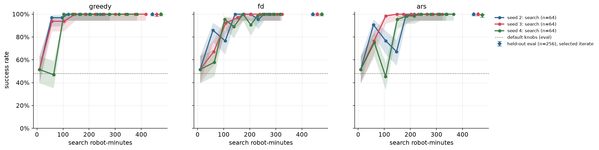
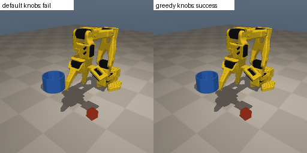
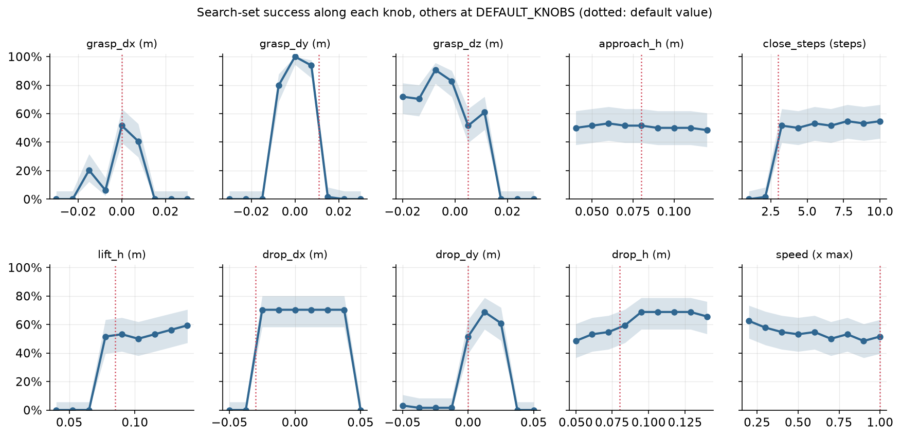
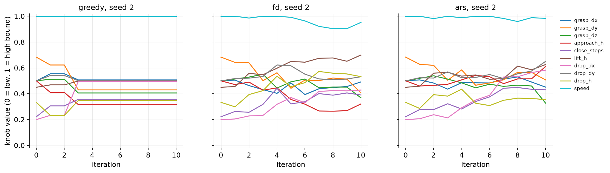
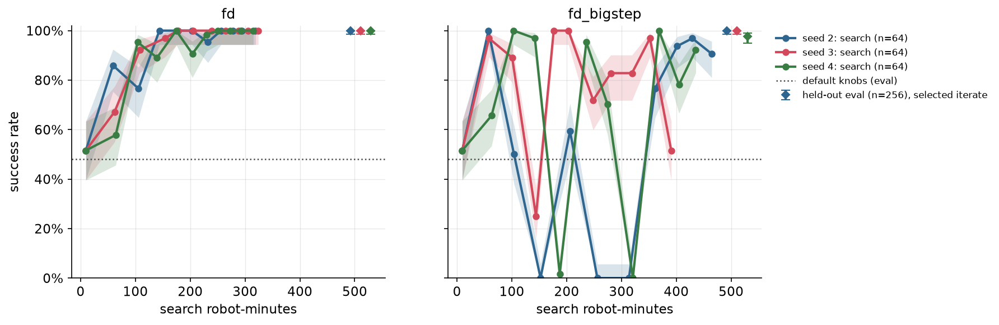

# Chapter 1: Hill climbing with a success counter

Three ways to tune a scripted controller's 10 knobs from success counts alone: greedy hill climbing, antithetic finite differences (FD) and ARS. All three take the mis-tuned controller from 123/256 = 48.0% to 99-100% on held-out states. Pooled over 3 seeds: greedy 767/768 = 99.9%, FD 768/768 = 100.0%, ARS **766/768 = 99.7% [99.1, 99.9]** (per seed 256, 256 and 254 of 256), at 278-418 search robot-minutes per run before tuning costs. The seeds share the same 256 start states, so the pooled intervals are too narrow; the per-seed rows are in Results.

Code: [`algos/01_hill_climb.py`](../../algos/01_hill_climb.py). Results: [`results/ch01/`](../../results/ch01/). Media: [`media/ch01/`](../../media/ch01/).

## The idea in plain words

You have a controller with a few knobs. You cannot differentiate it, you have no critic, and the only feedback is whether the cube ended up in the cup. What can you do?

You can do what an engineer does at the bench: change the knobs a little, run the robot a few times, count the successes, and keep changes that help. This chapter turns that into three algorithms and runs them on the scripted `KnobController` (10 knobs: grasp offsets, heights, a close delay, drop offsets, speed). The starting point is `DEFAULT_KNOBS`, which succeeds on 123/256 = 48.0% [42.0, 54.2] of the start states in the held-out eval set.

- **Greedy hill climbing.** Perturb the current knobs at random. Run the candidate on the same start states as the current knobs. Keep the candidate only if it scores strictly better.
- **Antithetic finite differences (FD).** Try pairs of mirrored perturbations, `+ε` and `-ε`. Directions where `+ε` beats `-ε` point uphill. Average them into a gradient estimate and take a step.
- **ARS (Augmented Random Search).** The same as FD with two changes. Use only the best few directions, and divide the step by the spread of the rewards you used. The second change makes the step size adapt to how noisy the scores are.

## The math

The success count `R(θ)` is a staircase: moving a knob by a hair almost never changes it, so its gradient is zero almost everywhere. Smooth it instead. Define

```
J(θ) = E_{ε ~ N(0, I)} [ R(θ + σ ε) ]
```

`J` is smooth, and its gradient can be estimated from rollouts alone. With `N` antithetic pairs, an unbiased estimate is

```
∇J(θ) ≈ 1/(2 N σ) · Σ_i [ R(θ + σ ε_i) − R(θ − σ ε_i) ] · ε_i
```

(For a linear `R(θ) = a·θ`, each difference is `2σ (a·ε_i)`, and the average of `(a·ε) ε` is `a`.) The code drops the `1/2`, so the vector it steps along is twice that estimate:

```
g = 1/(N σ) · Σ_i [ R(θ + σ ε_i) − R(θ − σ ε_i) ] · ε_i  = 2 · (estimate of ∇J)          (FD)
θ ← θ + α · g
```

The factor 2 is absorbed into the step size `α`: `α = 0.02` here is a step of `0.04` along the estimated `∇J`.

Mirroring cancels the even-order terms of the Taylor expansion, so the estimate has far less variance than using one-sided differences.

ARS (Mania et al., 2018, "V1-t") sorts the pairs by `max(R+, R−)`, keeps the top `b`, and uses

```
θ ← θ + α / (b · σ_R) · Σ_{top b} [ R+_i − R−_i ] · ε_i
```

where `σ_R` is the standard deviation of the `2b` rewards it kept. ARS's third trick, normalizing observations, does not apply: the knobs do not multiply observations.

Two implementation details carry most of the weight:

1. **A normalized knob space.** Every knob is mapped to `[0, 1]` by its `KNOB_SPACE` bounds, so `σ = 0.1` means "10% of the range" for a height in meters and for a delay in control steps alike. Candidates are clipped to the bounds.
2. **Common random numbers.** Every iteration draws 16 of the 64 search start states. All candidates in that iteration run on exactly those 16 states, with the same env seeds and policy seeds. `R+ − R−` then measures the knobs, not luck in cube placement.

All three methods get the same budget per iteration: `2N = 12` candidate evaluations of 16 episodes each (192 episodes). Greedy spends one of the 12 re-scoring the incumbent on the new minibatch. After each iteration, the current knobs are scored on all 64 search states. That score gives the learning curve, and it also picks the final knobs: the iterate with the best 64-state score, the latest one on ties. These monitoring episodes are robot time, so they are charged to the search budget as well. Only then are the picked knobs run once on the 256 held-out `eval` states.

## Papers it mirrors

- **Kohl & Stone 2004** ([C000](https://www.cs.utexas.edu/~pstone/Papers/bib2html-links/icra04.pdf)), *Policy Gradient Reinforcement Learning for Fast Quadrupedal Locomotion*. The original on-hardware hill climb: finite differences over 12 gait parameters on real Aibos, about 3 hours of robot time. Their note that a roughly hand-tuned start worked best is exactly our setup: we start from plausible, mis-tuned knobs, not from random ones.
- **ARS** ([C012](https://arxiv.org/abs/1803.07055)), *Simple random search provides a competitive approach to reinforcement learning*. Antithetic random search with reward-std scaling and top-b directions, competitive with deep RL on MuJoCo locomotion.
- **The modern "stage 2" use of the same loop.** Recent papers take a policy that already mostly works and climb the true metric with black-box perturbations, because at that point the metric is all you trust:
  - **TD-ES** ([C186](https://arxiv.org/abs/2511.09923)), *Harnessing Bounded-Support Evolution Strategies for Policy Refinement*, continues from a PPO checkpoint with antithetic ES and bounded triangular noise, so every candidate stays in a small box around the current weights. Our perturbations are not bounded that way: they are Gaussian (`σ = 0.1`), and the clip to `[0, 1]` only enforces the global knob limits, which at the default are at least `2σ` away for every knob except `speed`. The TD-ES version here would draw each knob's noise from a uniform or triangular distribution on `±a` around θ. One side effect of our clip: the default `speed = 1.0` sits on its upper bound, so every mirrored pair is one-sided in that knob.
  - **EvolSAC** ([C134](https://arxiv.org/abs/2507.10030)) pretrains SAC on a shaped reward, then runs an evolution strategy on the actor with the real competition score as fitness. In the same way, our controller was designed by hand (the "proxy"), and the search optimizes the real success count.
  - **ES at Scale** ([C155](https://arxiv.org/abs/2509.24372)) perturbs all weights of 30 copies of an LLM and steps toward the copies with the best scalar outcome reward, with no backprop.

  The algorithm is the same in all of them. What changes is the size of θ (10 knobs here, billions of weights there) and how many evaluations each candidate gets.

## Results

All numbers come from the full runs in `results/ch01/` (SO-101, variant v1). Each method ran with seeds 2, 3 and 4 (the seed sets the search's own random draws; every run uses the same 64 search-set start states), 10 iterations, `N = 6`, `σ = 0.1`, 16 start states per candidate, FD step `α = 0.02`, and ARS step `α = 0.05` with `b = 3`. Seeds 0 and 1 were used to choose `α` and the number of iterations (next section), so no reported run shares its random draws with the tuning. Held-out eval is n = 256 per run, with Wilson 95% intervals.

| Method | Seed | Search score of picked iterate (n=64) | Held-out eval (n=256) | Search robot-min, this run | Search robot-min incl. tuning | First ≥ 61/64 on search (robot-min) |
|---|---|---|---|---:|---:|---:|
| default knobs | – | 33/64 = 51.6% [39.6, 63.4] | **123/256 = 48.0% [42.0, 54.2]** | 0 | 0 | – |
| random candidate (no search) | 2 | – | 172/256 = 67.2% [61.2, 72.6] | 0 | 0 | – |
| random candidate (no search) | 3 | – | 0/256 = 0.0% [0.0, 1.5] | 0 | 0 | – |
| random candidate (no search) | 4 | – | 0/256 = 0.0% [0.0, 1.5] | 0 | 0 | – |
| greedy | 2 | 64/64 = 100.0% [94.3, 100.0] | 256/256 = 100.0% [98.5, 100.0] | 278.4 | 1,309.7 | 56.0 |
| greedy | 3 | 64/64 = 100.0% [94.3, 100.0] | 255/256 = 99.6% [97.8, 99.9] | 417.7 | 1,449.0 | 146.9 |
| greedy | 4 | 64/64 = 100.0% [94.3, 100.0] | 256/256 = 100.0% [98.5, 100.0] | 383.4 | 1,414.7 | 102.9 |
| fd | 2 | 64/64 = 100.0% [94.3, 100.0] | 256/256 = 100.0% [98.5, 100.0] | 319.1 | 3,586.3 | 143.6 |
| fd | 3 | 64/64 = 100.0% [94.3, 100.0] | 256/256 = 100.0% [98.5, 100.0] | 324.0 | 3,591.2 | 153.8 |
| fd | 4 | 64/64 = 100.0% [94.3, 100.0] | 256/256 = 100.0% [98.5, 100.0] | 315.0 | 3,582.2 | 104.2 |
| ars | 2 | 64/64 = 100.0% [94.3, 100.0] | 256/256 = 100.0% [98.5, 100.0] | 336.3 | 1,207.8 | 182.2 |
| ars | 3 | 64/64 = 100.0% [94.3, 100.0] | 256/256 = 100.0% [98.5, 100.0] | 322.9 | 1,194.4 | 105.8 |
| ars | 4 | 64/64 = 100.0% [94.3, 100.0] | 254/256 = 99.2% [97.2, 99.8] | 365.9 | 1,237.4 | 149.7 |

"Incl. tuning" adds the method's share of the tuning runs described below. It is the search cost the results files report and the one the leaderboard counts.

Pooled over the three seeds: greedy 767/768 = 99.9% [99.3, 100.0], fd 768/768 = 100.0% [99.5, 100.0], ars 766/768 = 99.7% [99.1, 99.9]. These pooled intervals are too narrow. The three runs of a method share the same 256 start states, so pooling them does not give three times the evidence. Quote the per-seed rows. Each run's improvement over the default is significant: McNemar's exact test on the paired eval episodes gives p between 1.2e-38 (greedy seed 3) and 1.8e-40 (the 256/256 runs). The differences between methods, at most 2 eval episodes, are not.

Each run used 2,624 search episodes. 704 of those (27%) were the per-iteration monitoring on the 64 search states. Each run also charged 53–57 eval robot-minutes: the shared default-knob evaluation (40.0 robot-minutes) plus its own final evaluation. The main run (9 search runs plus evals) took 8.2 minutes of wall time on the M5 Pro with 6 rollout workers, while other jobs were using the same CPU.



*Search-set score (64 states, Wilson band) of the current knobs against this run's search robot-minutes (tuning not included), 3 seeds per method. The diamonds on the right are the held-out eval scores (n = 256) of the iterate each run picked. The dotted line is the default knobs on eval.*



*Held-out start state 20000. Left: the default knobs close the gripper off-center and miss the cube. Right: the knobs found by greedy (seed 2) pick it up and drop it in the cup.*

### How the hyperparameters were chosen, and what that cost

Choosing a hyperparameter by trying it on the robot is search, so it belongs in the budget (honesty rule 5). Before the reported runs we made 10 exploratory runs on seeds 0 and 1, each for 15 iterations. The first batch was greedy, ARS and FD with `α = 0.05`, the first default. The second batch was FD with `α = 0.01` and `α = 0.02`. From their search-set curves we made two choices. FD's `α` went from 0.05 to 0.02, because 0.05 fell off cliffs and 0.01 climbed more slowly. The number of iterations went from 15 to 10, because every run at the settings we kept had reached 64/64 by iteration 5. ARS's `α = 0.05` and `b = 3`, and the shared `σ = 0.1`, `N = 6` and 16-state minibatch, were set before any run and never changed. The exploratory greedy and ARS runs used the same values as the final ones.

| Tuning runs (seeds 0 and 1, 15 iterations each) | Search robot-min |
|---|---:|
| greedy | 1,031.3 |
| ars | 871.5 |
| fd, `α = 0.05` | 1,415.7 |
| fd, `α = 0.01` | 957.5 |
| fd, `α = 0.02` | 894.0 |
| **total** | **5,170.0** |

The results files of the exploratory runs had been deleted, so we measured these costs by replaying the same runs with `--no-heldout`. Rollouts are deterministic, and the replay reproduced every search score and every robot-minute count the exploratory logs contained. The replay is sim time spent on accounting, and is not charged a second time. Each reported run is charged its own method's tuning (greedy 1,031.3, fd 3,267.2, ars 871.5 robot-minutes) in its results file, under `extra.tuning_robot_min_charged`. The choice of 10 iterations drew on all of them, so this split is a convention. FD comes out the most expensive because it is the only method whose step size we tuned. With the tuning included, an FD row costs about 3,590 search robot-minutes, eleven times the run itself.

One lapse to report. The exploratory runs used the normal script, which always ends with a held-out evaluation. The first batch printed its eval lines to the log we read, and all six scored 256/256. For the second batch we filtered the output to the search lines. No choice used an eval number, but the eval set was run 10 more times than the protocol allows. The script now has `--no-heldout` for tuning runs: it runs no eval episode and writes no results file.

### Why this landscape is so easy to climb, and so easy to fall off

After all the searches, a diagnostic run moved one knob at a time across its whole range, with the others held at the defaults. No method read its numbers. Each point was scored on the 64 search states: 5,760 episodes, 1,006 robot-minutes. They are not in any results file, because they are not part of any method's cost.



- **Cliffs.** `grasp_dy` rises from 0/64 [0.0, 5.7] at -0.015 m to 64/64 [94.3, 100.0] at 0.0, then falls to 1/64 [0.3, 8.3] at +0.015 m. The default (+0.011) sits on the slope, 4 mm from a value that scores 1/64. `drop_dx` is a plateau at 45/64 = 70.3% [58.2, 80.1] from -0.025 to +0.0375, with 0/64 [0.0, 5.7] on either side. The default (-0.03) is right at the left edge. `grasp_dz`, `lift_h`, `close_steps` and `drop_dy` all have a side where success falls to zero within one grid step.
- **Irrelevant knobs.** `approach_h` (31/64 = 48.4% [36.6, 60.4] to 34/64 = 53.1% [41.1, 64.8] across its whole range) and `speed` (31/64 to 40/64 = 62.5% [50.3, 73.3]) barely matter. The search moves them anyway, because a random direction mixes every knob, and nothing pulls them back. Across the nine runs, `approach_h` ended anywhere from 0.051 m to 0.089 m, and `speed` anywhere from 0.79 to 1.0.
- **Where the gains are.** Every run moved `grasp_dy` from +0.011 to between -0.006 and +0.005, and `drop_dx` from -0.030 to between -0.013 and +0.008. `grasp_dx` moved by more than 1 mm in six of the nine runs: five of them to between -0.009 and -0.001, and greedy seed 4 to +0.002. The other three (greedy seeds 2 and 3, FD seed 2) left it within 1 mm of 0. The hand-tuned `TUNED_KNOBS` have `grasp_dy` 0.0, `drop_dx` 0.0 and `grasp_dx` -0.005. The searches agree on the first two, and only five runs moved toward the third.



*Knob values (normalized) over iterations, seed 2 of each method. Greedy stops moving after iteration 3: once the incumbent scores 16/16 on a minibatch, no candidate can be strictly better. FD and ARS keep moving to the last iteration (see failure 3).*

## What went wrong

**1. A step size 2.5× too large falls off cliffs.** We reran FD with `α = 0.05` instead of 0.02 (`--fd-step 0.05 --tag _bigstep`, seeds 2–4, all else equal). On these cliffs, `R+ − R−` is often ±1 for a single direction. The vector the code steps along (`g`, twice the `∇J` estimate) then has a norm of about 3–15 in normalized units, so one 0.05 step moves the knob vector by 0.14–0.67 knob ranges (Euclidean length). The iterates jumped between 100% and 0% on the search set:



| FD, `α = 0.05` | Last iterate, search (n=64) | Picked iterate, search (n=64) | Held-out eval (n=256) | Search robot-min, this run |
|---|---|---|---|---:|
| seed 2 | 58/64 = 90.6% [81.0, 95.6] | it 1, 64/64 = 100.0% [94.3, 100.0] | 256/256 = 100.0% [98.5, 100.0] | 464.6 |
| seed 3 | 33/64 = 51.6% [39.6, 63.4] | it 5, 64/64 = 100.0% [94.3, 100.0] | 256/256 = 100.0% [98.5, 100.0] | 390.8 |
| seed 4 | 59/64 = 92.2% [83.0, 96.6] | it 8, 64/64 = 100.0% [94.3, 100.0] | **250/256 = 97.7% [95.0, 98.9]** | 435.5 |

Seed 2 scored 0/64 [0.0, 5.7] at iterations 3, 5 and 6. Seed 4 scored 1/64 at iteration 4 and 0/64 at iteration 7. Seed 3's last iterate scored 33/64, no better than the default. Picking the best monitored iterate, instead of the last one, saved the eval result in two of the three runs. In seed 4 it did not. Its pick scored 64/64 on the search states and still lost 6 held-out episodes that FD seed 4 with the smaller step solved. All 6 discordant pairs go one way, McNemar p = 0.031. An iterate reached by a large jump can sit right at a cliff edge: the 64 search states happen to fall on the good side, and some eval states do not. The failed iterates were also expensive, because a failing episode runs all 150 steps. The big-step runs used 391–465 search robot-minutes, against 315–324 for `α = 0.02`.

**2. A random candidate is a lottery.** The honesty rules ask for a random-selection baseline: one perturbation from the same `σ = 0.1` proposal, with no search at all. The three we drew (seeds 2–4) scored 67.2% [61.2, 72.6], 0.0% [0.0, 1.5] and 0.0% [0.0, 1.5] on eval. Seed 3 pushed `drop_dx` to its lower bound, -0.05 m, far past the cliff. Seed 4 pushed `drop_dx` to -0.036 m and `close_steps` to 1.5, both past their cliffs. Seed 2 moved `grasp_dy` toward the center (+0.008) but left `drop_dx` near the edge (-0.033), and scored 67.2%. Pooled, the random candidates scored 172/768 = 22.4% [19.6, 25.5], worse than doing nothing. A single lucky draw can still look like a good method, which is why this baseline is required. The search methods reached 99.2–100% on all 9 of their runs, and that consistency is what one random draw cannot show.

**3. The success counter goes blind at the top, and only greedy stops.** Every run's monitor (R at θ on the 64 search states) reached 64/64 within 6 iterations, at 103–239 robot-minutes. What happened next depends on the method.

- **Greedy froze.** Every minibatch is a subset of the same 64 states, so an incumbent at 64/64 scores 16/16 on each one, and no candidate can be strictly better. From saturation on, the step length was 0.0 and the minibatch score 1.0 in all three greedy runs. Its remaining 7–8 iterations bought nothing.
- **FD and ARS kept moving.** They climb the smoothed `J`, not R at θ, and the perturbed candidates at `σ = 0.1` do not saturate. After saturation, the candidates still succeeded on only 47–97% (FD) and 34–95% (ARS) of their minibatch episodes, so `R+ − R−` stayed nonzero. FD's `g` had a norm of 1.0–14.7. The FD and ARS iterates moved 0.02–0.26 knob ranges per iteration, apart from one skipped ARS update. ARS's "no signal" branch (`σ_R = 0`, no update) fired once in the nine runs, at ARS seed 4's last iteration.
- **That motion cuts both ways.** Moving toward the middle of the plateau, where more of the `σ`-neighborhood succeeds, should make the knobs more robust. The monitor cannot show that, because it is already at 64/64. Moving the other way does show: FD seed 2 fell to 61/64 at iteration 6, and FD seed 4 fell to 58/64 = 90.6% [81.0, 95.6] at iteration 5 and 63/64 at iteration 6. Both came back to 64/64. The ARS runs did not drop after saturating.
- **ARS's normalization did not blow up.** A common worry is that dividing by a small `σ_R` near the ceiling inflates the step. In our runs, the three iterations with `σ_R` between 0.029 and 0.048 took steps of 0.08–0.22, inside the 0.07–0.26 range of all the other ARS iterations. When the kept rewards are nearly equal, `R+ − R−` is small too, and the two shrink together.

With 64 search states, 64/64 only says the true rate is at least 94.3% (Wilson lower bound). Greedy seed 3 and ARS seed 4 both picked a 64/64 iterate and lost 1 and 2 eval episodes. Telling 99% from 100% needs hundreds of episodes per candidate. A stopping rule based on the monitor, such as "stop after two consecutive 64/64 monitors", would have ended the nine runs at 136–279 robot-minutes instead of 278–418, 41% less in total. For FD and ARS it would also have picked an earlier iterate, and we have not measured how those do on eval.

**4. The cost would not fit a real robot.** 280–420 search robot-minutes per run is 4.6–7 hours of robot time, for 10 knobs and a controller that improves easily, and the tuning adds 870–3,270 robot-minutes more per method. Much of the run cost is the fixed 10-iteration schedule and the monitor. Even so, the first time any run reached ≥ 61/64 was at 56–182 robot-minutes, which is more than an hour on hardware for most runs. The hardware step below cuts the problem down.

**Not done.** The curriculum lists an extra, a TD-ES-style triangular-noise ES on the last layer of the learned base policy. It is not in this chapter.

## The hardware step (SO-101)

> **Safety.** A learning policy can move the arm quickly and in unexpected ways, and the servos can pinch. Clear the workspace, keep the arm's power switch or plug (or an e-stop) within reach, start with low speed and a small per-step limit (in LeRobot, `max_relative_target` on the follower, which is off by default), keep your hands out of the workspace while the policy runs (reset only when the arm has stopped), and supervise every run.

Tune 4 knobs of the same scripted controller on the real arm: 8 iterations × 2 antithetic candidates × 3 episodes ≈ 50 episodes, about 20 minutes. The cube position comes from a color-blob detector through a calibrated table homography, so the controller reads the same quantities it reads in sim.

- **Which 4 knobs.** Use `grasp_dx`, `grasp_dy`, `grasp_dz` and `drop_dx`. In sim, `grasp_dy` and `drop_dx` moved in every run and carry most of the gain. `grasp_dx` moved by more than 1 mm in 6 of 9 runs, and gravity sag and servo offsets shift it on the real arm. `grasp_dz` has the largest single-knob gain after `grasp_dy` (33/64 at the default, 58/64 at -0.0075 m) and a cliff 12.5 mm above the default. Leave `approach_h` and `speed` alone, because in sim they barely matter. `lift_h`, `close_steps` and `drop_dy` also have cliffs near their defaults, and `drop_h` gains a little (31/64 to 44/64). We leave them out because each one gains less alone than the four above, and every knob you add costs episodes. Keep them at values that work on the real arm, so a perturbation cannot push them over their cliffs.
- **Common random numbers on hardware.** Use the same few marked cube positions from the `R_search` mat for both candidates in a pair. Then `R+ − R−` compares knobs, not positions.
- **Expect the sim knobs to be wrong.** Servo zero offsets and gravity sag (about 17 mm on the SO-101) shift exactly the offsets this chapter tunes. The lesson of the step is that knob values found in sim are wrong on the real arm, and about 50 real episodes correct them. With 3 episodes per candidate, the score takes only the values 0–3. Keep `σ` small near cliffs, pick the best iterate by a separate check rather than taking the last one, and log every episode in the ledger, including any runs you make to choose `σ` or the step size.
- **Report honestly.** Score the default and the tuned knobs on the 30 `R_eval` positions and report k/30 with its Wilson interval. 30/30 means "at least 88.6%", not 100%.

We have not run this step on hardware yet. The numbers above are sim only.

## Reproduce

```bash
uv run python algos/01_hill_climb.py --quick                                     # smoke test (~25 s); figures go to runs/ch01_quick/
uv run python algos/01_hill_climb.py                                             # greedy, fd, ars x seeds 2-4 (8.2 min here)
uv run python algos/01_hill_climb.py --method fd --fd-step 0.05 --tag _bigstep --no-gif   # failure case (3.0 min)
uv run python algos/01_hill_climb.py --method random                             # random-candidate baseline (0.4 min)
uv run python algos/01_hill_climb.py --method slices                             # landscape diagnostic (2.7 min)
uv run python algos/01_hill_climb.py --method plot                               # rebuild figures from results/ch01

# The tuning runs (search set only, no eval, no results files), with their search robot-minutes printed:
uv run python algos/01_hill_climb.py --seeds 0 1 --iterations 15 --fd-step 0.05 --no-heldout
uv run python algos/01_hill_climb.py --method fd --seeds 0 1 --iterations 15 --fd-step 0.01 --no-heldout
uv run python algos/01_hill_climb.py --method fd --seeds 0 1 --iterations 15 --fd-step 0.02 --no-heldout
```

Rollouts are deterministic given the seeds, so the success counts and robot-minutes reproduce exactly on the same machine. Wall-clock times depend on load. Each full run writes new timestamped results files; `--method plot` uses the newest file per run and warns about older duplicates.
