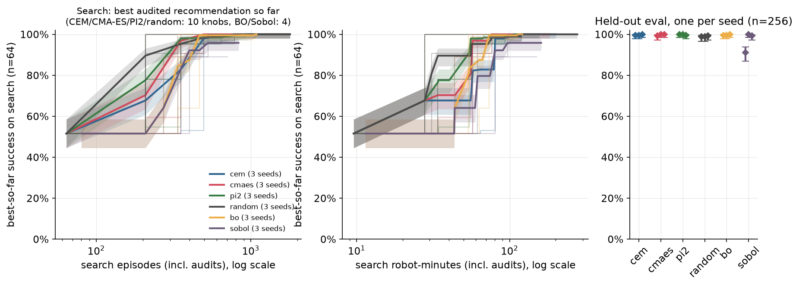
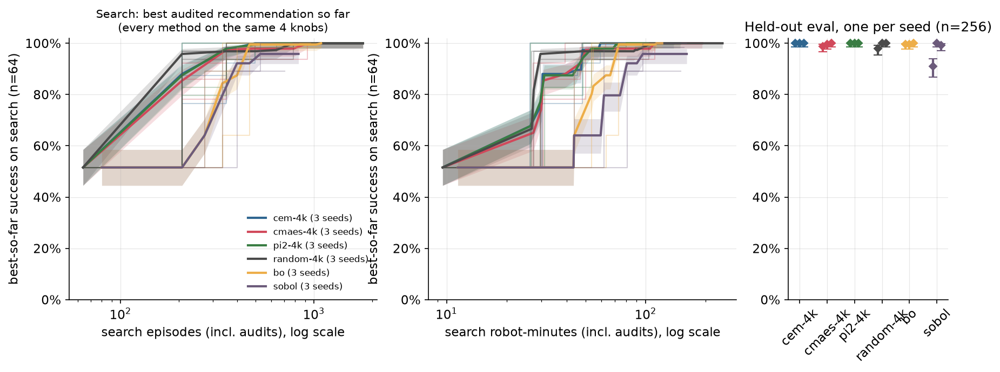
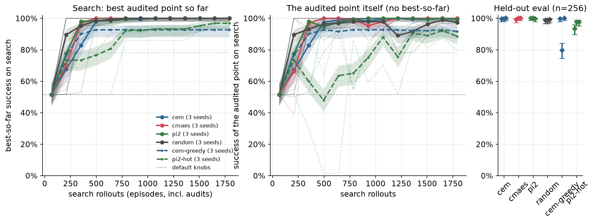
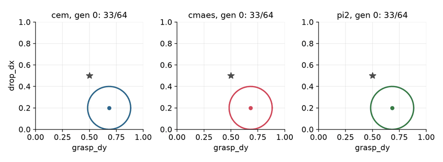
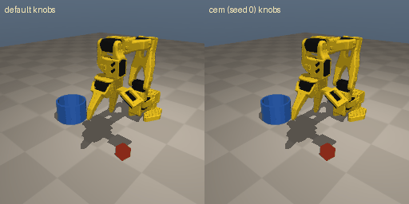
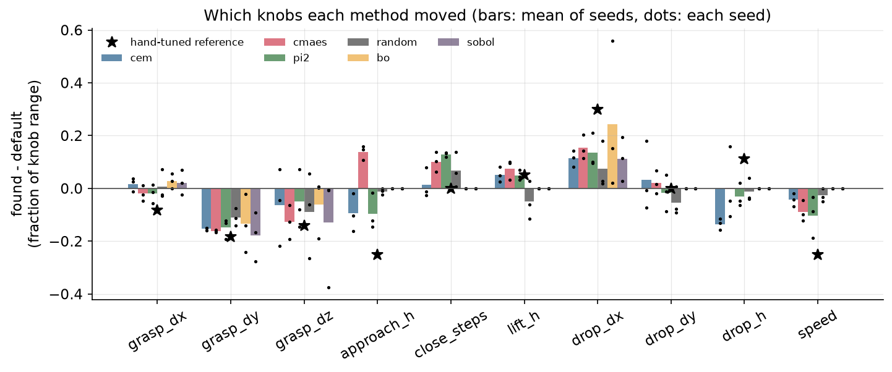

# Chapter 2: One update, different weights (CEM, CMA-ES, PI2/MPPI and BO)

Code: [`algos/02_cem_cmaes_pi2.py`](../../algos/02_cem_cmaes_pi2.py) (CEM, CMA-ES, PI2 behind one `--weights` switch) and [`algos/02b_bo.py`](../../algos/02b_bo.py) (Bayesian optimization with BoTorch, plus a Sobol random-search baseline).

**The problem is the same as in Chapter 1.** The scripted `KnobController` starts from `DEFAULT_KNOBS`, which succeed on 123/256 = 48.0% [42.0, 54.2] of the held-out `eval` episodes. We are allowed to change its knobs and count successes. Nothing else.

**Result.** CEM, CMA-ES, PI2 and BO all take the controller from 48.0% to 99.7-99.9% on held-out states, pooled over 3 seeds (CMA-ES: **766/768 = 99.7% [99.1, 99.9]**, per seed 254, 256 and 256 of 256). That is the level of the hand-tuned knobs (255/256). A hardware-sized BO budget failed on 2 of 3 seeds. The pooled intervals treat the seeds as independent, although they share the same 256 start states.

## The idea in plain words

Chapter 1 estimated a gradient from pairs of perturbations. This chapter uses a different loop, one that many well-known optimizers share:

1. Draw K candidate knob settings around a current guess.
2. Run each one on a few episodes and count its successes.
3. Give each candidate a weight: good candidates get more.
4. Move the guess to the weighted average of the candidates.

CEM, CMA-ES and PI2/MPPI are all this loop. They differ in two places: **how the weights are computed** from the scores, and **what else they refit** after moving the mean. In the code those differences take up three short weight functions and one `if` inside `refit()`. Everything else is shared.

Bayesian optimization (BO) takes a different route. It keeps every trial, fits a probabilistic model of "knobs → success rate" to all of them, and uses the model to pick the single most promising next trial. It spends computer time to save robot time, which matters most when every trial is expensive.

## The math

Knobs are scaled to `x ∈ [0, 1]^d` using their `KNOB_SPACE` bounds, so one unit of step size means the same thing for every knob.

**Sample.** `x_i = m + σ A z_i`, with `z_i ~ N(0, I)`, `C = A Aᵀ`, for `i = 1..K`. Points outside the box are clipped, and the clipped point is the one scored and learned from. This choice is simple, but it is biased at a bound. The default `speed = 1.0` sits exactly on its upper bound, so about half of all candidates have their speed clipped to 1.0 (16 of the 30 first-generation candidates across the three seeds), and no candidate can have a higher speed. Every weighted mean of those points has speed below 1.0, whatever the weights are. Hansen's tutorial discusses other ways to handle bounds, such as penalties and resampling. We kept clipping and report its effect below.

**Score.** `J_i` = the success rate of `x_i` on a batch of search episodes. Every candidate in a generation sees the same episodes (the same env seeds and policy seeds), so their scores are paired.

**Weight.** This is the only place the three methods differ:

| Method | Weight `w_i` | Refit after `m ← Σ w_i x_i` |
|---|---|---|
| CEM | `1/k` for the top `k` candidates (the elites), 0 for the rest. The default elite fraction 0.25 gives `k = round(2.5) = 2` of 10 (Python rounds halves to even) | a diagonal variance, `var_j = Σ w_i (x_ij − m_j)²`, blended with the old one (`cem_smooth = 0.5`) |
| CMA-ES | `w_r ∝ ln((K+1)/2) − ln r` for ranks `r ≤ K/2`, 0 below | a **full** covariance `C` (rank-one + rank-μ update) and the step size `σ` (cumulative step-size adaptation) |
| PI2 / MPPI | `w_i ∝ exp(−cost_i / λ)`, `cost = 1 − J` | nothing: the exploration noise is fixed and only decays (`σ ← 0.9 σ`) |

A success counter produces many ties (two candidates both at 6/8). For CEM and CMA-ES, tied candidates share their rank weights equally. Their order among themselves is arbitrary, so it should not change the update.

**CMA-ES in one screen.** With `y_i = (x_i − m)/σ` and `y_w = Σ w_i y_i` (Hansen's tutorial, C005):

```
p_σ ← (1 − c_σ) p_σ + sqrt(c_σ (2 − c_σ) μ_eff) · C^(−1/2) y_w
p_c ← (1 − c_c) p_c + h_σ sqrt(c_c (2 − c_c) μ_eff) · y_w
C   ← (1 − c_1 − c_μ) C + c_1 (p_c p_cᵀ + δ(h_σ) C) + c_μ Σ w_i y_i y_iᵀ
σ   ← σ · exp((c_σ / d_σ)(‖p_σ‖ / E‖N(0, I)‖ − 1))
```

The learning rates `c_σ, d_σ, c_c, c_1, c_μ` are the tutorial's defaults for `d = 10`, `K = 10`. The one change we made: the paths are normalized with `μ_eff = 1/Σw²` computed from the weights actually used, because tie-sharing spreads weight over more candidates. On an ill-conditioned quadratic the implementation learns a covariance with condition number about 150 for a true condition of 100, and converges.

**BO.** Observe `y_t = k_t / n` on a batch of `n = 16` search episodes. Fit a GP (Matérn-5/2, BoTorch `SingleTaskGP`) with **known binomial noise** `Var[y_t] = p̃(1 − p̃)/n`, where `p̃ = (k + 1)/(n + 2)`, so a 0/16 or 16/16 batch does not claim to be exact. Then pick

```
x_{t+1} = argmax_x log EI(x),   EI(x) = E[max(f(x) − f*, 0)],   f* = max posterior mean over the trials so far.
```

Using the best posterior mean as `f*`, instead of the best noisy observation, keeps one lucky batch from setting a bar the model then over-trusts. We start with the default knobs plus `d + 4 = 8` scrambled Sobol points, as recommended by the BO review (C445). BO searches 4 knobs: `grasp_dx`, `grasp_dy`, `grasp_dz`, `drop_dx`. We picked them from the `KnobController` docstring, which says how the defaults are off. That prior knowledge is free here and is not in any budget. The review notes that most hardware BO papers tune fewer than 10 parameters. The three sampling methods search all 10 knobs by default. To compare like with like, we also ran them on BO's 4 knobs (`--knobs grasp_dx grasp_dy grasp_dz drop_dx --tag=-4k`).

**Random search, the baseline.** `--weights random` runs the same loop with no weights and no update. Every generation draws K = 10 candidates from the *first* generation's distribution, `N(default, 0.1² I)`, and scores them on the same batch. The candidate with the best batch score so far is audited on all 64 search-set start states. It uses exactly the same trial and audit budget as the other three, so any gap is the work done by the weights and the update. (It re-audits an unchanged incumbent, which a real robot session would skip. That makes its budget match the others, not its minimum cost.)

## How the search is scored (and what it costs)

- **Search set only.** Every choice uses the search set (64 start states, seeds 10 000-10 063). Each generation's candidates share a batch of 8 search episodes (16 for BO trials). The batch rotates through the 64 start states from one generation to the next.
- **Audits.** After each generation, the new mean is scored on all 64 search-set start states (for random search: its incumbent; for BO: each new incumbent, checked every 4 trials). The returned knobs are the best-audited point, and later points win ties. **Audits are charged to the search budget** and make up about half of it. The curves below plot the best audit so far.
- **Held-out once.** Each run's chosen knobs are scored once on the eval set (256 held-out start states). The base evaluation (40.0 robot-minutes) is shared by all runs and charged to `eval` in each JSON.
- **Hyperparameters were not tuned on eval.** The defaults (`K = 10`, batch 8, 12 generations, `σ₀ = 0.1`, elite fraction 0.25, `cem_smooth = 0.5`, `λ = 0.05`, decay 0.9) were set up front. We checked them with `--no-heldout` runs, which look at the search set only. The two failure settings (below) were chosen before any held-out number existed. The random-search baseline and the 4-knob runs were added after a review, when the other held-out numbers already existed. They use the same defaults unchanged, with nothing tuned.
- **Three seeds per method.** The seed sets the sampling RNG. For a given seed, CEM, CMA-ES, PI2 and random search draw **the same first generation** (same `m`, `σ`, `C = I`), so their first steps are directly comparable.

Budget per run: CEM, CMA-ES, PI2 and random search use 12 × 10 × 8 = 960 trial episodes plus 13 × 64 = 832 audit episodes, 1,792 in total, whatever the number of knobs. BO uses 36 × 16 = 576 trial episodes plus 64 per distinct incumbent. **These totals are fixed by each script's configuration.** They are not the cost of solving the problem. For that, see the cost-to-62/64 table below.

## Results

All numbers come from the runs in [`results/ch02/`](../../results/ch02/), made with the commands at the bottom. Held-out is `eval`, n = 256 per seed, with Wilson 95% intervals. "Pooled" adds the three seeds (768 episodes). Its interval treats them as independent, which is optimistic because the same 256 start states repeat.

| Method | Search best (n=64), per seed | Held-out per seed | Held-out pooled | Search robot-min (mean of seeds) |
|---|---|---|---|---|
| default knobs (base) | 33/64 | 123/256 = 48.0% [42.0, 54.2] | | 0 |
| CEM | 64, 64, 64 | 255, 255, 256 /256 | 766/768 = 99.7% [99.1, 99.9] | 170.7 |
| CMA-ES (full covariance) | 64, 64, 64 | 254, 256, 256 /256 | 766/768 = 99.7% [99.1, 99.9] | 172.9 |
| PI2 (`λ = 0.05`) | 64, 64, 64 | 256, 256, 255 /256 | 767/768 = 99.9% [99.3, 100.0] | 147.6 |
| random search (10 knobs, same budget) | 64, 64, 64 | 253, 253, 254 /256 | 760/768 = 99.0% [98.0, 99.5] | 269.7 |
| BO (GP + logEI, 4 knobs) | 64, 64, 64 | 255, 255, 256 /256 | 766/768 = 99.7% [99.1, 99.9] | 114.9 |
| Sobol random search (4 knobs) | 57, 64, 63 | 233, 256, 254 /256 | 743/768 = 96.7% [95.2, 97.8] | 155.4 |
| *failure:* CEM, 1 elite, no smoothing | 64, 50, 64 | 255, 204, 256 /256 | 715/768 = 93.1% [91.1, 94.7] | 149.9 |
| *failure:* PI2, `λ = 1.0` | 60, 62, 64 | 239, 250, 250 /256 | 739/768 = 96.2% [94.6, 97.4] | 257.0 |
| *failure:* BO, hardware-sized budget | 10/10, 8/10, 8/10 | 255, 123, 123 /256 | 501/768 = 65.2% [61.8, 68.5] | 14.7 |

Per-seed Wilson intervals: 256/256 → [98.5, 100.0], 255/256 → 99.6% [97.8, 99.9], 254/256 → 99.2% [97.2, 99.8], 253/256 → 98.8% [96.6, 99.6], 251/256 → 98.0% [95.5, 99.2]. The hand-tuned `TUNED_KNOBS` score 255/256 on the same episodes, so the four good methods reach the level of a careful human tuner.

**The same 4 knobs for everyone.** CEM, CMA-ES, PI2 and random search, rerun on BO's 4 knobs with everything else unchanged (`K = 10` and CMA-ES's learning rates for `d = 4`):

| Method (4 knobs) | Search best, per seed | Held-out per seed | Held-out pooled | Search robot-min, per seed |
|---|---|---|---|---|
| CEM | 64, 64, 64 | 256, 256, 256 /256 | 768/768 [99.5, 100.0] | 132.6, 123.0, 138.1 |
| CMA-ES | 64, 64, 64 | 253, 255, 256 /256 | 764/768 = 99.5% [98.7, 99.8] | 192.0, 140.1, 162.9 |
| PI2 | 64, 64, 64 | 256, 256, 256 /256 | 768/768 [99.5, 100.0] | 132.7, 130.3, 149.0 |
| random search | 64, 64, 64 | 251, 256, 256 /256 | 763/768 = 99.3% [98.5, 99.7] | 242.5, 236.2, 243.1 |
| BO (from the table above) | 64, 64, 64 | 255, 255, 256 /256 | 766/768 = 99.7% [99.1, 99.9] | 113.0, 121.0, 110.9 |
| Sobol (from the table above) | 57, 64, 63 | 233, 256, 254 /256 | 743/768 = 96.7% [95.2, 97.8] | 150.3, 160.7, 155.3 |

Paired tests (McNemar, exact, on the shared eval episodes): every chosen setting beats the default knobs on every seed (largest p = 3.3e-14, for the collapsed CEM seed). The exceptions are the two hardware-budget BO seeds, which returned the default knobs themselves. Among CEM, CMA-ES, PI2 and BO there is nothing to separate: 766 vs 766 vs 767 vs 766 successes out of 768, p = 1 for each pair we tested. The 10-knob random search is a little lower (760): p = 0.11 against CEM, CMA-ES and BO, and p = 0.039 against PI2. We ran about 45 such pairwise tests, so one p of 0.04 is weak evidence. On 4 knobs, CEM, PI2, CMA-ES and BO are again indistinguishable (768, 768, 764, 766; p ≥ 0.12). Random search on 4 knobs scored 763 (p = 0.062 against CEM-4k and PI2-4k). BO beats Sobol random search, 766 vs 743 (p = 5.6e-6 on 3 × 256 seed-paired episodes), and so does every 4-knob sampling method, random search included (p ≤ 1.8e-4). CEM beats its greedy version (p = 8.6e-14), and PI2 beats its hot version (p = 5.8e-8).



*Left and middle: best audited search score so far (n = 64 per seed; thin lines are seeds, bold lines pool the 3 seeds with a Wilson band), on log axes. CEM, CMA-ES, PI2 and random search use 10 knobs, BO and Sobol use 4. The thin line that jumps to 100% at 208 episodes is seed 2 of CEM, CMA-ES, PI2 and random search drawn on top of each other. Right: the held-out score of each seed's chosen knobs, the only number that counts.*



*The same plot with CEM, CMA-ES, PI2 and random search restricted to BO's 4 knobs.*



*Dashed lines are the failure settings. The middle panel plots the audited point at each generation, not the best so far. For CEM, CMA-ES and PI2 that is the mean. For random search it is the incumbent, the candidate with the best batch score so far. That is where the hot PI2 run shows its random walk.*



*Seed 0, one frame per generation: the mean and 2-std ellipse in the `grasp_dy` × `drop_dx` slice (the star is the hand-tuned setting). CEM's diagonal variance shrinks (mean std 0.10 → 0.023 of the range over 12 generations). PI2's shrinks on its fixed schedule (0.10 → 0.028). CMA-ES's step size shrinks much more slowly (σ 0.10 → 0.057). Once most candidates score 8/8, ties carry little ranking signal. Clipping at the `speed` bound may also keep its steps long.*



*Eval seed 20000. Left: the default knobs miss the grasp. Right: the knobs CEM found on seed 0 drop the cube in the cup. The run shown is fixed in the code as the first method and the first seed (CEM, seed 0). It was not chosen for its held-out score, which is 255/256. An earlier version of the script showed the run with the best held-out score, which is a choice made on eval. The episode is the first eval episode that the default fails and these knobs fix.*

### Which knobs moved



The bars average the three seeds; the dots are the individual seeds.

- **Every method moved `grasp_dy` toward 0.** On 17 of the 18 plotted runs it moved by 0.08 to 0.28 of its range (about −0.5 to −1.7 cm). This is the main fix. BO seed 1 moved it by only 0.02 and still reached 255/256. `drop_dx` moved toward the cup on every run. `grasp_dz` moved down on 13 of 18 runs.
- **Most runs stopped short of the cup center on `drop_dx`** (the star; the mean of seeds is below it for every method). Once the cube lands in the cup, a success counter cannot tell "just inside" from "dead center". The objective is flat there, so the methods stop wherever they first land inside. BO seed 0 went the other way and overshot to +2.6 cm past the center. That was just as good for the success counter.
- **`close_steps` and `lift_h` moved away from cliffs, and that is learning.** With the default `grasp_dz`, the gripper needs at least 3 close steps. The controller rounds `close_steps`, so 2.6 scores 64/64 on search (with `grasp_dy = 0`), but 2.4 or less scores 0/64. The default of 3 sits half a step from that cliff, and `σ₀ = 0.1` of the range is about 0.9 steps. CMA-ES and PI2 moved `close_steps` up on all 6 of their runs (+0.06 to +0.14 of the range). CEM's moves were mixed (−0.03 to +0.08). `lift_h` has a similar cliff: the default knobs score 1/64 at `lift_h = 0.07` against 33/64 at the default 0.085. CEM, CMA-ES and PI2 raised `lift_h` on all 9 runs (+0.02 to +0.10). Random search, which does not learn, moved `lift_h` *down* on 2 of 3 seeds (to 0.073 and 0.079). Its chosen settings still worked on search and held-out, but with less margin to that cliff.
- **`speed` could only go down.** It moved down on every CEM, CMA-ES and PI2 run (−0.02 to −0.19), and on 2 of 3 random-search runs. This is the clipping bias described in the math section, not learning: the default sits on the upper bound, so every clipped candidate has speed ≤ 1.0. Speed barely matters here (the default knobs score 33–35/64 at speeds 0.6, 0.8 and 1.0).
- **`approach_h` and `drop_h` do not matter once the grasp is fixed.** `TUNED_KNOBS` still score 64/64 on search at both ends of the `approach_h`, `drop_h` and `speed` ranges. `approach_h` moved the same way on every seed of a method (up on all 3 CMA-ES seeds, down on all 3 CEM and PI2 seeds), but in opposite directions between methods. With the default knobs it changes the search score by at most 2 of 64 (31–34/64 across its range), so we read those moves as side effects of the sampling, not as a signal. We did not test `drop_dy` separately. BO and Sobol do not touch these knobs by construction.

## Where each method wins

The fixed budgets above say nothing about efficiency. What matters is how fast each method finds good knobs. **Cost to first reach 62/64 on search** (per seed: trial episodes / all search episodes including audits / search robot-minutes):

| Method | knobs | seed 0 | seed 1 | seed 2 |
|---|---|---|---|---|
| CEM | 10 | 320 / 640 / 93.4 | 240 / 496 / 80.5 | 80 / 208 / 27.8 |
| CMA-ES | 10 | 240 / 496 / 76.1 | 160 / 352 / 57.2 | 80 / 208 / 27.9 |
| PI2 | 10 | 400 / 784 / 94.0 | 160 / 352 / 55.8 | 80 / 208 / 27.8 |
| random search | 10 | 240 / 496 / 76.9 | 320 / 640 / 100.3 | 80 / 208 / 27.8 |
| CEM | 4 | 160 / 352 / 48.2 | 80 / 208 / 26.3 | 240 / 496 / 59.2 |
| CMA-ES | 4 | 480 / 928 / 110.8 | 160 / 352 / 39.4 | 160 / 352 / 47.0 |
| PI2 | 4 | 160 / 352 / 48.3 | 80 / 208 / 26.4 | 240 / 496 / 70.9 |
| random search | 4 | 80 / 208 / 27.4 | 80 / 208 / 26.8 | 400 / 784 / 103.7 |
| BO | 4 | 208 / 400 / 54.6 | 272 / 464 / 73.2 | 208 / 336 / 53.5 |
| Sobol | 4 | never (best 57/64) | 336 / 528 / 96.7 | 208 / 336 / 61.7 |

For a given seed, all the sampling methods draw the same first generation. On 10 knobs, seed 2's first generation already contains a candidate that fixes `grasp_dy`, so all four reach 62/64 after one generation.

- **On this problem, BO was not more efficient than the sampling methods.** On the same 4 knobs, CEM and PI2 reached 62/64 after 80 to 240 trial episodes (26 to 71 search robot-minutes), and BO after 208 to 272 (54 to 73). CMA-ES was slower on one seed (480). BO's lower *total* cost (115 search robot-minutes on average, against 123 to 192 per run for CEM, CMA-ES and PI2 on 4 knobs) comes from its smaller fixed budget and, in the 10-knob comparison, from searching fewer knobs. It does not come from needing fewer trials. Twelve or thirteen of BO's 36 trials scored 0/16, and a failed episode runs the full 150 steps (15 s), so exploring dead regions costs robot time.
- **The curriculum's headline guess ("BO needs about 30 episodes for 4 knobs, CMA-ES about 300 for 8") did not hold here.** BO needed 13 to 17 trials (208 to 272 trial episodes) to first reach 62/64, and the local methods needed 1 to 6 generations (80 to 480 trial episodes). The start already works half the time, and one knob is about 1 cm off, so a small step around the default finds the fix. BO starts by spreading Sobol points over the whole box, where most settings fail.
- **Local random search is a strong baseline, and it only loses on robot time.** With the same sampler and no update, it reached 62/64 about as fast as CEM (80 to 320 trial episodes on 10 knobs) and ended at 760/768 on held-out, against 766–767 for CEM, CMA-ES and PI2. That gap is not significant. On 4 knobs it was even the fastest on two seeds (80 trial episodes). It audits its best candidate directly, while CEM, CMA-ES and PI2 audit a weighted mean of several candidates, and that mean can land between two good settings. Its cost is the difference: 270 search robot-minutes against 148 to 173. Its candidates keep sampling around the half-broken default and succeed only 16–19% of the time, and failed episodes run long. The candidates of CEM, CMA-ES and PI2 succeed 66–85% of the time, and 83–99% over the last 6 generations. The update moves the whole search to where the robot mostly succeeds, which makes each trial cheaper and, on `lift_h`, left more margin. It hardly changes the final score here.
- **BO's real advantage is over global random search.** With the same 4 knobs and the same trial budget, the GP beat Sobol on held-out (766 vs 743 of 768), because Sobol wasted 28 to 32 of its 36 trials on 0/16 settings. Sampling locally around a decent start (random-4k: 763) also beat Sobol. On this problem, where the search starts matters as much as the model.
- **CMA-ES vs CEM vs PI2:** within noise of each other on the final number. CMA-ES adapts its own step size, so it has no variance floor or temperature to get wrong. The price is that it kept exploring widely after the problem was solved (see the ellipse GIF), which made it the most expensive of the three on 4 knobs (140 to 192 search robot-minutes, against 123 to 149 for CEM and PI2). Its mean can still dip: seed 0 fell from 64/64 to 55/64 at generation 6 before it came back.

## What went wrong

1. **CEM collapsed its variance and got stuck (seed 1).** With one elite out of ten and no smoothing, the refit variance is the variance of one point around itself: exactly zero. On seed 1 the best first-generation score, 7/8, was unique. The mean jumped to that one candidate, the variance became 0.0, and the mean stayed frozen at a setting that scores 50/64 on search. Held-out: 204/256 = 79.7% [74.3, 84.2]. On seeds 0 and 2 the collapse did not happen, because two candidates tied at 8/8. Tie-sharing split the single elite weight between them, so the mean moved to their midpoint, and the variance stayed positive (mean std 0.031 and 0.059 after generation 1). Seed 0's midpoint was no better than the default (33/64 on search), but the search kept going and reached 59/64 and then 64/64. Seed 2's midpoint scored 64/64 right away. So "1 elite" fails only when the top score is unique. With a success counter, ties are common, and they quietly turn one elite into several. The default `elite_frac = 0.25` (2 elites) with `cem_smooth = 0.5` avoided this in all three seeds.
2. **PI2 with a hot temperature wandered.** With `λ = 1.0` and costs between 0 and 1, the largest weight ratio is at most `e ≈ 2.7`. The weighted mean is then close to the plain mean of the samples, so the update is mostly noise. On seed 1 the mean fell to **1/64** on search at generations 3–4 before recovering. Best-so-far selection hid most of the damage: the returned knobs scored 239, 250 and 250 of 256, while the *final* means scored 51, 62 and 57 of 64 on search. It also cost more robot time than any other setting except random search (257 search robot-minutes on average, against 270 for random search), because failing episodes run the full 150 steps.
3. **BO with a hardware-sized budget failed on 2 of 3 seeds.** We ran BO with 2 episodes per trial, 30 trials, and a 10-episode audit, about 80 episodes per seed like a real SO-101 session. The protocol is in the `--tag=-hw` command below. On seeds 1 and 2 it returned **the default knobs** (held-out 123/256 = 48.0%). On its first 10 search-set start states the default scored 8/10, an optimistic sample of a 50% controller. On seed 1 the GP's chosen incumbent was a trial that had scored 0/2 and then audited at 0/10. With 2 binary outcomes per trial, the known-noise GP is close to flat. Seed 0 found good knobs (255/256). **30 trials of 2 episodes are not enough for this protocol.** That is 60 trial episodes plus 10 to 30 audit episodes, 70 to 90 per seed. The next section says what to change.
4. **Global random search picked a setting that looked better than it was.** Sobol seed 0 kept an early 15/16 trial as its incumbent. That trial audited at 57/64, and nothing better turned up in 36 trials. Held-out: 233/256 = 91.0% [86.9, 93.9].
5. **Clipping at a bound moves a knob that should stay put.** `speed` went down on all 9 CEM, CMA-ES and PI2 runs. It did so because the default sits on the upper bound and we learn from clipped samples, not because slower is better. Here it cost nothing, because speed barely matters. On a knob that matters, the same bias would push the search off a good setting at the edge of the box.
6. **The flat top hides the last centimeter.** Most runs stopped short of the `drop_dx` center, and CMA-ES's step size shrank only slowly once most candidates succeeded. A success counter gives no signal between "barely works" and "works with margin". That margin could matter on hardware, where the cup position is off by a few millimeters. A shaped score (for example the `near_miss` distance) would provide that signal. It is not used here, because this chapter optimizes only the success count.

Not built: the curriculum also proposes an MPPI planner over action sequences that uses MuJoCo state cloning as a perfect model. That is the same weighted-mean update applied at every control step. It is not in this chapter. The PI2 weights here are the same `exp(−cost/λ)` rule, applied to knobs instead of action sequences.

## Hardware step (SO-101)

> **Safety.** A learning policy can move the arm quickly and in unexpected ways, and the servos can pinch. Clear the workspace, keep the arm's power switch or plug (or an e-stop) within reach, start with low speed and a small per-step limit (in LeRobot, `max_relative_target` on the follower, which is off by default), keep your hands out of the workspace while the policy runs (reset only when the arm has stopped), and supervise every run.

Run BO on 3–4 real knobs of the scripted controller (grasp x/y offset, grasp height, drop x offset). The controller uses a color-blob cube estimate. Compare with Chapter 1's finite differences at the same robot-minutes. This would be the first leaderboard row where a method wins on robot-minutes, *if* it wins.

What the simulation says about how to do it:

- **Do not use 1–2 episodes per trial with a wide search box.** Our hardware-budget run (2 episodes per trial, 30 trials, about 80 episodes) failed on 2 of 3 seeds. Plausible fixes: 4–5 episodes per trial and 10–15 trials, a search box of about ±1.5 cm around the current knobs instead of the full range, and a longer final check (the 30-spot `R_eval` mat). These are untested in this chapter.
- Use the 10 marked spots of `R_search` as the rotating batch, and record every episode, including the audits, in robot-minutes.
- Expect the sim-optimal knobs to be wrong on the real arm (servo zero offsets, about 17 mm of gravity sag). Start BO from the real arm's current knobs, not from the sim result.
- Report the final result as k/30 with its Wilson interval, never as a percentage alone.

## Papers this chapter mirrors

- **[C130] An Introduction to Zero-Order Optimization Techniques for Robotics** (2025), https://arxiv.org/abs/2506.22087. Frames CEM, CMA-ES and MPPI as one sample-weight-update template, which is the structure of `02_cem_cmaes_pi2.py`.
- **[C005] Hansen, The CMA Evolution Strategy: A Tutorial** (2016), https://arxiv.org/abs/1604.00772. The (μ/μ_w, λ)-CMA-ES with full covariance, rank-one and rank-μ updates, and cumulative step-size adaptation implemented here.
- **[C002] Theodorou, Buchli, Schaal, A Generalized Path Integral Control Approach to Reinforcement Learning (PI2)** (2010), https://www.jmlr.org/papers/v11/theodorou10a.html. The `exp(−cost/λ)` reweighting, with no gradient and no learning rate.
- **[C445] A Decade of Bayesian Optimization for Controller Tuning and Robot Learning** (2026), https://arxiv.org/abs/2609.09403. The BO defaults used here (d + 4 initial points, logEI) and Sobol as the baseline to beat.
- **[C057] BOpt-GMM: Bayesian Optimization for Sample-Efficient Policy Improvement in Robotic Manipulation** (2024), https://arxiv.org/abs/2403.14305. BO on sparse binary success to improve an existing policy.

## Reproduce

```bash
uv run python algos/02_cem_cmaes_pi2.py --quick   # smoke test: about 20 s
uv run python algos/02b_bo.py --quick             # smoke test: about 15 s
uv run python algos/02_cem_cmaes_pi2.py           # CEM, CMA-ES, PI2, random + 2 failure settings, 3 seeds: 11.1 min
uv run python algos/02_cem_cmaes_pi2.py --knobs grasp_dx grasp_dy grasp_dz drop_dx --tag=-4k \
    --no-failures --no-media                      # the same 4 methods on BO's 4 knobs: 6.0 min
uv run python algos/02b_bo.py                     # BO + Sobol, 3 seeds each, then the comparison plots: 2.0 min
uv run python algos/02b_bo.py --acq logei --batch 2 --n-evals 30 --audit-n 10 --audit-every 30 \
    --tag=-hw --no-media                          # hardware-sized BO budget: 39 s
```

Wall times are from an Apple M5 Pro with 6 rollout workers, while other jobs were running. Run the two `02_cem_cmaes_pi2.py` commands before `02b_bo.py`, so the comparison plots include CEM, CMA-ES, PI2 and random search. The plots use the newest run with a held-out score for each method, knob set and seed. `--no-heldout` tuning runs are skipped, and an untagged run on a knob subset is labelled with its knob count. The rollouts are deterministic: a second full run reproduced every search and held-out count exactly.

[C002]: https://www.jmlr.org/papers/v11/theodorou10a.html
[C005]: https://arxiv.org/abs/1604.00772
[C057]: https://arxiv.org/abs/2403.14305
[C130]: https://arxiv.org/abs/2506.22087
[C445]: https://arxiv.org/abs/2609.09403
