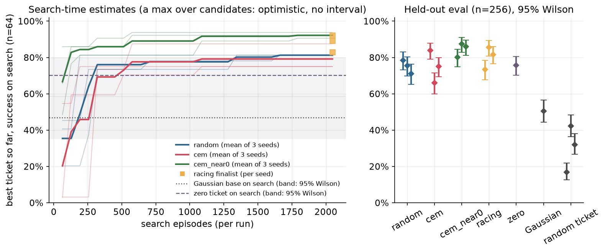
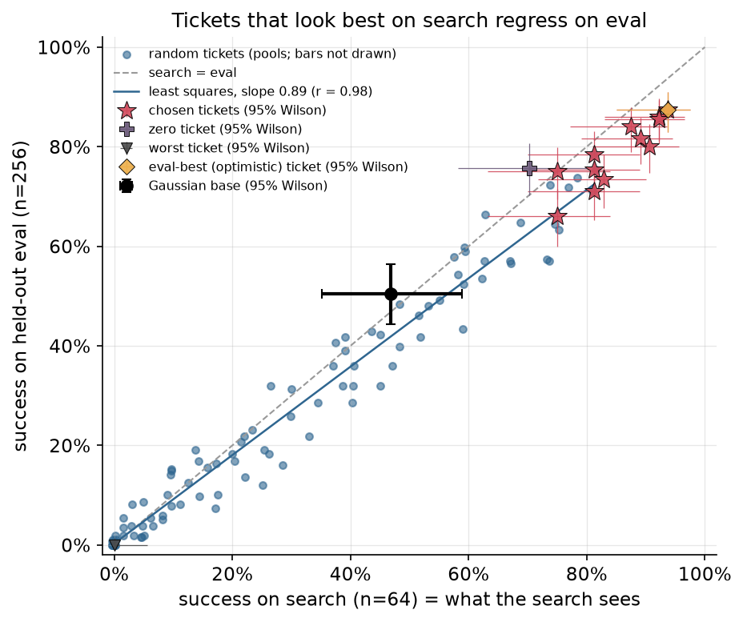
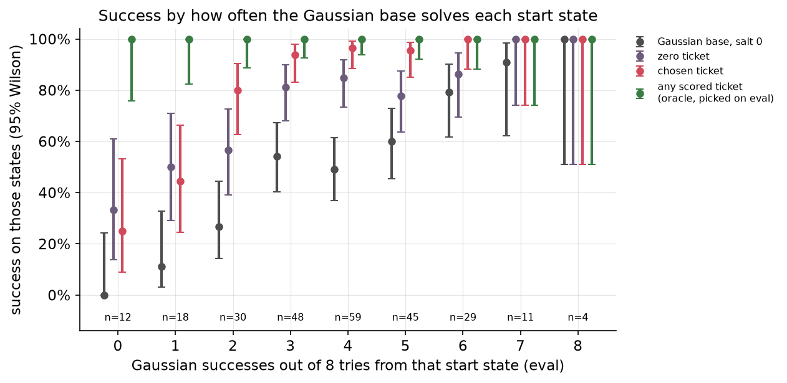
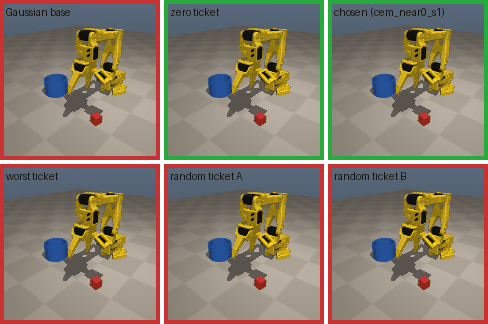
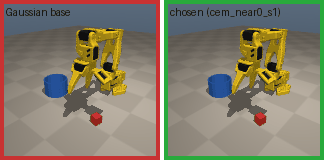

# Chapter 3: The golden ticket

The first hill climb of the shared flow policy `base_v1`, and it changes none of the policy's weights. We keep its 32-number noise input fixed to a single well-chosen vector, a *ticket*, and search for that vector. On held-out states, the best ticket from the three search methods fixed before we looked at any results goes from 50.4% to **85.5% [80.7, 89.3]**. A fourth method, added after peeking at some results (see "Where `cem_near0` came from"), reaches 87.5% [82.9, 91.0]; we report it, but the peek-free number is the one to quote. Most of the chapter is about how to report numbers like these honestly.

Code: [`algos/03_golden_ticket.py`](../../algos/03_golden_ticket.py). Results: [`results/ch03/`](../../results/ch03/). Media: [`media/ch03/`](../../media/ch03/).

```bash
uv run python algos/03_golden_ticket.py --quick   # smoke test: about 50 s, writes to runs/ch03_quick/ only
uv run python algos/03_golden_ticket.py           # full run: 26.9 min wall on an M5 Pro (6 workers, shared machine)
uv run python algos/03_golden_ticket.py --replot results/ch03/golden_ticket_so101_20260930-170617.json
```

## The idea in plain words

`base_v1` (Chapter 0) is a flow-matching policy. Every 4 control steps it takes the observation and a vector of 32 random numbers, and turns them into the next 8 actions. Different random numbers give different, equally "plausible" chunks. The policy was cloned from a mix of careful and sloppy demonstrations, so some of those chunks grasp cleanly and some fumble. Normally the noise is drawn fresh for every chunk, and the robot gets a random mix of the two behaviors: 50% success.

A *ticket* is one fixed noise vector reused for every chunk of every episode. With a ticket the policy is deterministic, like a scripted controller with 32 knobs. Some tickets are much better than fresh noise, and some are much worse. So we try tickets, count successes on practice start states, and keep the best one. No gradients, no retraining, and nothing about the network changes.

Two warnings go with this, and the chapter measures both:

1. **The best score in a search is biased upward.** If you try many tickets and keep the one with the highest count, part of its lead is luck on those particular practice states. Report it on states the search never saw.
2. **A ticket can only pick behavior the network can already produce.** It cannot teach the policy anything new. How much the base "already has" is what the Gaussian base's pass@k measures, and we check how many tries that measurement needs.

## The math

A flow policy maps an observation `s` and noise `w ∈ R^32` to a chunk through 10 Euler steps of a learned velocity field. For fixed `w` this is a deterministic function `π(s, w)`. The search objective is the success rate on the `n = 64` search start states `s_1..s_n`:

```
J(w)  = (1/n) Σ_i success(s_i, π(·, w))          (common random numbers: every ticket sees the same s_i)
ŵ     = argmax over the tickets we scored of J(w)
```

`J(w)` is itself an estimate of the true success rate `p(w)` over all start states. For each ticket, `E[J(w)] = p(w)`. The maximum, though, is biased: `E[max_j J(w_j)] ≥ max_j p(w_j)`, and the more candidates and the fewer states, the larger the bias (the "winner's curse"). This is why the ticket is chosen on `search` and scored on the held-out `eval` set (256 other start states).

The four searches spend the same budget, 2,048 search episodes per run:

| Method | What it does |
|---|---|
| `random` | 32 tickets drawn from N(0, I), each scored on all 64 search states. Keep the best. This is the Golden Ticket paper's method. |
| `cem` | Cross-entropy method from the prior N(0, I): 4 generations of 8. The mean moves to the average of the top 3, and the diagonal std is refit to the elites and averaged with the old one (`cem_smooth = 0.5`). From generation 1 on, the current mean is one of the 8 candidates. Keep the best candidate ever scored. |
| `cem_near0` | The same CEM, started with std 0.5 around `w = 0` instead of std 1. |
| `racing` | Random search with sequential halving: 512 tickets on 1 state, keep the better half, double the states (1, 2, 4, ..., 64). Each round reuses the earlier states' results, so the budget is `512 + 6 × 256 = 2048`, and 8 finalists end up scored on all 64. Each seed uses its own shuffled order of search states. |

Ties go to the earlier candidate. **Paired tests.** Every ticket and the base are scored on the same 256 eval states, so we compare them with McNemar's exact test on the discordant states (base fails and ticket succeeds, or the reverse), with a paired bootstrap interval for the difference.

## How the search is scored and what it costs

- **Choices use `search` only.** Each run picks its ticket by its score on the 64 search states. The headline row, `golden_ticket`, picks the best of all 12 runs by search score and **pays for all 12 searches** (3,859 search robot-minutes).
- **Held-out once per ticket.** Each chosen ticket is scored once on `eval` (256 states). The Gaussian base is scored on `eval` with policy-seed salt 0, which is the paired base in every results file. Salts 1-7 give pass@8.
- **Three kinds of baseline** (honesty rule 4), all fixed before any search:
  - the unsteered base (Gaussian noise);
  - a random ticket with no selection (the first ticket of each random-search pool);
  - the zero ticket `w = 0`.
- **For the scatter plot we paid for extra held-out rollouts.** All 96 tickets of the three random-search pools were also scored on `eval` (24,576 episodes, charged to `eval` in the `random_s*` files). That is how we can show search score against held-out score for every ticket, and the *optimistic* number: the best ticket picked by its eval score.
- **Costs are robot-minutes at 10 Hz** (`steps / 600`). A failed episode runs the full 15 s, so searches whose candidates fail a lot cost more for the same number of episodes.
- **Where `cem_near0` came from, in full.** The curriculum asked for random, CEM and racing. While measuring throughput before writing the script, we saw `w = 0` score 45/64 on search against 30/64 for Gaussian noise. We added `cem_near0` to test local search around that point. By then we had also seen smoke-test numbers (`--quick`) that included eval scores for the zero ticket. Quick mode uses the first 64 start states of the eval set (seeds 20000-20063), and those are part of the 256 held-out states reported here. Nothing was tuned afterwards: the std of 0.5 was the first and only value we ran. It is still a choice made after peeking at held-out data, so we flag it everywhere the headline appears, and we also report the **peek-free headline**: the best of the 9 runs of `random`, `cem` and `racing` by search score. That is `racing` seed 1 (59/64 on search), which scores 219/256 = 85.5% [80.7, 89.3] on eval. The headline JSON carries the same note.

## Results

All numbers come from the files in [`results/ch03/`](../../results/ch03/), from one full run. Two earlier full runs of the same search code gave identical numbers everywhere (the pipeline is deterministic); the current run only adds the 64-try check and the peek-free row. Intervals are Wilson 95%. "Pooled" adds the three seeds' 768 eval episodes. The pooled interval treats them as independent, which overstates precision because the same 256 start states repeat.

| Method | Search per seed (k/64) | Held-out per seed (k/256) | Held-out pooled | McNemar vs Gaussian base (worst seed) | Search robot-min, mean per run |
|---|---|---|---|---|---|
| Gaussian base (fresh noise, salt 0) | 30 = 46.9% [35.2, 58.9] | 129 = 50.4% [44.3, 56.5] | | | 0 |
| random ticket, no selection | not searched | 43, 108, 82 | 233/768 = 30.3% [27.2, 33.7] | worse on 2 of 3 seeds (p = 4.5e-15, 0.064, 1.4e-5) | 0 |
| zero ticket `w = 0` | 45 = 70.3% [58.2, 80.1] | 194 = 75.8% [70.2, 80.6] | | p = 2.5e-10 | 0 (7.2 to score it on search) |
| random search | 52, 52, 52 | 201, 193, 182 | 576/768 = 75.0% [71.8, 77.9] | p = 8.0e-7 | 393 |
| CEM | 56, 48, 48 | 215, 169, 192 | 576/768 = 75.0% [71.8, 77.9] | p = 1.5e-4 | 338 |
| CEM near 0 | 58, 60, 59 | 205, 224, 220 | 649/768 = 84.5% [81.8, 86.9] | p = 3.8e-14 | 220 |
| racing | 53, 59, 57 | 188, 219, 209 | 616/768 = 80.2% [77.2, 82.9] | p = 8.6e-9 | 332 |
| **headline: best of the 12 runs by search score** (`cem_near0` seed 1; method added after a peek) | 60 = 93.8% [85.0, 97.5] | **224 = 87.5% [82.9, 91.0]** | | p = 3.7e-22 (8 vs 103 discordant) | **3,859 total** |
| peek-free headline: best of the 9 `random`/`cem`/`racing` runs by search (`racing` seed 1) | 59 = 92.2% [83.0, 96.6] | 219 = 85.5% [80.7, 89.3] | | p = 2.6e-20 (9 vs 99 discordant) | |

Wilson intervals for the search column (n = 64; each is the score of the ticket that run picked, so it is optimistic as an estimate of that ticket, see below): 60 → [85.0, 97.5], 59 → [83.0, 96.6], 58 → [81.0, 95.6], 57 → [79.1, 94.6], 56 → [77.2, 93.5], 53 → [71.8, 90.1], 52 → [70.0, 88.9], 48 → [63.2, 84.0]. Per-seed intervals for the table's held-out numbers: 224 → [82.9, 91.0], 220 → [81.1, 89.7], 219 → [80.7, 89.3], 215 → [79.0, 88.0], 209 → [76.4, 85.9], 205 → [74.8, 84.5], 201 → [73.1, 83.1], 193 → [69.8, 80.3], 192 → [69.4, 79.9], 188 → [67.7, 78.5], 182 → [65.3, 76.3], 169 → [60.0, 71.5]; random tickets 43 → 16.8% [12.7, 21.9], 108 → 42.2% [36.3, 48.3], 82 → 32.0% [26.6, 38.0].

**Every one of the 12 searched tickets beats the Gaussian base** on the paired test (largest p = 1.5e-4). The headline ticket also beats each of the base's 8 salts separately (p ≤ 4e-22), so the result does not depend on the base's salt-0 draw: the base's mean over 8 salts is 966/2048 = 47.2% [45.0, 49.3].

**Against the free zero ticket the picture is mixed.** Twelve paired tests, one per run, discordant counts in brackets (zero only / ticket only):

| Run | vs zero ticket | Run | vs zero ticket |
|---|---|---|---|
| random s0 | p = 0.49 (34 / 41) | cem_near0 s0 | p = 0.25 (32 / 43) |
| random s1 | p = 1.0 (35 / 34) | cem_near0 s1 | **better**, p = 3.6e-5 (11 / 41) |
| random s2 | p = 0.26 (54 / 42) | cem_near0 s2 | **better**, p = 4.1e-4 (13 / 39) |
| cem s0 | **better**, p = 0.0086 (19 / 40) | racing s0 | p = 0.59 (47 / 41) |
| cem s1 | **worse**, p = 0.0035 (47 / 22) | racing s1 | **better**, p = 0.0026 (20 / 45) |
| cem s2 | p = 0.89 (25 / 23) | racing s2 | p = 0.11 (30 / 45) |

Four runs beat the zero ticket, one is worse, seven are indistinguishable from it. With 12 tests at the 0.05 level, one false positive would not be surprising. The headline ticket's lead over the zero ticket is 11.7 points, bootstrap 95% interval [6.2, 17.2].

**An independent check on `eval_ext` (1024 new start states).** Headline ticket 874/1024 = 85.4% [83.1, 87.4]; Gaussian base 452/1024 = 44.1% [41.1, 47.2]. The improvement holds on a set nobody looked at. The ticket slips 2.1 points from its `eval` score, well inside the noise.



*Left: best search score so far against search episodes (thin lines are seeds, bold lines the mean of the three seeds). A best-so-far value is a maximum over candidates, not a binomial count, so it gets no Wilson band; it is optimistic by construction. Racing has no meaningful "best so far" before its last round, so each seed's finalist is drawn as a square. The horizontal lines are the Gaussian base and the zero ticket on search, with their Wilson bands shaded. Right: the held-out score of each run's chosen ticket (diamonds, 95% Wilson), with the three baselines.*

### Search score against held-out score



*Each dot is one random ticket, scored on all 64 search states (x) and all 256 eval states (y). Stars are the tickets the 12 runs chose (by x only). The diamond is the ticket with the best eval score, the optimistic pick. The marked tickets and the Gaussian base carry 95% Wilson bars in both directions. The 96 pool dots are drawn without bars to keep the plot readable; their half-widths are up to about 12 points on x (n = 64) and 6 points on y (n = 256).*

- **Tickets differ enormously.** The 96 random tickets span 0/256 to 201/256 on eval. The spread between tickets (pool mean 27.6%, standard deviation 23 points) is far larger than the noise of a 64-state estimate (standard error about 6 points at 50%). That is why search and eval agree so well: correlation 0.98, least-squares slope 0.89.
- **The chosen tickets still lose ground.** 11 of the 12 chosen tickets score lower on eval than on search, by 6.5 points on average (0.0 to 10.5). This is the winner's curse at work. It is small here because 64 states are enough to rank tickets that differ this much.
- **The optimistic number turned out equal to the honest one.** The ticket with the best *eval* score among all 106 tickets scored on eval is the headline ticket itself (224/256), so picking on eval would not have looked better. Within each random-search pool, the eval-best ticket was the search-best ticket on seeds 0 and 1. On seed 2, a ticket with 49/64 on search scored 184/256 on eval, against 182/256 for the search pick. We expected a visible gap here, as the Golden Ticket verification found for SimplerEnv. With 64 search states and tickets this different, there was almost none. The next section shows where the gap does appear.

### Smaller searches overstate their pick

We scored the 96 random tickets, all drawn from N(0, I), on every search state and every eval state, so smaller random searches can be replayed offline with no new rollouts. Draw `T` tickets and `S` search states, keep the ticket with the most successes on those states, and read off its measured eval score. This was repeated 4,000 times per budget:

| Budget | Episodes | Pick's search score (mean) | Pick's held-out eval (mean) | 10-90% of picks on eval |
|---|---|---|---|---|
| 10 tickets × 5 states (the SO-101 step) | 50 | 78.7% | 58.6% | 39.8% - 75.4% |
| 10 tickets × 16 states | 160 | 74.5% | 63.1% | 48.0% - 75.4% |
| 32 tickets × 16 states | 512 | 83.6% | 69.2% | 57.0% - 78.5% |
| 32 tickets × 64 states (our random search) | 2048 | 79.6% | 73.2% | 64.8% - 78.5% |

At the hardware budget of the curriculum's SO-101 step, and with tickets drawn from N(0, I), **the pick's search score overstates its held-out score by 20 points on average**. More than 10% of such searches pick a ticket that is *worse* than the Gaussian base (50.4%). With 5 practice states, a ticket that goes 5/5 is often a mediocre ticket that got lucky. Scoring each ticket on more states shrinks the gap (20 → 11 points from 5 to 16 states). Scoring more tickets on the same states widens it again (11 → 14 points from 10 to 32 tickets), even though the pick gets better on eval (63.1% → 69.2%). These are averages over resampled searches, so they carry no Wilson interval. Each pick's eval score is a k/256 like the others. The replay says nothing direct about searches that start near `w = 0` (the protocol recommended for hardware below): we did not score near-zero tickets on every eval state, so that case is not replayed.

### The support limit, and how many tries pass@k needs



*Each eval start state is grouped by how many of 8 Gaussian tries succeed from it (x). The y values are success rates within each group, with Wilson intervals; the group sizes are printed at the bottom. The green "any scored ticket" series takes, for each state, the best of 106 tickets chosen on eval. It is an oracle, not a policy.*

The Gaussian base's pass@8 on eval is 244/256 = 95.3% [92.0, 97.3] (pass@1 through pass@8: 129, 182, 211, 227, 234, 237, 241, 244), so 12 start states failed all 8 Gaussian tries. The headline ticket's 87.5% is below that pass@8, as it should be for a single policy you could deploy. On those 12 states the headline ticket succeeds on 3/12 = 25.0% [8.9, 53.2] and the zero ticket on 4/12 = 33.3% [13.8, 60.9]. At first sight that looks like tickets reaching states the base cannot.

It is not, and the reason is the same regression to the mean as the winner's curse above, applied to start states instead of tickets. The 12 states were picked *because* 8 tries failed on them, so the group is enriched with states where the base was unlucky, not only states it cannot solve. The script checks this directly: it runs 56 more Gaussian tries (salts 8-63) on exactly those 12 states, 672 episodes charged to `eval` because nothing is selected with them.

| Eval index | 54 | 79 | 81 | 102 | 134 | 143 | 153 | 185 | 193 | 207 | 220 | 238 |
|---|---|---|---|---|---|---|---|---|---|---|---|---|
| Gaussian successes in 56 more tries | 12 | 0 | 16 | 13 | 1 | 10 | 1 | 8 | 3 | 13 | 20 | 2 |

- **With 64 tries the base solves 11 of the 12 itself.** pass@64 is 255/256 = 99.6% [97.8, 99.9].
- **The three states the headline ticket solves (81, 102, 220) are not hard for the base.** Gaussian noise succeeds there 16, 13 and 20 times in 56 tries, a 23% to 36% rate per try. The ticket picks behavior the base produces often from those states. It does not go past the base's support. The same holds for the zero ticket's four (81, 102, 143, 207: 16, 13, 10 and 13 of 56).
- **One state is still open.** Eval index 79 (seed 20079) is at 0/64 Gaussian tries. Neither the zero ticket nor the headline ticket solves it; 4 of the 96 random tickets do (pool seed 0 ticket 23; pool seed 1 tickets 4, 9 and 31). It is the only candidate here for a state where some ticket works and Gaussian noise did not in 64 tries. One state is too little to settle it: with a true per-try rate of 1% to 2%, 0 successes in 64 tries still happens 27% to 53% of the time.

So the rule stands as CONTRIBUTING states it: a ticket only selects behavior the network already has, and the base's pass@k is the ceiling for selection, once k is large enough. pass@8 undercounts that ceiling per state. Every one of the 256 eval states is solved by at least one of the 106 tickets we scored, but that union is picked on eval, so it is an oracle, not evidence against the rule. Of the headline ticket's 32 eval failures, 9 are on the 12 states that failed all 8 tries. We did not run a variant built to be outside the demos (`variant="hard"`), which is where a real support limit should show.

### What the chosen ticket does



*Eval seed 20000, all six from the same start state (green border = success). Top: the Gaussian base misses; the zero ticket and the chosen ticket (`cem_near0` seed 1) drop the cube in the cup. Bottom: the worst ticket (0/256 on eval) and random tickets A and B (the first two of pool 0; A is the "random ticket" baseline, 43/256). The worst ticket and ticket B reach the cube but never lift it. The state shown is the first eval state where the base fails and the chosen ticket succeeds, picked for illustration only.*



### Cost

| Row | Search robot-min | Eval robot-min | Notes |
|---|---|---|---|
| one `random` run | 380 - 407 | 1,648 - 1,740 | eval includes scoring all 32 pool tickets on 256 states for the scatter plot |
| one `cem` run | 329 - 354 | 64 - 71 | |
| one `cem_near0` run | 204 - 241 | 61 - 65 | cheapest: its candidates succeed more, and successes end early |
| one `racing` run | 301 - 360 | 62 - 69 | 512 tickets for the price of 32 |
| `zero_ticket` | 7.2 | 66.7 | the 7.2 is only its reference score on search; choosing `w = 0` costs nothing |
| `golden_ticket` (headline) | 3,859.0 | 853.3 | all 12 searches + the base's search reference; eval = 8 base salts, the pick, the 672-episode 64-try check (151 robot-min) and 3 × 1024 on `eval_ext` |

In robot time, one 2,048-episode search is 3.4 to 6.8 hours on a real arm, and the headline row is about 64 robot-hours. Human minutes are zero (sim: no demos, labels or resets). Compute: 2.4 CPU-hours for the full run, 26.9 minutes wall.

## Why a fixed ticket helps (our reading, not tested further)

Fresh noise re-rolls the decision "clean grasp or fumble" every 4 steps, so an episode is a random mix of both demonstrators. A good ticket makes the same choice every time, and the choice can be a consistently good one. The zero ticket sits at the center of the noise distribution, where the flow tends to output something like the most common chunk. With half the demos clean and the clean ones all alike, that is mostly the clean operator. FPO++ ([C208]) reports the same effect for a flow policy on Robomimic Can (zero-noise sampling alone: 10.00% → 71.35%). Random tickets are usually worse than fresh noise (75 of 96 below the base) because a constant offset in noise space becomes a constant bias in every chunk, and it never averages out. We only measured one thing along these lines: ticket norm barely predicts eval success (correlation −0.17 over the 96 random tickets). The chosen tickets from `cem_near0` have norms 1.6 to 2.6, against a typical 5.6 for a random draw.

## What went wrong

1. **A random ticket is a bad controller.** 75 of the 96 random tickets score *below* the Gaussian base on eval, 6 score 0/256, and the pool averages 6,775/24,576 = 27.6% [27.0, 28.1]. The random-ticket baselines (no selection) scored 16.8%, 42.2% and 32.0%. Fixing the noise is not free: without the search it makes the policy much worse. The worst ticket we scored went 0/64 on search and 0/256 on eval (the paper also reports a ticket at 2 of 50).
2. **Searching from the prior mostly bought what `w = 0` gives for free.** Random search spent about 390 search robot-minutes per seed, and none of its three picks is distinguishable from the zero ticket (p = 0.49, 1.0, 0.26). Only 1 of the 96 random tickets beats the zero ticket's 194/256 on eval. CEM from the prior did worse on one seed: seed 1 ended at 169/256 = 66.0% [60.0, 71.5], *significantly below* the free zero ticket (p = 0.0035), after 330 search robot-minutes. Its best candidate never improved on generation 0's 48/64 (47, 47, then 48 in the later generations). CEM raised the *average* candidate (25 → 41 of 64 over 4 generations), but not the best one, so its population ended up on a ticket the zero ticket beats. **Lesson: try `w = 0` before searching, and search around it.**
3. **The optimism gap we set out to show mostly did not appear at our budget.** With 64 search states, the ticket picked on search and the ticket picked on eval were the same. The winner's curse shows only as a 6.5-point average drop for the chosen tickets. It returns at small budgets, where it is 20 points at 50 episodes (see the replay table). A reader who takes "search and eval agree" from our main table to a 50-episode hardware session will be disappointed.
4. **We first misread pass@8 as a per-state ceiling that tickets beat.** An earlier draft of this chapter said "the base's pass@k is the ceiling" was wrong per state, because the chosen ticket solves 3 of the 12 states that failed all 8 Gaussian tries. That was regression to the mean, the very effect this chapter is about: states picked for 0/8 are partly states where the base was unlucky. With 56 more Gaussian tries the base solves 11 of the 12, including the three the ticket solves (16, 13 and 20 successes out of 56). Only seed 20079 stays open (see the support section). Lesson: a pass@k measured with the same tries that picked the states is biased low, just as the winner's search score is biased high. We also did not construct a case where selection truly cannot help.
5. **`cem_near0` was added after peeking.** See "How the search is scored". It is the best method here, and the headline ticket comes from it. It was added after we saw the zero ticket's search score and smoke-test eval numbers, and the smoke test's 64 eval states are the first 64 of the 256 reported here. Its advantage over random search (649 vs 576 of 768 pooled) should be read with that in mind. Racing, which did not depend on the peek, reached 616/768, and the best of the 9 peek-free runs by search (`racing` seed 1) scores 219/256 = 85.5% [80.7, 89.3], 2 points below the headline.
6. **The base is under-trained, and a ticket partly compensates for that.** Chapter 0 reports that training `base_v1` longer on the same demos lifts search success from 51% to about 62% (manifest: `plateau_search_sr`). We did not check whether a ticket still adds as much on a better-trained base. The two numbers are also not comparable directly: one is pass@1 on search with Gaussian noise, the other a held-out ticket score.
7. **The headline is expensive.** Picking the best of 12 runs costs 3,859 search robot-minutes, and it gains little over the best single `cem_near0` or `racing` run (220-240 and 300-360 minutes). The per-run rows are the fairer cost comparison. We report the headline because choosing among the runs is itself a use of all of them.

## The hardware step (SO-101)

> **Safety.** A learning policy can move the arm quickly and in unexpected ways, and the servos can pinch. Clear the workspace, keep the arm's power switch or plug (or an e-stop) within reach, start with low speed and a small per-step limit (in LeRobot, `max_relative_target` on the follower, which is off by default), keep your hands out of the workspace while the policy runs (reset only when the arm has stopped), and supervise every run.

From the curriculum: 10 tickets × 5 episodes on the 10 `R_search` spots (50 rollouts, about 15-20 minutes), then 30 held-out `R_eval` episodes. It is the cheapest real improvement in the course, and every later method has to beat it (the Golden Ticket paper's own recommendation).

What the simulation says about running it:

- **Include `w = 0` as the first of the 10 tickets**, and draw the others from N(0, 0.5² I) rather than N(0, I). In sim the zero ticket alone gave 75.8%, and search around it (`cem_near0`) gave the best tickets. Random N(0, I) tickets were mostly worse than the unsteered base.
- **Expect the search score to overstate the result.** Our replay of this budget (10 tickets × 5 states) used N(0, I) tickets, not the protocol above. For those it showed a 20-point gap between the pick's search score and its held-out score, and more than 10% of picks were worse than the base. We did not replay a search over `w = 0` plus near-zero tickets, so we cannot give the gap for the recommended protocol; treat the N(0, I) numbers as a warning about small searches in general, not as a prediction. If the budget allows, spend it on more episodes per ticket before more tickets.
- **Score the chosen ticket and the unsteered base on the same 30 `R_eval` spots**, in the printed mat's fixed order, and compare them with McNemar's exact test paired by spot. Report k/30 with its Wilson interval (for example 27/30 = [74.4, 96.5]), never a bare percentage, and do not re-pick the ticket after seeing `R_eval`.
- Count all 50 search episodes plus the 60 evaluation episodes in robot-minutes, and the resets in human-minutes.

## Papers this chapter mirrors

- **[C236] You've Got a Golden Ticket: Improving Generative Robot Policies With A Single Noise Vector** (2026-03), https://arxiv.org/abs/2603.15757. The method of this chapter: replace per-chunk Gaussian noise in a frozen diffusion or flow policy with one fixed vector found by black-box search. The paper reports a real Franka pick going from 80% to 98% on 50 held-out episodes after 150 search episodes (about 30 minutes) with random search. Its hardware average over 4 tasks was 57.5 → 88.5. On Robomimic Square the ticket made things worse (52.2 → 32.9). Our `random` method is its search. The curriculum's paper notes also flagged that one of its sim numbers was selected on the evaluation set, which is why we print the optimistic number here.
- **[C120] DSRL: Steering Your Diffusion Policy with Latent Space Reinforcement Learning** (2025-06), https://arxiv.org/abs/2506.15799. Treats the noise as an action space and learns a noise policy with RL instead of searching one fixed vector. That is Chapter 7. A ticket is the state-independent special case.
- **[C055] Diffusion-ES: Gradient-free Planning with Diffusion for Autonomous Driving and Zero-Shot Instruction Following** (2024-02), https://arxiv.org/abs/2402.06559. Evolutionary search through a frozen diffusion model at test time. It is the per-decision cousin of our CEM over tickets.
- **[C208] Flow Policy Gradients for Robot Control (FPO++)** (2026-02), https://arxiv.org/abs/2602.02481. Reports that zero-noise sampling alone lifts a flow policy on Can from 10.00% to 71.35%. This is our zero-ticket finding, in another task.
- **[C413] PSS: Principal Steering Subspaces** (2026-09), https://arxiv.org/abs/2609.33765. Finds the few noise directions that move a frozen policy's actions most. It is related to our observation that small-norm tickets near the center work best, though we did not test subspaces.
- INSPO and SDN, named in the curriculum, are not in `data/papers.csv`, so we do not cite them here.

## Reproduce

```bash
uv run python algos/03_golden_ticket.py --quick   # about 50 s; results and media go to runs/ch03_quick/
uv run python algos/03_golden_ticket.py           # 26.9 min; writes results/ch03/ (17 JSONs) and media/ch03/
uv run python algos/03_golden_ticket.py --replot results/ch03/golden_ticket_so101_20260930-170617.json
                                                  # redraws the plots and GIFs from the headline JSON (~10 s)
```

Useful switches: `--seeds 0 1 2 3 4`, `--n-random`, `--cem-pop`, `--cem-gens`, `--near0-sigma`, `--race-tickets`, `--pass-more`, `--no-ext`, `--no-media`. The headline JSON's `extra.analysis` holds every number in this document (`peek_free` for the peek-free headline, `hard_states` for the 64-try check). `extra.eval_successes` holds the per-episode outcomes of the base (8 salts), the zero ticket and the headline ticket. The `random_s*` files hold each pool's tickets with their per-state search and eval outcomes.

[C055]: https://arxiv.org/abs/2402.06559
[C120]: https://arxiv.org/abs/2506.15799
[C208]: https://arxiv.org/abs/2602.02481
[C236]: https://arxiv.org/abs/2603.15757
[C413]: https://arxiv.org/abs/2609.33765
