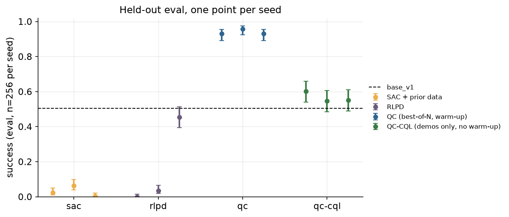
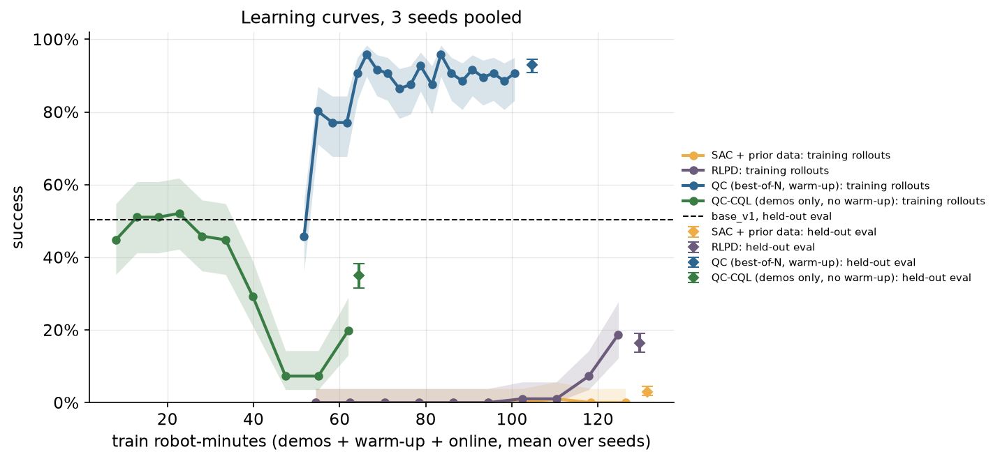
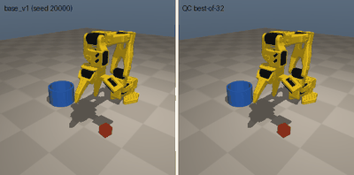
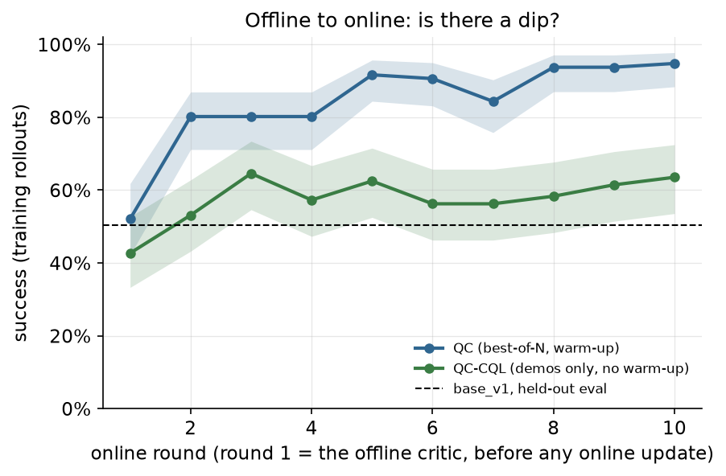

# Chapter 5: Off-policy critics: SAC → RLPD → Q-chunking

A critic that learns from every transition it has ever seen, and three ways to turn it into a policy. Two of them train an actor from scratch (SAC, then RLPD) and fail at this budget. The third, Q-chunking, keeps the frozen `base_v1` as its only actor and uses the critic to pick among the base's own proposals: **50.4% → 93.0% [90.9, 94.6]** on the held-out eval set, pooled over 3 seeds, with about 900 rollouts per seed. That is the same level Chapter 12's verifier reached with 4,096 labeled rollouts per seed, and **it does not reach the 95% target**: the best seed reaches 242/256 = 94.5% [91.0, 96.7], and no seed reaches 95%.

Code: [`algos/05_rlpd_qchunk.py`](../../algos/05_rlpd_qchunk.py). Results: [`results/ch05/`](../../results/ch05/). Media: [`media/ch05/`](../../media/ch05/).

```bash
uv run python algos/05_rlpd_qchunk.py --quick   # smoke test, under 1 min (51 s on MPS, 55 s CPU-only, under load); writes only to runs/ch05_quick/
uv run python algos/05_rlpd_qchunk.py           # full run: 71.6 min wall on an M5 Pro shared with other jobs (4 workers, MPS)
```

## The idea in plain words

Chapters 1-3 and 12 learned from success counts: run something, count, compare. Every rollout was used once, to score the thing that produced it. Off-policy RL keeps every transition in a replay buffer and learns a **critic** `Q(s, a)`: "if I do `a` now and then follow my policy, what is my discounted chance of success?" The critic is trained by **bootstrapping**. Its estimate now should equal the reward plus its own estimate one decision later (a Bellman backup). Because that target only needs one transition, any transition can be reused thousands of times, whoever collected it: a demo, a failed rollout of the base, a rollout of last round's policy.

Once you have a critic you still need a policy. The chapter tries three:

1. **SAC.** Train a Gaussian actor to pick actions the critic likes, with an entropy bonus to keep exploring. Demos and base rollouts simply sit in the replay buffer.
2. **RLPD.** SAC plus four small changes that made SAC work with prior data: every batch is half prior data and half online data; LayerNorm in the critic; an ensemble of 10 critics whose target takes the minimum over a random pair; and 4 critic updates per new transition (UTD = 4).
3. **QC (Q-chunking with best-of-N).** No actor at all. The policy is the frozen `base_v1` plus a selection rule: decode N = 32 candidate chunks from the base, execute the one with the highest Q. The critic's target applies the same best-of-32 selection at the next state, scored more cautiously (see the math). This is RLPD's critic with a different way of reading a policy out of it.

All three decide **once per chunk**, every 4 control steps, the way `base_v1` does (it plans 8 actions and executes 4). The critic scores the executed 4-action chunk, a 16-number action. That choice matters more than it looks; see the math.

Two more checks from the offline-to-online literature:

- **The three regimes.** Is the starting policy better than the data it came from, or worse? That decides whether you should protect the policy (warm-up with its own rollouts) or lean on the data (replay it).
- **The dip.** Pretraining a critic offline and then switching to online learning often makes performance *drop* first. We pretrain a QC critic on the demos alone with a conservative (CQL-style) penalty and watch what happens when it goes online, next to QC's warm-up with base rollouts.

## The math

**Chunked TD target.** Let one decision at time `t` pick the chunk `A_t = (a_t, ..., a_{t+h-1})`, `h = 4`. With a sparse reward (`r = 1` on the step the episode succeeds, else 0) and `γ = 0.99` per step, the critic regresses onto

```
y = Σ_{k<h} γ^k r_{t+k}  +  γ^h (1 − done) · V(s_{t+h})
```

Two properties make this the right target for chunks. It is **unbiased** for `Q(s_t, A_t)`: all h actions were chosen at time t, so no intermediate step is a decision where the data's policy and the target policy could disagree. A per-step critic with an h-step return would be biased for off-policy data, because steps t+1..t+h−1 were picked by whoever collected the data. That is Q-chunking's central point. The reason holds for every rollout of `base_v1`, of QC and of the SAC/RLPD actors, but not for the scripted demos: their controller picks each action from the observation at that step (closed loop), and we pack 4 of those actions into a chunk after the fact. The target is still valid for demo chunks because the simulator is deterministic: replaying the same 4 actions from the same state gives the same outcome. It is only approximately valid, because the observation leaves out velocities and other hidden simulator state. This matters most for QC-CQL, whose offline data is all demos. With a sparse reward it is also **faster**: the success signal moves h = 4 steps back per backup. QC's successful episodes take about 10 decisions (about 40 steps; a round with 31 of 32 successes added 326 transitions), so the reward reaches the first decision in about 10 backups instead of about 40.

Why h = 4 and not 8: `base_v1` replans after 4 steps, so the last 4 actions of each plan are never executed. A critic over all 8 with an 8-step target would score actions that did not happen. (Decoupled Q-chunking ([C191]) uses a longer critic chunk than the executed one on purpose. We did not try that.)

**Time-outs are terminal.** The observation includes `time_frac`, so the state at step 150 really has no chance left, and `done = 1` for both success and time-out. Without time in the state, a time-out would have to bootstrap.

**SAC and RLPD.** A tanh-Gaussian actor `π(a|s)` over the 16-number chunk.

```
critic:  V(s') = min_{i ∈ pair} Q'_i(s', a'),  a' ~ π(·|s')     (SAC: the pair is its 2 critics; RLPD: a random pair of 10)
actor:   max_π  E[ Q̄(s, a) − α log π(a|s) ]                      (SAC: Q̄ = min of 2; RLPD: mean of the ensemble)
```

with α tuned to a target entropy of −|A|/2 = −8. We leave the entropy bonus out of the critic's backup. With a 0/1 reward the bonus otherwise dominates. In our first quick run the soft Q values grew past 6 within two rounds, which is meaningless for a quantity that should be a success probability. Q-values then stay comparable across all four methods. Q' is a target network, updated by Polyak averaging (τ = 0.005).

**QC.** The policy is `π_QC(s) = argmax_{j ≤ N} Q̄(s, c_j)` with `c_j = base_v1(s, w_j)`, `w_j ~ N(0, I)`, N = 32, Q̄ the mean over all 10 members of the online critic. The target uses the same best-of-N selection, but scored pessimistically, with the minimum over a random pair of target-critic members instead of the ensemble mean used for acting:

```
V(s') = max_{j ≤ N}  min_{i ∈ pair} Q'_i(s', c'_j),    c'_j ~ base_v1(·|s')
```

So the target values a slightly more cautious greedy policy than the one executed. The reason: a max over 32 noisy estimates is biased upward, and in the target that bias would feed back into every later backup. The random-pair minimum (RLPD's and REDQ's trick) offsets it. When acting, the bias does not compound, so we use the ensemble mean, which uses all 10 members.

The candidates `c'_j` are exactly the 32 proposals the rollout policy decoded at `s'` (logged with the transition), and for the scripted demos they are sampled once from the base. Because the base is frozen, those samples never go stale. The critic therefore estimates the value of *best-of-32 from the base*, not of the base itself. This is the difference from Chapter 12's verifier, which regressed onto the base's own Monte-Carlo returns.

**QC-CQL (the dip check).** Offline, on the 20 demos only, the critic adds a conservative penalty that pushes the base's candidates down relative to the action in the data:

```
L = L_TD + α_CQL · E_s[ logsumexp_j Q(s, c_j) − Q(s, a_data) ],   α_CQL = 1, 8 candidates per state
```

Then it goes online with the penalty off and no warm-up rollouts, keeping the demos in its buffer.

## Papers it mirrors

| Paper | What we take from it |
|---|---|
| **Q-chunking** ([C133](https://arxiv.org/abs/2507.07969)), *Reinforcement Learning with Action Chunking* (2025-07) | The chunk critic, the unbiased h-step target, and best-of-N extraction from a flow-matching behavior policy (their "QC"; QC-FQL distills it into a one-step policy instead, which we did not implement). Their headline: OGBench, 25 tasks, offline → online, QC 52 → 86 vs FQL 37 → 58. |
| **RLPD** ([C037](https://arxiv.org/abs/2302.02948)), *Efficient Online Reinforcement Learning with Offline Data* (2023) | 50/50 prior/online batches, LayerNorm critics, an ensemble with a random-pair minimum, UTD > 1, no pretraining. The engine of SERL and HIL-SERL. |
| **Three Regimes** ([C172](https://arxiv.org/abs/2510.01460)), *The Three Regimes of Offline-to-Online RL* (2025-10) | Compare the starting policy's return with the dataset's average: if the policy is better, protect it with warm-up rollouts; if the data is better, replay it. |
| **WSRL** ([C088](https://arxiv.org/abs/2412.07762)), *Efficient Online RL Fine-Tuning Need Not Retain Offline Data* | Warm up the buffer with rollouts of the frozen starting policy before online RL. QC's 256 warm-up rollouts of `base_v1` are this step. (WSRL also drops the offline data; QC keeps the 20 demos.) |
| **IPE** ([C348](https://arxiv.org/abs/2607.27203)), *Do You Really Need to Pretrain Q-Functions for Online RL Fine-Tuning?* (2026-07) | Demo-pretrained critics barely beat random ones; a critic needs contrasting actions. QC-CQL's critic, pretrained on 20 demos, is our version of that finding. |
| **Cal-QL** ([C041](https://arxiv.org/abs/2303.05479)), *Calibrated Offline RL Pre-Training for Efficient Online Fine-Tuning* (2023) | Why conservative pretraining dips: CQL's values sit far below the true return, and the first online updates have to unlearn that. Cal-QL bounds them from below by a reference value. We show the problem, not the fix. |
| **Decoupled Q-chunking** ([C191](https://arxiv.org/abs/2512.10926)) | A critic chunk longer than the executed prefix. Mentioned for the h = 4 vs 8 choice; not implemented. |

## What the script does

For each of 3 seeds (the seed sets the demos, the warm-up and online env seeds, and the network initialization):

1. **Prior data.** 20 scripted demos recorded the way `base_v1`'s were (Chapter 0: 10 by the tuned controller, 10 sloppy, every attempt kept), on chapter-5 seeds 5 000 000 + 1 000 000·seed + 900 000 + j for the tuned demos and + 950 000 + j for the sloppy ones (5 900 000+ for seed 0, 6 900 000+ and 7 900 000+ for seeds 1 and 2), with hashed controller seeds (fixing Chapter 0's caveat 5). Then 256 **warm-up rollouts of the frozen `base_v1`** (seeds 5 000 000 + 1 000 000·seed + i). Both are charged to `train`; the demos also to human-minutes.
2. **Four methods**, all with the same prior data except QC-CQL (demos only), the same online env seeds, and 32 episodes per online round:
   - `sac`: 2 critics, no LayerNorm, uniform batches, UTD 1, 10 rounds.
   - `rlpd`: 10 LayerNorm critics, 50/50 batches, UTD 4, 10 rounds.
   - `qc`: RLPD's critic, 5000 offline updates on the prior data, then 20 rounds at UTD 2. No actor.
   - `qc-cql`: as `qc`, but offline on the demos only with the CQL penalty, then 10 rounds.

   A round rolls out the current policy (SAC/RLPD sample from the actor; QC picks the best of 32), adds the transitions, then trains. The learning curves are the training rollouts' success: each is a fresh start state, so it is an honest (if noisy) estimate of the current policy.
3. **Held-out eval, once per method and seed:** all 256 eval start states with the base's policy seeds (salt 0), so every comparison with `base_v1` is paired (McNemar). SAC and RLPD are scored with the actor's mean action; the sampled actor is scored as an extra and never used to pick anything. Also scored once: a random pick among QC's 32 candidates (honesty rule 4).

Nothing is selected on `eval`. The hyperparameters were fixed after one pilot run on seed 0, scored on the `search` set. The pilot ran SAC, RLPD and QC for 10 rounds and QC-CQL for 6. Three things changed after it, without a second pilot:

- QC went from 10 to 20 rounds. A new setting, `actor_rounds`, kept SAC and RLPD at the pilot's 10 (their rounds were 4-5× slower; see What went wrong #3).
- QC-CQL went from 6 to 10 rounds (`dip_rounds`).
- A new setting, `cql_cands = 8`, restricts QC-CQL's CQL penalty to 8 of the 32 candidates per state, which needs 4× fewer critic passes in the penalty. The pilot's config has no such setting.

So the full run's QC-CQL is not the configuration the pilot tested. Seed 0 of the full run reproduces the pilot's SAC, RLPD and QC rounds exactly (QC's first 10 of 20; the run is deterministic), but QC-CQL's rounds all differ (round 1: 15/32 in the full run, 18/32 in the pilot). The pilot's QC-CQL also fell online: it went from 18/32 = 56.2% [39.3, 71.8] in round 1 to 9/32 = 28.1% [15.6, 45.4] in round 6, and scored 3/64 = 4.7% [1.6, 12.9] on `search`. The pilot and the first `--quick` run (which exposed the entropy problem) are charged to every row through `PRIOR_STEPS` in the script.

Implementation notes. The critic ensemble is one batched matmul (`VLinear`), trained with Adam on Apple's MPS GPU, with replay kept on the device. The rollout workers run numpy copies of the exported actor or critic. QC's rollout policy subclasses `FlowChunkPolicy` and uses its callable-noise hook: it draws 32 noise vectors from the env's own generator, decodes them, scores them, returns the winner's noise, and logs all 32 candidates for the TD target.

## Results

All numbers come from one full run, `results/ch05/*_20260930-2211*.json` (71.6 min wall). Intervals are Wilson 95%.

### 1. Held-out evaluation

Every row is scored on the same 256 eval start states with the same policy seeds as `base_v1`, so the comparisons are paired. "fixed / broke" counts episodes the method solved and the base failed, and the reverse.

| policy (eval, n = 256 per seed) | seed 0 | seed 1 | seed 2 | pooled (k/768) | vs base: McNemar p (per seed) |
|---|---|---|---|---|---|
| `base_v1` | 129/256 = 50.4% [44.3, 56.5] | | | | — |
| random pick of 32 base candidates (control) | 125/256 = 48.8% [42.8, 54.9] | | | | 0.78 |
| SAC + prior data | 6 = 2.3% [1.1, 5.0] | 16 = 6.2% [3.9, 9.9] | 1 = 0.4% [0.1, 2.2] | 23 = 3.0% [2.0, 4.5] | 1e-34, 5e-27, 2e-37 |
| RLPD | 0 = 0.0% [0.0, 1.5] | 9 = 3.5% [1.9, 6.5] | 116 = 45.3% [39.3, 51.4] | 125 = 16.3% [13.8, 19.1] | 3e-39, 7e-34, 0.28 |
| **QC, best-of-32 (warm-up)** | **239 = 93.4% [89.6, 95.8]** | **242 = 94.5% [91.0, 96.7]** | **233 = 91.0% [86.9, 93.9]** | **714 = 93.0% [90.9, 94.6]** | 1e-24, 7e-30, 1e-24 |
| QC-CQL (demos only, no warm-up) | 106 = 41.4% [35.5, 47.5] | 55 = 21.5% [16.9, 26.9] | 107 = 41.8% [35.9, 47.9] | 268 = 34.9% [31.6, 38.3] | 0.036, 8e-12, 0.065 |

Paired with the base, episode by episode (fixed / broke / both failed): QC 121 / 11 / 6, 117 / 4 / 10 and 112 / 8 / 15 for seeds 0, 1, 2. Paired bootstrap 95% intervals for QC's gain: [+35.9, +50.0], [+37.9, +50.4] and [+34.0, +47.3] points. The pooled intervals treat the 3 × 256 episodes as independent; they share the same 256 start states, so read them as conditional on those states.

SAC and RLPD are scored with the actor's mean action, the convention fixed in advance. As an extra, the sampled actor scored 3/256 = 1.2% [0.4, 3.4], 15/256 = 5.9% [3.6, 9.4] and 0/256 = 0.0% [0.0, 1.5] (SAC), and 0/256 = 0.0% [0.0, 1.5], 30/256 = 11.7% [8.3, 16.2] and 68/256 = 26.6% [21.5, 32.3] (RLPD); see What went wrong #3.



What the table says:

- **QC is the only method that climbs: 50.4% → 93.0% pooled,** with every seed between 91.0% and 94.5% and McNemar p below 1e-23 for each. It does not reach the 95% point estimate that "95%+" means in this repo (honesty rule 7). The v0.2 exit criterion, at least one method ≥ 95% on eval with 3 seeds, is **not met by this chapter**.
- **The random pick of 32 is the base again** (48.8%, p = 0.78). Drawing 32 candidates does nothing by itself; the gain comes from the critic's ranking.
- **SAC and RLPD, which train an actor from scratch, end far below the base** after 10 rounds (320 online episodes). One RLPD seed reaches 45.3%, statistically indistinguishable from the base (p = 0.28), while the other two are near zero. QC-CQL also ends below the base.
- **Failure modes** (`OutcomeTracker`, eval): the base has 102 missed grasps, 18 slips, 4 rim hits and 3 off-target drops; QC seed 0 has 13 missed grasps, 1 slip, 1 rim hit, 1 off-target and 1 episode still holding the cube at the time limit. As in Chapter 12, almost all of the gain is grasps.

### 2. Learning curves



Training-rollout success per round (32 episodes per seed, pooled over 3 seeds, so 96 per point) against the cumulative `train` robot-minutes each method has spent, including its prior data. The QC and SAC/RLPD curves start at about 52 robot-minutes because the 20 demos (2.6 min) and the 256 warm-up rollouts (43-45 min) come first; QC-CQL uses only the demos. The diamonds are the held-out eval results, pooled over seeds.

- **QC:** round 1, where the critic has only seen the prior data, scores 44/96 = 45.8% [36.2, 55.8], the base's level. Round 2 jumps to 77/96 = 80.2% [71.1, 86.9], round 5 to 87/96 = 90.6% [83.1, 95.0]. From round 5 to 20 the pooled rounds stay between 83/96 = 86.5% [78.2, 91.9] and 92/96 = 95.8% [89.8, 98.4], with no visible trend, while the critic's mean Q on replayed data keeps rising slowly (0.36 → 0.41-0.45). The extra 15 rounds bought nothing we can see.
- **SAC:** 1 success in 960 training episodes (0.1% [0.0, 0.6]). Its critic's mean Q on replayed data climbs to 29.4, 9.3 and 40.8 by round 10 (the true value is at most 1): without LayerNorm the critic diverges, and an actor that maximizes a diverging Q learns nothing useful.
- **RLPD:** zero successes for 6 rounds, then 1, 1, 7 and 18 of 96 in rounds 7-10 (the last is 18.8% [12.2, 27.7]). LayerNorm keeps its Q between −0.2 and 0.5. It was improving when its budget ran out; we did not run it longer (What went wrong #3).
- **Robot-minutes are not episodes.** SAC and RLPD ran half as many online episodes as QC (320 vs 640) but spent more robot-minutes (about 80 vs 55 per seed), because a failing episode runs the full 150 steps.

### 3. Same start state, base vs QC



Eval seed 20000, the first eval start state where the base fails and QC (seed 0) succeeds; neither clip was picked by hand. It is the same state as Chapter 12's GIF.

### 4. The three regimes

The Three Regimes paper ([C172]) asks one question before offline-to-online RL: is the starting policy better than its data, or worse? If the policy is better, protect it with warm-up rollouts. If the data is better, keep replaying the data.

The fair comparison uses the same kind of start states for both. The demos and the warm-up rollouts of `base_v1` were both run on chapter-5 seeds (different seeds, drawn from the same start-state distribution), so they are the main comparison. The base's eval score is a secondary row: it was measured on a different set of start states.

| | k/n | success [Wilson 95%] |
|---|---|---|
| demos of the kind `base_v1` was cloned from (3 seeds × 20, chapter-5 seeds) | 36/60 | 60.0% [47.4, 71.4] |
| `base_v1`, the policy: warm-up rollouts (3 seeds × 256, chapter-5 seeds) | 330/768 | 43.0% [39.5, 46.5] |
| *secondary:* `base_v1` on the eval set (salt 0) | 129/256 | 50.4% [44.3, 56.5] |

Per seed, the demos beat the base's warm-up rollouts every time: 13/20 vs 111/256, 12/20 vs 103/256 and 11/20 vs 116/256. Pooled, the intervals do not overlap, and Fisher's exact test (computed afterwards from the counts above with scipy) gives p = 0.015. **The data is better than the policy**, by 17 points. That puts this chapter in the paper's "data is better, replay it" regime. Only the secondary comparison, demos against the base on the eval set, leaves the question open (intervals overlap, Fisher p = 0.20). That comparison mixes two different sets of start states, and the base itself scores lower on the chapter-5 seeds than on eval (43.0% vs 50.4%, Fisher p = 0.042; Chapter 0 measured 966/2048 = 47.2% [45.0, 49.3] on eval averaged over 8 noise salts). The 768 warm-up rollouts are the largest sample of the base in this chapter.

The lesson is sharper than "replay the data". The check says to replay the data, and yet the method that protects the policy most won. RLPD replays the prior data in half of every batch, as the regime recommends, and ends far below the base. QC replays the same data too, uniformly, but keeps the frozen base as its only actor. That is the strongest possible way of protecting the policy: the learned part can only reweight the base's own proposals. The regime check is a rule for how to fine-tune a policy whose weights move. Here, freezing the policy and learning only a critic over its proposals beat the moving-actor method the check recommends (RLPD, trained from scratch). We did not run the 2×2 that would separate the two effects (QC with 50/50 batches, RLPD with an actor warm-started from the base).

### 5. Offline to online: the dip



Pooled training-rollout success per online round (k/96 per round: 32 episodes × 3 seeds), Wilson 95% intervals. Round 1 uses the critic from the offline phase only.

| round | QC (warm-up, no penalty) | QC-CQL (demos only, CQL offline) | QC-CQL mean Q on replayed data (seeds 0 / 1 / 2) |
|---|---|---|---|
| 1 | 44/96 = 45.8% [36.2, 55.8] | 43/96 = 44.8% [35.2, 54.7] | −75 / −76 / −85 |
| 2 | 77/96 = 80.2% [71.1, 86.9] | 49/96 = 51.0% [41.2, 60.8] | −38 / −34 / −42 |
| 3 | 74/96 = 77.1% [67.7, 84.4] | 49/96 = 51.0% [41.2, 60.8] | −16 / −15 / −19 |
| 4 | 74/96 = 77.1% [67.7, 84.4] | 50/96 = 52.1% [42.2, 61.8] | −1.5 / −3.7 / −7.4 |
| 5 | 87/96 = 90.6% [83.1, 95.0] | 44/96 = 45.8% [36.2, 55.8] | 2.9 / 0.9 / −1.0 |
| 6 | 92/96 = 95.8% [89.8, 98.4] | 43/96 = 44.8% [35.2, 54.7] | 3.0 / 1.7 / 0.7 |
| 7 | 88/96 = 91.7% [84.4, 95.7] | 28/96 = 29.2% [21.0, 38.9] | 2.1 / 1.4 / 1.0 |
| 8 | 87/96 = 90.6% [83.1, 95.0] | 7/96 = 7.3% [3.6, 14.3] | 1.3 / 1.0 / 0.8 |
| 9 | 83/96 = 86.5% [78.2, 91.9] | 7/96 = 7.3% [3.6, 14.3] | 0.8 / 0.6 / 0.6 |
| 10 | 84/96 = 87.5% [79.4, 92.7] | 19/96 = 19.8% [13.1, 28.9] | 0.5 / 0.4 / 0.5 |

**QC with a warm-up shows no dip.** Its offline critic acts at the base's level (44/96 = 45.8% [36.2, 55.8]), and the first online round lifts it to 77/96 = 80.2% [71.1, 86.9].

**QC-CQL dips late and hard.** Its offline critic also acts at about the base's level (43/96 = 44.8% [35.2, 54.7]) and stays there for four rounds. It then falls to 7/96 = 7.3% [3.6, 14.3] in rounds 8 and 9 and is recovering in round 10 (19/96 = 19.8% [13.1, 28.9]). Its final policies score 268/768 = 34.9% [31.6, 38.3] pooled on eval, below the base. (The pilot's QC-CQL, with 6 rounds and the penalty as it was before `cql_cands`, also fell online; see What the script does.) The Q column shows the mechanism we believe is at work. The CQL penalty pushed every Q value far below anything possible with a 0/1 reward (around −80; the true values lie in [0, 1]), because nothing bounds it from below. Once the penalty is off, online TD pulls Q back up, and best-of-32 in the target picks the *most* over-estimated candidate at every backup, so the values overshoot past 1 in rounds 5-7. The collapse in success follows that overshoot. While the values are this far off, the argmax over candidates mostly reflects which candidates the critic is wrong about. This is the problem Cal-QL ([C041]) fixes by bounding the conservative values from below by a reference return. We show the problem, not the fix.

This is not a clean A/B of "CQL vs warm-up". QC-CQL differs in two ways at once: the penalty, and its prior data (20 demos instead of 20 demos + 256 base rollouts). IPE's ([C348]) point, that a critic pretrained on demos alone has seen too few contrasting actions to be useful, predicts the flat first four rounds by itself. We did not run the two missing cells (demos only without the penalty; warm-up with the penalty).

### 6. QC vs Chapter 12's verifier

Chapter 12 trained a Monte-Carlo verifier on the base's own labeled rollouts and used it the same way: best-of-32 from the frozen base. Both chapters were scored on the same 256 eval start states against the same base.

| | data per seed | robot-minutes of data per seed | eval, pooled over 3 seeds |
|---|---|---|---|
| Ch 12, MC-value verifier, best-of-32 | 4096 labeled base rollouts | 692.8 | 721/768 = 93.9% [92.0, 95.4] |
| Ch 12, same verifier, 512 rollouts (search set, from its data sweep) | 512 | about 87 | 385/768 = 50.1% [46.6, 53.7] on search |
| **Ch 5, QC critic, best-of-32** | 20 demos + 256 base rollouts + 640 online QC rollouts | 97.9-103.0 | 714/768 = 93.0% [90.9, 94.6] |

QC reaches the same level with about 7× fewer robot-minutes of data (the intervals overlap, so "the same level" is all we can say). With a similar amount of base-only data, Chapter 12's verifier did nothing. Three differences could explain this, and we did not separate them:

1. **TD instead of Monte-Carlo.** The critic learns from its own estimate one chunk later, so a successful episode teaches every state along it, not only through one noisy episode-level label.
2. **On-policy data.** 640 of QC's 916 episodes come from the improving best-of-32 policy itself, in the states it actually visits. Chapter 12 suspected that its weak verifiers failed partly in states the base rarely visits.
3. **The critic.** QC uses RLPD's 10-member LayerNorm ensemble; Chapter 12 used one plain MLP.

The cost on a real arm is not the same kind of cost. Chapter 12's rollouts can be logged passively from any run of the base. QC's online rounds need the learning loop on the robot: roll out, retrain the critic, roll out again.

### 7. Cost

Robot-minutes are env steps / 600 (10 Hz). The QC seed-0 row:

| item | robot-minutes | bucket |
|---|---|---|
| 20 scripted demos (also 2.6 human-minutes) | 2.6 | train |
| 256 warm-up rollouts of `base_v1` | 43.7 | train |
| 20 online rounds × 32 best-of-32 episodes | 54.6 | train |
| subtotal, this run | 100.9 | train |
| pilot 1 (seed 0, all four methods: SAC, RLPD, QC 10 rounds, QC-CQL 6; scored on `search`): rollouts | 267.3 | train |
| pilot 1: scoring on the search set | 74.2 | search |
| first `--quick` run (it exposed the entropy problem): rollouts / scoring | 17.3 / 34.6 | train / search |
| **improvement budget in the results file** | **385.4 train + 108.8 search = 494.2** | |
| held-out evaluations (base and QC) | 57.6 | eval |

The other rows: SAC and RLPD each spend 123-127 robot-minutes in this run (about 46 of prior data plus 77-81 online), QC-CQL 66.9, 61.3 and 57.8 for seeds 0, 1, 2 (demos plus 55-64 online). Every row also carries the same 284.6 train and 108.8 search robot-minutes from the pilot and the first quick run (`PRIOR_STEPS` in the script), because they fixed the round budgets for all methods. That prior cost is larger than what QC itself needs (100.9). On a real arm the recipe costs the 100.9: demos, a warm-up, and 20 short online rounds.

Compute: the results files report 0.69-0.80 CPU-hours per row, but most of that is shared, not the row's own cost. All 13 rows are open for the whole run, so each row's `cpu_hours` is the main process's CPU for the entire 71.6-minute run (every method's training and every evaluation) plus that row's own rollout workers, including the demo and warm-up workers it shares with the other methods of its seed. The `qc-random` row, which trains nothing and runs one evaluation, reports 0.69 CPU-hours, so at most 0.69 of each row's figure is the shared main process. The training rows are 0.04-0.11 CPU-hours above it (QC 0.10-0.11, SAC 0.06-0.09, RLPD 0.04-0.08, QC-CQL about 0.08): that difference is how much more worker CPU a row used than the single random-pick evaluation. Do not add the rows up: that counts the main process 13 times. The `wall_minutes` of every row (71.6) is likewise the whole run. On top of this is Apple-GPU (MPS) time for the critic updates, which the ledger does not count separately (`gpu_hours` is 0; the field is meant for NVIDIA time). Wall time per method and seed: SAC 2.8-3.3 min, RLPD 7.2-8.2, QC 4.1-4.6, QC-CQL 4.8-5.7. The whole run took 71.6 minutes on an M5 Pro shared with other experiments (load average around 17 on 18 cores), more than the 60 minutes we aimed for.

## What went wrong

**1. QC plateaus below 95%.** After round 5 the training rollouts stay between 83/96 = 86.5% [78.2, 91.9] and 92/96 = 95.8% [89.8, 98.4] pooled and do not trend up through round 20, and eval lands at 91.0-94.5% per seed. Doubling the rounds from the pilot's 10 to 20 changed little: the pilot's seed-0 QC scored 58/64 = 90.6% [81.0, 95.6] on search after 10 rounds. What would move the plateau is untested: more candidates, a larger or longer-chunked critic (DQC), or distilling the best-of-N policy into a new actor (QC-FQL). Whatever it is has to fix the remaining missed grasps (13 of 17 failures for seed 0).

**2. SAC diverges.** Without LayerNorm, SAC's critic on this sparse task drifts to Q values of 9-41 (the true values are at most 1) within 10 rounds, and its actors score 1-16 of 256 on eval (0.4-6.2%; intervals in the table above). This is the textbook failure RLPD's LayerNorm critics are meant to prevent, and it shows here cleanly: RLPD's critics, trained on the same data, stay in [−0.2, 0.5].

**3. RLPD is unstable and seed-dependent.** Its seeds end at 0/256, 9/256 and 116/256 on eval (0.0%, 3.5% and 45.3%; intervals in the table above). Seed 0 succeeded in 12/32 = 37.5% [22.9, 54.7] of its training episodes in round 10 and then scored 0/256 on eval after the next block of updates, with the mean action *and* with the sampled actor. The mean action and the sampled actor also disagree in both directions (seed 1: 9/256 = 3.5% [1.9, 6.5] vs 30/256 = 11.7% [8.3, 16.2]; seed 2: 116/256 = 45.3% [39.3, 51.4] vs 68/256 = 26.6% [21.5, 32.3]). Its learning curve was still rising when the budget ran out. We gave SAC and RLPD 10 rounds and QC 20, because RLPD's 10-critic ensemble at UTD 4 made a round 4-5× slower on this machine. A longer RLPD run could do better; we did not test it, so "RLPD fails here" means "RLPD fails within 320 online episodes (about 80 robot-minutes)". We also changed one thing from standard SAC and RLPD: the entropy bonus is not in the critic's backup (see the math). We did not test whether that hurts them.

**4. Conservative pretraining on demos collapses online** (result 5): from about 50% for four rounds to 7/96 = 7.3% [3.6, 14.3], ending at 268/768 = 34.9% [31.6, 38.3] pooled on eval, below the base. Two of the three seeds are significantly worse than the base: seed 1 (55/256 = 21.5%, McNemar p = 8e-12; fixed 24, broke 98) and seed 0 (106/256 = 41.4%, p = 0.036; fixed 44, broke 67). Seed 2 (107/256 = 41.8%, p = 0.065) is not significantly different. The penalty drove the values to around −80, and their overshoot back past 1 is where the collapse happens.

**5. QC breaks some episodes the base solved:** 11, 4 and 8 of the base's successes per seed, against 121, 117 and 112 fixed. Both failed on 6, 10 and 15 episodes. It is an improvement on average, not on every episode.

**6. Selection has a ceiling.** QC only reranks `base_v1`'s own proposals. It recombines chunks from different samples, so it can beat a finite pass@k, but it cannot solve a start state from which no sequence of base chunks succeeds (CONTRIBUTING rule 8). Chapter 12 found no such state among its search states; here we did not look.

**7. The budget accounting is dominated by our own exploration.** The pilot and the first quick run (393.4 robot-minutes together) cost more than the QC recipe itself (100.9). They are charged to every row, as the rules require, which makes the leaderboard's cost column for this chapter about 5× what a practitioner would pay for QC.

**8. The run took 71.6 minutes, not the 60 we aimed for,** on a machine shared with other experiments. Determinism held anyway: seed 0's SAC, RLPD and QC rounds matched the pilot's exactly (QC's first 10 of 20). QC-CQL did not, because its penalty and round count changed after the pilot (What the script does).

## The hardware step (SO-101)

> **Safety.** A learning policy can move the arm quickly and in unexpected ways, and the servos can pinch. Clear the workspace, keep the arm's power switch or plug (or an e-stop) within reach, start with low speed and a small per-step limit (in LeRobot, `max_relative_target` on the follower, which is off by default), keep your hands out of the workspace while the policy runs (reset only when the arm has stopped), and supervise every run.

From the curriculum (§1, Ch 5), adjusted by what the sim run taught us:

1. **Offline first, on logged data.** Every real rollout of the frozen real `base_v1` from Chapters 1-4 and 12 is prior data: log `(obs, executed chunk, reward, next obs, done)` every 4 steps, plus the 32 base candidates at each decision (re-sample them offline from the frozen policy if they were not logged). Label success with the human key. Expect a few hundred episodes.
2. **Fit the QC critic on the Mac** exactly as in this script: RLPD's ensemble critic, the 4-step chunked target, best-of-32 in the target. Do not pretrain it with a CQL penalty on demos alone (result 5), and do not judge it by its Q values on the data.
3. **Check it on `R_search`** (the 10 marked spots): best-of-32 against the base and against a random pick of 32. Chapter 12 measured about 15 ms per best-of-32 decision on the Mac with a single small MLP; QC's 10-member ensemble costs more (we did not time it), and the budget is the 400 ms between decisions.
4. **Optional online phase.** 30-45 minutes of QC rounds on `R_search` spots with keypress success labels, retraining the critic between rounds, like the sim's 20 rounds × 32 episodes. Expect the first round to look like the base: in sim the gain arrived in the second round (44/96 = 45.8% [36.2, 55.8] → 77/96 = 80.2% [71.1, 86.9] pooled).
5. **Score `R_eval` once** (30 spots, fixed order) for the base and the final QC critic, with k/30, the Wilson interval (27/30 is [74.4, 96.5]) and McNemar's test on the paired spots. Never write 100%.

Skip SAC and RLPD from scratch on the real arm. In sim they used about 125 robot-minutes per seed and ended below the base.

## Reproduce

```bash
uv run python algos/05_rlpd_qchunk.py            # full run, 71.6 min wall
uv run python algos/05_rlpd_qchunk.py --quick    # smoke test
uv run python algos/05_rlpd_qchunk.py --methods qc --seeds 0 --out runs/ch05_qc_only   # only QC, one seed
```

The full run writes one results JSON per method and seed (`sac_s0`, ..., `qc-cql_s2`) plus `qc-random` to `results/ch05/`, the plots and GIF to `media/ch05/`, and the exported networks to the git-ignored `runs/ch05_work/`. Always pass `--out` (as in the third line) for partial runs: a non-quick run without it writes to the repo's `results/ch05/`, where the leaderboard reads it, charges it the full `PRIOR_STEPS`, and overwrites the published plots and GIF in `media/ch05/`. On this machine the run is deterministic: seed 0 of the full run reproduced the pilot's SAC, RLPD and QC rounds exactly. QC-CQL's did not, because its configuration changed after the pilot.

[C037]: https://arxiv.org/abs/2302.02948
[C041]: https://arxiv.org/abs/2303.05479
[C088]: https://arxiv.org/abs/2412.07762
[C133]: https://arxiv.org/abs/2507.07969
[C172]: https://arxiv.org/abs/2510.01460
[C191]: https://arxiv.org/abs/2512.10926
[C348]: https://arxiv.org/abs/2607.27203
