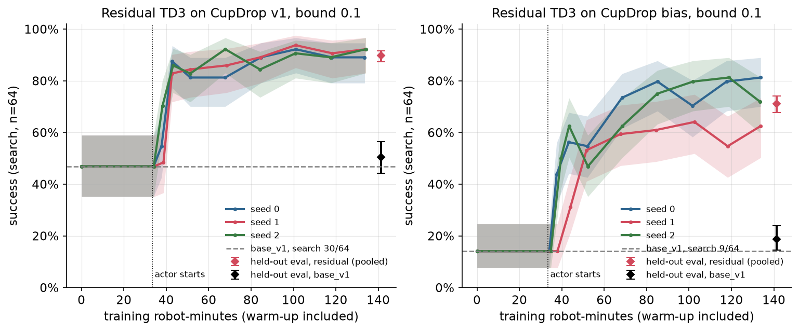
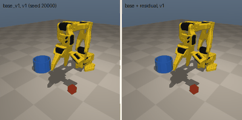
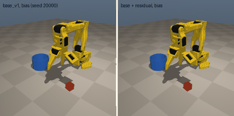
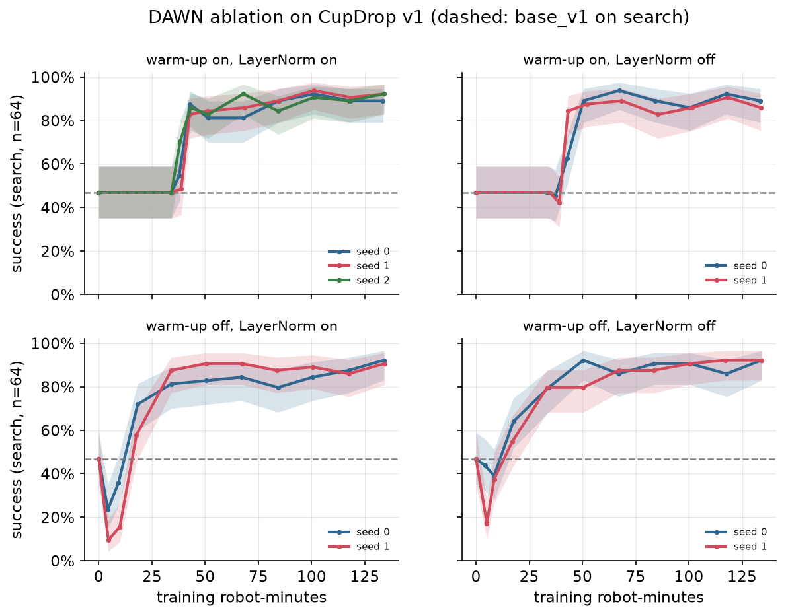
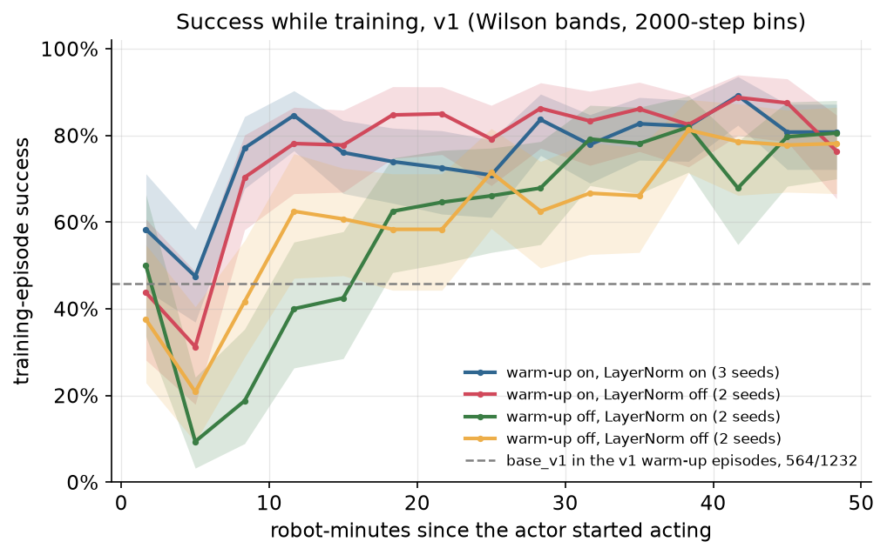
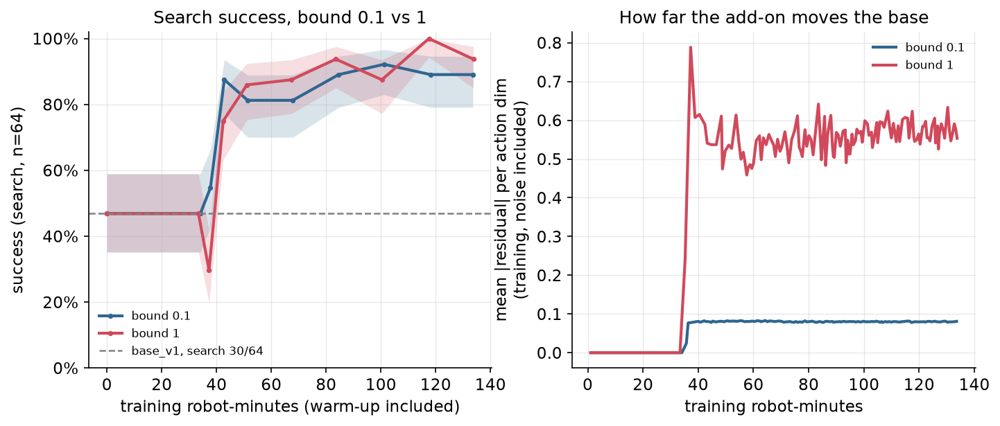

# Chapter 6: Residual RL on a frozen base

The first chapter that trains with reinforcement learning, and it still does not change a single weight of `base_v1`. A small network learns a bounded correction that is added to the base's action at every step, using off-policy TD3 on the sparse success reward. On held-out states it takes the base from 50.4% to **89.7% [87.4, 91.7]** on CupDrop v1 (pooled over 3 seeds), and from 18.8% to **71.1% [67.8, 74.2]** on the `bias` variant, where the arm's joint encoders are mis-zeroed. On bias, one of the three seeds stopped at 58.2%. Each run uses 134 robot-minutes of training interaction. All four DAWN cells end level, but they differ a lot during training. Without the critic warm-up, every run dropped *below* the base for its first robot-minutes of acting: training episodes succeeded 36.8% of the time, against 45.8% for the base. With the warm-up, they succeeded 66.7% of the time. The large bound we ran as the planned failure (α = 1) shows the same early dip, and then ends *above* the default.

Code: [`algos/06_residual_td3.py`](../../algos/06_residual_td3.py). Results: [`results/ch06/`](../../results/ch06/). Media: [`media/ch06/`](../../media/ch06/).

```bash
uv run python algos/06_residual_td3.py --quick   # smoke test, under 2 min; writes to runs/ch06_quick/ only and never touches eval
uv run python algos/06_residual_td3.py           # full run: 33-42 min wall on an M5 Pro (4 processes, busy machine)
# the committed results were written with the earlier pilot and superseded runs charged:
uv run python algos/06_residual_td3.py --prior-search-steps 950957 --prior-train-steps 2207801
uv run python algos/06_residual_td3.py --replot results/ch06/residual-td3_v1_s0_so101_20260930-230317.json
```

## The idea in plain words

`base_v1` (Chapter 0) succeeds about half the time. Most of its failures are missed grasps: it closes the gripper a centimeter or so beside the cube. Chapters 3 and 12 fixed that by choosing *which* of the base's own chunks to execute. This chapter lets a second, small network nudge the action itself.

At every control step the frozen base proposes an action, and a small "residual" network adds a correction to it:

```
action = base action + α · tanh(residual network output)
```

Three design choices make this gentler to train on a real robot than learning a policy from scratch:

1. **It starts at exactly the base.** The residual network's last layer starts at zero, so its output is `tanh(0) = 0` and the robot behaves exactly like the base on the first episode. The script checks this episode for episode on the search set before training. This lasts only until the actor's first updates: within one round of training (8 episodes) the mean residual moves from pure exploration noise (0.024 per action dimension) to 0.07-0.09, close to the bound of 0.1.
2. **Each step's correction is small.** `α` bounds the correction per step. With `α = 0.1` and the env's 2 cm per step action scale, the residual can move the end-effector target at most 2 mm per step away from what the base asked for. That is a bound on each step, not on the whole episode. The env integrates the deltas into its target, so a residual that keeps pushing the same way moves the gripper another 2 mm every step, which is 4 cm after 20 steps. A bad actor can still wreck the base (result 2 and What went wrong #1).
3. **The base is part of the environment.** The learner never sees or changes the base's weights. From its point of view the world is "the arm plus a policy that already does something reasonable", and its only job is to make that combination succeed more often.

The residual is trained with TD3, an off-policy actor-critic method: a critic learns `Q(s, a)`, the chance that the episode will succeed after taking action `a` in state `s`, from every transition in a replay buffer, and the residual network is trained to push the combined action toward higher `Q`. Off-policy matters on hardware: every rollout, including the base's own, stays useful.

## The math

The residual MDP. The base `π_b` (frozen, with its own sampling noise) proposes `a_b,t`; the actor `u_θ` sees the state and the base action and outputs an unbounded `u`:

```
a_t = clip( a_b,t + α · tanh(u_θ(s_t, a_b,t)), −1, 1 )
```

The critic is on the **summed** action, `Q_φ(s, a)`, so it does not care who produced which part, and base-only transitions are valid training data for it. Twin critics, target networks, an n-step target (n = 3, γ = 0.99) and target-policy smoothing, as in TD3:

```
y   = Σ_{k<n} γ^k r_{t+k}  +  γ^n (1 − d) · min_j Q'_j( s_{t+n},  clip(a_b,t+n + α · clip(tanh(u'(s_{t+n}, a_b,t+n)) + ε, −1, 1), −1, 1) )
L_Q = Σ_j ( Q_j(s_t, a_t) − y )²                       ε ~ clip(N(0, 0.2²), ±0.5)
L_π = − Q_1( s_t,  a_b,t + α · tanh(u_θ(s_t, a_b,t)) )   (every 2nd critic step)
```

The reward is the sparse success flag (1 on the success step, else 0), so `Q` is a discounted success probability and the target is clipped to [0, 1]. Every episode end is terminal: success ends the task, and the time limit is part of the observation (`time_frac`), so there is nothing to bootstrap after it. `a_b,t+n` is the base action actually recorded at step `t + n`; the base executes 8-action chunks 4 steps at a time, and giving the actor the base action is how it knows what the base is about to do.

Exploration adds `N(0, 0.3²)` to `tanh(u)` before clipping, so the real action noise is `0.3 α` (0.6 mm per step at α = 0.1). The bound limits the noise too, which is part of why a residual is gentle on hardware.

**DAWN's two fixes for the critic.** DAWN ([C233]) argues that in residual RL the critic, not the actor, is the bottleneck: early on the actor follows the gradient of a critic that has not learned anything yet. Its fixes are (1) *warm-up*: fill the replay buffer with pure base transitions (here 20 000 steps, about 33 robot-minutes) and train the critic alone on them before the actor moves, and (2) *LayerNorm* in the critic. Our default uses both; the ablation turns each off.

## Papers it mirrors

| Paper | What we take from it |
|---|---|
| **ResFiT** ([C142](https://arxiv.org/abs/2509.19301)), *Residual Off-Policy RL for Finetuning Behavior Cloning Policies* (2025-09) | The recipe: a frozen chunked BC policy (ACT there, FlowChunk here) plus a small per-step residual trained with a TD3-style off-policy method, a LayerNorm critic and n-step returns. ResFiT also mixes demos into every batch; we use no demos and fill the buffer with a base-rollout warm-up instead. Their headline: real 29-DoF humanoid WoollyBallPnP 14% → 64% after 134 rollouts. |
| **DAWN** ([C233](https://arxiv.org/abs/2602.10539)), *What Makes Value Learning Efficient in Residual Reinforcement Learning?* (2026-02) | Critic warm-up on base data plus critic LayerNorm, and the 2×2 ablation we reproduce. Their headline: PegInsertionSide 90% success about 6× faster than Policy Decorator (plot reading). |
| **Res-HIL** ([C432](https://arxiv.org/abs/2609.30023)), *Human-Guided Residual RL for Sample-Efficient Dexterous Manipulation* (2026-09) | A zero-initialized TD3 residual on a 20-demo ACT, with human takeovers used as regression targets. We take the zero init; takeovers belong to the hardware step. |
| **PLD** ([C158](https://arxiv.org/abs/2511.00091)), *Self-Improving VLA Models with Data Generation via Residual RL* (2025-10) | A bounded residual trained with SAC on a frozen VLA, whose successes are then distilled back into the base. We stop before the distillation. |
| **Policy Decorator** ([C086](https://arxiv.org/abs/2412.13630)), *Model-Agnostic Online Refinement for Large Policy Models* (2024-12) | A bounded SAC residual on frozen BeT or Diffusion Policy, with millions of env steps. The bound is the same idea as our α. |
| **Residual RL for Robot Control** ([C017](https://arxiv.org/abs/1812.03201)) and **Residual Policy Learning** ([C016](https://arxiv.org/abs/1812.06298)), both 2018 | The classics: `π = π_base + f_θ`, on a hand-engineered controller, trained with TD3 or DDPG. |

## What the script does

1. **The base on both variants.** `base_v1` on the 64 `search` states (salt 0) and on the 256 held-out `eval` states, for `v1` and `bias`. The bias variant adds constant joint offsets of about 1.7-3.4° on four joints (0.06, 0.05, 0.04 and −0.03 rad) between commanded and actual joint positions. The encoders do not see the offsets, so the base believes its gripper is somewhere it is not: 1.8-2.9 cm away in the poses we checked (20 search starts).
2. **The zero-init check.** The residual policy with the freshly initialized actor reproduces the base on search episode for episode (asserted).
3. **Training runs**, 4 at a time in separate processes (one torch thread each; each process steps its own envs). Every run has the same budget of 80 000 env steps (133 robot-minutes), warm-up included, so the DAWN cells compare at equal robot time:
   - 20 000 warm-up steps of pure base rollouts, then 20 000 critic-only updates;
   - then rounds of 8 training episodes with exploration noise, each followed by one gradient update per new env step (UTD = 1), batch 256, Adam 3e-4, τ = 0.005;
   - search-set evaluations (64 episodes, no exploration noise), charged to `search`: two early ones, about 2 000 and 5 000 steps after the actor starts acting, and then one every 10 000 steps.
   Training episodes use their own env seeds (1 000 000 + 50 000 × run id + i), disjoint from every named init set. The run's seed sets torch's generator *before* the networks are built, so a seed fixes the initial weights and the whole run. The final run below reproduced the previous one's curves exactly (What went wrong #6).
4. **Runs.** v1 and bias × seeds 0, 1, 2 with the default (α = 0.1, warm-up, LayerNorm); the three other DAWN cells on v1 with 2 seeds each; and one v1 run with α = 1.
5. **Selection on search.** Each run deploys the checkpoint with the best search score (ties go to the later one). The untouched base is one of the candidates, so "the residual did not help" is a possible outcome.
6. **Held-out eval once** for each main run, paired with the base (same 256 states, same base noise), McNemar's exact test and a paired bootstrap interval. The α = 1 run is also scored on eval, both at its chosen and at its last checkpoint.
7. **What the robot sees while training.** From the logged training episodes, the script reports each run's success over its first 8 000 steps of acting (exploration noise included), and the base's success in the warm-up episodes on the same training seeds.

Nothing about the configuration was tuned on `eval`. Before this run there were one pilot and two full runs: the pilot (v1 and bias, seed 0, 60 000 steps, search set only), after which we raised the budget from 60 000 to 80 000 steps because the bias curve was still rising; full run 1, made before the seeding bug was found (What went wrong #6); and full run 2, which differs from the run reported here only in the prior costs it charged and in one summary statistic (the base's warm-up success rate, which it pooled over both variants). All of their rollouts are charged to every row (section 4). The `--quick` smoke tests (search set only, tiny budgets) are not charged.

## Results

All numbers come from one full run, `results/ch06/*_20260930-2303*.json` (33.0 min wall; each training process took 5-10 min on a machine shared with other experiments; full run 2, with the same results, took 42.3 min under heavier load). Intervals are Wilson 95%. "Pooled" adds the three seeds' 768 eval episodes; it treats them as independent, which overstates precision because the same 256 start states repeat.

### 1. The held-out evaluation

| policy | variant | eval k/n | success [Wilson 95%] | vs base: McNemar p | paired difference, bootstrap 95% | fixed / broke |
|---|---|---|---|---|---|---|
| base_v1 | v1 | 129/256 | 50.4% [44.3, 56.5] | — | — | — |
| residual, seed 0 | v1 | 227/256 | 88.7% [84.2, 92.0] | 3.5e-24 | [+31.6, +44.9] pp | 104 / 6 |
| residual, seed 1 | v1 | 231/256 | 90.2% [86.0, 93.3] | 1.7e-23 | [+33.2, +46.5] pp | 111 / 9 |
| residual, seed 2 | v1 | 231/256 | 90.2% [86.0, 93.3] | 1.2e-24 | [+33.2, +46.5] pp | 109 / 7 |
| **residual, pooled** | v1 | **689/768** | **89.7% [87.4, 91.7]** | | | |
| base_v1 | bias | 48/256 | 18.8% [14.4, 24.0] | — | — | — |
| residual, seed 0 | bias | 204/256 | 79.7% [74.3, 84.2] | 2.2e-41 | [+54.3, +67.2] pp | 161 / 5 |
| residual, seed 1 | bias | 149/256 | 58.2% [52.1, 64.1] | 2.0e-17 | [+31.2, +47.7] pp | 126 / 25 |
| residual, seed 2 | bias | 193/256 | 75.4% [69.8, 80.3] | 4.0e-40 | [+50.0, +62.9] pp | 148 / 3 |
| **residual, pooled** | bias | **546/768** | **71.1% [67.8, 74.2]** | | | |

"Fixed" counts held-out episodes the base failed and the residual solved; "broke" the reverse. Checkpoints chosen on search: for v1, seeds 0-2 at 60 710, 60 606 and 80 456 steps, scoring 59/64 = 92.2% [83.0, 96.6], 60/64 = 93.8% [85.0, 97.5] and 59/64 = 92.2% [83.0, 96.6] on search. For bias, seeds 0-2 at 80 278, 61 534 and 71 260 steps, scoring 52/64 = 81.2% [70.0, 88.9], 41/64 = 64.1% [51.8, 74.7] and 52/64 = 81.2% [70.0, 88.9].

Neither variant reaches 95%: v1 stops about 5 points short pooled, and no single seed passes 91%.



The curves are search-set success (n = 64, shaded Wilson band) against training robot-minutes, warm-up included. During the 34 robot-minutes of warm-up the actor is still exactly zero, so success is the base's. On v1, the second evaluation after the actor starts (about 5 000 steps, 9 robot-minutes of acting) is already at 53-56 of 64 for all three seeds, i.e. from 82.8% [71.8, 90.1] to 87.5% [77.2, 93.5]. After that the curves move within their bands. On bias the climb is slower and mostly continues to the end of the budget, and seed 1 lags the other two from the start: it is still at the base's 9/64 = 14.1% [7.6, 24.6] after 2 000 steps of acting and ends at 40/64 = 62.5% [50.3, 73.3].

**What the residual fixes.** Failure modes on eval (labels from `OutcomeTracker`), base vs residual seed 0:

| | success | missed_grasp | slip | rim_hit | off_target | still_held |
|---|---|---|---|---|---|---|
| base_v1, v1 | 129 | 102 | 18 | 4 | 3 | 0 |
| residual s0, v1 | 227 | 24 | 4 | 0 | 0 | 1 |
| base_v1, bias | 48 | 175 | 17 | 11 | 3 | 2 |
| residual s0, bias | 204 | 43 | 7 | 0 | 2 | 0 |

As in Chapter 12, nearly all of the gain is grasps. On bias, the base misses the grasp in 175 of 256 episodes because it puts the gripper where its encoders say the cube is, about 2-3 cm off; the residual learns to add that offset back.





Both GIFs show eval seed 20000, the first eval state where the base failed and residual seed 0 succeeded, on v1 and on bias.

### 2. The DAWN ablation (v1)



Search-set success (k/64) at matching amounts of *acting*, i.e. steps since the actor started (for the warm-up cells that is after the 20 000 warm-up steps), and the training episodes' own success over the first 8 000 steps of acting:

| cell (seeds) | search, ~2k steps of acting | ~5k | ~10k | end of the 80k budget | training episodes, first 8 000 steps of acting |
|---|---|---|---|---|---|
| warm-up on, LayerNorm on (default; 0, 1, 2) | 35, 31, 45 | 56, 53, 55 | 52, 54, 53 | 57, 59, 59 | 228/328 = 69.5% [64.3, 74.2] |
| warm-up on, LayerNorm off (0, 1) | 29, 27 | 40, 54 | 57, 56 | 57, 55 | 119/192 = 62.0% [54.9, 68.5] |
| warm-up off, LayerNorm on (0, 1) | **15, 6** | 23, **10** | 46, 37 | 59, 58 | **41/136 = 30.1% [23.1, 38.3]** |
| warm-up off, LayerNorm off (0, 1) | 28, **11** | 25, 24 | 41, 35 | 59, 59 | 62/144 = 43.1% [35.3, 51.2] |
| base_v1 | 30 | | | | 564/1232 = 45.8% [43.0, 48.6] (v1 warm-up episodes) |

At n = 64 a Wilson interval is about ±12 points near 50% and narrower near the ends: 6/64 = 9.4% [4.4, 19.0], 15/64 = 23.4% [14.7, 35.1], 30/64 = 46.9% [35.2, 58.9] (the base), 45/64 = 70.3% [58.2, 80.1], 59/64 = 92.2% [83.0, 96.6]. Bold marks results whose interval lies entirely below the base's (search: 22/64 or fewer).



**The end points do not separate.** All four cells finish at 55-59 of 64, inside each other's intervals.

**The first minutes of acting do.** All four no-warm-up runs scored below the base's 30/64 on search at both early evaluations. Their lowest scores were 6, 11, 15 and 25 of 64, and the first three are below the base's interval. Their training episodes over the first 8 000 steps succeeded 103/280 = 36.8% [31.4, 42.6], below the base's 45.8% [43.0, 48.6] on the same kind of training seeds. With the warm-up they succeeded 347/520 = 66.7% [62.6, 70.6], above it. The plot of training-episode success shows where the difference comes from. Every cell dips in its second 2000-step bin (steps 2 000-4 000 of acting). The warm-up cells dip to 48% (with LayerNorm) and 31% (without), and the no-warm-up cells to 9% and 21%. Without the warm-up it then takes 10-20 robot-minutes of acting to get back above the base, and the no-warm-up cells stay below the warm-up cells for most of the first 35 robot-minutes. This is DAWN's argument: an actor that follows a critic which has seen a few thousand noisy steps makes the base worse before it makes it better. LayerNorm made no consistent difference here. Without the warm-up, the LayerNorm cell was in fact the worse of the two in this window, 30.1% vs 43.1%, with 2 seeds each.

On the robot-minute axis that includes the warm-up, the no-warm-up runs are ahead from about 17 minutes on (10 000 steps), simply because they start acting 34 minutes earlier. In sim, where a bad episode costs nothing, that makes the warm-up look like a cost. On a robot, the dip means minutes of training in which the arm does worse than the policy you started with, and that is the regime the warm-up protects against.

### 3. A bound large enough to override the base

The plan was to show what happens when the bound is too large: with α = 1 the residual can push the action anywhere in [−1, 1], and we expected it to wreck the base. It did, but only early on, and then it ended above the default.



| α = 1, seed 0 (v1) | search k/64 | eval k/256 | vs base: McNemar p | fixed / broke |
|---|---|---|---|---|
| first evaluation, ~2 300 steps of acting | 19/64 = 29.7% [19.9, 41.8] | — | — | — |
| training episodes, first 8 000 steps of acting | 15/64 = 23.4% [14.7, 35.1] (training) | — | — | — |
| chosen checkpoint (70 510 steps) | 64/64 = 100.0% [94.3, 100.0] | 247/256 = 96.5% [93.5, 98.1] | 2.8e-33 | 120 / 2 |
| last checkpoint (80 254 steps) | 60/64 = 93.8% [85.0, 97.5] | 242/256 = 94.5% [91.0, 96.7] | 4.8e-27 | 121 / 8 |

Even with the warm-up, the α = 1 run fell well below the base when the actor started: 19/64 on search, and 23.4% of its first training episodes against the base's 45.8%. The default runs (α = 0.1, warm-up and LayerNorm) never went below 31/64, and the α = 0.1 warm-up runs without LayerNorm went no lower than 27/64 = 42.2% [30.9, 54.4]. Then it recovered and, with one seed, reached 96.5% on eval at its chosen checkpoint, above every α = 0.1 seed (88.7-90.2%). The right panel shows what changed. During training, the mean absolute residual is about 0.08 per action dimension at α = 0.1 (noise included), close to its bound of 0.1, and about 0.55-0.6 at α = 1. **The α = 0.1 residual spends most of its time pressed against its bound**, which suggests our default bound limited the final result. At α = 1 the "residual" is no longer a small correction; it rewrites a large part of each action, and the early dip shows what that costs.

This is not a leaderboard row. α = 1 was run as a planned failure, with one seed, and its eval number was computed as part of that plan; we did not select α on search. Had α been a hyperparameter chosen on search, this run's 64/64 would have picked it. A proper version would sweep α over 3 seeds on search before scoring eval once.

### 4. Cost

Robot-minutes are env steps / 600 (10 Hz). Every row is charged everything the experiment spent except other main seeds' own runs: its own run, the shared base runs, all seven ablation and α = 1 runs, and the pilot and both superseded full runs. Per main row (v1 seed 0; the other rows' search and train totals are within 29 robot-minutes of these):

| item | robot-minutes | bucket |
|---|---|---|
| **this run** | | |
| warm-up: 20 440 steps of pure base rollouts | 34.1 | train |
| online residual training, 59 701 steps with exploration | 99.5 | train |
| this run's search-set curve (8 evaluations of 64 episodes) | 46.2 | search |
| base on search + zero-init check, shared by the v1 rows | 20.6 | search |
| the DAWN cells and the α = 1 run (7 runs: training and search curves) | 937.4 + 417.5 | train + search |
| the α = 1 run's two 256-episode eval passes (not a final evaluation, so charged as search) | 23.3 | search |
| subtotal, this run | 1071.0 train + 507.6 search = 1578.6 | |
| **before this run** | | |
| pilot (v1 and bias seed 0, 60 000 steps each, search set only) | 201.4 + 125.5 | train + search |
| full run 1 (20260930-212107, before the seeding fix: 13 runs, shared base runs, α = 1 eval passes charged at the 150-step episode cap since their steps were not logged) | 1738.0 + 641.6 | train + search |
| full run 2 (20260930-222920: the same 13 runs as this one, identical curves) | 1740.3 + 817.9 | train + search |
| **improvement budget in the results file** | **4750.7 train + 2092.5 search = 6843.2** | |
| base and final held-out evaluations | 60.6 | eval |

The base and final held-out evaluations of the two superseded runs are not charged; nothing was chosen from them. A bias row's own search curve costs more (62-81 robot-minutes) because failed episodes run the full 15 s, and it pays 14.4 shared search robot-minutes instead of 20.6. Compute: about 0.16 CPU-hours per row (the training process plus the main process), no GPU.

For comparison, Chapter 12's best-of-32 reached 93.9% pooled on v1 with 17 788 robot-minutes of improvement budget in its results files, which also include all of its exploration and superseded runs. The residual rows reach 89.7% with 6843 robot-minutes each. Of that, the policy that is deployed needed only its own 134 robot-minutes of training interaction (plus its search curve). The rest went to the ablation, the α = 1 run and runs we had to redo.

## What went wrong

**1. Without the warm-up, residual RL made the base worse before it made it better.** All four no-warm-up runs scored below the base on search in their first 5 000 steps of acting, down to 6/64 = 9.4% [4.4, 19.0] against the base's 30/64 (result 2). Their training episodes succeeded 36.8% of the time against the base's 45.8%. The α = 1 run did the same *with* the warm-up (19/64 on search, 23.4% of training episodes; result 3). The `--quick` smoke test shows the most extreme version. It uses a 600-step warm-up, a batch of 64 and about 1 000 steps of acting, and it ends at 8/64 = 12.5% [6.5, 22.8] on search on v1, against the base's 30/64 = 46.9% [35.2, 58.9], and at 0/64 = 0.0% [0.0, 5.7] on bias, against the base's 9/64 (40 s; since the seeding fix the same numbers every time). In every case the per-step bound of 0.1 did not prevent the collapse, because the actor's corrections add up over an episode.

**2. One bias seed fell well short and broke many episodes.** Bias seed 1 reached only 149/256 = 58.2% [52.1, 64.1] on eval, against 79.7% and 75.4% for the other two seeds. It also broke 25 held-out episodes that the base solved, against 3-5 for the others. Its search curve stayed at the base's 9/64 for the first 2 000 steps of acting and never caught up. Same code, same budget, different initial weights and training seeds. With 3 seeds we cannot say how often this happens.

**3. The planned failure only half failed.** We expected α = 1 to break the base. It did for the first few thousand steps of acting, and then it reached 96.5% on eval with one seed (result 3). The lesson we can defend is that α = 0.1 was too conservative for the final result on this task, because the residual sat near its bound most of the time. The lesson we cannot defend is that large bounds are safe. The α = 1 run's early dip is exactly the risk the bound is meant to limit.

**4. The residual breaks some episodes the base solved.** On eval it broke 6, 9 and 7 episodes on v1 and 5, 25 and 3 on bias (seeds 0, 1, 2), while fixing 104-161. It is better on average, not on every start state.

**5. "Residuals fix a calibration error easily" is only partly true.** The bias residual climbs from 18.8% to 71.1% pooled, a larger jump than on v1, but it ends 18.6 points below the v1 residual with the same budget, and its search curves were still rising when the budget ran out. Our guess, not tested: with the believed gripper position 2-3 cm off, a correction of at most 2 mm per step has to work against the base's own feedback, which keeps pulling the gripper back toward where it believes the cube is.

**6. The first full run was not reproducible, because of a seeding bug.** The training process seeded torch only *after* building the networks, and this torch version gives every new process a random default seed. So the actor's hidden layers and both critics started from different random weights in every run, and the "seed" did not control them. A reviewer found it by running the same spec twice and getting different curves. Our first version of this section blamed "the torch training loop" for a difference between the pilot and full run 1. That was wrong twice over: the cause was the seeding order, and the pilot also ran older code (it had no base point at the start of its curve). The fix seeds torch inside `make_nets`, before any layer is built. Two fresh processes now produce bit-identical quick runs. This run reproduced every search curve of full run 2 exactly. All results from full run 1 were replaced; its costs are charged (section 4).

**7. 95% is not reached at α = 0.1.** The pooled v1 result, 89.7%, is 5 points short. A larger bound might help (result 3), but we did not run it with 3 seeds.

## The hardware step (SO-101)

From the curriculum (§1, Ch 6), with the numbers above as a guide:

1. **Freeze the real `base_v1`** and wrap it exactly like `ResidualPolicy`: the residual output is added to the base's end-effector delta *before* the env's clipping, workspace box and `MAX_LEAD` rate limit, so the robot sees the same action pipeline whether the residual is on or off (the approximation to PAKT [C462] suggested in its verification notes). Start from the zero-initialized actor and confirm on a few `R_search` spots that the robot behaves exactly like the base.
2. **Warm up the critic before the actor acts.** Every real rollout of the frozen base collected in earlier chapters (with the human success key as the reward) can fill the replay buffer for free, plus fresh base rollouts if needed. Then train the critic alone on them. In sim, skipping this made every run worse than the base for its first robot-minutes of acting (What went wrong #1). The final numbers were the same either way, but on a robot those minutes are failed grasps, dropped cubes and resets.
3. **Watch the first minutes of acting.** Train online for 20-45 minutes with keypress success labels (`s` success, `esc` failure), with the bound at 0.1 or smaller. Keep a running success rate over the last 16 episodes, and stop or roll back to the base if it falls clearly below the base's rate. The sim dip came in the second 2 000 steps of acting (3-7 robot-minutes) even with the warm-up. Remember that the bound is per step, so a bad actor's corrections add up over an episode. Log every takeover with the SO-101 leader arm as a residual target (Res-HIL [C432]): the correction is the leader's action minus the base's. The sim run reached most of its gain within about 9 robot-minutes of acting on v1.
4. **Only then try a larger bound,** and only with a human ready to take over: in sim, α = 1 did best at the end (result 3), but it also dipped furthest below the base when it started acting.
5. **Score `R_eval` once** (30 marked spots), paired with the base: report k/30 with Wilson intervals (27/30 is [74.4, 96.5]), McNemar's test on the paired spots, robot-minutes of training and human-minutes of labels and resets. Real servos have zero errors much like our `bias` variant, so expect a larger jump from a lower base than in v1, and run more than one seed if you can (bias seed 1 above). Never write 100%.

## Reproduce

The full run writes one results JSON per main run (`residual-td3_{v1,bias}_s{0,1,2}`) to `results/ch06/`, with the curves and training rounds of every run, the DAWN cells, the α = 1 run, the early-training summary and all costs in `extra`; plots and GIFs go to `media/ch06/`. With the seeding fix, rerunning the command above reproduces the curves and evaluations exactly. `--replot FILE` redraws the plots from any of those files. `--variants`, `--seeds`, `--bound`, `--warmup-steps`, `--layernorm/--no-layernorm`, `--total-steps`, `--early-evals` and `--no-ablation` run any single configuration.

[C016]: https://arxiv.org/abs/1812.06298
[C017]: https://arxiv.org/abs/1812.03201
[C086]: https://arxiv.org/abs/2412.13630
[C142]: https://arxiv.org/abs/2509.19301
[C158]: https://arxiv.org/abs/2511.00091
[C233]: https://arxiv.org/abs/2602.10539
[C432]: https://arxiv.org/abs/2609.30023
[C462]: https://arxiv.org/abs/2609.25630
