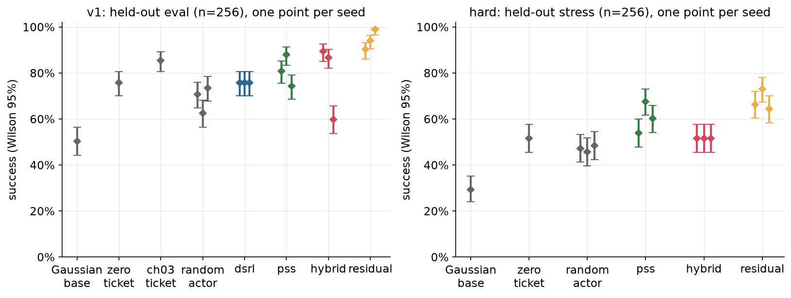
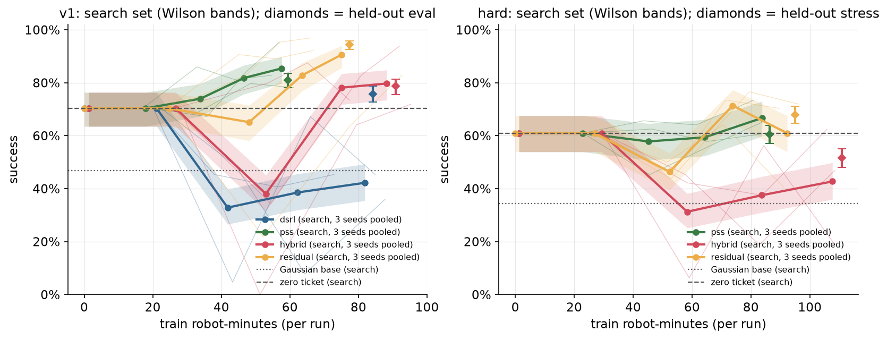
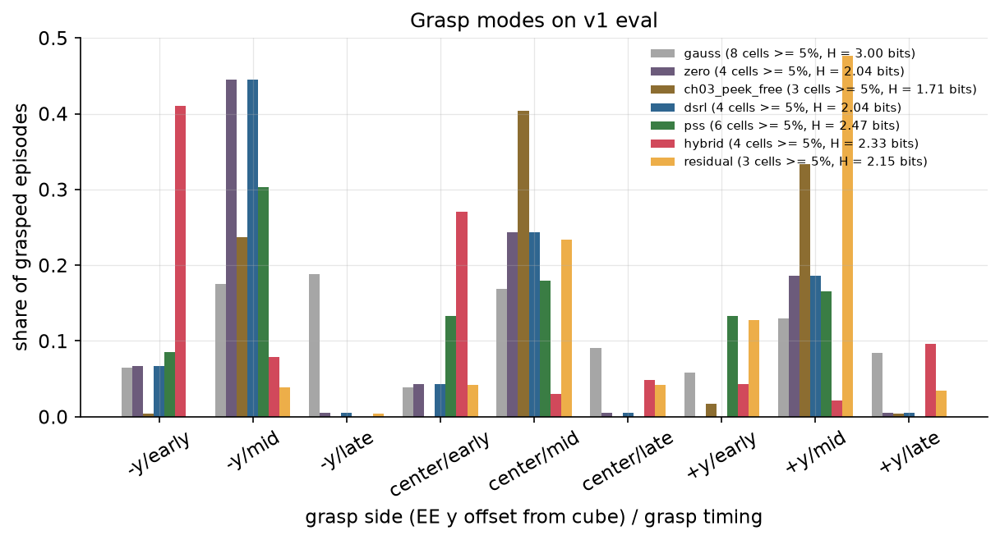
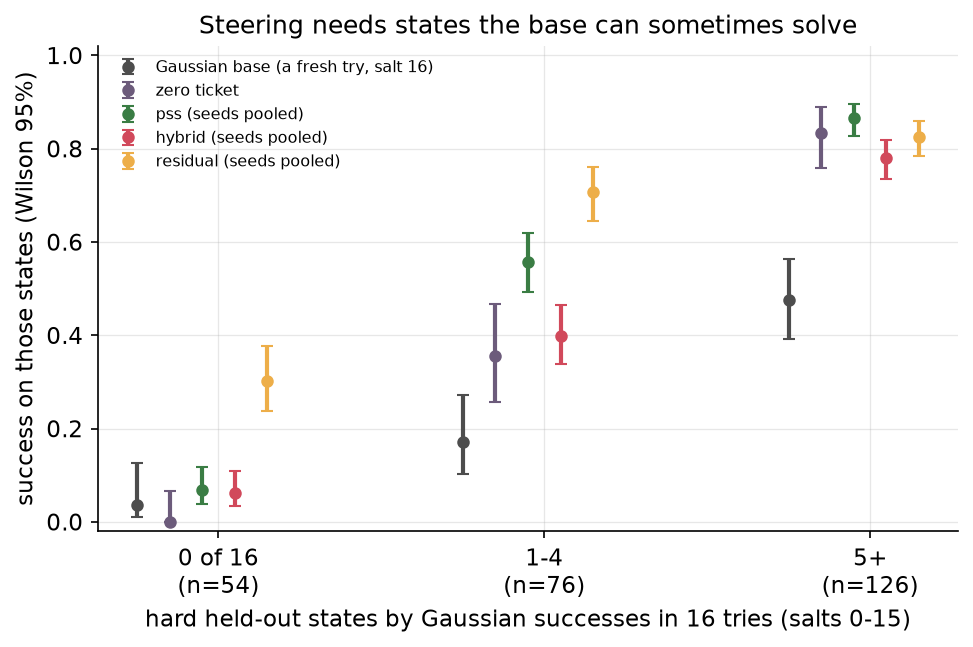
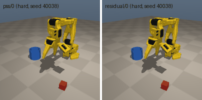
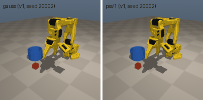

# Chapter 7: DSRL: RL in the noise space of a frozen flow policy

Chapter 3 fixed the base policy's 32-number noise input to one good vector, a *ticket*. This chapter lets a small network choose the noise at every chunk decision, from the current observation, and trains that network with reinforcement learning. The frozen `base_v1` still turns the noise into actions. Steering all 32 noise numbers did not work at our budget: every seed got worse than its starting point on the search set, so the selection rule kept the untrained actor, which is the zero ticket (75.8%). Steering only the 8 most influential noise directions (PSS) worked on one seed out of three: pooled **622/768 = 81.0% [78.1, 83.6]** on the held-out set, against 50.4% for the Gaussian base and 85.5% for Chapter 3's peek-free ticket. The arm that did best was not noise steering at all. A 4-number bounded residual added on top of the zero ticket reached **725/768 = 94.4% [92.5, 95.8]** pooled, and 253/256 = 98.8% [96.6, 99.6] on the seed with the best search score (62/64). On the hard variant, on start states the base never solved in 16 tries, steering solved 6.8% of episodes and the residual 30.2% (a 17th, fresh Gaussian try solved 3.7%). That is the support limit this chapter set out to show.

Code: [`algos/07_dsrl.py`](../../algos/07_dsrl.py). Results: [`results/ch07/`](../../results/ch07/). Media: [`media/ch07/`](../../media/ch07/).

```bash
uv run python algos/07_dsrl.py --quick   # smoke test: about 1 min, writes only to runs/ch07_quick/
uv run python algos/07_dsrl.py           # full run: 7 arms x 3 seeds, 19.5 min wall on an M5 Pro (4 workers, shared machine)
```

## The idea in plain words

`base_v1` (Chapter 0) is a flow-matching policy. Every 4 control steps it takes the observation and 32 random numbers and turns them into the next 8 actions. Chapter 3 showed that the random numbers matter a lot: the zero vector alone lifts success from 50% to 76%, and a searched ticket to about 86%. But a ticket is the same for every situation. If the cube sits on the left, the best noise might differ from the best noise when it sits on the right, or before and after the grasp.

DSRL ("diffusion steering with RL") makes the noise a function of the state: a small actor network reads the observation and outputs the noise, and the frozen base decodes it. From the RL algorithm's point of view, nothing about the robot changed except the action space. The "action" is now the 32-number noise, and the base policy has become part of the environment. Any RL algorithm can be run in this *latent-noise MDP*. We use SAC, as the DSRL paper does.

Two consequences, both measured below:

1. **Steering can only choose among behaviors the base already produces.** Whatever noise the actor picks, the base decodes it into one of its own chunks. That keeps exploration on the demonstrations' manifold, which is the selling point. It is also the ceiling: from a start state where no sequence of base chunks succeeds, no noise helps. A residual, which adds a small correction to the decoded actions, has no such ceiling.
2. **Choosing one noise per state can collapse the behavior.** The base mixes several ways of grasping (it was cloned from clean and sloppy demonstrations). A policy that always picks "the best" noise may keep only one of them. Behavioral Mode Discovery ([C304]) warns about this; we count grasp modes before and after.

## The math

The base is a deterministic map from observation `s` and noise `w ∈ R^32` to a chunk, `chunk = flow(s, w)` (10 Euler steps). The latent-noise MDP has state `s`, action `w`, and the transition "execute the first 4 actions of `flow(s, w)`". The reward is 1 on the step the cube lands in the cup, otherwise 0.

The actor is a tanh-Gaussian in a box, as in SAC:

```
w = c · tanh(u),   u ~ N(μ_φ(s), σ_φ(s)²),   c = 1.5        (the box [-1.5, 1.5]^32)
```

Its mean head is initialized to zero, so the untrained deterministic actor (`w = c · tanh(μ) = 0` everywhere) *is* Chapter 3's zero ticket, and its first exploration (`σ = 1`) is close to the Gaussian base. A ticket is the special case `μ_φ(s) = const`.

The critic is two Q-networks on `(s, w)` with LayerNorm. Its target is the Monte-Carlo return of the chunk decision, `G_t = γ^(T−t) · success` with `γ = 0.97` per decision, where `T` is the decision on which the episode succeeded. The actor maximizes the SAC objective with a fixed temperature `α = 0.003`:

```
critic:  min Σ_j (Q_j(s_t, w_t) − G_t)²
actor:   max E_{w ~ π_φ(·|s)} [ min_j Q_j(s, w) − α log π_φ(w | s) ]
```

The first 128 training episodes update only the critic. We switched from DSRL's recipe after it failed in pilots (see "What went wrong"), and the differences matter for how to read the results:

- **The critic target.** DSRL uses one-step TD with automatic temperature; we use the Monte-Carlo return and a fixed `α`. The replay buffer is never pruned, so a Monte-Carlo critic fit to all of it estimates the value of the *mixture* of the stochastic actors that collected the data (the warm-up's near-Gaussian exploration included), not the value of the current actor. The `Q` above is that mixture's value, and each actor step is a one-step improvement on it, not policy iteration on the current policy.
- **The update schedule.** DSRL updates its SAC online as transitions arrive. We train in batch rounds: 64 episodes with a frozen stochastic actor, then 0.5 gradient steps per new transition, then the next round.

So the `dsrl` arm below is "DSRL's latent-noise MDP and actor with this critic and schedule", not a reproduction of the paper's agent.

**Variants.**

- **PSS** ([C413]). Probe the frozen network: at 64 states visited by the base, measure by central finite differences how much each noise direction moves the decoded chunk, `J(s) = ∂ chunk / ∂ w` at `w = 0`. The top-`k` eigenvectors `V_k` of `M = mean_s J(s)ᵀ J(s)` are the principal steering subspace. The actor outputs `k = 8` numbers `z`, and `w = c · V_k z`. On `v1` the top 8 of 32 directions carry 50.5% of the total sensitivity (the top 16 carry 76.8%; [`pss_spectrum.png`](../../media/ch07/pss_spectrum.png)).
- **Residual** (the control). No steering: the noise stays at zero (the zero ticket), and the actor outputs 4 numbers `v`, added to every action of the chunk: `chunk = clip(flow(s, 0) + β · tanh(v))`, `β = 0.2` (4 mm of end-effector target per step at most, and ±0.2 on the gripper command).
- **Hybrid** ([C228], RFS). PSS steering and the residual together: `chunk = clip(flow(s, c · V_8 z) + β · tanh(v))`, 12 actor outputs. RFS steers the full noise; we use the PSS subspace because full steering failed (below), so hybrid vs PSS isolates what the residual adds.

All arms use the same SAC code, the same seeds and the same training start states, and they start from the same policy, the zero ticket.

## Papers it mirrors

- **[C120] DSRL: Steering Your Diffusion Policy with Latent Space Reinforcement Learning** (2025-06), https://arxiv.org/abs/2506.15799. RL over the input noise of a frozen diffusion or flow policy. The paper reports a real Franka task going from 2/10 to 9/10 after about 40 episodes, and a real pi0 "turn on toaster" task from 5/20 to 18/20 after 80 episodes. Our `dsrl` arm is its latent-noise MDP in the full 32-dim noise space, with a Monte-Carlo critic instead of its TD critic and batch rounds instead of online updates.
- **[C413] PSS: Principal Steering Subspaces for Online Adaptation of Frozen Generative Robot Policies** (2026-09), https://arxiv.org/abs/2609.33765. Finds the few noise directions that move the frozen policy's actions most (finite-difference probing at 64 states) and runs SAC only in that subspace. The paper reports Diffusion-Square final success 0.716 for full-latent DSRL vs 0.878 for PSS (one seed). Our `pss` arm. The direction of that result reproduced here, more strongly: full steering never improved.
- **[C228] RFS: Reinforcement Learning with Residual Flow Steering for Dexterous Manipulation** (2026-02), https://arxiv.org/abs/2602.01789. One PPO policy outputs both the starting noise and an additive residual, so it can switch modes and leave the demonstrations' manifold. The paper reports 0.861 vs base 0.250 and DSRL-only 0.483 on six IsaacLab tasks. Our `hybrid` arm (with SAC and the PSS subspace).
- **[C324] SCORE: Support-Constrained RL** (2026-06), https://arxiv.org/abs/2606.27475. Trains a steering policy in a digital twin that can only reweight actions the base produces, and transfers it with zero real RL (37.8 → 89.9 on 8 real tasks). It frames the base's support as the ceiling, which is our support-limit experiment.
- **[C304] BMD: Behavioral Mode Discovery for Fine-tuning Multimodal Generative Policies** (2026-05), https://arxiv.org/abs/2605.11387. Reports that DSRL keeps 2.00 of 24 behavior modes on an avoid task where DSRL[BMD] keeps 10.0. Our grasp-mode count.
- **[C236] Golden Ticket** (2026-03), https://arxiv.org/abs/2603.15757. The state-independent special case (Chapter 3). We compare with Chapter 3's chosen tickets on the same eval episodes.

## What the script does

1. **Baselines, fixed in advance**, on the held-out set (`eval`, 256 states, for `v1`; `stress`, 256 states, for `hard`, as DESIGN.md §3 prescribes): the Gaussian base (policy-seed salt 0, the paired base in every results file), the zero ticket, Chapter 3's headline ticket and its peek-free ticket (read from `results/ch03/`), and, on both variants, an untrained actor with random weights (a random state-dependent noise map in the same box, deterministic; honesty rule 4's random-selection control; the same three random actors on `eval` and on `stress`).
2. **Support groups for `hard`.** 16 Gaussian tries per `stress` state (salts 0-15). States are grouped by how many succeed: 0 of 16, 1-4, 5 or more. Because those 16 tries define the groups, the Gaussian column of the support table is a 17th, independent try (salt 16).
3. **PSS probe** (once per variant): 8 base episodes on training seeds (charged to `train`), then finite differences on the network, which need no robot time.
4. **Training.** Each arm × seed trains for 512 episodes on its own start states (env seeds `110000 + 10000·seed + i` for `v1`, `+50000` for `hard`; different arms with the same seed see the same start states). After the critic warm-up and then every 128 episodes, the deterministic actor is scored on the 64 `search` states (charged to `search`). Each run keeps the checkpoint with the best search score, ties going to the later checkpoint. That includes the untrained actor, so a run that never improves on search falls back to the zero ticket.
5. **Held-out evaluation**, once per run: the chosen checkpoint on all 256 held-out states, paired with the base (McNemar's exact test). The chosen actor (weights and steering basis) is saved to `runs/ch07_full/actors/<method>.npz` (git-ignored, 0.3 MB each), and `load_steer` in the script rebuilds the policy from it.
6. **Headline row** (`noise-steering-best`): the best of the 9 `v1` noise-steering runs (dsrl, pss, hybrid) by search score. It pays for the training and search rollouts of all 9, plus the pilot runs below. (It is named so that it is not read as full-noise DSRL: the pick is a PSS run.)

Every training rollout is charged to `train`, every checkpoint score to `search`. Evaluations of the base and of each run's pick go to `eval`. Human minutes are zero (sim).

**Pilot runs and what we looked at before the full run.** We chose the critic target, temperature, box and residual size in 14 pilot runs on seed 0, scored on the search set only. They are listed in "What went wrong" (per-run costs and curves in `runs/ch07_pilots/pilot_costs.jsonl`, with the driver scripts) and cost 735 search + 1,440 train robot-minutes, which are charged to every trained row (`v1` and `hard`) and to the headline row. Two things touched held-out states before the configuration was frozen, and we list them so the reader can judge. (a) Before writing the RL code, we scored the Gaussian base and the zero ticket on `eval` and `stress` and split `stress` by cube position. Those baselines are fixed in advance; nothing was tuned on them. (b) The `--quick` smoke tests (two while building the chapter, two after the review fixes, which changed only costs, controls and outputs) print scores of 64-episode policies on the first 32 `eval` and `stress` states. We did not use them for any choice.

## Results

All numbers come from [`results/ch07/`](../../results/ch07/), one full run (21 training runs, 19.5 min wall). Two earlier runs of the same training code, before the review fixes that added controls and changed cost accounting, reproduced every success number and search curve. Intervals are Wilson 95%. "Pooled" adds the three seeds' 768 held-out episodes. The pooled interval treats them as independent, which overstates precision because the same 256 states repeat.

### 1. `v1`: steering against the ticket

| Arm | Held-out per seed (k/256) | Held-out pooled | McNemar vs Gaussian base | vs zero ticket (p, per seed) | vs Chapter 3 peek-free ticket (p, per seed) | Robot-min per run, own rollouts (train + search) |
|---|---|---|---|---|---|---|
| Gaussian base (salt 0) | 129 = 50.4% [44.3, 56.5] | | | | | 0 |
| zero ticket `w = 0` | 194 = 75.8% [70.2, 80.6] | | p = 2.5e-10 | | | 0 |
| Chapter 3 tickets (searched in ch03) | headline 224 = 87.5% [82.9, 91.0]; peek-free 219 = 85.5% [80.7, 89.3] | | | | | 3,859 search (all of ch03's searches) |
| random actor, untrained | 181, 160, 188 | 529/768 = 68.9% [65.5, 72.1] | | 0.066, **worse 1.2e-5**, 0.41 | | 0 |
| **dsrl** (32 dims) | 194, 194, 194 | 582/768 = 75.8% [72.6, 78.7] | p = 2.5e-10 (each) | identical (fell back to the zero ticket) | worse, p = 0.0026 | 73-88 + 46-51 |
| **pss** (k = 8) | 207, 225, 190 | 622/768 = 81.0% [78.1, 83.6] | p ≤ 1.4e-8 | 0.15, **better 1.5e-4**, 0.72 | 0.16, 0.49, **worse 0.0015** | 55-61 + 32-35 |
| **hybrid** (pss + residual) | 229, 222, 153 | 604/768 = 78.6% [75.6, 81.4] | p ≤ 0.038 | **better 8.2e-5**, **better 0.0018**, **worse 2.8e-4** | 0.23, 0.79, **worse 5.8e-15** | 77-95 + 33-46 |
| **residual** (on the zero ticket) | 231, 241, 253 | **725/768 = 94.4% [92.5, 95.8]** | p ≤ 4.7e-24 | **better** 2.9e-5, 9.8e-10, 5.4e-17 | 0.13, **better 0.0013**, **better 5.4e-9** | 66-93 + 28-42 |

Per-seed Wilson intervals: pss 207 → 80.9% [75.6, 85.2], 225 → 87.9% [83.3, 91.3], 190 → 74.2% [68.5, 79.2]; hybrid 229 → 89.5% [85.1, 92.6], 222 → 86.7% [82.0, 90.3], 153 → 59.8% [53.7, 65.6]; residual 231 → 90.2% [86.0, 93.3], 241 → 94.1% [90.6, 96.4], 253 → 98.8% [96.6, 99.6]; random actor 181 → 70.7% [64.9, 75.9], 160 → 62.5% [56.4, 68.2], 188 → 73.4% [67.7, 78.5].

The last column is each run's own rollouts. Every trained row's results file (`v1` and `hard`) also carries the 14 pilots' 1,440 train + 735 search robot-minutes, because the pilots chose the recipe every run uses (the convention of Chapters 5 and 6). So the leaderboard charges, for example, `residual_s2` 1,506 train + 763 search robot-minutes, not 66 + 28.

- **Full 32-dim steering never beat its starting point.** After the actor started learning, the three seeds' search scores were 3, 43, 29 / 29, 26, 29 / 31, 5, 23 out of 64, all below the zero ticket's 45. The selection rule therefore kept the untrained checkpoint, and all three held-out results are the zero ticket's 194/256, episode for episode. DSRL in the full noise space bought nothing here, for 73-88 train and 46-51 search robot-minutes per seed.
- **PSS steering improved the zero ticket on one seed of three.** Seed 1 reached 225/256 (17 episodes lost, 48 gained against the zero ticket, p = 1.5e-4). Seeds 0 and 2 are indistinguishable from the zero ticket. Pooled, PSS is about 5 points above the zero ticket and 4.5 points below Chapter 3's peek-free ticket. A state-dependent noise policy did not beat the best fixed noise vector at this budget, though one seed matched it (225 vs 219, p = 0.49).
- **The headline row** picks among the 9 noise-steering runs by search score: `dsrl-pss8` seed 1 (61/64 on search), **225/256 = 87.9% [83.3, 91.3]** held-out (results file `noise-steering-best_so101_*.json`). It pays for all 9 runs and the pilots: 1,095 search + 2,123 train robot-minutes.
- **The residual was the strongest arm, and it is not noise steering.** All three seeds beat the zero ticket, and two beat Chapter 3's ticket. Seed 2's 253/256 is the first point estimate at 95%+ on `eval` in this chapter; the pooled number is just below it (94.4%).
- **The untrained random actor is worse than the zero ticket** (529/768 pooled vs 75.8%), but above the Gaussian base on all three seeds. Any fixed state-to-noise map in this box helps over fresh noise, because it stops re-rolling the noise; picking the map at random gives back part of the zero ticket's gain. The same three random actors on `hard` (below) show the same pattern.



*One diamond per seed with its 95% Wilson interval; baselines in gray (the random actor on both variants). Left: `v1` on `eval` (n = 256). Right: `hard` on `stress` (n = 256).*

### 2. Learning curves against robot-minutes



*Bold lines: search success pooled over 3 seeds (64 states each, so n = 192), with the Wilson band. Thin lines: single seeds. The first two points of every arm are the same policy, the zero ticket: the critic-only warm-up. Diamonds: held-out success of the chosen checkpoints, pooled. Dashed and dotted lines: the zero ticket and the Gaussian base on search.*

At the first checkpoint after the actor started learning (episode 256, 33-59 train robot-minutes), full steering, hybrid and residual dipped below the zero ticket on search, pooled over seeds: `v1` dsrl 135 → 63, hybrid 135 → 73 and residual 135 → 125 of 192 (the residual's dip is one seed, 45 → 14). PSS mostly did not: pooled it rose 135 → 142 (seed 0 went 45 → 55; seeds 1 and 2 fell by one or two episodes). On `hard`, PSS went 117 → 111 (seed 2 fell 39 → 29), while hybrid fell 117 → 60 and residual 117 → 89. The worst single seeds fell to 0/64 (hybrid seed 2), 3/64 (dsrl seed 0) and 5/64 (dsrl seed 2) on search. The pilot diagnostics point to the critic: right after the warm-up it rated full-dsrl's chosen noise 0.32-0.46 above random noise but PSS's only 0.10-0.12 (in discounted success probability; `runs/ch07_pilots/diag_output.txt`, git-ignored like the other chapters' pilot folders). The actor finds noise vectors that the critic overrates, the training rollouts then fail there, and the critic corrects itself, slowly. With 8 or 4 actor outputs there are fewer such directions to exploit than with 32. Steering in the subspace and the residual recovered; full steering did not. In the last 128 episodes on `v1`, the pooled residual curve gained the most (159 → 174), PSS gained 157 → 164 and hybrid 150 → 153; on `hard` the residual's pooled curve fell in that last segment (137 → 117), so all three residual-hard runs kept their episode-384 checkpoint.

### 3. Do the steered policies keep the base's behavior modes?

We describe each grasped episode by two things the clean and sloppy demonstrations differ in: the side of the cube the gripper closes on (end-effector y offset from the cube center below −4 mm, within ±4 mm, above +4 mm), and when it closes (step ≤ 12, 13-16, later). That gives 9 cells. We count the cells holding at least 5% of grasped episodes and the entropy of the distribution. Seed 0 of each arm, on `eval`:

| Policy | Cells ≥ 5% | Entropy (bits) | Grasp side −y / center / +y | Timing early / mid / late | Never grasped |
|---|---|---|---|---|---|
| Gaussian base | 8 | 3.00 | 43 / 30 / 27% | 16 / 47 / 36% | 102 |
| zero ticket (= dsrl) | 4 | 2.04 | 52 / 29 / 19% | 11 / 88 / 1% | 47 |
| Chapter 3 peek-free ticket | 3 | 1.71 | 24 / 40 / 35% | 2 / 98 / 0% | 16 |
| pss | 6 | 2.47 | 39 / 31 / 30% | 35 / 65 / 0% | 45 |
| hybrid | 4 | 2.33 | 49 / 35 / 16% | 72 / 13 / 14% | 27 |
| residual | 3 | 2.15 | **4** / 32 / 64% | 17 / 75 / 8% | 21 |

Seeds 1 and 2 (in each results file under `modes`): pss 5 and 6 cells, hybrid 7 and 3, residual 5 and 6.



- **The collapse BMD warns about happens when the noise is fixed, before any RL.** Against the stochastic Gaussian base, every deterministic policy has fewer modes. Fixing the noise (the zero ticket, Chapter 3's tickets) concentrates nearly all grasps in the "mid" timing cell (88-98%). Part of what disappears is the base's late, fumbling grasps (36% of its grasps are late), so "fewer modes" here is partly "fewer bad habits".
- **PSS steering did not narrow behavior further.** It started from the zero ticket's 4 cells and ended with 5-6 on all three seeds, with grasp sides more balanced than the zero ticket's.
- **The one-sided collapse came from the residual.** Residual seed 0 almost stopped grasping from the −y side (52% for the zero ticket, 4% after training), and seed 2 of the hybrid moved to 71% +y. A 4-number offset can shift every grasp the same way. The other two residual seeds did not (29% and 36% −y). So the mode question has a seed-dependent answer for the residual, and it is worth checking on hardware.

### 4. The support limit on the hard variant

The hard variant has a smaller cup (inner radius 3 cm instead of 4) and a cube region 1.5× wider in each direction, so many starts lie outside the region the demonstrations covered. The Gaussian base succeeds 75/256 = 29.3% [24.1, 35.1] on `stress`, the zero ticket 132/256 = 51.6% [45.5, 57.6], and the base's pass@16 is 202/256 = 78.9% [73.5, 83.5]: 54 states failed all 16 Gaussian tries.

| Arm (hard) | Held-out per seed (k/256) | Pooled | vs zero ticket (p, per seed) | Robot-min per run, own rollouts (train + search) |
|---|---|---|---|---|
| Gaussian base | 75 = 29.3% [24.1, 35.1] | | | |
| zero ticket | 132 = 51.6% [45.5, 57.6] | | | |
| random actor, untrained | 121, 117, 124 | 362/768 = 47.1% [43.6, 50.7] | 0.13, 0.072, 0.22 (all three below the zero ticket, none significantly) | 0 |
| pss | 138, 173, 154 | 465/768 = 60.5% [57.0, 63.9] | 0.43, **better 5.8e-9**, **better 0.0046** | 81-86 + 40-45 |
| hybrid | 132, 132, 132 | 396/768 = 51.6% [48.0, 55.1] | 1 (fell back), 1 (53 / 53 discordant), 1 (fell back) | 106-109 + 50-55 |
| residual | 170, 187, 165 | **522/768 = 68.0% [64.6, 71.2]** | **better** 3.3e-4, 1.1e-10, 4.5e-4 | 90-96 + 43-46 |

Per-seed Wilson intervals: pss 138 → 53.9% [47.8, 59.9], 173 → 67.6% [61.6, 73.0], 154 → 60.2% [54.1, 66.0]; residual 170 → 66.4% [60.4, 71.9], 187 → 73.0% [67.3, 78.1], 165 → 64.5% [58.4, 70.1]; hybrid 132 → 51.6% [45.5, 57.6]; random actor 121 → 47.3% [41.2, 53.4], 117 → 45.7% [39.7, 51.8], 124 → 48.4% [42.4, 54.5].

The random-selection control matters here: a random state-dependent noise map in the same box is above the Gaussian base on every seed (117-124 vs 75) and just below the zero ticket, as on `v1`. Trained PSS (two seeds) and the residual (all three) beat the zero ticket, so the gains beyond the zero ticket on `hard` come from training, not from fixing the noise to some map.

Split by how often the Gaussian base solved each state in 16 tries (salts 0-15; arms pooled over 3 seeds). The groups are defined by those 16 tries, so the Gaussian column is a 17th, independent try (salt 16), not one of them:

| States (Gaussian successes in 16 tries) | n | Gaussian base, fresh try (salt 16) | zero ticket | pss | hybrid | residual |
|---|---|---|---|---|---|---|
| 0 of 16 | 54 | 2/54 = 3.7% [1.0, 12.5] | 0/54 | 11/162 = 6.8% [3.8, 11.7] | 10/162 = 6.2% [3.4, 11.0] | **49/162 = 30.2% [23.7, 37.7]** |
| 1-4 | 76 | 13/76 = 17.1% [10.3, 27.1] | 27/76 = 35.5% [25.7, 46.7] | 127/228 = 55.7% [49.2, 62.0] | 91/228 = 39.9% [33.8, 46.4] | 161/228 = 70.6% [64.4, 76.1] |
| 5 or more | 126 | 60/126 = 47.6% [39.1, 56.3] | 105/126 = 83.3% [75.9, 88.8] | 327/378 = 86.5% [82.7, 89.6] | 295/378 = 78.0% [73.6, 81.9] | 312/378 = 82.5% [78.4, 86.0] |



- **Steering flatlines where the base has no support; the residual does not.** On the 54 states the base never solved in 16 tries, PSS steering succeeds in 6.8% of episodes and the residual in 30.2%. Where the base succeeds sometimes (1-4 of 16), steering helps a lot (17.1% for a fresh Gaussian try → 55.7%): it picks, chunk by chunk, the base's rare successful behaviors.
- **Steering's 6.8% is not zero, and it does not contradict the rule.** "0 of 16" is an estimate of the base's support, and Chapter 3 showed that states picked for failing every try include states where the base was unlucky. The fresh 17th Gaussian try confirms it: it solved 2 of the 54 states (3.7% [1.0, 12.5]), so their support is small, not zero, and steering's 6.8% [3.8, 11.7] cannot be told apart from the base's own rate there. Steering also re-picks the noise at every chunk, so it can combine good chunks from different base samples into one episode, which can beat any finite pass@k; one extra try cannot separate the two explanations. The residual's 30.2% [23.7, 37.7] is a different size of effect, from a policy that can produce actions the base never does.
- **Where the base is already good (5+ of 16), the residual is not the best arm** (82.5% vs PSS 86.5%). The gains of the residual on `hard` come from the states outside the base's support.
- **Hybrid failed on `hard`.** Two seeds never beat the zero ticket on search and fell back to it, and the third picked a checkpoint at 40/64 (vs 39/64 for the zero ticket) that scores exactly 132/256 on `stress`, with 53 episodes lost and 53 gained. See "What went wrong".



*Stress seed 40038, a start the Gaussian base failed in all 16 tries. Left: PSS seed 0 pushes the cube away and never grasps it. Right: the residual seed 0 drops it in the cup. The state is the first such start where the residual succeeds and PSS fails, picked for illustration only.*



*Eval seed 20002. Left: the Gaussian base fails. Right: the headline pick (`dsrl-pss8` seed 1) succeeds. The state is the first eval state where the base fails and the pick succeeds, picked for illustration only.*

### 5. Cost

The per-run rows below are each run's own rollouts. Each trained row's results file adds the pilots (1,440 train + 735 search) on top, the headline row adds them once.

| Row | Train robot-min | Search robot-min | Eval robot-min | Notes |
|---|---|---|---|---|
| one `dsrl` run | 73-88 | 46-51 | 67 | 512 training episodes; 5 search checkpoints |
| one `pss` run | 55-61 | 32-35 | 61-68 | includes 1.3 robot-min of probe rollouts |
| one `hybrid` run | 77-95 | 33-46 | 60-75 | |
| one `residual` run | 66-93 | 28-42 | 55-60 | |
| one `hard` run | 81-109 | 40-55 | 78-96 | failures run the full 15 s, so `hard` costs more |
| `noise-steering-best` headline row | 2,123 | 1,095 | 61 | 9 steering runs (683 + 360) plus pilots (1,440 + 735) |
| random actor (3 per variant) | 0 | 0 | 68-73 (`v1`), 90-92 (`hard`) | no training, no search |

A run's eval column includes the shared Gaussian-base evaluation (each results file carries it, so every file stands alone). One training run of 512 episodes is about 0.9-1.8 robot-hours, plus about 0.5-0.9 hours of search checkpoints. That is far beyond the curriculum's hardware budget for this chapter (40-80 episodes). Compute: 19.5 minutes wall for the whole run with 4 rollout workers and 2 torch threads, on a laptop shared with other experiments (the two earlier runs took 37.8 and 41.2 minutes under heavier load). The headline row's 0.51 CPU-hours cover the main process for the whole run plus the rollout workers of the baselines and the 9 steering runs; the other rows carry their own workers' CPU time.

## What went wrong

1. **Full-noise DSRL did not improve the base at all.** In three seeds out of three, every trained checkpoint was worse on search than the untrained one, and the reported result is the zero ticket (194/256). The pilot diagnostics (`runs/ch07_pilots/diag_output.txt`) show why. Right after the warm-up, the critic rated the actor's chosen noise 0.32-0.46 higher than random noise (in units of discounted success probability), while the rollouts with those noises succeeded less often than before. The actor had found directions where the critic extrapolates. With 32 output dimensions there are many such directions, and 512 episodes are not enough data to close them. Steering 8 directions (PSS) or adding 4 residual numbers was much better behaved with the same code.
2. **The published recipe failed in our pilots, and we changed it.** All pilots were on seed 0 and scored on the search set only; the numbers are search successes out of 64 at checkpoints every 128 episodes (the first two points are always the untrained actor, 45/64).

   | Pilot | Search curve | What happened |
   |---|---|---|
   | SAC, 1-step TD, automatic temperature, box ±1.5 (DSRL's recipe), 768 episodes | 45, 45, 2, 0, 16, 1, 2 | Q diverged to 25 (true values are in [0, 1]); the actor saturated at the box corners |
   | + TD target clipped to [0, 1], actor lr 1e-4 | 45, 45, 28, 3, 17, 1, 27 | Q stuck near 0.9 while rollouts succeeded 1/64 |
   | + smaller box ±0.6 | 45, 45, 15, 23, 54, 44, 29 | erratic |
   | Monte-Carlo critic, box ±1.5 | 45, 45, 17, 15, 33, 51, 12 | critic calibrated, actor still erratic |
   | + penalty toward the N(0, I) prior (weight 0.05), 768 and 384 episodes | 45, 45, 13, 24, 0, 38, 36 and 45, 45, 42, 34 | no better |
   | Monte-Carlo critic, fixed α = 0.003 (the final recipe), 512 episodes | 45, 45, 37, 39, 44 | stable but no gain |
   | PSS k = 8, same recipe | 45, 45, 57, 58, 58 | the first arm that climbed |
   | hybrid with full noise and a 32-number residual (one offset per action) | 45, 45, 19, 23, 14 | training rollouts fell to 0-2/64 |
   | residual with 32 numbers | 45, 45, 56, 38, 32 | rose, then fell |
   | residual with 4 numbers; hybrid = PSS + 4-number residual | 45, 45, 14, 41, 53; 45, 45, 22, 53, 60 | the final arms |
   | hard: PSS; residual | 39, 39, 40, 37, 39; 39, 39, 32, 41, 26 | |

   The pilots cost 735 search + 1,440 train robot-minutes (`runs/ch07_pilots/pilot_costs.jsonl`; git-ignored, like `runs/ch05_pilots` and `runs/ch06_pilot`), charged to every trained row and to the headline row, since they chose the recipe all of them use. Five of them ran with a diagnostic hook that drew extra random numbers from torch, so the full run's seed 0 does not repeat their curves (for example, full-noise DSRL seed 0 went 45, 45, 3, 43, 29 in the full run). The full run itself is deterministic: rerunning it reproduced the same per-run numbers. `--n-step 1 --tune-alpha --alpha 1e-4 --train-episodes 768` runs the second pilot's recipe (one-step TD with the clipped target). The prior penalty is not in the final code.
3. **Hybrid seed 2 made the policy significantly worse than doing nothing**: 153/256 = 59.8% [53.7, 65.6] against the zero ticket's 194 (82 episodes lost, 41 gained, p = 2.8e-4), and far below Chapter 3's ticket. Its search curve went 45, 45, 0, 41, 46: the selection rule took the last checkpoint because 46/64 beat the untrained actor's 45/64 by one episode. A one-episode margin on 64 states is noise, and the held-out set shows that this checkpoint was much worse. A rule that keeps the untrained actor unless a checkpoint wins by a clear margin (or a paired test on the search states) would have avoided it. We did not change the rule after seeing this.
4. **The seed spread is large.** PSS went 190-225 and hybrid 153-229 over three seeds of the same configuration. A single seed would have made either arm look like it matches Chapter 3, or like it fails. Even three seeds give a coarse picture.
5. **Full steering, hybrid and residual got worse right after the actor started learning** (the dip in the learning curves; PSS mostly did not). On a real robot that dip is real episodes of a worse policy. A slower actor, more critic updates per episode or a longer warm-up might shrink it; we did not test them.
6. **The residual was the best method of a chapter about noise steering.** We set it up as a control, and it beat every steering arm on both variants. On `v1` this is also a statement about the base: 102 of `base_v1`'s 127 eval failures are missed grasps (Chapter 0), and a 4-dim offset per chunk can move the gripper directly, without finding the right noise first. Chapter 6 trains residuals properly (TD3, larger budgets); our residual uses this chapter's SAC code and settings.
7. **We looked at `stress` by cube position before writing the RL code.** Before writing the RL code, we looked at which `stress` starts the base fails on (mostly cubes beyond the far x edge of the demonstration region: 43 states, base mean success 0.7% per try). The support grouping in the script uses the base's own pass@16 instead, which needs no position rule, and no policy was chosen with that exploration. It was still a look at held-out states, so we report it.

## The hardware step (SO-101)

From the curriculum: DSRL on the real `base_v1`, 40-80 episodes (about 20-40 minutes), and report whether the policy lost a grasp mode.

What the simulation says about it:

- **With this recipe, do not steer all 32 noise dimensions.** At about 500 episodes per run, full steering with our Monte-Carlo critic and batch rounds never beat its untrained start in sim (DSRL's own TD recipe diverged in our pilots, so we have no working full-noise baseline to compare). 40-80 real episodes is ten times less data. Steer a PSS subspace (probe the frozen network at states from real base rollouts; the probe needs no robot time) and start the actor at zero, so that the starting point is the zero ticket, which is Chapter 3's cheapest real improvement.
- **Run the residual as well.** In sim the 4-number residual was the best arm on both variants. A bounded residual on a real SO-101 must go through the same clipping and rate limits as the policy's own actions.
- **Expect a dip** after the actor starts learning, and keep the untrained actor unless a checkpoint beats it clearly on the 10 `R_search` spots (see what went wrong 3: a checkpoint that won by a one-episode margin on search was much worse in sim).
- **Count modes.** Log the side of the cube the gripper closes on and the grasp step, before and after, on the same `R_eval` spots. In sim the steering did not narrow behavior, but one residual seed almost stopped grasping from one side.
- Score the chosen policy and the unsteered base once on the 30 `R_eval` spots, report k/30 with Wilson intervals (27/30 is [74.4, 96.5]), compare them with McNemar's test paired by spot, and count every training and selection episode in robot-minutes.

## Reproduce

```bash
uv run python algos/07_dsrl.py --quick            # under 1 min; results, media and actors go to runs/ch07_quick/
uv run python algos/07_dsrl.py                    # 19.5 min; writes results/ch07/ (28 JSONs), media/ch07/, runs/ch07_full/actors/
uv run python algos/07_dsrl.py --subspace 8       # one arm: PSS with k = 8 (on --variant v1 by default); writes only to runs/ch07_arm/
uv run python algos/07_dsrl.py --residual-only --variant hard                          # one arm, also to runs/ch07_arm/
uv run python algos/07_dsrl.py --replot results/ch07/noise-steering-best_so101_<stamp>.json   # redraw the plots
```

Useful switches: `--seeds`, `--arms`, `--hard-arms`, `--pss-k`, `--noise-scale`, `--res-scale`, `--train-episodes`, `--n-step`, `--tune-alpha`, `--no-pilot-costs`, `--no-media`. The headline JSON (`noise-steering-best_so101_*.json`) holds the whole analysis under `extra.analysis` (baselines, every run's curve and paired tests, modes, support groups, PSS spectra). Each run's file holds its search curve, its per-episode held-out outcomes (`eval_successes`), its paired tests, its own cost (`extra.robot_minutes`, before pilots), the pilot charge (`extra.pilot_robot_minutes`) and the path of its saved actor (`extra.actor_file`). One-arm runs never write to `results/` or `media/`, so they cannot add duplicate rows to the leaderboard.

[C120]: https://arxiv.org/abs/2506.15799
[C228]: https://arxiv.org/abs/2602.01789
[C236]: https://arxiv.org/abs/2603.15757
[C304]: https://arxiv.org/abs/2605.11387
[C324]: https://arxiv.org/abs/2606.27475
[C413]: https://arxiv.org/abs/2609.33765
