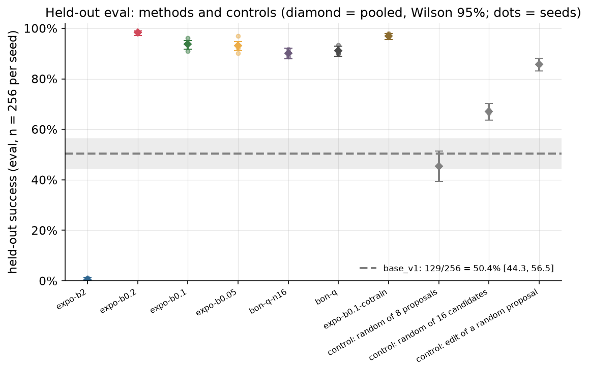
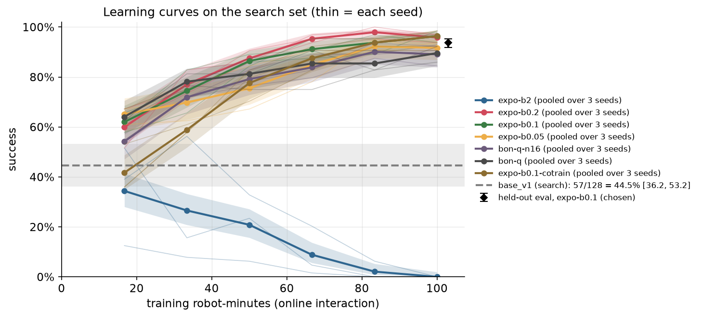
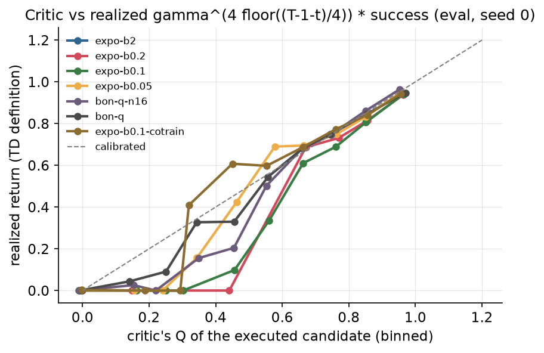
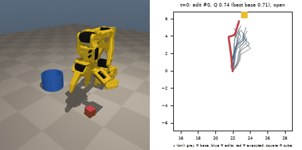

# Chapter 8: Propose, edit, select

This chapter trains two small networks around `base_v1` and leaves the base's weights alone (except in one ablation). The frozen base proposes chunks, a small editor nudges each proposal by at most β per action, and a learned Q ensemble picks which candidate the robot executes. Only the editor and the critic learn, from the robot's own online experience. This is the recipe behind EXPO-FT's real-robot fine-tuning, shrunk to a 0.23M-parameter flow policy (227,616 weights) on a laptop.

Code: [`algos/08_expo_edit.py`](../../algos/08_expo_edit.py). Results: [`results/ch08/`](../../results/ch08/). Media: [`media/ch08/`](../../media/ch08/).

```bash
uv run python algos/08_expo_edit.py --quick   # smoke test: about 55 s, writes only to runs/ch08_quick/
uv run python algos/08_expo_edit.py           # full run: 50.8 min wall on an M5 Pro (4 processes, shared machine)
```

## The idea in plain words

Chapter 12 showed that `base_v1` already contains good chunks: sample 32 of them at every decision, let a verifier pick one, and success goes from 50% to about 94%. Its verifier needed about 4000 labeled episodes, and it could only pick among what the base proposed.

This chapter changes two things:

1. **The critic learns online, by temporal differences.** The robot acts with the current critic, every chunk it executes goes into a replay buffer, and the critic is trained to predict "the discounted chance of success if I execute this chunk here, and then keep choosing the way I choose now". It bootstraps from its own estimate at the next decision instead of waiting for the episode's outcome (Chapter 12's Monte-Carlo labels).
2. **A small editor may move each proposal a little.** For each of the N = 8 base proposals, the editor outputs a correction bounded by β per action (`β · tanh(·)`), learned to raise Q. The robot picks among 2N candidates: the 8 originals and their 8 edits. When a proposal is almost right (the gripper closes 5 mm beside the cube), the edit can fix it; when a proposal is right already, the original stays available.

No gradient flows into the base: it is a proposal distribution, like a pretrained VLA that is too big or too slow to fine-tune. β sets how far the executed behavior may leave what the base proposes. With β = 0 there is no editor, and the method is best-of-N with a TD-learned critic. With β = 2 the editor can output any action, which is close in spirit to MiDAS's full-chunk editor.

Selection with small edits can only reach behavior near what the base already proposes. With β = 0 the ceiling is the base's support (the share of start states from which some sequence of base chunks succeeds); a β-bounded edit widens that support by β per action, no more.

## The math

States are the 21-dim observation at a chunk decision. The critic's action is the part of the chunk that is executed: 4 steps × [dx, dy, dz, grip] = 16 numbers. A transition is one decision: `(s, a, r, s')` where `r` is 1 if the episode succeeded during those 4 steps and `k ≤ 4` steps were executed.

**Candidates.** At state `s`:

```
a_j  = first 4 actions of base(s, w_j),   w_j ~ N(0, I),  j = 1..N            (proposals)
ã_j  = clip(a_j + β tanh(u_j), -1, 1),    u_j ~ N(μ_φ(s, a_j), σ_φ(s, a_j))     (edits)
C(s) = {a_1..a_N, ã_1..ã_N}
```

**Acting** (the policy the critic evaluates): `a* = argmax_{a ∈ C(s)} Q̄(s, a)`, where `Q̄` is the mean over an ensemble of E = 5 critics. At evaluation the edit is deterministic (`u = μ_φ`).

**Critic** (REDQ + EMaQ, with the same argmax in the target):

```
a'* = argmax_{a ∈ C(s')} Q̄(s', a)                                    (the acting rule, at s')
y   = r + (1 − done) · γ^k · min_{i ∈ M} Q'_i(s', a'*),   M = 2 random target critics,  γ = 0.99 per step
L_Q = Σ_i E[(Q_i(s, a) − y)²]
```

Selecting with the online ensemble mean and valuing with the minimum of a random pair of slow-moving target critics decouples selection from evaluation, the usual guard against overestimation. The candidate proposals at `s'` are the ones the base actually made at the next decision, stored in replay (EMaQ's "max over N behavior samples"). A timeout counts as terminal: the observation contains the time, so the true value after the last step is 0.

**Editor** (SAC-style, with automatic entropy tuning):

```
L_φ = E_{s, a_j ~ replay, u ~ π_φ}[ α log π_φ(u | s, a_j) − Q̄(s, clip(a_j + β tanh u)) ]
L_α = −E[ log α · (log π_φ(u | s, a_j) + H_target) ],   H_target = −16
```

The editor's mean is zero-initialized, so at the start it proposes no edit, and the 2N candidates are the N proposals plus N noisy copies.

**Co-training** (success-filtered BC co-training, a deviation from EXPO): the base also takes one flow-matching gradient step per round of decisions, but only on the chunks of successful online episodes (`obs_t → actions[t:t+8]`, learning rate 1e-4). That is filtered behavior cloning, the idea of Chapter 9. EXPO itself trains the base with its imitation loss on ordinary replay mini-batches, which include failed episodes. The stored next-state proposals in replay are re-sampled from the updated base every 100 rounds.

## Papers it mirrors

| Paper | What we take from it |
|---|---|
| **EXPO** ([arXiv 2507.07986](https://arxiv.org/abs/2507.07986), Dong et al. 2025; its code is in [data/resources.csv](../../data/resources.csv), the paper itself is not yet in data/papers.csv) | The algorithm: an expressive base policy trained with BC, a light Gaussian edit policy trained to maximize Q, and "on-the-fly" selection of the best of base and edited actions, used both to act and in the TD target. |
| **EXPO-FT** ([C276](https://arxiv.org/abs/2605.25477)), *Sample-Efficient Reinforcement Learning Finetuning for Vision-Language-Action Models* (2026-05) | The real-robot recipe we copy most directly: sample 8 chunks from π0.5, add a tanh-bounded learned edit to each, execute the argmax-Q of the 16 candidates; no RL gradient enters the VLA. Real, 8 tasks: SFT 20.5/30 → 30/30 each, with 19.1 minutes of online data on average. 30/30 is consistent with a true rate as low as 88.6% (Wilson). |
| **Real-Time EXPO-FT** ([C412](https://arxiv.org/abs/2609.18207)) (2026-09) | The slow model proposes 32 chunks from a stale observation, a fast policy edits them from the fresh one, a Q ensemble picks. Real, 4 dynamic tasks, 10 minutes of online data: 12.5/30 → 29/30. Its point is latency, which we measure below. |
| **DICE-RL** ([C235](https://arxiv.org/abs/2603.10263)) (2026-03) | A small residual on a frozen BC sampler, conditioned on the same noise, and the best-Q sample is executed. Real UR5 belt assembly, 56.67% → 93.33% after about 420 episodes. |
| **MiDAS** ([C402](https://arxiv.org/abs/2608.11363)) (2026-08) | An edit actor that outputs the full executed chunk, so it can leave the base's support. Our β = 2 run is the stand-in (a residual that can reach any action), and it is where this chapter fails. |
| **FASTER** ([C263](https://arxiv.org/abs/2604.19730)) (2026-04) | Score noise seeds before denoising them, to cut EXPO's inference cost (37.55 → 4.70 TFLOPs per decision on π0.5). Not implemented; our latency table shows where the time goes for a small policy. |
| **RL Token** ([C264](https://arxiv.org/abs/2604.23073)) (2026-04) | A tiny TD3-style actor-critic edits the frozen VLA's own sampled chunk under an L2 penalty. The same "edit, don't retrain" idea with a soft bound instead of a hard one. |
| **EMaQ** ([N436](https://arxiv.org/abs/2007.11091)), REDQ ([arXiv 2101.05982](https://arxiv.org/abs/2101.05982), not in the list), **RLPD** ([C037](https://arxiv.org/abs/2302.02948)), **Q-chunking** ([C133](https://arxiv.org/abs/2507.07969)) | The pieces: the max over N behavior samples in the backup (EMaQ), an ensemble with a min over a random subset (REDQ), LayerNorm critics (RLPD), and a critic whose action is the executed chunk, with a k-step discount (Q-chunking). |

## What the script does

Everything is chosen on the `search` set (64 start states, seeds 10 000-10 063). The held-out `eval` set (256 states) is scored once per run at the end, with the same env and policy seeds as the base (salt 0), so every comparison with `base_v1` is paired.

1. **Online training, one process per run.** 16 simulated arms step in lockstep. At every round each arm makes one chunk decision (8 proposals from the frozen base, 8 stochastic edits, argmax of the critic ensemble's mean), executes the 4 actions, and the decision goes into replay. After the first 1000 transitions, every round is followed by 16 gradient steps (critic, editor, entropy weight; batch 256, Adam 3e-4, Polyak 0.005), about one gradient step per stored chunk. Training episodes use their own env seeds (200 000 + 100 000·seed + i) and are charged to `train`. Each run has 60 000 env steps of interaction: **100 robot-minutes**.
2. **Learning curves.** Six times per run, the current policy (deterministic edits, exactly the deployable policy) is scored on all 64 search states; at the end, on two policy salts of them (128 episodes). These are charged to `search`.
3. **The β sweep, frozen base:** β ∈ {0, 0.05, 0.1, 0.2, 2}, 3 seeds each, 15 runs, 4 at a time. Alongside it, a control that is not a β candidate: **β = 0 trained with N = 16 proposals** (`bon-q-n16`), so that best-of-N without edits scores as many candidates as the edited settings do.
4. **Choose β on search:** the best pooled final search score over the 3 seeds (the smaller β on ties). Every row of the chosen β pays for the whole sweep: 15 runs' interaction and search rollouts. Each results file says what it is in `extra["role"]` (`chosen`, `ablation`, `cotrained-ablation` or `control`) and `extra["selected_on_search"]`.
5. **Co-trained base at the chosen β:** 3 more runs in which the base also fine-tunes on successful episodes. They are built on the sweep's choice, so they pay for the sweep too.
6. **Held-out eval** of every run, and four controls that split the gain between the editor and the selection, all paired with the base: the unsteered base; a random pick among the 8 base proposals (the base distribution again; honesty rule 4); a uniform random pick among all 16 candidates (8 proposals and their 8 edits); and the deterministic edit of a random proposal with no critic pick (the editor alone). The last two use the 3 chosen-β checkpoints. All control episodes are charged to the `random-pick-8` results file.
7. **Diagnostics:** how often the executed candidate is an edited one, how the critic's Q of the executed candidate compares with the return it is trained toward (calibration), failure labels from `OutcomeTracker`, 16 base rollouts on every eval state the chosen policy (seed 0) fails (does the base ever solve it?), and the latency of one decision for N ∈ {1, 2, 4, 8, 16, 32}.

The deployable policy is a `BatchPolicy` written in numpy (`ExpoPolicy`). The base proposals come from env `i`'s own generator, so every episode is identical whatever batch or worker it runs in. At the first decision, proposal 0 uses the same noise as the base's own first chunk. After that the two random streams differ, because this policy draws N noise vectors per decision and the base draws one. Training uses batched torch for speed.

## Results

All numbers come from one full run, `results/ch08/*_20261001-00263[34].json` (50.8 minutes wall on an M5 Pro shared with other experiments; 4 training processes with one torch thread each). This is the third full run of the chapter; the two earlier ones are described under What went wrong #9. All 18 training runs that the earlier runs also had gave identical learning curves, search scores and eval scores here. Intervals are Wilson 95%. "Pooled" adds the three seeds' episodes; the pooled interval treats them as independent, but they share the same 256 start states, so read it as conditional on those states.

### 1. The held-out evaluation

Every run was scored once on the 256 `eval` states with the same env and policy seeds as the base, so each comparison with `base_v1` is paired (McNemar's exact test on the episodes where exactly one of the two succeeded).

| policy (eval, n = 256 per seed) | seed 0 | seed 1 | seed 2 | pooled (k/768) | search, pooled (k/384) |
|---|---|---|---|---|---|
| base_v1 | 129/256 = 50.4% [44.3, 56.5] | | | | 57/128 = 44.5% [36.2, 53.2] |
| β = 0: best-of-8 with the TD critic | 239 = 93.4% [89.6, 95.8] | 231 = 90.2% [86.0, 93.3] | 230 = 89.8% [85.5, 93.0] | 700 = 91.1% [88.9, 93.0] | 342 = 89.1% [85.5, 91.8] |
| β = 0, N = 16 (control: as many candidates as β > 0) | 231 = 90.2% [86.0, 93.3] | 227 = 88.7% [84.2, 92.0] | 235 = 91.8% [87.8, 94.6] | 693 = 90.2% [87.9, 92.1] | 342 = 89.1% [85.5, 91.8] |
| β = 0.05 | 248 = 96.9% [94.0, 98.4] | 231 = 90.2% [86.0, 93.3] | 236 = 92.2% [88.2, 94.9] | 715 = 93.1% [91.1, 94.7] | 356 = 92.7% [89.7, 94.9] |
| **β = 0.1 (chosen on search)** | **233 = 91.0% [86.9, 93.9]** | **246 = 96.1% [93.0, 97.9]** | **241 = 94.1% [90.6, 96.4]** | **720 = 93.8% [91.8, 95.3]** | **370 = 96.4% [94.0, 97.8]** |
| β = 0.2 | 251 = 98.0% [95.5, 99.2] | 252 = 98.4% [96.1, 99.4] | 252 = 98.4% [96.1, 99.4] | 755 = 98.3% [97.1, 99.0] | 368 = 95.8% [93.3, 97.4] |
| β = 2 (unbounded editor) | 0 = 0.0% [0.0, 1.5] | 3 = 1.2% [0.4, 3.4] | 0 = 0.0% [0.0, 1.5] | 3 = 0.4% [0.1, 1.1] | 0 = 0.0% [0.0, 1.0] |
| β = 0.1, co-trained base | 247 = 96.5% [93.5, 98.1] | 251 = 98.0% [95.5, 99.2] | 247 = 96.5% [93.5, 98.1] | 745 = 97.0% [95.5, 98.0] | 368 = 95.8% [93.3, 97.4] |

Controls on the chosen β = 0.1 checkpoints (same eval episodes):

| control (eval, n = 256 per seed) | seed 0 | seed 1 | seed 2 | pooled (k/768) |
|---|---|---|---|---|
| random pick of the 8 base proposals | 116 = 45.3% [39.3, 51.4] | | | |
| random pick of all 16 candidates | 172 = 67.2% [61.2, 72.6] | 170 = 66.4% [60.4, 71.9] | 173 = 67.6% [61.6, 73.0] | 515 = 67.1% [63.7, 70.3] |
| edit of a random proposal, no critic pick | 220 = 85.9% [81.1, 89.7] | 219 = 85.5% [80.7, 89.3] | 220 = 85.9% [81.1, 89.7] | 659 = 85.8% [83.2, 88.1] |

Paired with the base, episode by episode (base failed and method succeeded / base succeeded and method failed), and McNemar's p:

| run | seed 0 | seed 1 | seed 2 |
|---|---|---|---|
| β = 0 | 116 / 6, p = 1.6e-27 | 113 / 11, p = 1.8e-22 | 113 / 12, p = 9.2e-22 |
| β = 0, N = 16 | 114 / 12, p = 5.1e-22 | 112 / 14, p = 3.7e-20 | 116 / 10, p = 4.9e-24 |
| β = 0.05 | 123 / 4, p = 1.3e-31 | 113 / 11, p = 1.8e-22 | 114 / 7, p = 5.1e-26 |
| **β = 0.1** | **111 / 7, p = 3.4e-25** | **123 / 6, p = 1.8e-29** | **120 / 8, p = 9.0e-27** |
| β = 0.2 | 124 / 2, p = 1.9e-34 | 126 / 3, p = 1.1e-33 | 126 / 3, p = 1.1e-33 |
| β = 2 | 0 / 129, p = 2.9e-39 | 2 / 128, p = 1.3e-35 | 0 / 129, p = 2.9e-39 |
| β = 0.1, co-trained | 122 / 4, p = 2.4e-31 | 123 / 1, p = 1.2e-35 | 124 / 6, p = 9.2e-30 |

**Where the gain comes from.** The controls split the β = 0.1 result into its two parts:

- *Drawing proposals does nothing by itself.* A random pick among the 8 base proposals scores 116/256 against the base's 129/256 (McNemar p = 0.26): it is the base distribution again.
- *The editor alone does most of the work.* Executing the deterministic edit of a random proposal, with no critic pick at all, scores 659/768 = 85.8% pooled, from 50.4% (p < 1e-16 vs the base on every seed). A uniform random pick among the 16 candidates, half of them edits, lands in between (67.1%), as it should.
- *The critic's pick adds the rest.* The full method (pick the best of the 16 under the critic) scores 93.8%, 8 points above the editor alone. Per seed the paired difference is clear on seeds 1 and 2 (p = 1e-4 and 0.002) and not on seed 0 (233 vs 220, p = 0.07).
- *Scoring more unedited candidates does not help.* β = 0 trained with N = 16 scores 90.2% pooled, against 91.1% with N = 8, and both are 89.1% on search. So the gap between best-of-8 and the edited settings is not explained by β > 0 having twice as many candidates.

The two parts are partial substitutes: a critic picking among unedited proposals (β = 0) gets to 91.1%, and the editor without a pick gets to 85.8%. Each alone captures most of the gain; together they add a few points.

**The headline, by the rule fixed before the run (best pooled search score), is β = 0.1: 720/768 = 93.8% [91.8, 95.3] on held-out eval, from 50.4%. Each run costs 100 robot-minutes of online interaction plus 39-50 robot-minutes of search-set scoring, and the β sweep that chose it costs 15 times that (see Cost).** One of its three seeds passes 95% (96.1%); the pooled result does not. β = 0.2 scored 98.3% pooled on eval with every seed at 98.0% or above, but it lost the search comparison by 2 episodes out of 384 (368 vs 370). Quoting 98.3% as the result would be choosing on the eval set (see What went wrong #2).



Failure modes on eval (`OutcomeTracker`), base vs β = 0.1 seed 0:

| | success | missed_grasp | slip | rim_hit | off_target |
|---|---|---|---|---|---|
| base_v1 | 129 | 102 | 18 | 4 | 3 |
| β = 0.1, seed 0 | 233 | 22 | 1 | 0 | 0 |

As in Chapter 12, almost all of the gain is grasps. The chosen policy fails 23 episodes: 22 missed grasps and 1 slip.

### 2. Learning curves: success vs robot-minutes



Search set, all 64 states, policy salt 0, the deterministic (deployable) policy, pooled over 3 seeds (k/192):

| training robot-minutes | 16.7 | 33.4 | 50 | 66.7 | 83.4 | 100 |
|---|---|---|---|---|---|---|
| β = 0 | 64.1% | 78.1% | 81.2% | 85.4% | 85.4% | 89.6% [84.5, 93.2] |
| β = 0, N = 16 | 54.2% | 71.9% | 79.2% | 83.9% | 90.1% | 89.1% [83.9, 92.7] |
| β = 0.05 | 65.1% | 69.8% | 75.5% | 84.9% | 92.2% | 91.7% [86.9, 94.8] |
| β = 0.1 | 62.0% | 74.5% | 86.5% | 91.1% | 93.8% | 96.4% [92.7, 98.2] |
| β = 0.2 | 59.9% | 77.1% | 87.5% | 95.3% | 97.9% | 95.8% [92.0, 97.9] |
| β = 2 | 34.4% | 26.6% | 20.8% | 8.9% | 2.1% | 0.0% [0.0, 2.0] |
| β = 0.1, co-trained | 41.7% | 58.9% | 77.6% | 87.5% | 93.8% | 96.4% [92.7, 98.2] |

The base scores 57/128 = 44.5% [36.2, 53.2] on the same search states (the gray band). Every bounded setting on the frozen base is above it from the first checkpoint on; the co-trained one starts below it (What went wrong #5). β = 0 and β = 0.1 were still rising at 100 robot-minutes, while β = 0.05 and β = 0.2 dipped slightly over the last 17. Best-of-8 without edits (β = 0) is the best setting at 33 robot-minutes (78.1%), then flattens around 85-90% while the edited settings climb past it. During training the robot explores with stochastic edits, and those episodes succeed less often: in the last tenth of training, 276/301 (β = 0.1) and 296/307 (β = 0.2) training episodes succeeded, against 0/120 for β = 2 in every tenth of its training.

How often the executed candidate is an edited one, for the bounded settings (β = 0.05, 0.1, 0.2): about half at the start of training (the critic is untrained, and half of the 16 candidates are edits), rising to 72-95% by the end. With deterministic edits on eval, an edited candidate was executed at 97-100% of decisions in every bounded run. The editor is not making rare corrections; it moves almost every chunk, by about half of its bound on average (mean |Δ| per action number at the end of training: 0.025, 0.052, 0.101 for β = 0.05, 0.1, 0.2, including exploration noise). The unbounded β = 2 runs are different: their edited share fell from 87-88% at the start to 40-69% at the end of training, and on eval it was 79-95%.

### 3. Does the critic believe its own picks?



For every decision of the seed-0 eval episodes, the critic's Q of the executed candidate is compared with the return it is trained toward. The TD target counts the reward undiscounted inside a chunk and discounts by γ⁴ at each chunk boundary, so a decision at step `t` of an episode that succeeds at its last step `T − 1` is worth `γ^(4·⌊(T−1−t)/4⌋)`, and 0 if the episode fails. For β = 0.1, decisions the critic scored 0.97 on average realized 0.94, those scored 0.85 realized 0.81, and those scored 0.76 realized 0.69 (mean over all decisions: 0.625 predicted, 0.596 realized). So the critic overestimates its picks by about 2-7 points, more in the middle of the range than at the top. β = 0, β = 0.05 and the co-trained run are closer still (mean predicted vs realized: 0.663 vs 0.654, 0.761 vs 0.752, 0.747 vs 0.743); β = 0.2 overestimates by about 3 points (0.827 vs 0.796). Some gap is what an argmax over noisy estimates predicts, since the winner is more often a candidate the critic overrates; the pessimistic target (the minimum over a random pair of target critics) keeps it small. One caveat: the critic is trained on the policy that explores with stochastic edits, while eval runs deterministic edits, so this compares the critic with a slightly different policy from the one it values. For β = 2 the critic predicts about 0 everywhere and is right (see What went wrong #1).

### 4. The proposal fan



Eval seed 20000, the first eval state where the base failed and β = 0.1 (seed 0) succeeded, replayed step by step. Right panel, seen from above and zoomed on the end effector: the commanded paths of the 8 base proposals (gray), their 8 edits (blue) and the executed candidate (red), with the critic's Q of the pick and of the best unedited proposal. The edits are small (at most 2 mm per step at β = 0.1), so the fan shows how a slightly better aimed version of a proposal wins the argmax.

### 5. Latency vs N

One chunk decision for one env (sample N proposals, edit them, score 2N candidates with 5 critics), numpy on one CPU core, β = 0.1 seed 0 weights, measured at the end of the full run (the two earlier runs measured 2.48 ms and, on a busier machine, 5.27 ms at N = 8):

| N proposals | 1 | 2 | 4 | 8 | 16 | 32 |
|---|---|---|---|---|---|---|
| ms per decision | 0.40 | 0.71 | 1.34 | 2.54 | 4.79 | 10.80 |

Time grows about linearly with N (roughly 0.3 ms per proposal; the plot uses linear axes), and almost all of it is the base's 10 Euler steps per proposal (the numpy sampler decodes one row at a time on purpose, so an episode never depends on its batch; the editor and critics add well under a millisecond). A decision happens every 4 control steps, 400 ms at 10 Hz, so N = 8 uses about 0.6% of the budget on this laptop. For a VLA proposer the ratio flips: EXPO-FT's proposals cost a large model's denoising, which is why FASTER scores noise seeds before decoding them and Real-Time EXPO-FT moves the slow proposer off the control loop.

### 6. Cost

Robot-minutes are env steps / 600 (10 Hz). Per run, the recipe itself costs:

| item | robot-minutes | bucket |
|---|---|---|
| online interaction (60 000 env steps, about 1000 episodes) | 100.0 | train |
| learning-curve and final scores on the search set (6 × 64 + 2 × 64 episodes) | 39-50 (β = 2: 110-125, since failures run the full 15 s) | search |
| base on the search set (2 salts × 64), every row | 21.3 | search |
| base and final held-out evaluations | 53-60 (β = 2: 104) | eval |

The results files charge more than that to the rows that depend on the β sweep. Each β = 0.1 row (`role: chosen`) pays the whole sweep (15 runs: 1500.4 train and 863.0 search robot-minutes, plus the base's search episodes): **1500.4 train + 884.3 search robot-minutes**. The co-trained rows pay the sweep plus their own run: 1600.4 train + 929-931 search. The ablation rows and the N = 16 control rows pay only their own run (100 train, 60-71 search; β = 2: 131-146 search). On the leaderboard the β = 0.2 rows therefore look both cheaper (about 160 robot-minutes) and better (98%) than the chosen β = 0.1 rows; they are ablations that were not selected, which their `role` field says. The chosen row is about 15 times what one run of the recipe costs; that is the price of choosing β by experiment instead of guessing it. The controls (random picks, the editor alone, and the base-support check) add 314.5 eval robot-minutes, charged to the `random-pick-8` file.

Compute (CPU-hours in the results files, which include each row's share of the evaluations): 0.08-0.19 for an ablation row, 0.15 for an N = 16 control row, 2.02 for a β = 0.1 row (it carries the whole sweep's 15 training processes) and 2.17 for a co-trained row; 50.8 minutes wall for the whole run. No GPU. (CPU-hours depend on how busy the machine is: the previous run, on the same code for these 18 runs, recorded 2.97 for a β = 0.1 row.)

For comparison with Chapter 12, which reached 93.9% pooled with best-of-32 and a Monte-Carlo verifier: that verifier needed 692.8 train robot-minutes of labeled base rollouts per seed, and with 512 labeled episodes per seed (about 85 robot-minutes) it gave nothing at N = 32. Here, 100 robot-minutes of online interaction with a TD critic gave 91.1% with plain best-of-8 (β = 0) and 93.8% with β = 0.1 edits. Two differences make this more than a verifier comparison: the critic learns from the improving policy's own visits instead of the base's, and it bootstraps instead of waiting for episode outcomes. We did not separate the two.

## What went wrong

**1. The unbounded editor (β = 2) destroyed the policy, on every seed.** Held-out eval: 0/256, 3/256 and 0/256 (pooled 3/768 = 0.4% [0.1, 1.1]), from the base's 129/256; it broke 128-129 episodes the base solved. The search curve shows how. At the first checkpoint (16.7 robot-minutes) the deterministic policy still scored 51.6%, 39.1% and 12.5% on the three seeds, because the editor's mean starts at zero and the base proposals are always among the candidates. But every one of the roughly 400 training episodes per seed failed, from the first one on: exploring with edits of up to ±2 (the whole action range) turns a chunk into noise, and the argmax of an untrained critic picked an edited candidate 87-88% of the time. With no success in the replay buffer the critic learns, correctly, that every candidate is worth about 0 (calibration plot: predicted −0.01, realized 0.00). Then it cannot tell candidates apart, the editor follows the gradient of a flat, noisy function, and the deterministic edits drift until nothing works (0/64 on search for every seed at 100 robot-minutes). Our β = 2 run is a residual that can reach any action, a stand-in for MiDAS's full-chunk editor, not MiDAS itself. The lesson is about exploration, not overestimation: an editor that can leave the base's support needs exploration noise scaled to the task, or a pull toward the proposals, or it never sees a success to learn from.

**2. Selection on the search set picked the worse of two near-tied settings.** β = 0.1 won on search by 2 episodes out of 384 (370 vs 368 for β = 0.2), well inside the noise; on eval β = 0.2 is 98.3% pooled against 93.8%, and better on every seed. We report 93.8% as the headline because that is what the rule fixed in advance chose. The search set (64 states, 2 policy salts, 3 seeds) cannot rank settings this close to the ceiling. A larger search budget at the end, or a rule that prefers the larger β among settings whose intervals overlap, might have chosen differently; deciding that now, after seeing the eval numbers, would be choosing on eval.

**3. The chosen setting misses 95%.** 720/768 = 93.8% [91.8, 95.3] pooled. Seed 1 reaches 96.1%, seed 0 only 91.0% (its search score was also the lowest of the three, 118/128). Three seeds is the minimum to see a spread like this.

**4. It breaks episodes the base solved.** β = 0.1 lost 7, 6 and 8 eval episodes that the base solved (while fixing 111, 123 and 120). Best-of-8 without edits lost 6, 11 and 12. Even β = 0.2 lost 2-3 per seed. On average it is a large improvement; per episode it is not a strict one.

**5. Co-training the base made the start worse, and the end is hard to attribute.** At 16.7 robot-minutes the co-trained runs scored 41.7% pooled on search, against 62.0% for the frozen base at the same β (and below the base's 44.5%): the first fine-tuning steps on a handful of successful episodes moved the proposals before the critic knew what to do with them. By 100 robot-minutes they had caught up (96.4% on search for both) and on eval they ended higher (97.0% vs 93.8% pooled; 96.5-98.0% per seed vs 91.0-96.1%). Our co-training is success-filtered BC (the idea of Chapter 9), not EXPO's version, which trains the base on all replay data; we did not run EXPO's version. Co-training also changes two things at once: the proposals improve, and the replay's stored next-state proposals have to be re-sampled from the new base every 100 rounds. We did not separate those. It also gives up this chapter's selling point: the deployed policy now needs new base weights, which for a VLA is the expensive part.

**6. The entropy tuning did nothing useful.** In every β > 0 run the entropy weight α decayed from 0.1 to about 0.0014, at the fastest rate Adam allows, because the editor's entropy never fell to the target of −16. After the first few thousand updates the editor was trained on Q alone, and exploration came from its learned standard deviation, which we did not log. The target was a default (−dim of the edit) and was never tuned; with a bounded edit, the entropy in tanh space is not on the same scale as in an unbounded SAC.

**7. We first gave the critic credit for the editor's work.** An earlier version of this chapter had only one control, a random pick among the 8 base proposals, and concluded that "the gain comes from the critic's choice". That control cannot tell editing from selecting, because it never executes an edit. The two controls added since (result 1) show the opposite split: the editor alone reaches 85.8%, and the critic's pick adds 8 points on top. The earlier version also left open whether β > 0 beat β = 0 only because it scores 16 candidates instead of 8; β = 0 trained with N = 16 (90.2%) rules that out. One question stays open: β = 0 with a learned critic (91.1%) and the editor without a critic (85.8%) each reach most of the gain alone, and we have not tested which one matters more on hardware, where the critic sees far fewer episodes.

**8. It is slower than the guideline, and longer.** A full run took 50.8 minutes of wall time on a shared laptop (58.7 and 76.0 minutes for the two earlier runs, on busier machines). DESIGN.md asks for under 30 unless the docstring says otherwise; the docstring says about 65. Most of it is the 21 training runs; each spends most of its time on critic updates that score 2N = 16 candidates with a 5-critic ensemble inside every TD target. REDQ uses 10 critics; we used 5 to halve that cost and did not test whether 10 would change the results. The file is also about 880 lines, against the 150-450-line guideline, because training, the controls, the diagnostics and the GIF all live in one file.

**9. Training was not bit-reproducible once, and we do not know why.** We ran the full script three times with the same training code and seeds. The second run changed only the bookkeeping and the GIF: the first run's results files reported about 0 CPU-hours and 0.1 wall-minutes, because its ledgers were opened after the work was done. The third (this one) added the N = 16 control and the new controls, fixed the calibration diagnostic, and regenerated the plots. The rollouts are deterministic. Between the second and third runs all 18 shared training runs gave identical learning curves, search scores and eval scores. Between the first and second runs 17 of 18 did, but β = 0.2 seed 2 matched up to 50 robot-minutes and then drifted (search 56 vs 60 of 64 at 66.7 robot-minutes; final search 122 vs 123 of 128; eval 250 vs 252 of 256). A likely cause is last-bit differences in floating-point sums (math libraries can pick different kernels in different processes) that grow over thousands of gradient steps until one argmax flips, after which an RL run follows a different path. We did not track it down. The choice of β was the same in all three runs. The earlier runs' files are not in `results/` (superseded). After this run only the y-axis label of the calibration plot changed in the script; the plots were redrawn from the saved summary.

**What selection and small edits cannot do.** With β = 0 the executed chunk is always one the base proposed, so the ceiling is the base's support. With β = 0.1 every executed action is within 0.1 of a proposal: 2 mm of end-effector motion per step, a twentieth of the gripper's [−1, 1] command range. Neither can solve a start state where nothing near the base's behavior succeeds. The script checks this on the 23 eval states the chosen policy (seed 0) fails, with 16 base rollouts each. The base solved 22 of them at least once (1 to 10 times out of 16), so those failures lie inside the base's support. On one state (seed 20153) the base succeeded 0 times out of 16 ([0, 19.4]% per attempt): that failure may be outside what selection and small edits can reach. The variant that could reach further, β = 2, is the one that failed.

## The hardware step (SO-101)

From the curriculum (§1, Ch 8): EXPO on the real `base_v1`, with at most 30 minutes of online robot time, keypress success labels, optional leader-arm corrections in the replay buffer, and the per-decision latency measured on the Mac. With the sim numbers as a guide:

1. **Warm the buffer for free.** Every real rollout of `base_v1` logged in earlier chapters is a transition source: store `(obs, executed 4 actions, reward, next obs)` at every chunk decision, plus the 8 proposals the base would have made at the next state (re-sample them offline from the logged observations). EXPO-FT and WSRL both start from such data; our sim runs started from an empty buffer, and their first 15-20 robot-minutes were the weakest.
2. **Run online with a hard robot-time cap.** One arm, the same loop as `train_run` with `n_envs = 1`: decide, execute 4 actions at 10 Hz, press `s` for success or `esc` for failure, and train between decisions on the Mac (CPU). Keep β small. The sim says β = 2 destroys the policy; start with the β chosen in sim and do not sweep it on hardware, since every sweep point costs another 30-100 robot-minutes.
3. **Leader-arm corrections.** When the operator takes over, log the corrected chunk as an extra candidate at that state, with its outcome. It enters replay like any other executed chunk; the critic learns its value and the editor learns to move proposals toward it. Charge the takeover time to human-minutes.
4. **Measure latency on the robot computer.** A decision here is 8 base samples plus 8 edits plus 16 critic scores. The latency table above (numpy, one core) is the number to check against the 400 ms between decisions; a vision encoder will dominate on hardware.
5. **Score `R_eval` once**: 30 marked spots, fixed order, the base and the trained policy on the same spots, k/30 with Wilson intervals (27/30 is [74.4, 96.5]) and McNemar's test on the pairs. Never write 100%.
