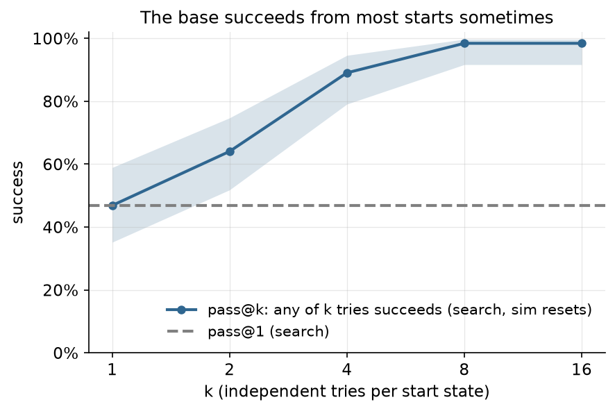
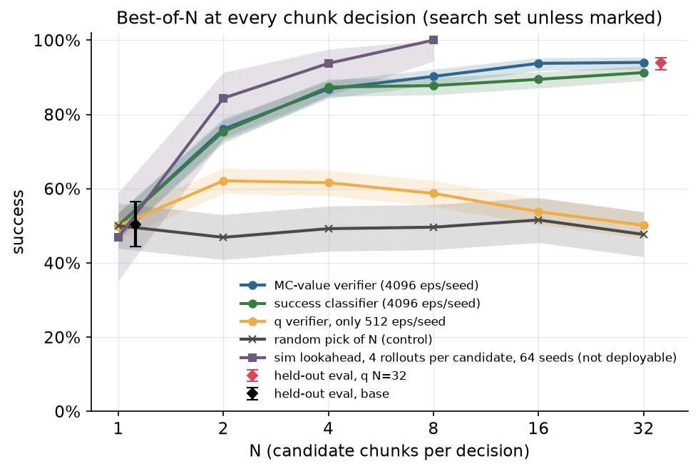
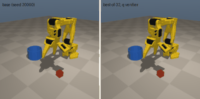
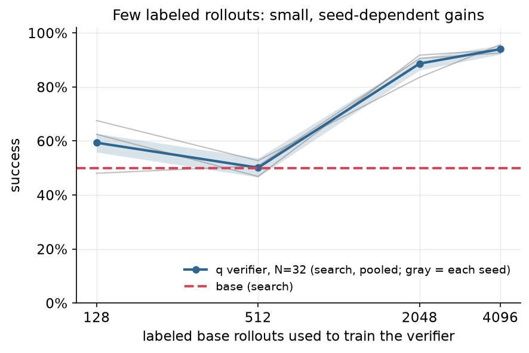

# Chapter 12: Test-time search with a verifier

Best-of-32 from the frozen `base_v1`, ranked by a Monte-Carlo value verifier trained on 4,096 labeled base rollouts per seed, goes from 50.4% to **721/768 = 93.9% [92.0, 95.4]** on held-out states, pooled over 3 verifier seeds. One seed passes 95% (245/256 = 95.7%); the pooled result does not.

Code: [`algos/12_best_of_n.py`](../../algos/12_best_of_n.py). Results: [`results/ch12/`](../../results/ch12/). Media: [`media/ch12/`](../../media/ch12/).

## The idea in plain words

The earlier chapters change something about the policy: its knobs (Chapters 1 and 2) or its noise input (Chapter 3), and the planned Chapters 4-11 change its weights. This one changes nothing. The frozen `base_v1` flow policy stays exactly as it is, and we spend compute when it runs instead.

The base picks an action chunk every 4 control steps by decoding one random 32-dim noise vector. Different noise gives a different chunk, and from the same state some chunks lead to a grasp while others miss. So at every chunk decision:

1. draw N noise vectors and decode N candidate chunks (the base's own proposals);
2. score each candidate with a small learned **verifier** that predicts "if the robot does this chunk and then carries on as usual, will the episode succeed?";
3. execute the highest-scoring chunk.

The verifier learns from the base's own rollouts. We run the base, write down every (state, chunk) it chose, and label each one with how its episode ended. Nobody labels anything by hand; in sim the success flag comes from the environment.

Three things have to hold for this to work, and the chapter measures each one:

- **The base must be able to succeed from most start states.** Selection can only choose behavior the base already has. From a start state where no sequence of base chunks succeeds, no reranking helps.
- **The verifier must rank candidates *within* a state,** not only tell good states from bad ones. These are different skills, and the usual accuracy numbers only measure the second.
- **The verifier must stay right as N grows.** The more candidates you rank, the more likely the top score belongs to a candidate the verifier overrates (over-optimization). And the better the verifier steers, the more the robot visits states that the base's rollouts, and so the verifier's training data, rarely contain.

## The math

Let `Q^π(s, a)` be the probability that the episode succeeds if the base `π` executes chunk `a` in state `s` and then keeps acting normally. Best-of-N executes

```
a* = argmax_{j = 1..N} Q̂(s, a_j),     a_j = flow(s, w_j),   w_j ~ N(0, I)
```

With the true `Q^π` this is one step of greedy policy improvement: the policy-improvement theorem says the new policy is at least as good as `π` in every state. With a learned `Q̂` there is no such guarantee, only the hope that `Q̂` ranks candidates the way `Q^π` would.

We train two verifiers on the same data, one sample per chunk decision (`t` = the step the chunk was chosen, `T` = the step the episode succeeded):

```
success classifier:  ŷ(s, a) ≈ P(success | s, a)        loss = BCE(ŷ, 1[success])
MC value verifier:   Q̂(s, a) ≈ E[γ^(T − t) · 1[success]] loss = (σ(f(s, a)) − γ^(T − t) · 1[success])²,  γ = 0.99
```

Both are Monte-Carlo estimates of the base's own value: the label is what happened after the base kept going, so they estimate `Q^π`, not the value of an optimal policy. The discount makes the MC verifier prefer chunks that lead to *faster* success, which also favors chunks that lead to success at all.

Why N matters twice. Pick the max of N noisy scores `Q̂ = Q + ε` and the expected error of the winner grows with N (roughly like `σ_ε · sqrt(2 log N)` for Gaussian errors). A verifier with small errors keeps improving with N; one with large errors peaks and then falls back toward the base, because at large N the argmax is dominated by the candidates with the largest `ε`, not the largest `Q`. That is the textbook story. Result 2 shows a weak verifier that does peak and fall back, but a check there suggests drift into unfamiliar states may matter as much as the errors on familiar ones.

Why pass@k is not a hard cap here. Trajectory-level best-of-N (run N whole episodes, keep the best) cannot beat pass@N. Reranking at every decision can, because it combines good chunks from different samples into one episode. What it cannot do is leave the support of the base. The ceiling is pass@k as k grows without bound: the share of start states from which *some* sequence of base chunks succeeds. No finite pass@k measures that. The 98.4% pass@16 on search is only a lower estimate of it, and result 1 below shows a state that 16 base episodes never solved and best-of-N solves half the time.

## Papers it mirrors

| Paper | What we take from it |
|---|---|
| **UF-OPS** ([C259](https://arxiv.org/abs/2603.10282)), *Update-Free On-Policy Steering via Verifiers* (2026-03) | The recipe: a small verifier trained on labeled rollouts of the deployed policy, then reranking samples of the frozen diffusion/flow policy. Their headline: real ALOHA, 5 tasks, mean 38% → 87% at best-of-10 (chart reading). |
| **Q-Planning** ([C392](https://arxiv.org/abs/2608.21204)), *Beyond Imitation: Self-Improving Robot Policies via Off-Policy Q-Planning* (2026-08) | A frozen policy as the proposal, 32-64 candidate chunks scored by a separate Q-function, only the critic retrained. Real stack-cups 40% → 90%. |
| **SeeQ** ([C438](https://arxiv.org/abs/2609.22085)), *Training Generalist Value Functions for Long-Horizon Robotic Manipulation* (2026-09) | Rerank 8 samples from a frozen π0.5 with a learned value; real bimanual average 35.4% → 66.7%. |
| **V-GPS** ([C075](https://arxiv.org/abs/2410.13816)), *Steering Your Generalists: Improving Robotic Foundation Models via Value Guidance* | The same sample-and-rerank loop on frozen generalist policies, with an offline Cal-QL critic. |
| **IDQL** ([C042](https://arxiv.org/abs/2304.10573)), *Implicit Q-Learning as an Actor-Critic Method with Diffusion Policies* | The classic offline-RL version: a frozen diffusion behavior policy proposes, an IQL critic picks the best of N. |
| **VLA-ATTC** ([C288](https://arxiv.org/abs/2605.01194)), *Adaptive Test-Time Compute for VLA Models* | Spend the extra samples only when candidates disagree. Not implemented here; see "What went wrong" for why it would matter on hardware. |

The curriculum also lists QGF ([C307](https://arxiv.org/abs/2606.11087), gradient guidance of the flow by ∇Q) and JITI ([C189](https://arxiv.org/abs/2511.22555), rerank only at critical moments). This chapter implements best-of-N only; guidance and gating are left for a later version.

## What the script does

Everything is chosen on the `search` set (64 start states, seeds 10 000-10 063). The held-out `eval` set (256 states) is scored once at the end.

1. **Diagnostic.** Run the base 16 times per search state (16 policy-noise salts) and compute pass@k.
2. **Controls.** Check that the best-of-N wrapper with N = 1 reproduces the base episode for episode (it does, bit for bit: the code asserts it). Then the random-pick control: draw N candidates, pick one uniformly at random. This is the base distribution again, and it should score like the base.
3. **Labeled rollouts.** For each of 3 verifier seeds, run the base on 4096 episodes from its own seed range (70 000 + 10 000·seed + i, disjoint from search and eval), and cut each episode into one (obs, chunk, outcome) sample per chunk decision: about 105 000 samples per seed. These are charged to `train`.
4. **Verifiers.** A 2×256 MLP on (normalized obs, flattened 8×4 chunk) → one logit, trained with AdamW for 3000 steps on CPU (a few seconds). The last 10% of episodes are held out for early stopping, split by episode. We also train a third, chunk-blind classifier that sees only the state, as a diagnostic.
5. **Sweep.** Best-of-N for N ∈ {1, 2, 4, 8, 16, 32} with each verifier, 4 salts × 64 search states per point (256 episodes per seed, 768 pooled). The best pooled (verifier, N) is chosen, the smaller N on ties. Because the choice pools the three seeds, every seed's row is charged all three seeds' labeled rollouts and sweeps. The script also records what each seed alone would have chosen.
6. **Data sweep.** Retrain the chosen verifier on the first 128, 512 and 2048 of its episodes; score each at the chosen N (and the 512-episode one at every N).
7. **Simulator lookahead.** A non-deployable reference: at each decision, save the simulator state, roll each candidate out 4 times (the candidate, then the base, with 4 continuation noises shared by all candidates) and execute the candidate with the best mean discounted outcome. Its rollouts are charged to `search` like any other.
8. **Held-out eval.** The base, the chosen setting for each verifier seed, and the random-pick control at the same N, on all 256 eval states with the same policy seeds (paired, so McNemar's test applies).

Best-of-N plugs into the policy through `FlowChunkPolicy`'s callable-noise hook (DESIGN §6): `PickNoise(obs, rngs)` draws N candidate noises for env `i` from `rngs[i]`, decodes and scores them, and returns the chosen noise. The policy then decodes that noise as usual. Because candidate 0 is exactly the noise the base would have drawn, N = 1 is the base.

## Results

All numbers come from one full run, `results/ch12/*_20260930-1701*.json` (26.4 min wall on an M5 Pro shared with other experiments, 6 rollout workers), except the offline check in result 2, which is marked. Intervals are Wilson 95%. Two earlier full runs with the same sweeps (they differed only in the simulator lookahead and the bookkeeping) gave identical numbers for every sweep and eval; their costs are charged below.

### 1. The diagnostic: the base has headroom



| k (tries per search state) | 1 | 2 | 4 | 8 | 16 |
|---|---|---|---|---|---|
| states solved at least once | 30/64 = 46.9% [35.2, 58.9] | 41/64 = 64.1% [51.8, 74.7] | 57/64 = 89.1% [79.1, 94.6] | 63/64 = 98.4% [91.7, 99.7] | 63/64 = 98.4% [91.7, 99.7] |

The base succeeds about half the time but, given 8 tries, from 63 of 64 start states. The failures are mostly bad luck in the sampled chunks, which is the situation where picking chunks can help. (pass@k uses simulator resets, so it is not a success rate you could deploy.)

One search state, env seed 10020, was never solved in 16 base tries. That does not put it out of reach. Whole-episode pass@k asks whether one of k complete samples worked; best-of-N picks again at every chunk, so it can string together good chunks that never appeared in the same base episode. The chosen setting (MC-value verifier, N = 32) solved seed 10020 in 6 of its 12 search tries (3 verifier seeds × 4 salts). The other hard search states, those the base solved at most 2 times in 16, went the same way:

| search env seed | base, successes of 16 | best-of-32 MC-value, successes of 12 |
|---|---|---|
| 10014 | 2 | 10 |
| 10020 | 0 | 6 |
| 10028 | 2 | 12 |
| 10029 | 1 | 7 |
| 10040 | 2 | 8 |

So the ceiling for per-chunk reranking is the base's support, pass@k as k grows without bound, and 98.4% at k = 16 is only a lower estimate of it.

### 2. Success vs N on the search set



Search set, 4 policy salts × 64 states per seed; the verifier rows pool 3 verifier seeds (k/768), random pick is k/256, and the simulator lookahead (4 rollouts per candidate) uses salt 0 on all 64 states (k/64).

| N | success classifier | MC-value verifier | random pick (control) | MC-value, only 512 episodes | sim lookahead (not deployable) |
|---|---|---|---|---|---|
| 1 (= base) | 384 = 50.0% [46.5, 53.5] | 384 = 50.0% [46.5, 53.5] | 128 = 50.0% [43.9, 56.1] | 384 = 50.0% [46.5, 53.5] | 30 = 46.9% [35.2, 58.9] |
| 2 | 579 = 75.4% [72.2, 78.3] | 584 = 76.0% [72.9, 78.9] | 120 = 46.9% [40.9, 53.0] | 477 = 62.1% [58.6, 65.5] | 54 = 84.4% [73.6, 91.3] |
| 4 | 671 = 87.4% [84.8, 89.5] | 667 = 86.8% [84.3, 89.1] | 126 = 49.2% [43.2, 55.3] | 473 = 61.6% [58.1, 65.0] | 60 = 93.8% [85.0, 97.5] |
| 8 | 674 = 87.8% [85.3, 89.9] | 693 = 90.2% [87.9, 92.1] | 127 = 49.6% [43.5, 55.7] | 451 = 58.7% [55.2, 62.2] | 64 = 100.0% [94.3, 100.0] |
| 16 | 687 = 89.5% [87.1, 91.4] | 720 = 93.8% [91.8, 95.3] | 132 = 51.6% [45.5, 57.6] | 413 = 53.8% [50.2, 57.3] | not run |
| 32 | 701 = 91.3% [89.1, 93.1] | **722 = 94.0% [92.1, 95.5]** | 122 = 47.7% [41.6, 53.8] | 385 = 50.1% [46.6, 53.7] | not run |

Per verifier seed (MC-value verifier, k/256 at N = 2, 4, 8, 16, 32): seed 0: 194, 214, 234, 244, 237; seed 1: 201, 221, 232, 238, 240; seed 2: 189, 232, 227, 238, 245. Success classifier: seed 0: 200, 224, 230, 230, 243; seed 1: 198, 240, 229, 232, 238; seed 2: 181, 207, 215, 225, 220.

What the table says:

- **The random pick stays at the base's level for every N** (47-52%). Drawing more candidates does nothing by itself; the gain comes from the ranking.
- **With 4096 labeled episodes per seed, both verifiers climb steeply up to N = 4** and keep improving slowly after that. The MC-value verifier edges out the classifier at N ≥ 8 (for example 93.8% vs 89.5% at N = 16). The selection rule (best pooled search success, smaller N on ties) chose **the MC-value verifier at N = 32**, 94.0% on search. N = 32 is the largest value we tried, so we do not know whether N = 64 would help or hurt. Each seed alone would have chosen differently: seed 0 the MC-value verifier at N = 16 (244/256), seed 1 the classifier at N = 4 (240/256, tied with its MC-value verifier at N = 32, so the smaller N wins), seed 2 the MC-value verifier at N = 32 (245/256). The three rows below therefore share one pooled choice. They are replicates of "train a verifier and deploy it at this (verifier, N)", not of the whole recipe, and each row is charged all three seeds' labeled rollouts and sweeps.
- **The simulator lookahead is an approximate upper bound, and the learned verifier bends away from it.** At each decision it saves the simulator state, tries every candidate 4 times (the candidate, then the base, with the same 4 continuation noises for every candidate) and executes the best mean outcome. It reaches 84.4% at N = 2, 93.8% at N = 4 and 64/64 = 100.0% [94.3, 100.0] at N = 8, while the learned MC-value verifier gets 76.0%, 86.8% and 90.2% at the same N. The gap grows with N: at N = 8 the intervals no longer overlap, and the lookahead at N = 8 is already above the learned verifier at N = 32 (94.0%). It is not a strict bound: 4 rollouts per candidate are still a noisy estimate of `Q^π`, and it was run on 64 episodes, not 768. It is not deployable either (a real robot cannot reset to a saved state), and it is expensive: 2529.4 robot-minutes of simulation for the three N values on 64 episodes (1091.6 at N = 8 alone). Those rollouts are charged to `search` in every verifier row. An earlier version that tried each candidate only once scored about level with the learned verifier (93.8% at N = 8, 95.3% at N = 16), which is why it was replaced.
- **A verifier trained on 512 episodes gets worse as N grows.** It helps at N = 2 (62.1%) and then slides back to the base: 50.1% at N = 32. We have two explanations and have not tested which one is right. (a) Over-optimization, as in the math section: its errors are large, and the more candidates it ranks, the more often the winner is one it overrates. (b) State-distribution shift: in closed loop, each pick moves the robot into states that the base's rollouts, and so the 512 training episodes, rarely contain, and there the verifier's ranking is worse. An offline check (not part of the script) points toward (b). On 400 decision states from *base* rollouts on search, we drew N candidates, let the 512-episode verifier (seed 0) pick one, and scored the pick with the 4096-episode verifier. The pick's score above the candidates' mean rose with N: +0.006 at N = 2, +0.010 at N = 8, +0.013 at N = 32. So on the states the base visits, the weak verifier's picks get slightly better as N grows, not worse, while closed-loop success falls. The two verifiers agree only loosely within a state (median correlation 0.41), and the check uses one verifier as a stand-in for the truth. A proper test would score the picks along best-of-N trajectories with simulator rollouts.

### 3. The held-out evaluation

The chosen setting (MC-value verifier, N = 32) was scored once on the 256 `eval` states for each verifier seed, with the same policy seeds as the base (salt 0), so every comparison is paired.

| policy (eval, n = 256) | k/n | success [Wilson 95%] | vs base: McNemar p | paired difference, bootstrap 95% |
|---|---|---|---|---|
| base_v1 | 129/256 | 50.4% [44.3, 56.5] | — | — |
| random pick, N = 32 | 125/256 | 48.8% [42.8, 54.9] | 0.78 | — |
| best-of-32, MC-value verifier, seed 0 | 242/256 | 94.5% [91.0, 96.7] | 1.9e-26 | [+37.1, +51.2] pp |
| best-of-32, MC-value verifier, seed 1 | 234/256 | 91.4% [87.3, 94.3] | 4.0e-26 | [+34.4, +47.7] pp |
| best-of-32, MC-value verifier, seed 2 | 245/256 | 95.7% [92.5, 97.6] | 6.0e-30 | [+38.7, +52.0] pp |
| **pooled over the 3 verifier seeds (headline)** | **721/768** | **93.9% [92.0, 95.4]** | | |

The held-out result matches the search estimate (94.0% on search, 93.9% pooled on eval). One of three seeds passes the 95% point estimate that "95%+" means in this repo; **the pooled result, 93.9%, does not reach 95%.** The pooled interval treats the 3 × 256 episodes as independent; they share the same 256 start states, so read it as conditional on those states.

Failure modes on eval (labels from `OutcomeTracker`), base vs best-of-32 (seed 0):

| | success | missed_grasp | slip | rim_hit | off_target |
|---|---|---|---|---|---|
| base_v1 | 129 | 102 | 18 | 4 | 3 |
| best-of-32 (seed 0) | 242 | 12 | 2 | 0 | 0 |

Almost all of the gain is grasps: the verifier learned which chunks close the gripper around the cube and which close it next to the cube.



The GIF shows eval seed 20000, the first eval state where the base failed and best-of-32 (seed 0) succeeded.

### 4. How much labeled data the verifier needs



MC-value verifier at N = 32, search set, trained on the first E episodes of each seed's pool:

| labeled episodes per seed | seed 0 (k/256) | seed 1 (k/256) | seed 2 (k/256) | pooled (k/768) |
|---|---|---|---|---|
| 128 | 123 = 48.0% [42.0, 54.2] | 160 = 62.5% [56.4, 68.2] | 173 = 67.6% [61.6, 73.0] | 456 = 59.4% [55.9, 62.8] |
| 512 | 130 = 50.8% [44.7, 56.8] | 120 = 46.9% [40.9, 53.0] | 135 = 52.7% [46.6, 58.8] | 385 = 50.1% [46.6, 53.7] |
| 2048 | 232 = 90.6% [86.4, 93.6] | 235 = 91.8% [87.8, 94.6] | 214 = 83.6% [78.6, 87.6] | 681 = 88.7% [86.2, 90.7] |
| 4096 | 237 = 92.6% [88.7, 95.2] | 240 = 93.8% [90.1, 96.1] | 245 = 95.7% [92.5, 97.6] | 722 = 94.0% [92.1, 95.5] |

The base on the same search episodes is 384/768 = 50.0% [46.5, 53.5]. Below about 2000 episodes the gains are small, depend on the seed and do not grow with N: 128 episodes give +9 points pooled at N = 32 (the interval excludes the base, but one of the three seeds gains nothing), and the 512-episode verifier gives +12 points at N = 2 (477/768 = 62.1% [58.6, 65.5]) and nothing at N = 32. Only from 2048 episodes are the gains large and consistent across seeds. 2000 episodes is 2000 × ~10 s of robot time, around 5.6 robot-hours.

### 5. Why the usual verifier metric misleads

Held-out AUC (does a success decision score above a failure decision?) for the 4096-episode verifiers: classifier 0.989 / 0.989 / 0.985, MC-value 0.989 / 0.989 / 0.985, and **the chunk-blind classifier, which never sees the candidate, 0.987 / 0.987 / 0.983.** Nearly all of the AUC comes from recognizing states (the cube is already lifted, or time is almost up), which says nothing about which chunk to pick. A verifier that sees only the state gives every candidate the same score, so it cannot rerank at all. The 512-episode verifiers also have AUC 0.97-0.98, and they fail at large N. Judge a verifier by what best-of-N does with it on the search set, not by its AUC.

### 6. Cost

Robot-minutes are env steps / 600 (10 Hz). Per verifier-seed row (seed 0; seeds 1 and 2 are within 13 robot-minutes of search and identical in train):

| item | robot-minutes | bucket |
|---|---|---|
| **this run** | | |
| labeled base rollouts for this seed's verifier (4096 episodes, seeds 70 000+) | 692.8 | train |
| the other two seeds' labeled rollouts (they fed the pooled choice of verifier and N) | 1379.2 | train |
| pass@k diagnostic, N = 1 check and random-pick sweep (shared by every row) | 376.2 | search |
| this seed's verifier sweeps (2 verifiers × 5 N × 256 episodes) | 211.8 | search |
| the other two seeds' verifier sweeps (they fed the pooled choice) | 430.8 | search |
| this seed's data sweep (128, 512 and 2048 episodes) | 239.0 | search |
| simulator lookahead, N = 2, 4, 8, 4 rollouts per candidate, 64 episodes (not deployable) | 2529.4 | search |
| subtotal, this run | 5859.3 | search + train |
| **before this run** ([`tools/ch12_pilots/prior_costs.json`](../../tools/ch12_pilots/prior_costs.json), added with `--prior-costs`) | | |
| pilots 1 and 2 ([`pilot1.py`](../../tools/ch12_pilots/pilot1.py), [`pilot2.py`](../../tools/ch12_pilots/pilot2.py)): 5120 labeled episodes and best-of-N trials on dev seeds 79 000+, never search or eval | 1307.7 + 859.8 | search + train |
| full run 20260930-154814: all three seeds' labels and sweeps, shared diagnostic, 1-rollout lookahead on 32 seeds (444.7) | 2168.1 + 2072.0 | search + train |
| full run 20260930-161317: the same, with a 1-rollout lookahead on 64 seeds (1725.6) | 3449.0 + 2072.0 | search + train |
| subtotal, before this run | 11 928.6 | search + train |
| **improvement budget in the results file** | **10 712.1 search + 7075.7 train = 17 787.9** | |
| base and final held-out evaluations | 57.1 | eval |

The random-pick row costs 1128.8 robot-minutes of search (the shared diagnostic in this run and the two earlier ones) and no training.

The leaderboard row is honest but not what a practitioner would pay. The two earlier full runs computed the same sweeps (the results are deterministic), and the lookahead is a reference, not part of the method. The deployable recipe is: record labeled rollouts of the base (692.8 robot-minutes for one verifier), train the verifier (seconds), and check a few N on the search states (about 212 robot-minutes for our sweep). Everything else is exploration we did to write this chapter. Run the script without `--prior-costs` and its results files report only what that run spent.

Latency, one env, numpy on one CPU core, per chunk decision (sample N chunks and score them; measured in the full run on a busy machine):

| N | 1 | 2 | 4 | 8 | 16 | 32 |
|---|---|---|---|---|---|---|
| ms per decision | 0.68 | 2.67 | 2.46 | 6.74 | 7.77 | 15.20 |

The machine was busy with other experiments, so single numbers are noisy (N = 2 measured slower than N = 4; an earlier run measured 1.25 and 1.89 ms). A decision happens every 4 control steps (400 ms at 10 Hz), so even N = 32 costs about 4% of the budget. The numpy sampler decodes candidates one row at a time on purpose, so an episode's result never depends on its batch; batched torch sampling of 32 candidates took about 1 ms in a separate timing test.

Compute: 0.48-0.57 CPU-hours per row, 26.4 minutes wall for the whole run.

## What went wrong

**1. With too little data, more N makes best-of-N worse.** With 512 labeled episodes per seed, the verifier gives +12 points at N = 2 and nothing at N = 32 (385/768 = 50.1% [46.6, 53.7], the base is 50.0%). If you trained a verifier on a few hundred real rollouts and deployed it at the N that worked with a big verifier, you would get the base back after paying for the rollouts and the compute. Choose N on your own search states with your own verifier. Whether the cause is over-optimization or drift into unfamiliar states is open (see result 2).

**2. The data curve is not monotone, and we cannot explain it.** 128 episodes (59.4% pooled at N = 32) did better than 512 (50.1%), and the 128-episode result swings from 48.0% to 67.6% across seeds. The 128-episode verifiers are early-stopped on only 13 held-out episodes, and one guess is that they end up much smoother functions of the chunk than the 512-episode ones; we have not tested it. Treat everything below 2048 episodes as "unreliable", not as a trend.

**3. The chosen N is at the edge of the grid.** N = 32 won on search and we did not try larger N. The per-seed curves already wobble at the top (seed 0: 244 at N = 16, 237 at N = 32; seed 2's classifier: 225 then 220), which may be the first sign of a decline at large N or just noise at ±3 points per seed.

**4. Best-of-N breaks some episodes the base solved.** On eval, best-of-32 lost 9, 6 and 5 episodes (seeds 0, 1, 2) that the base solved with its own noise, while fixing 122, 111 and 121; both failed on 5, 16 and 6 (stored as `extra.eval.paired` in the results files). Some of these are the verifier preferring a chunk that turned out worse; some are simply different noise draws. Either way, it is not a strict improvement per episode, only on average.

**5. Seed 1 is 4 points worse on eval than the others** (234/256 vs 242 and 245), although its search score was similar (240/256). Three seeds is the minimum to see this kind of spread; one lucky seed would have made the method look better than it is.

**6. The cost is dominated by labeled rollouts, and ours are generous.** 4096 episodes per seed is about 11.5 robot-hours of labeled rollouts, and our state-based MLP verifier needed about 2000 episodes before its gains were large and reliable (below that they were small and seed-dependent). That is far more than a real-robot budget allows. A better verifier architecture, or reusing every rollout collected in the earlier chapters, would change this number more than anything else.

**7. Gating and guidance are not implemented.** The curriculum asks for QGF-style gradient guidance and a disagreement gate (VLA-ATTC, JITI). We ran out of the chapter's scope. On this task the gate would matter for latency on slower hardware and for not reranking where it cannot help (after the grasp, most candidates are equivalent).

**What selection cannot do.** Best-of-N reweights chunks the base already proposes, so it cannot solve a start state from which no sequence of base chunks succeeds. We did not find such a state: the one search state the base never solved in 16 tries is solved by best-of-32 (result 1), and an eval episode where both the base and best-of-N failed is one failed noise draw each, not evidence that the state is out of reach. Finding the true limit would take many more tries per state than we ran. Where the base's support does run out (a new object, a new camera angle), the policy itself has to change (Chapters 4-10).

## The hardware step (SO-101)

> **Safety.** A learning policy can move the arm quickly and in unexpected ways, and the servos can pinch. Clear the workspace, keep the arm's power switch or plug (or an e-stop) within reach, start with low speed and a small per-step limit (in LeRobot, `max_relative_target` on the follower, which is off by default), keep your hands out of the workspace while the policy runs (reset only when the arm has stopped), and supervise every run.

From the curriculum (§1, Ch 12), with the numbers above as a guide:

1. **Collect labeled rollouts.** Every real rollout of the frozen real `base_v1` collected during the course is labeled data: log `(obs, chunk, success, steps)` at every chunk decision (the policy exposes `last_chunk` and `last_noise`), with the human success key as the label. Expect 500+ episodes after the earlier chapters. Record the human reset time as human-minutes.
2. **Train the verifier on the Mac** exactly as in this script (the MC-value target, early stopping on held-out episodes). Do not trust its AUC; see result 5.
3. **Pick N on `R_search` only.** Rerank N = 4-8 candidates per chunk (a few ms on the Mac) and compare with the base and with a random pick on the 10 marked `R_search` spots. The sim data sweep says a verifier trained on a few hundred episodes may help only at small N (N = 2 gave +12 points with 512 sim episodes) and can hurt at large N, so do not copy N = 32 from sim.
4. **Score `R_eval` once** (30 marked spots, fixed order) for the base and the chosen setting, report k/30 with Wilson intervals (15/30 is [33.2, 66.8], 27/30 is [74.4, 96.5]), and compare them with McNemar's test on the paired spots. Never write 100%.
5. There is no simulator lookahead on the real arm: the learned verifier is the only thing you can deploy.

The curriculum's finale (stacking a ticket or DSRL, an edit or residual policy, and gated best-of-N on the extended real set) depends on those chapters and is not part of this version.

## Reproduce

```bash
uv run python algos/12_best_of_n.py            # full run: about 26 min on an M5 Pro, 6 workers
uv run python algos/12_best_of_n.py --quick    # smoke test, under 1 min; writes only to runs/ch12_quick/
# the committed results were written with the earlier costs added:
uv run python algos/12_best_of_n.py --prior-costs tools/ch12_pilots/prior_costs.json
```

The full run writes one results JSON per verifier seed (`bon-q-n32_s{0,1,2}`) and one for the random-pick control (`bon-random-n32`) to `results/ch12/`, the plots and GIF to `media/ch12/`, and the verifier weights to the git-ignored `runs/ch12_work/`. Every run is deterministic: three full runs gave the same sweep and eval numbers.
